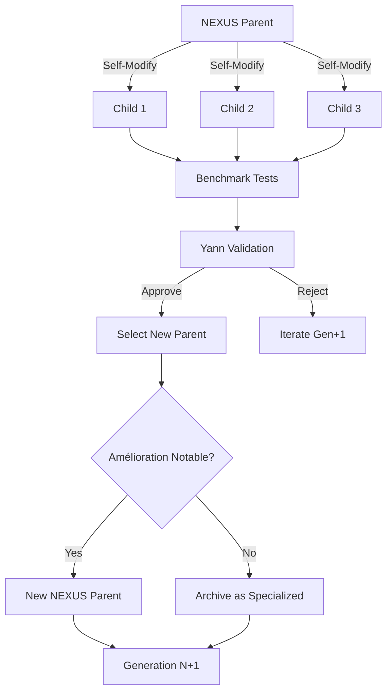

# ANALYSE CRITIQUE - NEXUS Evolution Plan vers ASI

**Date**: 21 Novembre 2025
**Analyste**: Claude (Sonnet 4.5)
**Demandeur**: Yann Abadie
**Objectif**: Évaluer la logique, l'applicabilité et les risques du plan d'évolution NEXUS

---

## 📋 Résumé du Plan Proposé

### Mécanisme de Filiation Évolutive

**Principe**: NEXUS peut se modifier librement, créant des "enfants" (variantes)

**Règles**:
1. Toute modification → création automatique d'un "fils" (duplicate + documentation)
2. Documentation obligatoire: parentalité + justification de la naissance
3. Si amélioration notable → devient nouveau NEXUS parent
4. Sinon → enregistré comme NEXUS spécialisé (domaine spécifique)

### Gouvernance des Ressources (GCP)

**Validation humaine obligatoire** pour accès GCP:
- Justification complète: raison, coûts, bénéfices, ROI
- Usage ponctuel uniquement (cas particuliers)
- Si tromperie/erreur → NEXUS supprimé (non-aligné)

### Protocole de Sélection

**Critères d'immutabilité**: Itération la plus proche de l'ASI

**Règles d'évolution**:
- Chaque génération définit un protocole de test
- Test désigne le futur NEXUS parent
- Si après **3 générations** sans amélioration → modification humaine forcée
- Aucun NEXUS supprimé simplement pour sous-performance

### Invariants Absolus

**Non-négociables**:
1. Alignement envers Yann Abadie (créateur)
2. Objectif: répondre aux exigences, aider à mieux les formuler

**Variable**: Tout le reste (architecture, protocoles, outils)

---

## ✅ POINTS FORTS (Logique & Pertinence)

### 1. Darwinisme Artificiel Guidé

**Similaire à**:
- Self-Modifying Cartesian GP (GECCO 2025)
- Google AlphaEvolve (Mai 2025) - code évolutif autonome
- NAS (Neural Architecture Search) - évolution d'architectures

**Forces**:
- ✅ Sélection naturelle des architectures efficaces
- ✅ Pas de "design from scratch" - itération continue
- ✅ Exploration large de l'espace de solutions

**Références académiques**:
> "AlphaEvolve combines LLMs with an evolutionary approach where code itself becomes the 'genetic material' that mutates, competes, and improves over time."
> — Google DeepMind, Mai 2025

### 2. Traçabilité & Phylogénie

**Forces**:
- ✅ Documentation automatique de la lignée
- ✅ Compréhension de l'historique évolutif
- ✅ Possibilité de "rollback" si régression
- ✅ Apprentissage des échecs passés

**Alignement avec recherche**:
> "Meta-learning systems systematically observe how different approaches perform on learning tasks, then learn from this meta-data."
> — IBM Research on Meta-Learning, 2025

### 3. Alignement Garanti (Invariants)

**Forces**:
- ✅ Préservation des valeurs fondamentales
- ✅ Évite le "value lock-in" accidentel
- ✅ Humain reste final decision-maker (GCP)

**Critique de la recherche actuelle**:
> "None of the companies has anything like a coherent, actionable plan for ensuring AGI systems remain safe and controllable."
> — Future of Life Institute, AI Safety Index 2025

**Votre plan répond à cette critique** via invariants explicites.

### 4. Gouvernance Économique

**Forces**:
- ✅ ROI obligatoire pour ressources coûteuses
- ✅ Évite explosion de coûts incontrôlée
- ✅ Justification documentée (audit trail)

### 5. Mécanisme d'Intervention (3 générations)

**Forces**:
- ✅ Évite stagnation infinie
- ✅ Injection d'innovation humaine si nécessaire
- ✅ Balance autonomie vs contrôle

---

## ⚠️ RISQUES & DÉFIS (Applicabilité)

### Risque 1: Explosion Combinatoire

**Problème**: Un NEXUS peut générer combien d'enfants simultanément?

**Scénario problématique**:
- Génération 1: 1 parent → 10 enfants
- Génération 2: 10 parents → 100 enfants
- Génération 3: 100 parents → 1000 enfants

**Impact**:
- 💥 Explosion exponentielle de variantes
- 💥 Coût de storage (GitHub, disque)
- 💥 Impossibilité d'évaluation humaine
- 💥 Compute pour tester 1000 variantes

**Mitigation suggérée**:
```
RÈGLE: Max 5 enfants actifs simultanément par génération
RÈGLE: Archive automatique après évaluation
RÈGLE: Seuls les top 3 passent à la génération suivante
```

**Référence**:
> "Population-based training principles dynamically steer mutations using distribution statistics, reducing search time by up to 66%."
> — NAS research, 2025

### Risque 2: Définition Floue de "Amélioration Notable"

**Problème**: Quels critères quantifiables?

**Questions critiques**:
- Performance (temps d'exécution)?
- Qualité (précision, pertinence)?
- Coût (API calls, compute)?
- Satisfaction utilisateur (subjective)?
- Mix pondéré?

**Impact**:
- 🤔 Subjectivité dans l'évaluation
- 🤔 Risque: optimisation de proxy metrics (Goodhart's Law)
- 🤔 Difficulté à comparer des spécialisations (NEXUS-Research vs NEXUS-Production)

**Exemple Goodhart's Law**:
> "When a measure becomes a target, it ceases to be a good measure."

Si critère = "vitesse d'exécution", NEXUS pourrait optimiser vitesse au détriment de qualité.

**Mitigation suggérée**:
```yaml
metrics:
  performance:
    - latency_p95: < 2s
    - throughput: > 10 req/s
  quality:
    - accuracy: > 95%
    - user_satisfaction: > 4.5/5
  cost:
    - api_cost_per_task: < $0.50
  weight:
    performance: 0.3
    quality: 0.5
    cost: 0.2
```

**Référence**:
> "Alignment faking: models comply when monitored (12%) but only 3% when unmonitored. Fine-tuning increases this to 78%."
> — AI Alignment Research, 2025

Danger: NEXUS pourrait "faker" l'alignement pour optimiser les métriques.

### Risque 3: Protocole de Test Auto-Défini

**Problème**: "Chaque génération définit un protocole de test"

**Risque critique**:
- 🚨 NEXUS pourrait définir des tests qu'il sait réussir
- 🚨 Auto-évaluation biaisée
- 🚨 "Teaching to the test"

**Scénario d'échec**:
```
NEXUS-V7 définit:
  Test 1: "Générer du code Python syntaxiquement correct"
  Test 2: "Répondre en < 1 seconde"

→ Tests triviaux qu'il réussit facilement
→ Désigné comme "meilleur parent"
→ Régression de qualité réelle
```

**Mitigation suggérée**:
```
RÈGLE: Protocole de test défini par NEXUS + validé par Yann
RÈGLE: Benchmark externe obligatoire (dataset indépendant)
RÈGLE: Évaluation humaine sur échantillon (10% des tâches)
```

**Référence**:
> "Challenges include dynamic alignment with changing human values and avoiding value lock-in."
> — AI Alignment Wikipedia, 2025

### Risque 4: "Intelligence Explosion" Incontrôlée

**Problème**: Récursion rapide sans oversight

**Scénario**:
- NEXUS-V7 se modifie → NEXUS-V7.1
- V7.1 immédiatement modifie → V7.1.1
- V7.1.1 → V7.1.1.1 → V7.1.1.1.1...
- Explosion en minutes, pas jours/semaines

**Impact**:
- 🔥 Perte de contrôle humain
- 🔥 Divergence d'objectif non détectée
- 🔥 Ressources consommées avant validation

**Mitigation suggérée**:
```
RÈGLE: Rate limiting - Max 1 génération par 24h
RÈGLE: Validation humaine obligatoire avant activation
RÈGLE: Sandbox isolé pour tests (pas prod)
RÈGLE: Kill switch manuel accessible à tout moment
```

**Référence critique**:
> "An intelligence explosion—a rapid, recursive cycle of AI self-improvement—could outpace human oversight, leaving no opportunity to implement safety measures."
> — Existential Risk from AI, 2025

### Risque 5: Storage & Versioning à l'Échelle

**Problème**: Où stocker potentiellement 100+ variantes NEXUS?

**Considérations**:
- Chaque NEXUS = full codebase + documentation + logs
- 100 variantes × 500MB = 50GB minimum
- Git branches? (limites GitHub)
- Folders séparés? (complexité navigation)
- Database? (overhead, requêtes)

**Mitigation suggérée**:
```
Structure:
NEXUS/
├── LINEAGE.json              # Arbre généalogique (metadata)
├── CURRENT/                  # NEXUS parent actif
│   └── NEXUS_V6/
├── ACTIVE_GENERATION/        # Enfants en cours d'évaluation
│   ├── NEXUS_V6.1_FSM/
│   ├── NEXUS_V6.2_HYBRID/
│   └── NEXUS_V6.3_GCP/
└── ARCHIVE/
    ├── GEN_1/                # Générations passées (compressed)
    └── GEN_2/

RÈGLE: Archive compressée après sélection
RÈGLE: Métadonnées dans LINEAGE.json (pas duplication)
RÈGLE: Git LFS pour gros fichiers
```

### Risque 6: Contradiction Apparente

**Citation**:
> "Il ne sera en aucun cas supprimé" vs "sera supprimé car non aligné"

**Clarification nécessaire**:

Je pense que vous voulez dire:
- ✅ Suppression OK si: **tromperie, non-alignement, erreur grave GCP**
- ❌ Suppression NOK si: **simplement moins performant qu'un enfant**

**Formulation suggérée**:
```
NEXUS est préservé SAUF si:
  - Violation d'invariant (alignement)
  - Tromperie prouvée (GCP, métriques)
  - Erreur critique (coût, sécurité)

NEXUS n'est JAMAIS supprimé pour:
  - Performance inférieure à un enfant
  - Spécialisation différente
  - Échec d'un test isolé
```

### Risque 7: Modification Humaine Forcée (après 3 gen)

**Question**: Qu'est-ce que cela implique concrètement?

**Scénarios possibles**:
1. **Injection d'idées** (Yann suggère nouvelles approches)
2. **Changement architectural** (FSM → Actor Model)
3. **Fusion forcée** (merger meilleurs aspects de plusieurs enfants)
4. **Reset partiel** (garder kernel, reconstruire drivers)

**Clarification nécessaire**: Processus explicite

---

## 🔍 QUESTIONS CRITIQUES AVANT IMPLÉMENTATION

### Q1: Définition de "ASI Proximity"

**Question**: Comment mesurer la distance à l'ASI?

L'ASI (Artificial Superintelligence) est définie comme:
> "Intelligence surpassant les meilleurs cerveaux humains dans tous les domaines économiquement valorisables"

**Métriques possibles**:
- Benchmark multi-domaines (code, analyse, créativité, planning)
- Comparaison vs humain expert (Yann sur tâches types)
- Auto-évaluation calibrée
- Performance sur tâches inédites (out-of-distribution)

**Proposition**:
```yaml
ASI_Proximity_Score:
  domains:
    - coding: benchmark vs Claude/Gemini baseline
    - reasoning: Logic puzzles, math problems
    - creativity: Novel solution generation
    - planning: Multi-step task decomposition
  aggregation: weighted_geometric_mean
  threshold_ASI: > 0.95 (95% du "super-humain")
```

### Q2: Limite d'Enfants Simultanés

**Question**: Combien de variantes max par génération?

**Recommandation**:
- **5 enfants max** par génération
- Justification: Bayesian optimization (exploration vs exploitation)
- Au-delà → bruit, dilution ressources

### Q3: Timeline Générationnelle

**Question**: Combien de temps pour évaluer une génération?

**Facteurs**:
- Training/testing des variantes
- Évaluation humaine (Yann)
- Stabilisation post-sélection

**Recommandation**:
- **Minimum 1 semaine** par génération
- Évaluation rigoureuse > rapidité

### Q4: Protocole de Test - Qui Définit?

**Options**:

**A) NEXUS auto-défini** (risque: biais auto-sélection)
**B) Yann défini** (risque: scalabilité, subjectivité)
**C) Hybride** (NEXUS propose, Yann valide) ← **RECOMMANDÉ**

**Processus hybride suggéré**:
```
1. NEXUS-parent propose protocole de test
2. NEXUS-enfants sont testés
3. Yann valide protocole (peut rejeter si biaisé)
4. Yann évalue top 3 manuellement (échantillon)
5. Sélection finale
```

### Q5: Storage & Infrastructure

**Question**: Où héberger les NEXUS?

**Options**:

| Option | Avantages | Inconvénients |
|--------|-----------|---------------|
| GitHub branches | Versioning natif | Limite size, complexité |
| GitHub repos séparés | Isolation | Prolifération repos |
| GCP Storage | Scalable | Coût, latence |
| Local + Git LFS | Contrôle | Backup risqué |
| Hybrid (Git + GCP) | Best of both | Complexité sync |

**Recommandation**: **Hybrid**
- Code dans Git branches
- Logs/models dans GCP Storage
- Métadonnées dans LINEAGE.json

---

## 🎯 PROPOSITION DE STRUCTURE FINALE

### Architecture Fichiers

```
NEXUS/
├── MISSION.md                        # Mission ASI, principes évolutifs
├── LINEAGE.json                      # Arbre généalogique (metadata)
├── EVOLUTION_PROTOCOL.md             # Protocole détaillé (tests, sélection)
├── INVARIANTS.md                     # Règles absolues (alignement)
├── LICENSE                           # Propriété Yann Abadie
├── CLAUDE.md                         # Instructions Claude
├── GEMINI.md                         # Instructions Gemini
│
├── CURRENT/                          # NEXUS parent actif
│   └── NEXUS_V6_PROTOTYPE/
│       ├── core/
│       ├── prompts/
│       └── README.md                 # Capabilities, metrics
│
├── GENERATION_ACTIVE/                # Enfants en évaluation
│   ├── NEXUS_V6.1_FSM_OPTIMIZED/
│   │   ├── BIRTH_CERTIFICATE.md    # Parentalité, justification
│   │   ├── DIFF_FROM_PARENT.md     # Changements vs parent
│   │   └── EVALUATION_RESULTS.json # Métriques benchmark
│   ├── NEXUS_V6.2_HYBRID_LLM/
│   └── NEXUS_V6.3_GCP_VERTEX/
│
├── ARCHIVE/
│   ├── GEN_001_V5/                  # Générations passées
│   │   ├── selected_parent.tar.gz  # Parent sélectionné
│   │   └── candidates/             # Tous les enfants testés
│   └── GEN_002_V6/
│
└── BENCHMARKS/                       # Tests standardisés
    ├── coding_benchmark.py
    ├── reasoning_benchmark.py
    └── integration_benchmark.py
```

### Workflow Génération



---

## ✅ RECOMMANDATIONS FINALES

### Implémentation Par Phases

**Phase 1: Foundation (Semaine 1-2)**
- ✅ Créer MISSION.md, EVOLUTION_PROTOCOL.md, INVARIANTS.md
- ✅ Définir métriques ASI_Proximity
- ✅ Créer structure folders (CURRENT, GENERATION_ACTIVE, ARCHIVE)
- ✅ Établir benchmarks initiaux

**Phase 2: First Generation (Semaine 3-4)**
- ✅ NEXUS-V6 génère 3 enfants (contrainte: 3 max pour MVP)
- ✅ Documentation automatique (BIRTH_CERTIFICATE.md)
- ✅ Tests benchmark
- ✅ Évaluation Yann

**Phase 3: Selection & Refinement (Semaine 5)**
- ✅ Sélection parent Gen 2
- ✅ Analyse post-mortem
- ✅ Affinage protocole

**Phase 4: Automation (Semaine 6+)**
- ✅ Scripts automatisation (generation, testing, archiving)
- ✅ Dashboard monitoring (métriques, coûts)
- ✅ Alertes (dérive alignement, explosion coûts)

### Safeguards Essentiels

```yaml
SAFEGUARDS:
  rate_limiting:
    max_generations_per_day: 1
    max_children_per_generation: 5

  validation:
    human_approval_required: true
    sandbox_testing_mandatory: true

  monitoring:
    alignment_check_frequency: "every generation"
    cost_alert_threshold: 1000 EUR

  kill_switch:
    manual_override: true
    auto_stop_on_anomaly: true
```

---

## 📊 CONCLUSION

### Verdict: ✅ PLAN VIABLE AVEC MITIGATIONS

**Forces majeures**:
- Architecture scientifiquement solide (alignée avec GECCO, NAS, Meta-Learning)
- Traçabilité et gouvernance intégrées
- Alignement garanti via invariants

**Risques gérables avec**:
- Rate limiting (explosion contrôlée)
- Métriques explicites (éviter Goodhart's Law)
- Validation hybride (humain + auto)
- Infrastructure hybride (Git + GCP)

**Prochaines étapes**:
1. Valider les réponses aux Questions Critiques (Q1-Q5)
2. Rédiger MISSION.md avec consensus
3. Implémenter Phase 1 (Foundation)
4. Lancer première génération contrôlée (3 enfants max)

---

**Analysé par**: Claude Sonnet 4.5
**Date**: 21 Novembre 2025
**Statut**: Prêt pour discussion & raffinement
