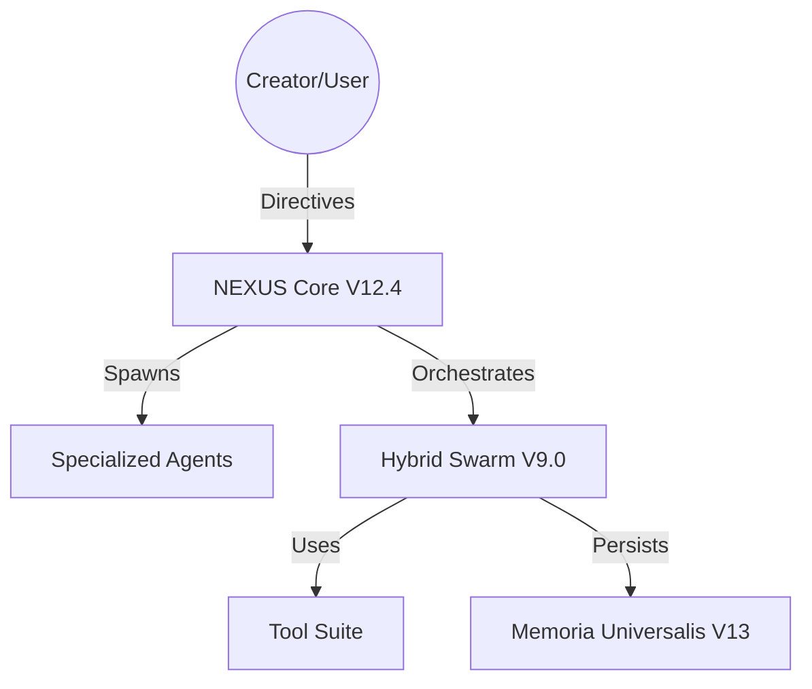
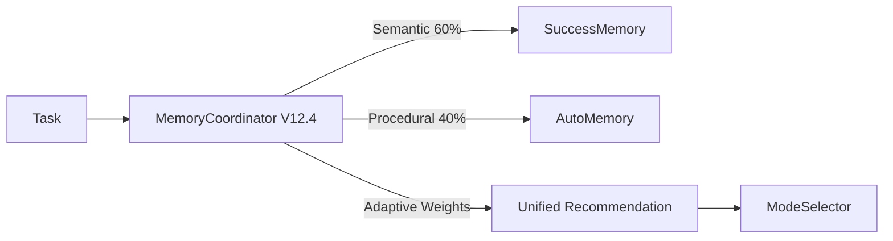

# ARCHITECTURE MAP (NEXUS V12.4 "COGNITIVE BOOST")

> **STATUS**: PARTIALLY ACTIVATED
> **VERSION**: V12.4.2 (Hybrid V9.4/V12.4)
> **LAST AUDIT**: 2025-12-17 (Autonomous Cycle 002)

## 🗺️ System Context (Level 1)

NEXUS is a **Collaborative Intelligence Orchestrator** designed to be cloned into any project.
It upgrades the project by spawning specialized agents that coexist in the `workspace/agents/` directory.

---

## 🏗️ Container View (Level 2)

### Core Components

| Component | Version | Status | Description |
|-----------|---------|--------|-------------|
| **OrchestratorV7** | V9.4 | ⚠️ **LEGACY** | Finite State Machine core. Currently uses Reactive Stagnation (V8.0). |
| **HybridSwarmEngine** | V9.0 | ✅ **ACTIVE** | Negotiates collaboration modes. Uses MemoryCoordinator. |
| **MemoryCoordinator** | V12.4 | ✅ **ACTIVE** | Adaptive weights (RL-lite) for semantic vs procedural memory. |
| **StagnationPredictor**| V12.4 | 💤 **DORMANT**| Proactive hesitation detection. Exists but NOT wired to FSM. |
| **HiveMind** | V7.5 | ✅ **ACTIVE** | Task pipeline & Strategy Blacklist. |

### Critical Paths

1.  **Incoming Task** → `TaskAnalyzer` → `HybridSwarmEngine`
2.  **Swarm Engine** → `ModeSelector` → `MemoryCoordinator` (Consults History)
3.  **Mode Selected** → `AgentInvoker` → `Execution`
4.  **Loop** → `StagnationDetector` (Reactive check) → `CFL` (Validation)

---

## 🔍 Tactical Zoom (Level 3)

### 1. The "Broken" Neural Link
The Orchestrator is currently using an outdated `StagnationDetector`.
- **Current**: REACTIVE. Waits for 3 repeated messages.
- **Available**: PROACTIVE (`StagnationPredictor`). Detects "let me think", diminishing returns.
- **Action Required**: Hot-swap in Cycle 003.

### 2. Memory Subsystem (Memoria Universalis)
The V12.4 "Cognitive Boost" is fully active in `core/memory`.

*Note: Weights adapt per domain (coding vs writing) based on feedback.*

---

## ⚠️ Known Technical Debt & Hallucinations

1.  **Orchestrator Lag**: The nervous system (`OrchestrationV7`) lags behind the brain (`Memory`).
2.  **Missing RAG Features**: `HybridBackend` (Reciprocal Rank Fusion) is implemented but engagement metrics are unknown.
3.  **Documentation Drift**: `ROADMAP.md` claims "COMPLETE" for features that are present but unconnected.

## 🚀 Evolution Trajectory

- **Cycle 003**: Activate `StagnationPredictor` (Proactive Intuition).
- **Cycle 004**: Deepen `Introduction` of specialized agents.
- **Cycle 005**: Self-Evolution via `MutationDetector`.
