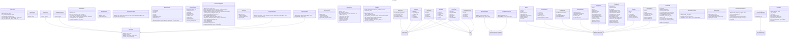

# Architecture Map

Generated for: `C:\Users\yann.abadie\OneDrive - GIE AD BRIVE\Documents\Projets\MES\20_NEXUS`

Date: 2025-11-20 14:39:38

```mermaid
---
title: 20_NEXUS
---
classDiagram
    class SkillLoader {
        - __init__(self, skills_dir) None
        + list_available_skills(self) List[str]
        + load_skill(self, skill_name) Any
        + execute_skill(self, skill_name, params) Dict[str, Any]
        + get_skill_info(self, skill_name) Dict[str, Any]
    }

    class AgentContext {
        - __init__(self) None
    }

    class BaseAgent {
        - __init__(self, name) None
        + run(self, context)
    }

    class GeminiAgent {
        + run(self, context)
    }

    class ClaudeWorkerAgent {
        + run(self, context)
    }

    class GeminiDriver {
        - __init__(self) None
        + plan_and_execute(self, user_request) str
        - _call_claude_with_state(self, task, state) str
        - _parse_claude_response_loose(self, text, task) TaskResult
        - _extract_json(self, text) Optional[str]
        - _is_critical_request(self, text) bool
    }

    class NexusHistorian {
        - __init__(self) None
        + update_history(self)
    }

    class PatternType {
        + str SUCCESS_STRATEGY
        + str ERROR_PATTERN
        + str OPTIMIZATION
        + str DOMAIN_INSIGHT
    }

    class ExecutionTrace {
        + str timestamp
        + str command
        + str action
        + str status
        + str details
        + Optional[float] duration
        + Optional[str] error
        + @classmethod from_worker_report(cls, report_text) "ExecutionTrace"
    }

    class LearnedPattern {
        + PatternType pattern_type
        + str trigger_context
        + str strategy
        + float confidence
        + int success_count
        + int failure_count
        + str last_used
        + List[str] examples
        + success_rate(self) float
    }

    class NexusLearningEngine {
        - __init__(self, history_path) None
        + parse_chat_history(self, history_content) List[ExecutionTrace]
        + extract_patterns(self, traces) List[LearnedPattern]
        - _analyze_action_group(self, action, traces) Optional[LearnedPattern]
        - _extract_success_strategy(self, traces) str
        - _extract_error_pattern(self, traces) str
        + update_playbook(self, patterns)
        - _get_playbook_category(self, pattern_type) str
        - _find_similar_pattern(self, pattern, category) Optional[Dict]
        - _merge_patterns(self, existing, new)
        - _prune_playbook(self)
        - _save_playbook(self)
        + learn_from_history(self) Dict
        + suggest_strategy(self, context) Optional[Dict]
    }

    class MCPServer {
        - __init__(self) None
        - _initialize_tools(self)
        - _register_handlers(self)
        + async run(self)
    }

    class MCPSSEHandler {
        - __init__(self, server, transport) None
        - async __call__(self, scope, receive, send)
    }

    class MCPMessageHandler {
        - __init__(self, transport) None
        - async __call__(self, scope, receive, send)
    }

    class MCPServerSSE {
        - __init__(self) None
        - _initialize_tools(self)
        - _register_handlers(self)
        + async handle_sse(self, request)
    }

    class CalculatorTool {
        - __init__(self) None
        + get_tools(self) List[Tool]
        + async execute(self, tool_name, arguments) Any
        - _add(self, args) float
        - _subtract(self, args) float
        - _multiply(self, args) float
        - _divide(self, args) float
        - _power(self, args) float
        - _sqrt(self, args) float
    }

    class AIBridge {
        - Dict[str, ClaudePersistentSession] _persistent_sessions
        + dict MODEL_MAP
        - __init__(self, logger) None
        - _check_dependencies(self)
        + get_persistent_session(self, model) ClaudePersistentSession
        + call_claude(self, prompt, model, persistent) str
        + call_gemini(self, prompt, model) str
        - _execute_oneshot(self, cmd, source_name) str
        + close_all_sessions(self)
    }

    class TaskStatus {
        + str PENDING
        + str IN_PROGRESS
        + str COMPLETED
        + str FAILED
        + str BLOCKED
        + str CANCELLED
    }

    class TaskPriority {
        + str LOW
        + str MEDIUM
        + str HIGH
        + str CRITICAL
    }

    class AgentRole {
        + str DRIVER
        + str EXECUTOR
        + str SAGE
        + str HISTORIAN
        + str USER
    }

    class ArtifactType {
        + str CODE
        + str DOCUMENT
        + str PLAN
        + str REPORT
        + str LOG
        + str UNKNOWN
    }

    class FeedbackSeverity {
        + str INFO
        + str WARNING
        + str ERROR
        + str CRITICAL
    }

    class Artifact {
        + UUID id
        + str name
        + ArtifactType type
        + Optional[str] path
        + Optional[str] content_preview
        + datetime created_at
        + datetime updated_at
        + int version
    }

    class SessionContext {
        + str session_id
        + str project_root
        + str environment
        + datetime start_time
        + List[AgentRole] active_agents
    }

    class FeedbackItem {
        + FeedbackSeverity severity
        + str message
        + Optional[str] suggestion
        + Optional[str] location
    }

    class ExecutionMetrics {
        + datetime start_time
        + Optional[datetime] end_time
        + float duration_seconds
        + int tokens_used
        + int tool_calls_count
    }

    class TaskRequest {
        + UUID id
        + str title
        + str description
        + TaskPriority priority
        + AgentRole role
        + Dict[str, Any] input_data
        + List[UUID] input_artifacts
        + str expected_output_format
        + List[str] constraints
        + int timeout_seconds
        + datetime created_at
        + AgentRole created_by
    }

    class TaskResult {
        + UUID task_id
        + TaskStatus status
        + str summary
        + Optional[str] detailed_output
        + List[Artifact] artifacts_created
        + List[UUID] artifacts_modified
        + Optional[str] error_message
        + ExecutionMetrics metrics
        + float confidence_score
        + List[FeedbackItem] quality_notes
        + List[str] next_steps_suggestions
        + List[str] blockers_found
        + datetime completed_at
        + AgentRole completed_by
    }

    class PlanStep {
        + UUID id
        + str title
        + str description
        + TaskStatus status
        + AgentRole assigned_to
        + List[UUID] dependencies
    }

    class ExecutionPlan {
        + UUID id
        + str goal
        + List[PlanStep] steps
        + int current_step_index
        + TaskStatus status
        + datetime created_at
        + datetime updated_at
    }

    class NexusState {
        + str version
        + datetime last_updated
        + SessionContext context
        + Optional[ExecutionPlan] current_plan
        + Dict[UUID, Artifact] artifacts_registry
        + List[TaskResult] task_history
        + float quality_score_rolling_avg
        + int turn_count
        + Optional[str] last_driver_message
        + Optional[str] last_executor_response
        + update_timestamp(self)
    }

    class BaseAgent {
        - __init__(self, name, bridge, logger) None
        + run(self, state) Dict[str, Any]
    }

    class GeminiNativeAgent {
        - __init__(self, name, model, instructions, input_keys, output_key, bridge, logger) None
        + run(self, state) Dict[str, Any]
    }

    class ClaudeProxyAgent {
        - __init__(self, name, model, prompt_template, input_keys, output_key, bridge, logger) None
        + run(self, state) Dict[str, Any]
    }

    class SequentialAgent {
        - __init__(self, name, agents, bridge, logger) None
        + run(self, state) Dict[str, Any]
    }

    class ArchitectureLoader {
        - __init__(self, library_path) None
        + load(self, arch_path) BaseAgent
        - _load_agent_list(self, agents_conf) List[BaseAgent]
    }

    class NexusLogger {
        - __init__(self, log_dir) None
        - _init_log_file(self, timestamp)
        + log(self, speaker, target, content, icon)
        + system(self, message)
    }

    class ClaudePersistentSession {
        - __init__(self, model, session_id, logger) None
        - _find_executable(self) str
        + start(self) bool
        - _read_stream(self, stream, stream_name)
        + send_message(self, message, timeout) str
        + close(self)
    }

    class NexusJSONEncoder {
        + default(self, obj)
    }

    class NexusStore {
        - __init__(self, db_path) None
        - _get_conn(self)
        - _init_db(self)
        + save_state(self, state)
        + load_state(self) NexusState
        + log_task(self, request, result)
        + get_recent_history(self, limit) List[Dict]
        + reset(self)
    }

    GeminiAgent --|> BaseAgent

    ClaudeWorkerAgent --|> BaseAgent

    PatternType --|> `enum.Enum`

    MCPSSEHandler --|> `starlette.responses.Response`

    MCPMessageHandler --|> `starlette.responses.Response`

    TaskStatus --|> str

    TaskStatus --|> `enum.Enum`

    TaskPriority --|> str

    TaskPriority --|> `enum.Enum`

    AgentRole --|> str

    AgentRole --|> `enum.Enum`

    ArtifactType --|> str

    ArtifactType --|> `enum.Enum`

    FeedbackSeverity --|> str

    FeedbackSeverity --|> `enum.Enum`

    Artifact --|> `pydantic.BaseModel`

    SessionContext --|> `pydantic.BaseModel`

    FeedbackItem --|> `pydantic.BaseModel`

    ExecutionMetrics --|> `pydantic.BaseModel`

    TaskRequest --|> `pydantic.BaseModel`

    TaskResult --|> `pydantic.BaseModel`

    PlanStep --|> `pydantic.BaseModel`

    ExecutionPlan --|> `pydantic.BaseModel`

    NexusState --|> `pydantic.BaseModel`

    GeminiNativeAgent --|> BaseAgent

    ClaudeProxyAgent --|> BaseAgent

    SequentialAgent --|> BaseAgent

    NexusJSONEncoder --|> `json.JSONEncoder`
```
