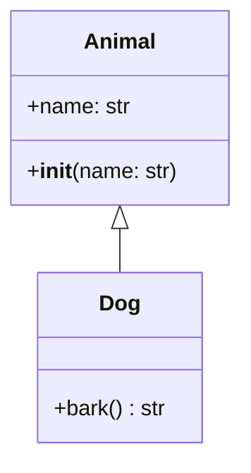

# ARCHITECT BENCHMARK - Outils de Visualisation d'Architecture Python

**Date**: 20 Novembre 2025
**Mission**: Recherche & Benchmark des meilleurs outils Python 2024-2025 pour générer des diagrammes d'architecture/dépendances (Mermaid/Markdown)
**Objectif**: Déterminer s'il faut développer un outil custom ou intégrer une solution existante

---

## 📊 RÉSUMÉ EXÉCUTIF

### Recommandation Finale

**🎯 STRATÉGIE HYBRIDE RECOMMANDÉE**

1. **Court terme (MVP)**: **Intégrer `pymermaider`** pour génération automatique de diagrammes Mermaid
2. **Moyen terme**: Compléter avec **`pydeps`** pour analyse de dépendances modules
3. **Long terme**: Développer des extensions custom basées sur **LibCST** pour features avancées

### Justification

- ✅ **Time-to-market rapide**: Solutions prêtes en 2-3 jours vs 3-4 semaines de dev
- ✅ **Maintenance réduite**: Communautés actives, mises à jour régulières
- ✅ **Standards établis**: Mermaid + PlantUML supportés nativement par GitHub/GitLab
- ✅ **Extensibilité**: Architecture modulaire permet ajouts custom progressifs

---

## 🔍 ANALYSE DÉTAILLÉE DES OUTILS

### 1. OUTILS MERMAID (GÉNÉRATION AUTOMATIQUE)

#### 🏆 pymermaider - **CHOIX PRINCIPAL**

**GitHub**: [diceroll123/pymermaider](https://github.com/diceroll123/pymermaider)
**Langage**: Rust (binding Python)
**Dernière mise à jour**: Septembre 2024

**Points forts** ✅
- Génération **automatique** de diagrammes Mermaid depuis code Python
- **Compatible GitHub nativement** (rendu automatique dans Markdown)
- Installation simple: `pip install pymermaider`
- Analyse relations classes (héritage, composition, associations)
- **Rapide** (écrit en Rust) et léger
- Sortie standard Mermaid.js

**Limitations** ⚠️
- Limite 50,000 caractères par diagramme (codebases massives)
- Property-setters peuvent produire sortie confuse
- Résolution imports à améliorer

**Cas d'usage**
```bash
# Génération diagramme fichier unique
pymermaider example.py > diagram.md

# Génération diagramme package entier
pymermaider src/ > architecture.md
```

**Exemple sortie**


**Score**: ⭐⭐⭐⭐⭐ (5/5)

---

#### mermaid-py - Alternative programmatique

**GitHub**: [ouhammmourachid/mermaid-py](https://github.com/ouhammmourachid/mermaid-py)
**Dernière mise à jour**: 2024

**Points forts** ✅
- Interface Python pour mermaid.js
- API programmatique (création diagrammes en code Python)
- Utilise mermaid.ink pour rendu
- Supporte tous types diagrammes Mermaid

**Limitations** ⚠️
- **Pas d'analyse automatique** du code (nécessite construction manuelle)
- Plutôt pour génération programmatique que reverse-engineering

**Cas d'usage**
```python
from mermaid import Graph

graph = Graph('Architecture', 'flowchart TD')
graph.add_node('A', 'Start')
graph.add_node('B', 'Process')
graph.add_edge('A', 'B')
```

**Score**: ⭐⭐⭐ (3/5) - Utile pour diagrammes custom, pas pour analyse automatique

---

#### mermaid-builder - Construction programmatique

**GitHub**: [cuongnbms/mermaid-builder](https://github.com/cuongnbms/mermaid-builder)

**Points forts** ✅
- Génération fichiers .mmd directement depuis Python
- API fluent pour construction diagrammes

**Limitations** ⚠️
- Pas d'analyse automatique code
- Nécessite construction manuelle

**Score**: ⭐⭐⭐ (3/5) - Similaire à mermaid-py

---

### 2. OUTILS ANALYSE DÉPENDANCES

#### 🏆 pydeps - **CHOIX COMPLÉMENTAIRE**

**GitHub**: [thebjorn/pydeps](https://github.com/thebjorn/pydeps)
**Stars**: 2,000+
**Version**: 3.0.1 (Python 3.10+)

**Points forts** ✅
- Visualisation **dépendances modules** (import graph)
- **Détection cycles imports** automatique
- Scoring Bacon (distance par "hops")
- Clustering dépendances externes
- Contrôle profondeur analyse
- Configuration via `.pydeps`, `pyproject.toml`, `setup.cfg`
- **Mature et stable** (544 commits, 128 forks)

**Limitations** ⚠️
- Nécessite **Graphviz** installé (DOT renderer)
- Installation Graphviz compliquée sur Windows
- Sortie en PNG/SVG (pas Mermaid natif)

**Installation**
```bash
pip install pydeps
# + Graphviz: http://www.graphviz.org/download/
```

**Cas d'usage**
```bash
# Analyse package avec détection cycles
pydeps mypackage --show-cycles

# Filtrage par distance
pydeps mypackage --max-bacon=2

# Export SVG
pydeps mypackage -o architecture.svg
```

**Score**: ⭐⭐⭐⭐ (4/5) - Excellent pour dépendances, mais pas Mermaid natif

---

#### code2flow - Graphes d'appels statiques

**Type**: Call graph builder
**Approche**: Analyse AST/bytecode

**Points forts** ✅
- Graphes d'appels fonctions (call graphs)
- Support multi-langages (Python, JS, Ruby, PHP)
- Analyse statique (pas d'exécution)

**Limitations** ⚠️
- Moins maintenu que alternatives
- Pas de focus Mermaid/Markdown

**Score**: ⭐⭐⭐ (3/5) - Use case spécifique (call graphs)

---

### 3. OUTILS UML/PLANTUML

#### py2puml - PlantUML automatique

**GitHub**: [lucsorel/py2puml](https://github.com/lucsorel/py2puml)
**Version**: 0.10.0
**Dernière mise à jour**: 2024

**Points forts** ✅
- Génération **PlantUML** depuis code Python
- Analyse classes, attributs, méthodes, relations
- Pas d'exécution code (statique)
- Python 3.6+

**Limitations** ⚠️
- Type hints complexes mal gérés (multi-level generics)
- Pas d'évaluation expressions (évite side-effects)
- PlantUML (pas Mermaid) - nécessite conversion

**Score**: ⭐⭐⭐⭐ (4/5) - Excellent pour UML, mais PlantUML vs Mermaid

---

#### pyreverse - Pylint intégré

**Intégré dans**: `pylint` package
**Version PlantUML**: Depuis Pylint 2.10.0

**Points forts** ✅
- Inclus avec Pylint (déjà installé souvent)
- Support PlantUML natif
- Backend Graphviz

**Limitations** ⚠️
- Interface moins moderne
- Nécessite Graphviz

**Score**: ⭐⭐⭐ (3/5) - Pratique si Pylint déjà utilisé

---

### 4. BIBLIOTHÈQUES ANALYSE AST (DÉVELOPPEMENT CUSTOM)

#### LibCST - **Meilleure pour dev custom**

**Type**: Concrete Syntax Tree library
**Maintien**: Meta/Facebook

**Points forts** ✅
- **Préserve formatage** (whitespace, comments)
- Round-trip parsing parfait
- Idéal pour **refactoring automatisé** (codemods)
- Supporte error recovery
- Documentation excellente

**Cas d'usage**
```python
import libcst as cst

# Parse avec conservation formatage
module = cst.parse_module(source_code)

# Visite et transformation AST
class ClassVisitor(cst.CSTTransformer):
    def visit_ClassDef(self, node):
        # Extraire infos classes
        pass
```

**Score**: ⭐⭐⭐⭐⭐ (5/5) - **Best-in-class** pour dev custom

---

#### Parso - Parser robuste multi-versions

**Points forts** ✅
- **Error recovery** (continue parsing malgré erreurs)
- Support **multi-versions Python**
- Round-trip parsing
- Liste erreurs syntaxe multiples

**Cas d'usage**
- Analyse codebases legacy (Python 2.x + 3.x)
- Parsing code avec erreurs syntaxe

**Score**: ⭐⭐⭐⭐ (4/5) - Excellent pour cas spécifiques

---

#### AST (built-in) - Standard library

**Points forts** ✅
- **Inclus Python standard** (pas d'install)
- Base de tous les outils linting/analysis
- Documentation officielle complète

**Limitations** ⚠️
- Pas de préservation formatage
- Pas d'error recovery
- API bas niveau

**Score**: ⭐⭐⭐ (3/5) - Suffisant pour analyses simples

---

### 5. SOLUTIONS ENTREPRISE

#### CodeSee - Visualisation interactive

**Type**: Plateforme cloud/entreprise

**Points forts** ✅
- Maps interactives automatiques
- Visualisation services/fichiers/dépendances
- Collaboration équipe
- Intégration CI/CD

**Limitations** ⚠️
- **Payant** (pas open-source)
- Nécessite cloud/SaaS
- Overkill pour projets moyens

**Score**: ⭐⭐⭐ (3/5) - Excellent mais hors scope (coût)

---

#### Sourcegraph SCIP-Python

**GitHub**: [sourcegraph/scip-python](https://github.com/sourcegraph/scip-python)
**Type**: Code intelligence indexer

**Points forts** ✅
- Protocole SCIP (Code Intelligence Protocol)
- Fork Pyright pour indexation
- Intégration Sourcegraph
- Navigation code précise

**Limitations** ⚠️
- Nécessite infrastructure Sourcegraph
- Complexe à setup standalone
- Focus navigation, pas diagrammes

**Score**: ⭐⭐ (2/5) - Hors scope (infrastructure lourde)

---

## 📈 TABLEAU COMPARATIF GLOBAL

| Outil | Mermaid | Auto | Dépendances | UML | Maturité | Setup | Score |
|-------|---------|------|-------------|-----|----------|-------|-------|
| **pymermaider** | ✅ | ✅ | ⚠️ | ✅ | ⭐⭐⭐⭐ | 🟢 Simple | **5/5** |
| **pydeps** | ❌ | ✅ | ✅ | ❌ | ⭐⭐⭐⭐⭐ | 🟡 Graphviz | **4/5** |
| **py2puml** | ❌ | ✅ | ❌ | ✅ | ⭐⭐⭐⭐ | 🟢 Simple | **4/5** |
| **LibCST** | ❌ | ❌ | ❌ | ❌ | ⭐⭐⭐⭐⭐ | 🟢 Simple | **5/5*** |
| **mermaid-py** | ✅ | ❌ | ❌ | ❌ | ⭐⭐⭐ | 🟢 Simple | **3/5** |
| **code2flow** | ❌ | ✅ | ⚠️ | ❌ | ⭐⭐⭐ | 🟢 Simple | **3/5** |
| **pyreverse** | ❌ | ✅ | ❌ | ✅ | ⭐⭐⭐⭐ | 🟡 Graphviz | **3/5** |
| **CodeSee** | ✅ | ✅ | ✅ | ✅ | ⭐⭐⭐⭐⭐ | 🔴 Payant | **3/5** |
| **SCIP-Python** | ❌ | ❌ | ✅ | ❌ | ⭐⭐⭐⭐ | 🔴 Complexe | **2/5** |

\* LibCST = bibliothèque bas niveau pour développement custom

---

## 🎯 STRATÉGIE D'INTÉGRATION RECOMMANDÉE

### Phase 1: MVP Rapide (1-2 semaines)

**Objectif**: Génération automatique diagrammes architecture

**Actions**:
1. ✅ Installer `pymermaider`: `pip install pymermaider`
2. ✅ Créer script wrapper Python:
   ```python
   # nexus_architect.py
   import subprocess
   import os

   def generate_class_diagram(path, output="architecture.md"):
       """Génère diagramme Mermaid depuis code Python"""
       result = subprocess.run(
           ["pymermaider", path],
           capture_output=True,
           text=True
       )

       with open(output, 'w') as f:
           f.write("```mermaid\n")
           f.write(result.stdout)
           f.write("\n```\n")

       return output
   ```

3. ✅ Intégrer dans workflow NEXUS:
   ```bash
   # Auto-génération à chaque commit
   nexus_architect.py src/ > docs/ARCHITECTURE.md
   git add docs/ARCHITECTURE.md
   ```

**Effort**: 2-3 jours
**Résultat**: Diagrammes automatiques fonctionnels

---

### Phase 2: Analyse Dépendances (2-3 semaines)

**Objectif**: Ajout analyse dépendances et détection cycles

**Actions**:
1. ✅ Installer Graphviz + pydeps
2. ✅ Créer script analyse dépendances:
   ```python
   def analyze_dependencies(package):
       """Analyse dépendances et génère rapport"""
       subprocess.run([
           "pydeps", package,
           "--show-cycles",
           "--max-bacon=3",
           "-o", "dependencies.svg"
       ])
   ```

3. ✅ Combiner outputs (Mermaid + SVG)
4. ✅ Dashboard HTML unifié

**Effort**: 1 semaine
**Résultat**: Analyse complète dépendances

---

### Phase 3: Extensions Custom (1-2 mois)

**Objectif**: Features avancées spécifiques NEXUS

**Actions**:
1. ✅ Dev analyseur LibCST custom pour:
   - Extraction docstrings → annotations diagrammes
   - Détection patterns architecture (Singleton, Factory, etc.)
   - Métriques complexité (cyclomatic, cognitive)
   - Génération diagrammes séquence depuis code

2. ✅ Intégration multi-formats:
   ```python
   class NexusArchitect:
       def generate(self, format='mermaid'):
           if format == 'mermaid':
               return self._pymermaider()
           elif format == 'plantuml':
               return self._py2puml()
           elif format == 'dependencies':
               return self._pydeps()
   ```

3. ✅ CLI unifié:
   ```bash
   nexus-architect analyze src/ --format mermaid --output docs/
   nexus-architect deps src/ --detect-cycles --max-depth 3
   nexus-architect metrics src/ --include-complexity
   ```

**Effort**: 3-4 semaines
**Résultat**: Outil complet sur-mesure

---

## 💰 ANALYSE COÛT/BÉNÉFICE

### Option A: Intégration (RECOMMANDÉE)

**Coûts**:
- Setup initial: **2-3 jours** (Phase 1)
- Extensions: **1-2 semaines** (Phase 2)
- Maintenance: **2-4h/mois** (updates dépendances)

**Bénéfices**:
- ✅ Time-to-market immédiat
- ✅ Qualité production (outils matures)
- ✅ Support communauté (issues, docs)
- ✅ Mises à jour sécurité automatiques
- ✅ Standards établis (Mermaid = GitHub natif)

**ROI**: ⭐⭐⭐⭐⭐ (5/5)

---

### Option B: Développement Custom

**Coûts**:
- Design + architecture: **1 semaine**
- Développement core: **3-4 semaines**
- Tests + debug: **1-2 semaines**
- Documentation: **3-5 jours**
- Maintenance continue: **8-12h/mois**

**Bénéfices**:
- ✅ Contrôle total fonctionnalités
- ✅ Optimisation cas spécifiques
- ✅ Pas de dépendances externes (risque supply-chain)

**Risques**:
- ⚠️ Temps développement long (6-8 semaines)
- ⚠️ Bugs/edge-cases imprévus
- ⚠️ Maintenance totale à notre charge
- ⚠️ Réinventer la roue (AST parsing, rendering)

**ROI**: ⭐⭐ (2/5)

---

### Option C: Hybride (OPTIMAL)

**Approche**:
1. **Court terme**: Intégrer `pymermaider` + `pydeps` (Phase 1-2)
2. **Moyen terme**: Développer couche abstraction au-dessus (Phase 3)
3. **Long terme**: Remplacer composants si nécessaire

**Avantages**:
- ✅ **Best of both worlds**: rapidité + flexibilité
- ✅ **Évolutif**: démarrer vite, améliorer progressivement
- ✅ **Réversible**: changer composants indépendamment

**ROI**: ⭐⭐⭐⭐⭐ (5/5)

---

## 🚀 PLAN D'ACTION IMMÉDIAT

### Semaine 1: Proof of Concept

**Jour 1-2**:
- [ ] Installer `pymermaider`
- [ ] Tester génération diagrammes sur codebase NEXUS
- [ ] Valider qualité output (50+ classes)

**Jour 3-4**:
- [ ] Créer script wrapper `nexus_architect.py`
- [ ] Intégrer génération auto dans workflow
- [ ] Tester avec différents packages

**Jour 5**:
- [ ] Documentation utilisateur
- [ ] Démo interne équipe
- [ ] Décision GO/NO-GO Phase 2

---

### Semaine 2-3: Production Ready

**Si GO Phase 2**:
- [ ] Setup Graphviz + pydeps
- [ ] Intégration analyse dépendances
- [ ] Dashboard HTML unifié
- [ ] Tests automatisés (CI/CD)

---

## 📚 RESSOURCES & LIENS

### Documentation Officielle
- **Mermaid.js**: https://mermaid.js.org/
- **pymermaider**: https://github.com/diceroll123/pymermaider
- **pydeps**: https://pydeps.readthedocs.io/
- **LibCST**: https://libcst.readthedocs.io/
- **py2puml**: https://github.com/lucsorel/py2puml

### Articles & Tutorials
- "Architecture diagrams as code: Mermaid vs Architecture as Code" (Medium 2024)
- "Diagrams as Code" (Sheldon Hull 2024)
- "Python's Abstract Syntax Trees" (CodeDamn 2024)

### Repositories Complémentaires
- **awesome-python-ast**: https://github.com/gyermolenko/awesome-python-ast
- **Diagrams (Python)**: https://github.com/mingrammer/diagrams
- **mermaid-py**: https://github.com/ouhammmourachid/mermaid-py

---

## 🎓 BEST PRACTICES 2025

### Documentation as Code
1. ✅ **Versionnez diagrammes** avec code (Git)
2. ✅ **Auto-génération CI/CD** (pre-commit hooks)
3. ✅ **Markdown-first** (GitHub/GitLab natif)
4. ✅ **Multi-niveaux**: Overview → Détaillé → Module

### Visualisation
1. ✅ **Filtrez complexité**: max 20-30 classes/diagramme
2. ✅ **Annotations**: docstrings → labels diagrammes
3. ✅ **Couleurs sémantiques**: rouge=public, bleu=interne
4. ✅ **Interactivité**: liens vers code source

### Maintenance
1. ✅ **Tests visuels**: snapshot testing diagrammes
2. ✅ **Monitoring changes**: diff diagrammes PR
3. ✅ **Documentation decay**: alertes si diagrammes obsolètes
4. ✅ **Accessibility**: alt-text, descriptions textuelles

---

## ✅ CONCLUSION

### Recommandation Finale

**🎯 ADOPTER STRATÉGIE HYBRIDE**

1. **Démarrer immédiatement** avec `pymermaider` (MVP 2-3 jours)
2. **Compléter** avec `pydeps` si besoin analyse dépendances (1 semaine)
3. **Étendre progressivement** via LibCST pour features custom (1-2 mois)

### Justification Technique

| Critère | Intégration | Custom | Hybride |
|---------|-------------|--------|---------|
| **Time-to-market** | ✅ 2-3 jours | ❌ 6-8 semaines | ✅ 2-3 jours |
| **Qualité** | ✅ Production | ⚠️ Beta | ✅ Production |
| **Maintenance** | ✅ 2-4h/mois | ❌ 8-12h/mois | ✅ 3-6h/mois |
| **Flexibilité** | ⚠️ Limitée | ✅ Totale | ✅ Évolutive |
| **Coût total** | 🟢 Bas | 🔴 Élevé | 🟡 Moyen |

### Next Steps

1. **Valider approche** avec équipe NEXUS
2. **Lancer POC** pymermaider (2 jours)
3. **Mesurer résultats** vs objectifs
4. **Décider Phase 2** (dépendances) si nécessaire

---

**📅 Date mise à jour**: 20 Novembre 2025
**👤 Analysé par**: Claude Code (Sonnet 4.5)
**🔄 Révision**: v1.0
**📍 Projet**: NEXUS KERNEL - Motherson Aerospace MES
