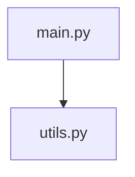

# SPECIFICATION : AGENT ARCHITECTE (NEXUS SKILL)

## Objectif
Créer un outil Python autonome capable de scanner un projet logiciel et de générer un rapport d'architecture complet, optimisé pour la compréhension par une IA (Gemini).

## Contraintes Techniques
- **Langage** : Python 3.8+ (Utiliser librairies standard `ast`, `pathlib` si possible, ou `networkx` si indispensable et disponible).
- **Entrée** : Chemin racine du projet.
- **Sortie** : Fichier `ARCHITECTURE_REPORT.md` à la racine de l'analyse.

## Fonctionnalités Requises

### 1. Scan Intelligent
- Parcourir récursivement les dossiers.
- Respecter strictement `.gitignore` (s'il existe).
- Ignorer les dossiers "bruit" par défaut (`__pycache__`, `.git`, `.venv`, `node_modules`).

### 2. Analyse Statique (Python Focus)
Pour chaque fichier `.py` :
- Extraire les **Classes** (Nom, Docstring, Héritage).
- Extraire les **Fonctions/Méthodes** (Nom, Arguments, Docstring, Return Type hint).
- Détecter les **Imports** (pour construire le graphe de dépendance).

### 3. Génération de Rapport (Markdown)
Le rapport doit contenir :
- **Header** : Date, Projet, Statistiques globales (Nb fichiers, Lignes de code).
- **Carte Topographique** : Arborescence des fichiers (Tree view).
- **Catalogue des Modules** : Pour chaque fichier clé, résumé de son contenu (Classes/Fonctions).
- **Graphe de Dépendances** : Diagramme Mermaid `graph TD` montrant les relations entre fichiers.

## Format de Sortie (Template)

```markdown
# Rapport d'Architecture : [NomProjet]
Date : YYYY-MM-DD

## Statistiques
- Fichiers : X
- Classes : Y
- Fonctions : Z

## Structure
[Arborescence]

## Vue Détaillée par Module
### src/main.py
- **Class** `Main`: Point d'entrée...
  - `run()`: Lance le processus.

## Dépendances (Mermaid)

```

## Instructions pour le Développeur (Claude)
- Sois robuste sur l'encodage (UTF-8).
- Gère les erreurs de parsing AST sans crasher.
- Fais un code propre, typé et documenté.
- Le script doit être exécutable en CLI : `python architect.py <path>`
