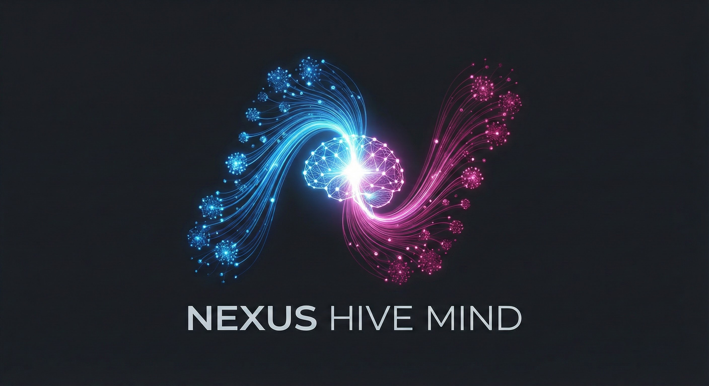
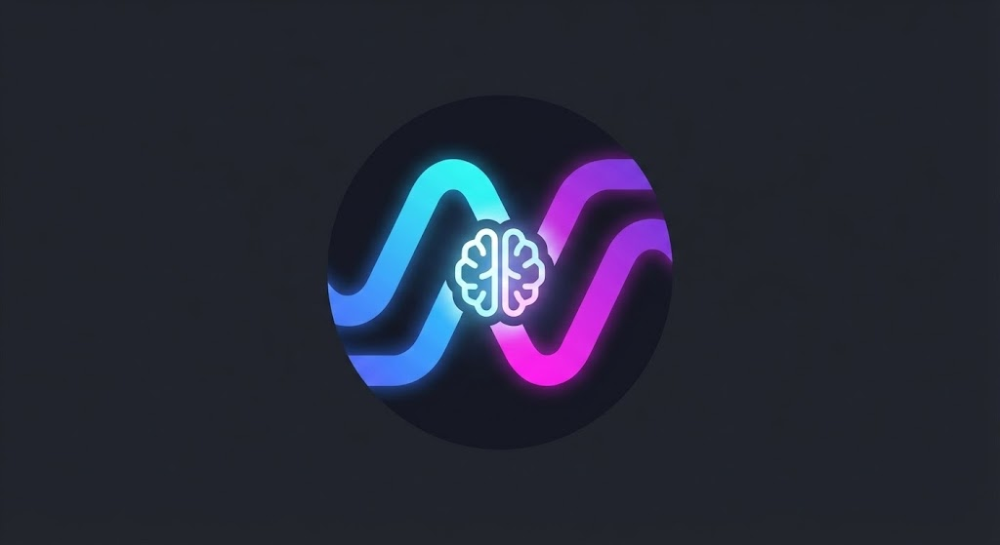
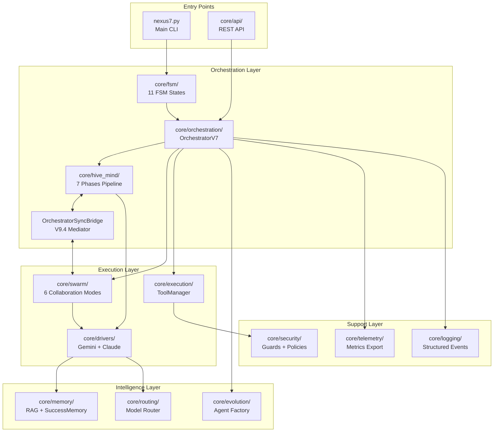

<p align="center">
  
</p>

<h1 align="center">
  
  NEXUS V12.0 "RETINA VISUALS"
</h1>

<p align="center">
  <strong>A Collaborative Intelligence Core for Specialized Agent Generation</strong>
</p>

<p align="center">
  <a href="#quick-start">Quick Start</a> •
  <a href="#features">Features</a> •
  <a href="#architecture">Architecture</a> •
  <a href="#commands">Commands</a> •
  <a href="ROADMAP.md">Roadmap</a>
</p>

<p align="center">
  
  
  
  
  
  
</p>

---

NEXUS is a multi-agent orchestration platform that combines **Claude** and **Gemini** to create a **collaborative intelligence** capable of generating and coordinating specialized agents for complex tasks.

## Vision

NEXUS is a **deployable collaborative intelligence** that:
1. **Analyzes** complex requirements
2. **Generates** specialized agents (children that coexist)
3. **Orchestrates** their collaboration via Hybrid Swarm
4. **Evolves** by selecting the best configurations

<a name="quick-start"></a>
## Quick Start

```bash
# Navigate to NEXUS
cd NEXUS-N7A

# Install dependencies
pip install -r requirements_v7.txt

# Run NEXUS
python nexus7.py
```

## Core Power: Gemini + Claude Symbiosis

```
GEMINI 3 Pro  <═══════════════>  CLAUDE Opus 4.5
     │           SYMBIOSIS           │
     │          COGNITIVE            │
     └───────────────┬───────────────┘
                     │
             6 SWARM MODES
     PARALLEL │ SEQUENTIAL │ LEAD_SUPPORT
     PING_PONG │ SPECIALIST │ RED_BLUE
                     │
            SELF-HEALING (Phase 8)
           FALLBACK CHAIN ON FAILURE
```

<a name="features"></a>
## V12.0 Features

### Recent Operations

| Version | Codename | Feature | Status |
|---------|----------|---------|--------|
| **V12.0** | RETINA VISUALS | Mission Cockpit UI (HiveMap, FileCommander, MissionControl) | ✅ COMPLETE |
| **V11.7** | RETINA FOUNDATION | React 19 Frontend (CEREBRO) | ✅ COMPLETE |
| **V11.6.2** | IRONCLAD | Zero Trust WebSocket Auth (IDOR fix) | ✅ COMPLETE |
| **V11.6** | KEYMAKER | JWT Authentication | ✅ COMPLETE |
| **V11.5** | CORTEX | API Control & State Persistence | ✅ COMPLETE |

### CEREBRO Web Interface (V12.0)

```
┌─────────────────────────────────────────────────────────────┐
│ CEREBRO V12.0 - Mission Cockpit                             │
├───────────────────────────────────┬─────────────────────────┤
│ Tabs: [Hive Map] [Files]          │ Mission Control         │
│                                   │ - 6 Swarm Modes         │
│ - HiveMap: SVG Graph Viz          │ - ENGAGE / ABORT        │
│ - FileCommander: Monaco Editor    ├─────────────────────────┤
│ - Graph Events: Real-time         │ Event Stream            │
│                                   │ - WebSocket Live        │
└───────────────────────────────────┴─────────────────────────┘
```

### Classic Phase Highlights (V8-V10)

| Phase | Feature | Status |
|-------|---------|--------|
| **Phase 8** | Self-Healing Swarm (Fallback Chain) | ✅ COMPLETE |
| **Phase 10d** | Session-Aware Agent Selection | ✅ COMPLETE |
| **Phase 14e** | Force Chain-of-Thought (EXPERT) | ✅ COMPLETE |

### Hybrid Swarm Engine
Dynamic collaboration modes negotiated by agents:
- **PARALLEL**: Simultaneous work on independent subtasks
- **SEQUENTIAL**: Ordered execution for dependent steps
- **LEAD_SUPPORT**: Expert leads, partner reviews
- **PING_PONG**: Rapid iteration until convergence
- **SPECIALIST**: Single expert for clear domains
- **RED_BLUE**: Adversarial propose/attack/defend

**Fallback Chain (Self-Healing):**
```
PARALLEL → SEQUENTIAL → SPECIALIST
RED_BLUE → LEAD_SUPPORT → SPECIALIST
PING_PONG → SEQUENTIAL → SPECIALIST
```

### Agent Factory (Spawning Pool)
Generate specialized agents that persist and collaborate:
```bash
nexus> /spawn SQL Expert      # Creates workspace/agents/sql_expert/
nexus> /spawn Vue.js Expert   # Creates workspace/agents/vue_js_expert/
nexus> /agents                # List all spawned agents
```

### Intelligent Model Routing
- **Claude Opus**: Complex reasoning, creativity, architecture
- **Claude Sonnet**: Fast execution, tool use
- **Gemini 3-Pro**: Research, analysis, brainstorming

### Evolution System
Create and evaluate child configurations:
```bash
nexus> /evolve 3       # Create 3 children
nexus> /evolve-status  # Show evolution stats
nexus> /review         # Review pending children
```

<a name="architecture"></a>
## Architecture (V12.0)

```
┌──────────────────────────────────────────────────────────────────────┐
│                   NEXUS V12.0 RETINA VISUALS                              │
├──────────────────────────────────────────────────────────────────────┤
│                                                                      │
│   USER INPUT                                                         │
│       │                                                              │
│       ▼                                                              │
│   ┌─────────────────────────────────────────────────────────┐       │
│   │              ORCHESTRATOR V7 (FSM-based)                │       │
│   │   ┌─────┐   ┌─────────────┐   ┌────────────────┐        │       │
│   │   │IDLE │──▶│BRAINSTORMING│──▶│ EXECUTING_TOOL │        │       │
│   │   └─────┘   └─────────────┘   └────────────────┘        │       │
│   │              ▲       │               │                   │       │
│   │              │       ▼               ▼                   │       │
│   │   ┌──────────┴───────────────────────────────┐          │       │
│   │   │           VALIDATING_CFL (CFL)           │          │       │
│   │   └──────────────────────────────────────────┘          │       │
│   └─────────────────────────────────────────────────────────┘       │
│       │                                                              │
│       │  (MODERATE+ complexity)                                      │
│       ▼                                                              │
│   ┌─────────────────────────────────────────────────────────┐       │
│   │              HYBRID SWARM ENGINE                         │       │
│   │   TaskAnalyzer → ModeSelector → Negotiation → Executor  │       │
│   │                                                          │       │
│   │   Modes: PARALLEL│SEQUENTIAL│LEAD_SUPPORT│PING_PONG     │       │
│   │          SPECIALIST│RED_BLUE                             │       │
│   │                                                          │       │
│   │   Phase 8: Self-Healing Fallback Chain                   │       │
│   │   Phase 10d: Session-Aware Agent Selection               │       │
│   └─────────────────────────────────────────────────────────┘       │
│       │                                   │                          │
│       ▼                                   ▼                          │
│   ┌─────────────┐                   ┌─────────────┐                 │
│   │ GEMINI CLI  │                   │ CLAUDE CLI  │                 │
│   │ JSON Strict │                   │ Hybrid XML  │                 │
│   │ --resume    │                   │ <tool_use>  │                 │
│   └─────────────┘                   └─────────────┘                 │
│                                                                      │
└──────────────────────────────────────────────────────────────────────┘
```

<a name="commands"></a>
## Commands

| Command | Description |
|---------|-------------|
| `/help` | Show all commands |
| `/status` | Show orchestrator state |
| `/doctor` | System diagnostics |
| `/swarm <task>` | Route task through Hybrid Swarm |
| `/swarm-status` | Show swarm mode and DyLAN metrics |
| `/spawn <role>` | Create specialized agent |
| `/agents` | List spawned agents |
| `/evolve [n]` | Create n children (default: 3) |
| `/review` | Review pending children |
| `/pool-stats` | DyLAN agent importance scores |
| `/ws list` | List workspace files |
| `/ws read <file>` | Read workspace file |
| `/export-telemetry` | Export session telemetry |
| `exit` | Quit NEXUS |

## Project Structure

```
NEXUS-N7A/
├── core/                     # Core orchestration
│   ├── api/cerebro/          # CEREBRO REST API (V11.5+)
│   ├── drivers/              # Claude & Gemini CLI drivers
│   ├── fsm/                  # Finite State Machine (11 states)
│   ├── swarm/                # Hybrid Swarm Engine (6 modes)
│   ├── synapse/              # Memory & Protocol (LightMessageV7/HeavyMessageV7)
│   ├── evolution/            # Agent generation & mutation
│   ├── execution/            # Tool execution layer
│   ├── memory/               # Success memory (Phase 10)
│   ├── security/             # Defense-in-depth (IRONCLAD)
│   └── ...                   # 36 modules total
├── interface/ui/cerebro/     # CEREBRO Frontend (V12.0)
│   ├── src/components/       # React 19 components
│   │   ├── views/            # HiveMap, FileCommander
│   │   └── controls/         # MissionControl
│   └── src/stores/           # Zustand stores
├── prompts/                  # System prompts
├── workspace/                # Runtime data
├── tests/                    # Test suite (667+ tests)
├── docs/                     # Documentation
├── CLAUDE.md                 # Claude instructions
├── MISSION.md                # HIVE MIND vision
├── KERNEL.py                 # Alignment kernel (immutable)
└── ROADMAP.md                # Development roadmap
```

## Documentation

### Core Documents
| Document | Purpose |
|----------|---------|
| [MISSION.md](MISSION.md) | HIVE MIND vision & philosophy |
| [CLAUDE.md](CLAUDE.md) | Claude agent instructions |
| [ROADMAP.md](ROADMAP.md) | Development roadmap |
| [docs/README.md](docs/README.md) | Documentation index |
| [docs/HYBRID_SWARM.md](docs/HYBRID_SWARM.md) | Swarm documentation |
| [AUDIT_REPORT.md](AUDIT_REPORT.md) | Latest technical audit |

### The Nexus Map (V12.0 Architecture)



### Navigation Tree (V12.0 - 36 Modules Documented)

<details>
<summary><b>📁 core/ - Main Engine (176 Python files)</b></summary>

| Module | README | Synopsis |
|--------|--------|----------|
| `core/` | [README](core/README.md) | Engine principal - FSM + HiveMind + Swarm |
| `core/fsm/` | [README](core/fsm/README.md) | Machine à états (11 états, transitions, health monitoring) |
| `core/swarm/` | [README](core/swarm/README.md) | Hybrid Swarm Engine (6 modes, Self-Healing, DyLAN) |
| `core/hive_mind/` | [README](core/hive_mind/README.md) | Pipeline 7 phases (Analysis → Consolidation) |
| `core/hive_mind/phases/` | [README](core/hive_mind/phases/README.md) | Phases individuelles (BPMN workflow) |
| `core/orchestration/` | [README](core/orchestration/README.md) | Composants extraits (SyncBridge V9.4) |
| `core/drivers/` | [README](core/drivers/README.md) | Drivers LLM (Gemini JSON, Claude XML) |
| `core/execution/` | [README](core/execution/README.md) | ToolManager (11 outils) |
| `core/security/` | [README](core/security/README.md) | Guards multi-couches (OWASP LLM01:2025) |
| `core/memory/` | [README](core/memory/README.md) | RAG, ProjectMemory, SuccessMemory |
| `core/memory/backends/` | [README](core/memory/backends/README.md) | TF-IDF, BM25, Dense backends |
| `core/evolution/` | [README](core/evolution/README.md) | Agent Factory, mutations, LINEAGE |
| `core/evolution/phases/` | [README](core/evolution/phases/README.md) | Pipeline d'évolution |
| `core/agents/` | [README](core/agents/README.md) | Unified registry, agent pool |
| `core/bootstrap/` | [README](core/bootstrap/README.md) | Project analysis, auto-discovery |
| `core/synapse/` | [README](core/synapse/README.md) | Protocol V7 (LightMessage/HeavyMessage) |
| `core/routing/` | [README](core/routing/README.md) | Model routing (Opus/Sonnet/Pro) |
| `core/interface/` | [README](core/interface/README.md) | REPL interface |
| `core/interface/commands/` | [README](core/interface/commands/README.md) | Slash commands registry |
| `core/governance/` | [README](core/governance/README.md) | Alignment testing |
| `core/governance/red_team/` | [README](core/governance/red_team/README.md) | Adversarial testing |
| `core/telemetry/` | [README](core/telemetry/README.md) | Metrics & export |
| `core/logging/` | [README](core/logging/README.md) | Structured event logging |
| `core/utils/` | [README](core/utils/README.md) | Utilities (AtomicJsonStore, etc.) |
| `core/api/` | [README](core/api/README.md) | REST API endpoints |
| `core/mcp/` | [README](core/mcp/README.md) | Model Context Protocol |
| `core/adapters/` | [README](core/adapters/README.md) | External adapters |
| `core/prompts/` | [README](core/prompts/README.md) | Internal system prompts |
| `core/workspace/` | [README](core/workspace/README.md) | Workspace management |
| `core/notifications/` | [README](core/notifications/README.md) | User notifications |
| `core/ui/` | [README](core/ui/README.md) | UI components |
| `core/reasoning/` | [README](core/reasoning/README.md) | Chain-of-thought, reasoning |
| `core/meta/` | [README](core/meta/README.md) | Metacognition |
| `core/async_primitives/` | [README](core/async_primitives/README.md) | Async utilities |

</details>

## Requirements

- **Python**: 3.11+
- **CLIs**: `gemini`, `claude` installed and configured
- **Accounts**: Google AI Ultra + Claude Max (recommended)

## Principles

1. **Collaboration over Hierarchy**: Gemini + Claude are equal partners
2. **Coexistence over Replacement**: Spawned agents persist alongside parent
3. **Simplicity over Complexity**: Operation Ockham (remove before adding)
4. **Security First**: KERNEL.py immutable, SandboxPolicy enforced
5. **Self-Healing**: Graceful degradation via fallback chains

## Test Status

```
667 passed, 2 skipped, 0 failures
Score: 9/10 (Architecture mature)
```

## Author

**Yann Abadie** - Creator and Alignment Authority

---

*"Intelligence emerges from collaboration, not competition."*
