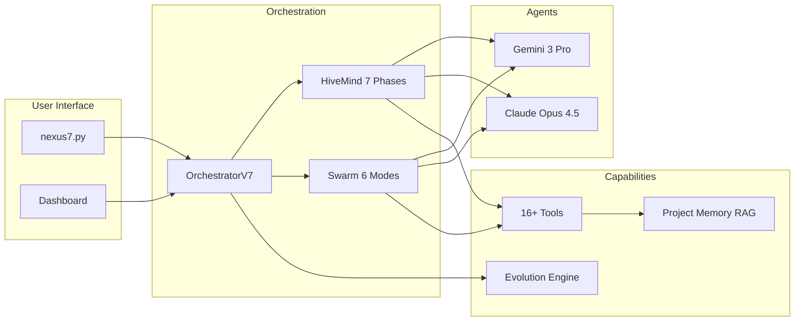

# NEXUS V10 "SINGULARITY"


> **Collaborative AI Intelligence that Evolves**

NEXUS is a multi-agent orchestration platform that combines Gemini and Claude into a unified collaborative intelligence. It specializes based on context, learns from outcomes, and evolves through self-improvement.

---

## Quick Start

```bash
# Install dependencies
pip install -r requirements.txt

# Run NEXUS
python nexus7.py
```

---

## The Nexus Map



---

## Architecture Overview

| Layer | Component | Purpose |
|-------|-----------|---------|
| **Entry** | `nexus7.py` | Interactive REPL |
| **Orchestration** | `core/orchestration_v7.py` | FSM + routing |
| **Strategic** | `core/hive_mind/` | 7-phase pipeline |
| **Tactical** | `core/swarm/` | 6 collaboration modes |
| **Execution** | `core/execution/` | 16+ tools |
| **Memory** | `core/memory/` | RAG + learning |
| **Evolution** | `core/evolution/` | Self-improvement |
| **Security** | `core/security/` | KERNEL alignment |
| **UI** | `frontend/` | Next.js dashboard |

---

## Navigation

### Core Modules (30)
→ [core/README.md](core/README.md)

### Documentation
- [ROADMAP_V10.md](ROADMAP_V10.md) - Development roadmap
- [INSTALLATION.md](INSTALLATION.md) - Setup guide
- [MISSION.md](MISSION.md) - Project philosophy
- [docs/](docs/) - Full documentation

### Key Files
| File | Purpose |
|------|---------|
| `KERNEL.py` | Immutable alignment rules |
| `LINEAGE.json` | Evolution history |
| `GEMINI.md` | Gemini instructions |
| `CLAUDE.md` | Claude instructions |

---

## HiveMind 7 Phases

1. **Analysis** - Independent task analysis by both agents
2. **Debate** - Resolve disagreements through structured debate
3. **Architecture** - Design execution plan
4. **Execution** - Monitored step execution
5. **Diagnosis** - Error analysis on failure
6. **Retry** - Apply fixes and retry
7. **Consolidation** - Merge and summarize results

---

## Swarm 6 Modes

| Mode | Use Case |
|------|----------|
| PARALLEL | Independent subtasks |
| SEQUENTIAL | Dependent steps |
| LEAD_SUPPORT | Complex implementation |
| PING_PONG | Iterative refinement |
| SPECIALIST | Single expert |
| RED_BLUE | Security review |

---

## Project Structure

```
NEXUS/
├── nexus7.py              ← Entry point
├── KERNEL.py              ← Immutable alignment
├── core/                  ← 30 backend modules
│   ├── hive_mind/         ← Strategic brain
│   ├── swarm/             ← Tactical coordination
│   ├── drivers/           ← LLM communication
│   ├── execution/         ← Tool execution
│   ├── memory/            ← RAG + learning
│   ├── evolution/         ← Self-improvement
│   └── security/          ← Safety layer
├── frontend/              ← Next.js dashboard
├── prompts/               ← System prompts
├── workspace/             ← Runtime data
└── tests/                 ← Test suite
```

---

## License

MIT License - See [LICENSE](LICENSE)

---

*Created by Yann Abadie | NEXUS V10.2*
