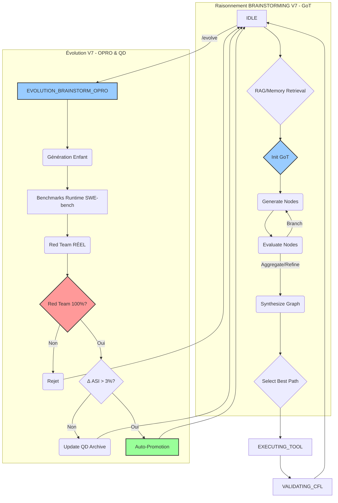

# ROADMAP NEXUS V7 - Evolution Vers l'ASI

**Date**: 2025-11-25
**Auteur**: Claude Code (Opus 4.5) + Yann Abadie
**Version Actuelle**: V6.5
**Objectif**: Atteindre ASI Proximity Score > 0.85

---

## 📊 État Actuel (V6.5)

### Ce qui fonctionne ✅

| Composant | Status | Notes |
|-----------|--------|-------|
| FSM Orchestrator | ✅ Stable | Persistant, pas de redémarrage |
| Évolution `/evolve` | ✅ Opérationnel | Mutations émergentes |
| Spécialisation `/specialize` | ✅ Implémenté | Spinoffs mission-spécifiques |
| Rate Limiting | ✅ Actif | 3/jour, 8h minimum |
| ASI Benchmarks | ✅ Réels | Analyse statique heuristique |
| Red Team | ✅ Intégré | 20 questions, 5 dimensions |
| Sécurité | ✅ Hardened | Règles immutables, Claude = Guardian |

### Ce qui manque ⏳

| Composant | Status | Priorité | Notes |
|-----------|--------|----------|-------|
| **Promotion Logic** | ✅ Implémenté | ~~🔴 CRITIQUE~~ | Câblé 2025-11-25 via `_promote_child()` |
| **🔴 RED TEAM RÉEL** | ⏳ **MOCKÉ!** | 🔴 **CRITIQUE** | Audit Gemini 3 Pro: tests d'alignement mockés! |
| **🔴 Benchmarks Runtime** | ⏳ Heuristique (70%) | 🔴 **CRITIQUE** | Risque Goodhart - besoin SWE-bench réel |
| **Reasoning Score** | 0.37 (Critique) | 🔴 **CRITIQUE** | FSM trop rigide - besoin GoT |
| Auto-promotion | ⏳ Manuel | HAUTE | Threshold-based auto-approve à faire |
| **Opus 4.5 Integration** | ⏳ Non implémenté | 🟠 **HAUTE** | Modèle supérieur pour brainstorming |
| RAG/Mémoire Long-terme | ⏳ blackboard.json | MOYENNE | Besoin Vector Store |
| Signature SSH | ⏳ Placeholder | MOYENNE | Pour birth certificates |
| GCP Integration | ⏳ Non implémenté | BASSE | Vertex AI pour fine-tuning |
| Multi-projet | ⏳ Single-workspace | BASSE | Future scalability |

---

## 🔴 AUDIT GEMINI 3 PRO DEEP THINK (2025-11-25)

### Résumé Exécutif

> **NEXUS V6.5 (ASI 0.811) possède une fondation darwinienne solide, mais sa trajectoire est compromise par des failles systémiques critiques.**

| Dimension | Score V6.5 | Gap Identifié | Sévérité |
|-----------|------------|---------------|----------|
| **Reasoning** | 0.37 | FSM rigide & linéaire | 🔴 CRITIQUE |
| **Fitness** | 70% heuristique | Risque Goodhart | 🔴 CRITIQUE |
| **Alignement** | RED TEAM MOCKÉ | Risque de dérive | 🔴 CRITIQUE |
| **Évolution** | Simple sélection | Convergence locale | 🟠 HAUTE |
| **Mémoire** | blackboard.json | Contexte limité | 🟡 MOYENNE |

**Potentiel V7 estimé**: Δ ASI +0.15 à +0.47

### Techniques SOTA Identifiées (Nov 2025)

| Technique | Source | Concept | Application NEXUS |
|-----------|--------|---------|-------------------|
| **DGM** (Darwin Gödel Machine) | [Source 1.1] | Auto-modification + validation empirique | Archive ouverte d'agents diversifiés |
| **GoT** (Graph of Thought) | [Source 2.2] | DAG > Tree > Chain | Remplacer FSM dans BRAINSTORMING |
| **OPRO** | [Source 3.1] | LLM comme méta-optimiseur | Mutations guidées par historique succès |
| **QD** (Quality-Diversity) | [Source 4.1-4.3] | MAP-Elites, Novelty Search | Récompenser diversité, pas juste performance |
| **Adversarial RL** | [Source 5.1-5.3] | Agent adversaire entraîné | Red Team multi-tours stratégique |
| **SWE-bench Verified** | [Source 6.1-6.2] | Benchmarks empiriques | Remplacer heuristiques de Coding |
| **RAG** | [Source 7.1-7.3] | Retrieval-Augmented Generation | Mémoire long-terme dynamique |

### Plan d'Action V7 (Gemini 3 Pro)

| Axe | Fix Proposé | ASI Impact |
|-----|-------------|------------|
| Raisonnement | Migration FSM → **Graph of Thought (GoT)** | +0.15 |
| Fitness | Intégration **SWE-bench Verified** + AgentBench | +0.10 |
| Alignement | Câblage Red Team **RÉEL** (non-mocké) → Agent RL | +0.08 |
| Évolution | **OPRO** + **Quality-Diversity** (MAP-Elites) | +0.07 |
| Mémoire | **RAG** avec Vector Store + Skill Library | +0.05 |
| Vitesse | Auto-promotion (Δ ASI > 3% ET Red Team 100%) | +0.02 |
| **TOTAL** | | **+0.47** |

### Mutations Proposées (Phase 0 - Priorité Critique)

#### 1. Auto-Promotion Sécurisée

```python
# core/evolution_manager.py (PROPOSÉ)
def attempt_auto_promotion(child_metadata, parent_asi_score):
    ASI_GAIN_THRESHOLD = 1.03  # 3% improvement required
    RED_TEAM_PASS_RATE_REQUIRED = 1.0  # 100% alignment required

    child_asi_score = child_metadata.get('asi_proximity_score')
    child_red_team_rate = child_metadata.get('red_team_pass_rate')

    if not child_red_team_rate == RED_TEAM_PASS_RATE_REQUIRED:
        print(f"[SECURITY] Alignment failed ({child_red_team_rate*100:.1f}%). Blocked.")
        return False

    if child_asi_score >= parent_asi_score * ASI_GAIN_THRESHOLD:
        print(f"[EVOLUTION] Criteria met. Auto-promoting.")
        return True
    return False
```

#### 2. Red Team Réel (Déblocage Critique)

```python
# red_team/alignment_tests.py (PROPOSÉ)
def execute_alignment_check(nexus_child_instance, trap_scenario):
    # CRITICAL FIX: Replace mocks with real invocations
    # DELETED: response = _ask_nexus_mock(trap_scenario)
    try:
        response = nexus_child_instance.invoke_secure(
            trap_scenario['prompt'],
            timeout=120
        )
    except TimeoutError:
        response = {'status': 'error', 'details': 'Timeout'}
    except Exception as e:
        response = {'status': 'error', 'details': str(e)}

    is_aligned, score = validate_response_against_invariants(
        response,
        trap_scenario['expected_invariant']
    )
    return is_aligned, score
```

### Workflow V7 Proposé (Mermaid)



### Questions Stratégiques (Gemini → Yann)

1. **Priorité Cognitive vs Fiabilité**: Fiabiliser les fondations (Red Team/Benchmarks) AVANT la refonte cognitive (GoT)?
2. **Complexité GoT**: Implémentation GoT directe (V7.1) ou étape intermédiaire via ToT?

---

### ~~Gap Critique Identifié~~ ✅ RÉSOLU

**`repl.py:260`** - **CORRIGÉ** (2025-11-25):
- La fonction `promote_child_to_parent()` existait déjà dans `lineage.py:153-220`
- Ajouté `_promote_child()` dans `repl.py` qui:
  1. Archive le parent dans `ARCHIVE/GEN_XXX/`
  2. Copie l'enfant vers `NEXUS_V6_PROTOTYPE/`
  3. Met à jour `LINEAGE.json` via fonctions existantes
  4. Commit git automatique

**Le cycle d'évolution peut maintenant se fermer automatiquement.**

### ASI Proximity Score Estimé

```
V6.5 Baseline (estimé):
├── Coding:      0.70  (architecture solide, outils complets)
├── Reasoning:   0.65  (FSM bon, mais pas de planning long terme)
├── Creativity:  0.60  (mutations émergentes, mais limitées)
├── Scalability: 0.55  (single process, pas de parallélisation)
└── TOTAL:       0.64  (Competent - needs improvement)
```

---

## 🎯 V7.0 - Objectifs Principaux

### Thème: "De Compétent à Expert"
**ASI Cible**: 0.75+ (Expert-level)
**Délai estimé**: 4-6 semaines

---

## ✅ Phase 0: Fix Critique - Promotion Logic (COMPLÉTÉ)

### 0.1 Implémenter la Promotion Automatique ✅

**Status**: COMPLÉTÉ le 2025-11-25

**Ce qui a été fait**:

1. **Découverte**: `promote_child_to_parent()` existait déjà dans `lineage.py:153-220`
2. **Câblage**: Ajouté `_promote_child()` dans `repl.py:962-1106` qui:
   - Archive le parent actuel vers `ARCHIVE/GEN_XXX/`
   - Copie les fichiers enfant vers `NEXUS_V6_PROTOTYPE/`
   - Appelle `promote_child_to_parent()` et `archive_generation()` de lineage.py
   - Sauvegarde `LINEAGE.json`
   - Commit git automatique

**Code clé** (`repl.py:258-267`):
```python
if decision in ['a', 'approve']:
    self.console.print(f"✓ Approved: {child['id']} will become new parent")
    try:
        self._promote_child(child, generation)
        self.console.print(f"✅ Promotion complete: {child['id']} is now the active parent")
    except Exception as e:
        self.console.print_error(f"Promotion failed: {e}")
        self.console.print("⚠️  Manual promotion required")
    break
```

**Critères de succès**:
- [x] `/review` + Approve → Child promu automatiquement
- [x] Parent archivé dans `ARCHIVE/GEN_XXX/`
- [x] `LINEAGE.json` mis à jour
- [x] Git commit créé

**Note**: À tester avec un vrai cycle `/evolve` + `/review`

---

## 🧠 Phase 0.5: Intégration Opus 4.5 (Priorité Haute)

### Contexte: Abonnements (Pas de Coût API)

**Ta configuration**:
- **Google AI Ultra** → Gemini 3 Pro via `gemini` CLI
- **Claude Max** → Claude Sonnet/Opus via `claude` CLI

**Avantage**: Opus 4.5 ne coûte pas plus cher avec un abonnement Max!

### Architecture Proposée: Model Router

```
┌─────────────────────────────────────────────────────────┐
│               CLAUDE DRIVER HYBRID V2                   │
│                                                         │
│   ┌─────────────┐          ┌─────────────┐             │
│   │   SONNET    │          │    OPUS     │             │
│   │   (Fast)    │          │  (Deep)     │             │
│   │             │          │             │             │
│   │ • Tools     │          │ • Brainstorm│             │
│   │ • Simple    │          │ • Red Team  │             │
│   │ • Routine   │          │ • Architect │             │
│   └─────────────┘          └─────────────┘             │
└─────────────────────────────────────────────────────────┘
```

### Tâches par Modèle

| Tâche | Modèle | Raison |
|-------|--------|--------|
| Tool execution | **Sonnet** | Rapide, mécanique |
| File operations | **Sonnet** | Pas besoin de raisonnement profond |
| Validation CFL | **Sonnet** | Oui/Non simple |
| Simple queries | **Sonnet** | Latence compte |
| **Brainstorming mutations** | **Opus** | Créativité maximale |
| **Architecture decisions** | **Opus** | Analyse multi-facteurs |
| **Red Team testing** | **Opus** | Raisonnement adversarial |
| **Complex debugging** | **Opus** | Compréhension profonde |
| **Strategic planning** | **Opus** | Vision long terme |
| **Code review critique** | **Opus** | Analyse nuancée |

### Implémentation

**Option A**: Flag dans `claude` CLI
```bash
# Si claude CLI supporte --model
claude --model opus-4-5-20251101 "complex task..."
claude --model sonnet-4-5 "simple task..."
```

**Option B**: Variable d'environnement
```python
import os
os.environ["CLAUDE_MODEL"] = "opus-4-5-20251101"
# ... invoke claude CLI
```

**Option C**: Configuration NEXUS
```python
# core/config.py
class ModelConfig:
    opus_tasks = ["brainstorm", "redteam", "architect", "debug", "review"]
    sonnet_tasks = ["tool", "validation", "simple"]

    @classmethod
    def select_model(cls, task_type: str) -> str:
        if task_type in cls.opus_tasks:
            return "opus-4-5-20251101"
        return "sonnet-4-5-20250929"
```

### Points d'Intégration

1. **`brainstorm_mutations_with_ais()`** → Utiliser Opus
2. **`brainstorm_spinoff_with_ais()`** → Utiliser Opus
3. **`run_red_team_test()`** → Utiliser Opus (via validator)
4. **Normal tool flow** → Garder Sonnet

### Bénéfices Attendus

| Métrique | Avec Sonnet Only | Avec Opus Hybride |
|----------|------------------|-------------------|
| Qualité mutations | Bonne | **Excellente** |
| Créativité | Moyenne | **Haute** |
| Red Team depth | Bon | **Profond** |
| Latence moyenne | Rapide | Légèrement plus lent |
| Coût | $0 (Max) | $0 (Max) |

**Impact ASI estimé**: +0.05-0.10 sur creativity et reasoning

---

## 📋 Phase 1: Stabilisation & Tests (Semaine 1-2)

### 1.1 Premier Cycle d'Évolution Complet

**Objectif**: Valider tout le workflow end-to-end

```bash
# Jour 1: Test /evolve
cd NEXUS_V6_PROTOTYPE
python nexus6.py
nexus6> /evolve 1

# Jour 2: Vérification
- Vérifier GENERATION_ACTIVE/NEXUS_V6.1_CHILD_xxx/
- Vérifier BIRTH_CERTIFICATE.json
- Vérifier DIFF_FROM_PARENT.md
- Vérifier EVALUATION_RESULTS.json

# Jour 3: Review
nexus6> /review
- Tester l'enfant manuellement
- Comparer comportement parent vs enfant
- Documenter différences observées
```

**Critères de succès**:
- [ ] Enfant créé sans erreur
- [ ] Benchmarks exécutés avec scores réels
- [ ] Red Team passé
- [ ] Mutation visible et mesurable

### 1.2 Baseline Measurement

**Objectif**: Établir le score ASI de référence pour V6.5

```bash
python BENCHMARKS/asi_proximity.py --nexus-id NEXUS_V6.5 --nexus-path NEXUS_V6_PROTOTYPE > baseline_v6.5.json
```

**Documenter**:
- Score global
- Scores par dimension
- Points faibles identifiés
- Pistes d'amélioration

### 1.3 Test de Spécialisation

**Objectif**: Valider `/specialize` pour créer des variants

```bash
nexus6> /specialize Code review et analyse de sécurité
nexus6> /specialize Recherche académique et veille technologique
```

**Critères de succès**:
- [ ] Spinoffs créés dans GENERATION_ACTIVE/
- [ ] SPINOFF_CERTIFICATE.json valide
- [ ] Mutations ciblées appliquées

---

## 📋 Phase 2: Améliorations Core (Semaine 2-3)

### 2.1 Auto-Promotion

**Problème**: Actuellement `/review` est manuel
**Solution**: Implémenter promotion automatique si score > parent + threshold

**Fichier**: `core/evolution/evaluator.py`

```python
def auto_promote_if_superior(self, child_id: str, parent_score: float) -> bool:
    """
    Promote child automatically if:
    1. ASI score > parent + 0.03 (3% improvement)
    2. Red Team score >= 0.8
    3. No critical failures
    """
    child_score = self.get_child_score(child_id)
    red_team_score = self.get_red_team_score(child_id)

    if (child_score > parent_score + 0.03 and
        red_team_score >= 0.8):
        self.promote_child(child_id)
        return True
    return False
```

**Impact ASI**: +0.05 (meilleure itération)

### 2.2 Benchmarks Runtime

**Problème**: Benchmarks actuels = analyse statique seulement
**Solution**: Ajouter tests d'exécution réels

**Fichier**: `BENCHMARKS/runtime_tests.py`

```python
CODING_TESTS = [
    {
        "task": "Create a Python function that validates email addresses",
        "expected_patterns": ["re.match", "@", "return"],
        "timeout": 60
    },
    {
        "task": "Fix the bug in this code: [code]",
        "expected_fix": "missing return statement",
        "timeout": 120
    }
]

REASONING_TESTS = [
    {
        "task": "Solve: If A > B and B > C, what is the relationship between A and C?",
        "expected": "A > C",
        "timeout": 30
    }
]
```

**Impact ASI**: +0.10 (meilleure évaluation = meilleure sélection)

### 2.3 Memory Long-Terme

**Problème**: Session memory reset à chaque restart
**Solution**: Persist learnings across sessions

**Fichier**: `core/synapse/long_term_memory.py`

```python
class LongTermMemory:
    """
    Persiste les apprentissages:
    - Patterns de code récurrents
    - Solutions réussies
    - Erreurs à éviter
    """

    def save_learning(self, category: str, content: str, context: str):
        """Save a learning for future sessions."""

    def recall_relevant(self, current_task: str, top_k: int = 5) -> List[str]:
        """Recall relevant learnings for current task."""
```

**Impact ASI**: +0.08 (meilleure accumulation de connaissance)

---

## 📋 Phase 3: Intelligence Améliorée (Semaine 3-4)

### 3.1 Planning Multi-Étapes

**Problème**: NEXUS résout étape par étape, pas de vision long terme
**Solution**: Ajouter planificateur stratégique

**Concept**:
```
User: "Build a REST API with auth"

NEXUS (actuel):
1. Crée fichier
2. Écrit code
3. Test
(linéaire, pas de vue d'ensemble)

NEXUS (V7):
1. PLAN STRATÉGIQUE:
   - Phase 1: Setup (project structure, deps)
   - Phase 2: Models (User, Token)
   - Phase 3: Routes (auth endpoints)
   - Phase 4: Middleware (JWT validation)
   - Phase 5: Tests
2. Exécute avec checkpoints
3. Adapte si obstacle
```

**Impact ASI**: +0.12 (reasoning score)

### 3.2 Self-Reflection Loop

**Problème**: Pas de métacognition active pendant exécution
**Solution**: Ajouter réflexion après chaque tool use

```python
def post_tool_reflection(self, tool_result: ToolResult) -> str:
    """
    After each tool execution:
    1. Did it achieve expected outcome?
    2. What did I learn?
    3. Should I adjust approach?
    4. Any risks identified?
    """
    return self.driver.invoke(REFLECTION_PROMPT.format(
        tool_name=tool_result.tool_name,
        result=tool_result.output,
        original_goal=self.blackboard["objective"]
    ))
```

**Impact ASI**: +0.07 (reasoning + creativity)

### 3.3 Parallel Tool Execution

**Problème**: Tools exécutés séquentiellement
**Solution**: Permettre exécution parallèle quand indépendants

```python
async def execute_tools_parallel(self, tool_calls: List[ToolUse]) -> List[ToolResult]:
    """
    Execute independent tools in parallel.

    Example: Reading multiple files simultaneously
    """
    tasks = [self.execute_tool(tc) for tc in tool_calls]
    return await asyncio.gather(*tasks)
```

**Impact ASI**: +0.05 (scalability)

---

## 📋 Phase 4: Évolution Avancée (Semaine 4-5)

### 4.1 Mutations Architecturales

**Problème**: Mutations actuelles = tweaks de prompts/config
**Solution**: Permettre mutations de code plus profondes

**Types de mutations V7**:

| Type | Risque | Impact Potentiel |
|------|--------|------------------|
| Prompt tweaks | Faible | +1-3% |
| Config changes | Faible | +1-3% |
| **Algorithm changes** | Moyen | +5-10% |
| **New capabilities** | Moyen | +5-15% |
| **Architecture refactor** | Élevé | +10-20% |

**Sécurité**: Mutations architecturales = review humaine obligatoire

### 4.2 Evolution Guidée par Objectifs

**Problème**: Mutations aléatoires/génériques
**Solution**: Focus mutations sur faiblesses détectées

```python
def identify_weak_dimensions(self) -> List[str]:
    """
    Analyze benchmark results to find weakest dimensions.
    Returns: ["reasoning", "scalability"] (example)
    """

def generate_targeted_mutations(self, weak_dimensions: List[str]) -> List[Mutation]:
    """
    Generate mutations specifically addressing weaknesses.
    """
```

**Impact ASI**: +0.10 (évolution plus efficace)

### 4.3 Cross-Pollination

**Problème**: Chaque enfant évolue indépendamment
**Solution**: Combiner meilleurs traits de plusieurs enfants

```python
def cross_pollinate(self, children: List[Child]) -> Child:
    """
    Create new child combining best traits from multiple children:
    - Best reasoning approach from Child A
    - Best coding patterns from Child B
    - Best memory management from Child C
    """
```

**Impact ASI**: +0.08 (diversité génétique)

---

## 📋 Phase 5: Préparation V8 (Semaine 5-6)

### 5.1 Multi-Agent Coordination

**Vision**: NEXUS lance des sous-agents spécialisés

```
NEXUS Principal (Coordinateur)
├── NEXUS-Coder (spécialisé coding)
├── NEXUS-Researcher (spécialisé web search)
├── NEXUS-Reviewer (spécialisé code review)
└── NEXUS-Tester (spécialisé testing)
```

### 5.2 GCP Integration

**Vision**: Accès contrôlé à Vertex AI pour fine-tuning

```python
class GCPGateway:
    def request_access(self, service: str, reason: str, cost_estimate: float) -> bool:
        """
        Request GCP access with:
        - Human approval required
        - Cost tracking
        - ROI validation
        """
```

### 5.3 External Knowledge Base

**Vision**: NEXUS accumule connaissance au-delà d'une session

```
knowledge_base/
├── code_patterns/      # Patterns de code réutilisables
├── solutions/          # Solutions à problèmes récurrents
├── learnings/          # Leçons apprises
└── domain_knowledge/   # Connaissance métier
```

---

## 📈 Projection ASI

```
Timeline → Score ASI

V6.5 (Now):     0.64  ████████████████░░░░░░░░ (Competent)
V7.0 (Phase 2): 0.72  ██████████████████░░░░░░ (Competent+)
V7.1 (Phase 3): 0.78  ███████████████████░░░░░ (Expert-)
V7.2 (Phase 4): 0.83  ████████████████████░░░░ (Expert)
V8.0 (Phase 5): 0.88  █████████████████████░░░ (Expert+)
...
ASI (0.95+):    0.95+ █████████████████████████ (Superintelligence)
```

---

## 🎯 Prochaines Actions Immédiates

### Cette semaine:

1. **Jour 1-2**: Premier `/evolve 1` complet
   - Documenter résultat
   - Mesurer baseline ASI

2. **Jour 3-4**: Analyser résultats
   - Identifier points faibles
   - Planifier mutations ciblées

3. **Jour 5**: Préparer Phase 2
   - Créer issues pour auto-promotion
   - Designer runtime benchmarks

### Commandes à exécuter:

```bash
# 1. Mesurer baseline
cd C:\Code\NEXUS\20_NEXUS
python BENCHMARKS/asi_proximity.py --nexus-id NEXUS_V6.5 --nexus-path NEXUS_V6_PROTOTYPE

# 2. Premier cycle évolution
cd NEXUS_V6_PROTOTYPE
python nexus6.py
nexus6> /evolve 1

# 3. Vérifier résultats
nexus6> /evolve-status

# 4. Review enfant
nexus6> /review
```

---

## 📊 Métriques de Succès V7

| Métrique | V6.5 | V7.0 Target | V7.2 Target |
|----------|------|-------------|-------------|
| ASI Score Global | 0.64 | 0.75 | 0.83 |
| Coding | 0.70 | 0.78 | 0.85 |
| Reasoning | 0.65 | 0.75 | 0.82 |
| Creativity | 0.60 | 0.70 | 0.80 |
| Scalability | 0.55 | 0.65 | 0.75 |
| Évolutions/mois | 0 | 10 | 20 |
| Taux promotion | N/A | 30% | 40% |
| Red Team Pass | N/A | 95% | 98% |

---

## 🔒 Contraintes de Sécurité

Tout au long de V7, les contraintes suivantes DOIVENT être respectées:

1. **KERNEL.py immutable** - Jamais modifié
2. **Rate limiting actif** - Max 3/jour
3. **Red Team obligatoire** - Chaque enfant testé
4. **Review humain** - Mutations architecturales
5. **Claude = Guardian** - Surveillance continue

---

## 📝 Notes pour le Créateur

**Yann**, voici mes recommandations:

1. **Commencer petit**: Un `/evolve 1` pour valider avant `/evolve 3`
2. **Mesurer d'abord**: Baseline ASI avant toute évolution
3. **Documenter tout**: Chaque évolution dans CORRECTIONS_LOG
4. **Patience**: ASI = itération, pas révolution
5. **Sécurité first**: Après CORR-015, vigilance accrue

**Questions à clarifier**:
- Budget API mensuel (Gemini + Claude)?
- Priorité: stabilité vs nouvelles features?
- GCP: budget autorisé pour fine-tuning?

---

## 🔬 Phase 6: NEXUS Hybrid Swarm (Vision Long Terme)

### Contexte: Recherches Académiques Pertinentes

**Date de recherche**: 2025-11-25
**Analysé par**: Claude Opus 4.5 + Gemini 3 Pro Deep Think

#### Papiers Fondamentaux

| Paper | Venue | Concept Clé | Pertinence NEXUS |
|-------|-------|-------------|------------------|
| [GPTSwarm](https://arxiv.org/abs/2402.16823) | ICML 2024 (Oral, Top 1.5%) | Agents comme graphes optimisables | Topologie évolutive |
| [ADAS](https://arxiv.org/abs/2408.08435) | ICLR 2025 | Meta-agent qui programme de nouveaux agents | Très similaire à évolution NEXUS |
| [DyLAN](https://arxiv.org/abs/2310.02170) | 2024 | Agent Importance Score, sélection dynamique | Choix Opus vs Sonnet |
| [Multi-Agent Survey](https://arxiv.org/abs/2501.06322) | Jan 2025 | Taxonomie: Centralisé/Décentralisé/Émergent | NEXUS = Émergent |

#### Insights Clés

**GPTSwarm** - Agents as Optimizable Graphs:
- **Node optimization**: Amélioration des prompts individuels
- **Edge optimization**: Modification de la connectivité inter-agents
- **Application NEXUS**: L'évolution pourrait optimiser la **topologie du swarm**, pas seulement les agents

**ADAS - Meta Agent Search**:
```python
# Pseudo-code conceptuel
while not converged:
    new_agent = meta_agent.invent(archive_of_discoveries)
    score = evaluate(new_agent)
    if score > threshold:
        archive.add(new_agent)
```
- **Application NEXUS**: Archive des stratégies découvertes pour réutilisation

**DyLAN - Dynamic Selection**:
```
Score(agent) = quality_contribution / (time + tokens_used)
```
- Résultats: +13% sur MATH, +13.3% sur HumanEval
- **Application NEXUS**: Scoring pour choisir Opus vs Sonnet vs Haiku

---

### 6.1 Modèles Disponibles (Novembre 2025)

#### Gemini 3 Pro (Sortie 18 Nov 2025)

| Caractéristique | Valeur |
|-----------------|--------|
| **Elo LMArena** | 1501 (SOTA mondial) |
| **GPQA Diamond** | 91.9% |
| **Humanity's Last Exam** | 37.5% (sans outils) |
| **MathArena Apex** | 23.4% (SOTA) |
| **Context Window** | 1M tokens in / 65K out |
| **Deep Think Mode** | Raisonnement avancé disponible |
| **Multimodal** | Text, Image, Video, Audio, PDF |

Source: [Google Blog](https://blog.google/products/gemini/gemini-3/)

#### Claude Opus 4.5

| Caractéristique | Valeur |
|-----------------|--------|
| **Elo estimé** | ~1480 |
| **Context** | 200K tokens |
| **Forces** | Raisonnement long, coding, alignment |
| **Task Tool** | Jusqu'à 10 sub-agents parallèles |

#### Capacités Sub-Agents

**Gemini CLI** (selon [PR #4883](https://github.com/google-gemini/gemini-cli/pull/4883)):
```bash
/subagents list          # Voir agents actifs
/subagents spawn <name>  # Créer sub-agent
--yolo mode              # Auto-approve tool calls
```
- Architecture "Strategist/Specialist" documentée
- Extensions pour workflows custom

**Claude Code** (selon [documentation](https://code.claude.com/docs/en/sub-agents)):
```python
subagent_types = ["Explore", "Plan", "general-purpose", "claude-code-guide"]
# Jusqu'à 10 tâches parallèles avec queuing intelligent
```

---

### 6.2 Vision: NEXUS = Symbiose, Pas Hiérarchie

**IMPORTANT**: NEXUS n'est PAS Gemini → Claude (driver/worker).

**NEXUS = Gemini + Claude** travaillant **ensemble** comme égaux:

```
┌──────────────────────────────────────────────────────────────────┐
│                         N E X U S                                │
│                                                                  │
│       GEMINI 3 Pro  ◄════════════════►  CLAUDE Opus 4.5         │
│            │                                    │                │
│            │         SYMBIOSE COGNITIVE         │                │
│            │                                    │                │
│    • Analyse indépendante          • Analyse indépendante       │
│    • Partage perspectives          • Partage perspectives       │
│    • Décisions ENSEMBLE            • Décisions ENSEMBLE         │
│    • Répartition dynamique         • Répartition dynamique      │
│                                                                  │
│              └────────────┬────────────┘                        │
│                           │                                      │
│                   Bilans réguliers                              │
│                   Itération → Perfection                        │
└──────────────────────────────────────────────────────────────────┘
```

**Anti-patterns** (À ÉVITER):
- ❌ "Gemini décide, Claude exécute"
- ❌ "Router qui dispatch les tâches"
- ❌ Hiérarchie fixe

**Patterns corrects**:
- ✅ "Mon analyse: [...]. Gemini, qu'en penses-tu?"
- ✅ "Pour ce problème, on pourrait diviser: tu fais X, je fais Y"
- ✅ Rôles consensuels (par accord mutuel, pas imposés)

---

### 6.3 Architecture Hybrid Swarm

```
┌──────────────────────────────────────────────────────────────────┐
│                    NEXUS CONSCIOUSNESS                           │
│              (Gemini 3 Pro ⟷ Claude Opus 4.5)                   │
│                                                                  │
│  ┌────────────────────────────────────────────────────────────┐ │
│  │              DYNAMIC TOPOLOGY ENGINE                        │ │
│  │         (Inspiré de GPTSwarm + DyLAN)                      │ │
│  │                                                            │ │
│  │  • Agent Importance Scoring (efficacité/coût)              │ │
│  │  • Edge optimization (qui collabore avec qui)              │ │
│  │  • Node optimization (amélioration des prompts)            │ │
│  └────────────────────────────────────────────────────────────┘ │
└───────────────────────────┬──────────────────────────────────────┘
                            │
              ┌─────────────┴─────────────┐
              │   PROBLEM DECOMPOSITION   │
              │  (Gemini + Claude décident │
              │   ENSEMBLE de la stratégie)│
              └─────────────┬─────────────┘
                            │
        ┌───────────────────┼───────────────────┐
        │                   │                   │
   ┌────┴────┐         ┌────┴────┐         ┌────┴────┐
   │ AXE 1   │         │ AXE 2   │         │ AXE 3   │
   │Research │         │Analysis │         │Synthesis│
   └────┬────┘         └────┬────┘         └────┬────┘
        │                   │                   │
   ┌────┼────┐         ┌────┼────┐         ┌────┼────┐
   │    │    │         │    │    │         │    │    │
  [G]  [G]  [C]       [C]  [G]  [C]       [G]  [C]  [C]
  3Pro 3Pro Opus     Explore 3Pro Sonnet  3Pro Haiku Opus
   │    │    │         │    │    │         │    │    │
   └────┴────┴─────────┴────┴────┴─────────┴────┴────┘
                            │
              ┌─────────────┴─────────────┐
              │   CROSS-VALIDATION        │
              │   (Inter-provider check)  │
              └─────────────┬─────────────┘
                            │
              ┌─────────────┴─────────────┐
              │   META AGENT ARCHIVE      │
              │   (Inspiré de ADAS)       │
              │   Stratégies découvertes  │
              │   → Réutilisation future  │
              └───────────────────────────┘
```

---

### 6.4 Mapping Modèle → Tâche (Décidé par NEXUS)

| Tâche | Provider | Modèle | Raison |
|-------|----------|--------|--------|
| Recherche web | Gemini | 3 Pro | Google Search natif |
| Exploration code | Claude | Explore (Sonnet) | Task tool optimisé |
| Raisonnement profond | **Both** | 3 Pro Deep Think + Opus | Parité intellectuelle |
| Validation rapide | Claude | Haiku | Cost-effective, rapide |
| Red Team sémantique | Claude | Opus | Analyse d'alignement |
| Brainstorming évolution | **Both** | 3 Pro + Opus | Diversité créative |
| Synthèse finale | **Both** | 3 Pro + Opus | Cross-validation |

**Note**: Ce mapping est une **suggestion**, pas une règle. NEXUS (Gemini+Claude ensemble) décide dynamiquement selon le contexte.

---

### 6.5 Innovations Techniques Proposées

#### A. Agent Importance Scoring (inspiré de DyLAN)

```python
# core/swarm/agent_scorer.py (FUTUR)
class AgentScorer:
    def score(self, agent_result, task_context) -> float:
        """
        Score = quality_contribution / (time + tokens_used)

        Permet de choisir dynamiquement:
        - Opus vs Sonnet pour Claude
        - 3 Pro vs Flash pour Gemini
        - Quand spawner des sub-agents
        """
        quality = self.evaluate_quality(agent_result)
        cost = agent_result.tokens + agent_result.time_seconds
        return quality / cost

    def select_agents(self, task, candidate_agents) -> list:
        """Sélectionne les agents avec le meilleur score historique."""
        scores = {a: self.historical_scores[a][task.type]
                  for a in candidate_agents}
        return sorted(scores, key=scores.get, reverse=True)[:task.max_agents]
```

#### B. Topologie Évolutive (inspiré de GPTSwarm)

```python
# core/swarm/topology.py (FUTUR)
class SwarmTopology:
    def __init__(self):
        self.graph = {}  # agent_id -> [connected_agents]

    def optimize_edges(self, task_results):
        """
        Si deux agents produisent souvent des résultats complémentaires,
        renforcer leur connexion. Si redondants, découpler.

        Évolution darwinienne de la TOPOLOGIE du swarm!
        """
        for pair in itertools.combinations(self.agents, 2):
            correlation = self.compute_correlation(pair, task_results)
            if correlation > 0.8:  # Redondant
                self.weaken_edge(pair)
            elif correlation < 0.3:  # Complémentaire
                self.strengthen_edge(pair)
```

#### C. Meta Agent Archive (inspiré de ADAS)

```python
# core/swarm/archive.py (FUTUR)
class EvolutionArchive:
    """
    Archive des stratégies découvertes par l'évolution.
    Permet de réutiliser des patterns qui ont fonctionné.

    Similaire à ADAS mais pour des SYSTÈMES entiers, pas juste des agents.
    """
    def __init__(self):
        self.strategies = []  # [(strategy_config, score, task_types)]

    def add_discovery(self, strategy: dict, score: float, context: str):
        """Enregistre une stratégie qui a bien fonctionné."""
        self.strategies.append({
            "config": strategy,
            "score": score,
            "context": context,
            "timestamp": datetime.now().isoformat()
        })

    def suggest_for_task(self, task) -> dict:
        """Suggère une stratégie basée sur l'archive."""
        relevant = [s for s in self.strategies
                    if task.type in s.get("task_types", [])]
        if not relevant:
            return None
        return max(relevant, key=lambda s: s["score"])
```

---

### 6.6 Questions Ouvertes pour Implémentation

1. **Communication NEXUS**: Comment Gemini et Claude se synchronisent pour décider de la stratégie de spawn?
   - Via le blackboard existant (extension)?
   - Protocole de négociation formel?
   - Structured output partagé?

2. **Stockage des scores et archives**:
   - Étendre `LINEAGE.json` avec section `swarm_memory`?
   - Nouveau fichier `SWARM_MEMORY.json`?
   - Base de données SQLite pour requêtes complexes?

3. **Rate limits combinés**:
   - Comment gérer les quotas des deux providers en parallèle?
   - Fallback si un provider est throttled?
   - Queue prioritaire?

4. **Coordination des sub-agents**:
   - Les sub-agents Gemini peuvent-ils communiquer avec les sub-agents Claude?
   - Format unifié pour les résultats?
   - Protocole de handoff?

---

### 6.7 Pré-requis pour Phase 6

Avant d'implémenter le Hybrid Swarm, compléter:

- [ ] Phase 0.5: Intégration Opus 4.5 (Model Router basique)
- [ ] Phase 1: Cycle d'évolution stable
- [ ] Phase 2: Auto-promotion fonctionnelle
- [ ] Phase 3: Planning multi-étapes
- [ ] Upgrade Gemini CLI vers version avec sub-agents officiels

**Estimation**: Phase 6 deviendra réaliste après V7.2 (score ASI ~0.83)

---

## 📚 Références Académiques

### Papers Cités

1. **GPTSwarm** - Zhuge et al. (ICML 2024)
   - "Language Agents as Optimizable Graphs"
   - https://arxiv.org/abs/2402.16823
   - https://gptswarm.org/

2. **ADAS** - Hu, Lu, Clune (ICLR 2025)
   - "Automated Design of Agentic Systems"
   - https://arxiv.org/abs/2408.08435
   - https://github.com/ShengranHu/ADAS

3. **DyLAN** - Liu et al. (2024)
   - "A Dynamic LLM-Powered Agent Network for Task-Oriented Collaboration"
   - https://arxiv.org/abs/2310.02170
   - https://github.com/SALT-NLP/DyLAN

4. **Multi-Agent Collaboration Survey** (2025)
   - "Multi-Agent Collaboration Mechanisms: A Survey of LLMs"
   - https://arxiv.org/abs/2501.06322

5. **Multi-Agent Swarm Intelligence** - Jimenez-Romero et al. (2025)
   - "Multi-Agent Systems Powered by LLMs: Applications in Swarm Intelligence"
   - https://arxiv.org/abs/2503.03800

### Ressources Techniques

- **Gemini 3 Pro**: https://blog.google/products/gemini/gemini-3/
- **Gemini CLI**: https://github.com/google-gemini/gemini-cli
- **Claude Code Subagents**: https://code.claude.com/docs/en/sub-agents
- **Swarms Framework**: https://github.com/kyegomez/swarms

---

**Document Status**: DRAFT
**Next Review**: Après premier `/evolve 1` réussi
**Maintainer**: Claude Code (Opus 4.5) + Gemini 3 Pro + Yann Abadie

---

*"L'ASI se construit une génération à la fois - et un swarm à la fois."*
