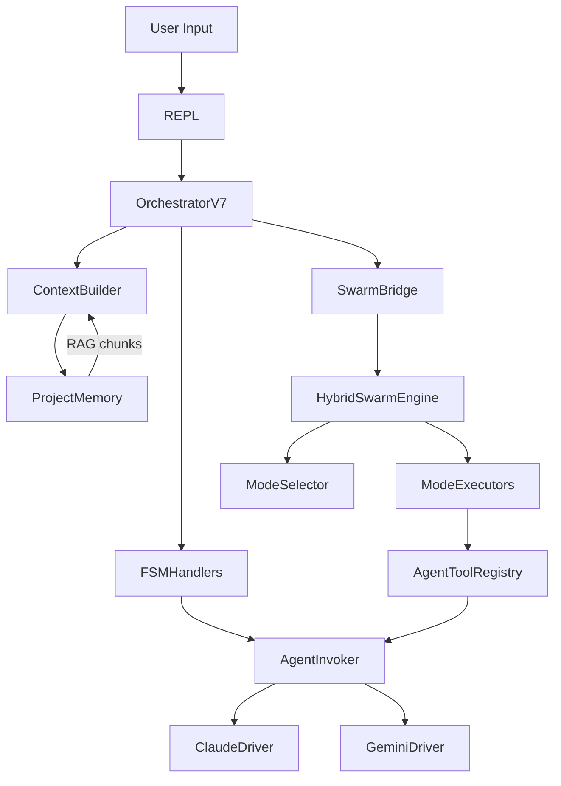

# NEXUS V7.8 Core Module

Le module `core/` est le coeur de NEXUS V7.8 "HIVE MIND" - un système d'orchestration multi-agent collaboratif qui génère des agents spécialisés pour résoudre des problèmes complexes.

**Version**: 7.8 | **Last Updated**: 2025-12-08

## Vue d'ensemble

Le module core implémente une **Finite State Machine (FSM)** qui orchestre la collaboration entre les agents AI Claude et Gemini. Il fournit:

- **Orchestration multi-agent** avec négociation dynamique des rôles
- **Capacités d'auto-évolution** avec validation de sécurité
- **Mémoire persistante** et gestion d'état
- **Routage dynamique de modèles** (Opus/Sonnet/Pro/Flash)
- **Hybrid Swarm Engine** pour modes de collaboration adaptatifs
- **Force Chain-of-Thought** pour tâches EXPERT (Phase 14e)
- **Project Memory RAG** pour injection de contexte (Phase 10c) **[V7.8]**
- **Agent-as-Tool** pour invocation fractale (Phase 15) **[V7.8]**

## Architecture

```
                           USER INPUT
                               │
                               ▼
┌──────────────────────────────────────────────────────────────────┐
│                    ORCHESTRATION V7 (FSM)                        │
│                    783 lignes (-65% depuis V7.6)                 │
│                                                                  │
│   ┌─────────┐    ┌──────────┐    ┌────────────┐    ┌─────────┐  │
│   │  IDLE   │───▶│BRAINSTORM│───▶│EXECUTE_TOOL│───▶│VALIDATE │  │
│   └─────────┘    └──────────┘    └────────────┘    └─────────┘  │
│        ▲                                                  │      │
│        └──────────────────────────────────────────────────┘      │
│                                                                  │
│   ┌────────────────────────────────────────────────────────┐    │
│   │                  HYBRID SWARM ENGINE                    │    │
│   │  ┌──────────┐ ┌──────────┐ ┌──────────┐ ┌───────────┐  │    │
│   │  │ PARALLEL │ │SEQUENTIAL│ │PING_PONG │ │ RED_BLUE  │  │    │
│   │  └──────────┘ └──────────┘ └──────────┘ └───────────┘  │    │
│   └────────────────────────────────────────────────────────┘    │
└──────────────────────────────────────────────────────────────────┘
                               │
              ┌────────────────┼────────────────┐
              ▼                ▼                ▼
        ┌──────────┐    ┌──────────┐    ┌──────────┐
        │  CLAUDE  │    │  GEMINI  │    │  TOOLS   │
        │  DRIVER  │    │  DRIVER  │    │ MANAGER  │
        └──────────┘    └──────────┘    └──────────┘
```

## Structure des Modules

| Répertoire | Fonction | Fichiers clés |
|------------|----------|---------------|
| [`orchestration/`](orchestration/README.md) | **[V7.8]** Package modulaire extrait | `context_builder.py`, `fsm_handlers.py`, `swarm_bridge.py` |
| [`drivers/`](drivers/README.md) | Interfaces modèles AI | `claude_driver_hybrid.py`, `gemini_driver_v7.py` |
| [`fsm/`](fsm/README.md) | Composants FSM | `states.py`, `panic_system.py` |
| [`synapse/`](synapse/README.md) | Mémoire & protocole | `protocol_v7.py`, `memory_v7.py` |
| [`swarm/`](swarm/README.md) | Collaboration multi-agent | `hybrid_swarm_engine.py`, `mode_selector.py` |
| [`memory/`](memory/README.md) | **[V7.8]** AutoMemory + ProjectMemory RAG | `auto_memory.py`, `project_memory.py` |
| [`execution/`](execution/README.md) | **[V7.8]** Tools + Agent-as-Tool | `tool_manager.py`, `agent_tools.py` |
| [`evolution/`](evolution/README.md) | Moteur d'auto-modification | `lineage.py`, `tiered_validator.py` |
| [`routing/`](routing/README.md) | Sélection dynamique modèles | `model_router.py` |
| [`interface/`](interface/README.md) | Interaction utilisateur | `repl.py`, `commands.py` |
| [`telemetry/`](telemetry/README.md) | Métriques & budget | `metrics.py`, `budget_tracker.py` |
| [`security/`](security/README.md) | Validation & politiques | `mutation_validator.py`, `path_guardian.py` |
| [`workspace/`](workspace/README.md) | Gestion sessions | `manager.py` |

## Fichiers Core

### `orchestration_v7.py` (783 lignes)

Orchestrateur principal implémentant la FSM. Utilise pattern composition:

```python
class OrchestratorV7:
    def __init__(self, ...):
        # V7.8 Phase 14c: Extracted modules
        self.context_builder = ContextBuilder(self)
        self.agent_invoker = AgentInvoker(self)
        self.swarm_bridge = SwarmBridge(self)
        self.fsm_handlers = FSMHandlers(self)

        # V7.8 Phase 10c: Project Memory
        self.project_memory = ProjectMemory(nexus_root)

    def process_turn(self, user_input=None) -> Dict:
        # Dispatcher pattern
        return self.fsm_handlers.handle_state(self.state, user_input)
```

### `config.py`

Gestion configuration via `.env`, variables d'environnement, et valeurs par défaut.

| Paramètre | Défaut | Description |
|-----------|--------|-------------|
| `TIMEOUT` | 120 | Timeout requête (secondes) |
| `SWARM_ENABLED` | True | Activer Hybrid Swarm Engine |
| `SWARM_AUTO_ROUTE` | True | Auto-route MODERATE+ vers swarm |
| `VALIDATION_TIER` | 4 | Profondeur validation (1-4) |

## États FSM (11)

| État | Description | États suivants |
|------|-------------|----------------|
| `IDLE` | Attente entrée | `BRAINSTORMING`, `SWARM_ANALYZING` |
| `BRAINSTORMING` | Débat agents | `EXECUTING_TOOL`, `VALIDATING_CFL` |
| `EXECUTING_TOOL` | Outil en cours | `VALIDATING_CFL` |
| `VALIDATING_CFL` | Boucle feedback | `IDLE`, `BRAINSTORMING` |
| `SWARM_ANALYZING` | Analyse tâche | `SWARM_NEGOTIATING` |
| `SWARM_NEGOTIATING` | Négociation mode | `SWARM_EXECUTING` |
| `SWARM_EXECUTING` | Exécution mode | `VALIDATING_CFL` |
| `EVOLUTION_BRAINSTORM` | Création enfants | `VALIDATING_CFL` |
| `WAITING_USER` | Attente utilisateur | `IDLE` |
| `ERROR` | Erreur récupérable | `IDLE` |
| `PANIC` | Erreur fatale | - |

## Phases V7.8 Implémentées

| Phase | Feature | Module |
|-------|---------|--------|
| **10c** | Project Memory RAG | `memory/project_memory.py` |
| **14c** | Orchestrator Refactoring (-65%) | `orchestration/*.py` |
| **14e** | Force CoT (EXPERT) | `swarm/mode_executors.py` |
| **15** | Agent-as-Tool | `execution/agent_tools.py` |
| **12.5** | Dynamic Tools | `execution/dynamic_tools.py` |

## Flux de Données V7.8



## Intégrations Clés

### Synapse Protocol

```python
from core.synapse.protocol_v7 import LightMessageV7, HeavyMessageV7
```

### Memory System

```python
from core.memory import get_auto_memory, ProjectMemory

# AutoMemory - apprentissage opérationnel
memory = get_auto_memory()
rec = memory.get_recommendation("code_review")

# ProjectMemory - RAG codebase
pm = ProjectMemory(nexus_root)
pm.index_directory(Path("core/"))
chunks = pm.retrieve("FSM state handling")
```

### Agent-as-Tool

```python
from core.execution.agent_tools import AgentToolRegistry

registry.refresh()  # Découvre agents spawnés
registry.execute_agent_tool("security_expert", {"task": "..."})
```

## Configuration

```bash
# Core
TIMEOUT=300
LOG_LEVEL=DEBUG

# Swarm
SWARM_ENABLED=True
SWARM_AUTO_ROUTE=True
SWARM_DEFAULT_MODE=ping_pong

# Evolution
VALIDATION_TIER=4

# Routing
GEMINI_MODEL=gemini-3-pro-preview
```

## Métriques V7.8

| Composant | Lignes V7.6 | Lignes V7.8 | Delta |
|-----------|-------------|-------------|-------|
| orchestration_v7.py | 2223 | 783 | -65% |
| orchestration/*.py | 0 | 1527 | NEW |
| memory/*.py | 450 | 1135 | +152% |
| execution/*.py | 800 | 1310 | +64% |
| **Total core/** | ~15000 | ~14500 | -3% |

## Voir Aussi

- [Main README](../README.md) - Documentation complète V7.8
- [ROADMAP_HIVE_MIND.md](../ROADMAP_HIVE_MIND.md) - Roadmap phases
- [docs/FEATURE_INVENTORY_V7.8.md](../docs/FEATURE_INVENTORY_V7.8.md) - Inventaire fonctionnalités
- [docs/HYBRID_SWARM.md](../docs/HYBRID_SWARM.md) - Documentation Swarm
