# core

NEXUS Core Module - TRUE HIVE MIND

## Overview

| Metric | Value |
|--------|-------|
| **Path** | `C:\Code\NEXUS\NEXUS-N7A\core` |
| **Modules** | 5 |
| **Total Lines** | 2161 |
| **Classes** | 11 |
| **Functions** | 4 |

## Architecture

```mermaid
classDiagram
    class Config {
        +fitness_metrics
        +min_hours_between_generations
        +max_children_per_generation
        -__init__(self)
        +to_dict(self) dict
    }
    class Timeouts {
        +float BASH_COMMAND
        +float BASH_LONG_RUNNING
        +float GIT_COMMAND
        +float WEB_SEARCH
        +float WEB_FETCH
        +float TODO_WRITE
        +float CFL_VALIDATION
        +float HIVE_MIND_ASYNC
        +float FSM_ITERATION
        +float BREAKPOINT_USER
        +float PROCESS_GRACEFUL_TERMINATION
        +float MCP_PROCESS_WAIT
        +float CLI_VERSION_CHECK
        +float RATE_LIMITER_ACQUIRE
    }
    class RetryLimits {
        +int MAX_PARSE_FAILURES
        +int MAX_TOOL_ITERATIONS
        +int MAX_FSM_ITERATIONS
        +int MAX_CFL_ITERATIONS
        +int MAX_LEAD_SWAPS
    }
    class SagaLimits {
        +int MAX_ROLLBACK_ATTEMPTS
        +float ROLLBACK_TIMEOUT
        +int CHECKPOINT_RETENTION_HOURS
        +int MAX_CHECKPOINTS_PER_TASK
    }
    class DebateLimits {
        +int MIN_TURNS
        +int MAX_TURNS
        +int COMPLEX_TURNS_MIN
        +int COMPLEX_TURNS_MAX
        +int EXPERT_TURNS_MIN
        +int EXPERT_TURNS_MAX
        +int ADAPTIVE_TURN_CAP
        +int NEGOTIATION_MAX_TURNS
    }
    class MemoryLimits {
        +int RAG_CHUNKS_RETRIEVE
        +int RAG_CHUNKS_MAX
        +int SIMILAR_TASKS_LIMIT
        +int CONTEXT_WINDOW_TOKENS
        +float MIN_SIMILARITY_SCORE
    }
    class ExecutionLimits {
        +int SWARM_MAX_ROUNDS
        +int MAX_SWARM_DEPTH
        +int MAX_PARALLEL_AGENTS
        +int MAX_EXECUTION_STEPS
    }
    class ThresholdConstants {
        +float DEFAULT_CONFIDENCE
        +float FALLBACK_QUALITY_PENALTY
        +float STAGNATION_SIMILARITY
        +float HIVE_MIND_AGREEMENT
        +float RED_TEAM_PASS
    }
    class CostEstimates {
        +int ANALYSIS_COMPARE
        +int CONSENSUS_CHECK
        +int EXECUTION_STEP
        +int DIAGNOSIS_SINGLE
        +int DIAGNOSIS_SYNTHESIS
        +int CHANGES_APPLY
        +int RETENTION_DECIDE
        +int CONSOLIDATION
        +int RAG_INJECTION
        +int DEFAULT_OPERATION
    }
    class ServiceFactory {
        -Dict[str, Dict[str, Any]] _instances
        -_lock
        -Optional[Path] _nexus_root
        -_embedding_engine
        -_embedding_engine_lock
        +initialize(cls, nexus_root: Path) None
        +get_nexus_root(cls) Path
        -_get_tenant_cache(cls, tenant_id: str) Dict[str, Any]
        -_get_or_create(cls, service_name: str, factory_func, ctx: Optional[SessionContext]=...) Any
        +get_tenant_workspace_path(cls, ctx: Optional[SessionContext]=...) Path
        +get_registry(cls, ctx: Optional[SessionContext]=...)
        +get_workspace_manager(cls, ctx: Optional[SessionContext]=...)
        +get_tool_registry(cls, ctx: Optional[SessionContext]=...)
        +get_rate_limiter_registry(cls, ctx: Optional[SessionContext]=...)
        +get_interaction_provider(cls, ctx: Optional[SessionContext]=...)
        +get_execution_engine(cls, ctx: Optional[SessionContext]=...)
        +get_system_health(cls, ctx: Optional[SessionContext]=...)
        +get_budget_tracker(cls, ctx: Optional[SessionContext]=...)
        +get_path_guardian(cls, ctx: Optional[SessionContext]=...)
        +get_config(cls, ctx: Optional[SessionContext]=...)
        +get_embedding_engine(cls)
        +get_project_memory(cls, ctx: Optional[SessionContext]=...)
        +get_auto_memory(cls, ctx: Optional[SessionContext]=...)
        +get_success_memory(cls, ctx: Optional[SessionContext]=...)
        +get_spotlighter(cls, ctx: Optional[SessionContext]=...)
        +clear_tenant_cache(cls, tenant_id: str) None
        +clear_all_caches(cls) None
        +get_cache_stats(cls) Dict[str, int]
    }
    class OrchestratorV7 {
        +workspace_path
        +config
        +logger
        +state
        -_registry
        +iteration
        +memory
        +blackboard
        +stagnation_detector
        +plan_health
        +panic_system
        +model_router
        +gemini_driver
        +drivers
        +tool_manager
        +pending_tool_result
        +json_parse_failures
        +max_parse_failures
        +stalemate_counter
        +gemini_info
        +claude_info
        +task_analyzer
        +auto_memory
        +context_builder
        +mutation_detector
        +agent_invoker
        +swarm_bridge
        +fsm_handlers
        -_sync_bridge
        +project_memory
        +agent_tool_registry
        +agent_pool
        +spawned_agent_loader
        +swarm_engine
        +telemetry
        -__init__(self, workspace_path: Path, config, gemini_info: Dict, claude_info: Dict)
        +active_agent(self) str
        +active_agent(self, agent: str)
        -_build_execution_context(self, objective: str=...) TaskExecutionContext
        +current_context(self) TaskExecutionContext
        -_sync_context_agent(self, context: TaskExecutionContext)
        -_get_claude_driver(self, task_type: TaskType, timeout_override: int=...) ClaudeDriverHybrid
        -_invoke_agent(self, task_type: TaskType, context: str) Dict
        -_invoke_for_swarm(self, agent_id: str, task_type: str, context: str, session_uuid: str=...) str
        -_invoke_agent_direct(self, task_type: TaskType, context: str, target_agent: str) Dict
        -_build_swarm_context(self, task_context: str, task_type: str, target_agent: str=...) str
        +check_project_context(self, project_path: Optional[Path]=...) Dict
        +get_startup_hints(self) list
        +process_turn(self, user_input: Optional[str]=...) Dict
        +process_turn_async(self, user_input: Optional[str]=...) Dict
        -_handle_async_state(self, user_input: Optional[str]=...) Dict
        -_handle_brainstorming_async(self, factory, user_input: Optional[str]) Dict
        -_handle_cfl_async(self, factory) Dict
        -_build_simple_context(self, user_input: str, task_analysis: TaskAnalysis) str
        -_transition_to(self, new_state: OrchestratorState)
        -_make_result(self, state: str, output: Optional[str], agent: Optional[str], finished: bool, error: Optional[str]=..., tool: Optional[str]=...) Dict
        -_detect_mutation_complete(self, content: str) bool
        -_handle_stagnation(self) Dict
        -_handle_error(self, error_msg: str) Dict
        -_trigger_panic(self, reason: str) Dict
        -_calculate_quality_score(self, message: dict, validation_ok: bool, is_stagnant: bool) float
        -_record_invocation(self, agent_name: str, task_type: str, success: bool, duration: float, quality_score: float=..., response_text: Optional[str]=...)
        -_build_context(self) str
        -_build_context_with_tool_result(self) str
        -_format_tool_result(self, result) str
        -_validate_message(self, response: Dict, expect_heavy: bool=...) Dict
        +reset_to_idle(self, clear_task: bool=...)
        +get_system_status(self) Dict
        +rollback_to_backup(self, backup_file: Path=...) bool
        +consolidate_memory(self) Dict
        +start_swarm_mode(self, objective: str, force_mode: Optional[CollaborationMode]=...) Dict
        +process_with_swarm(self, task_input: str, force_mode: Optional[CollaborationMode]=..., skip_negotiation: bool=..., on_negotiation_turn: Optional[Callable]=..., on_execution_round: Optional[Callable]=...) Dict
    }
```

## Modules

| Module | Description | Classes | Functions |
|--------|-------------|---------|-----------|
| [config](config.py) | Configuration Management - NEXUS V7 | 1 | 1 |
| [constants](constants.py) | NEXUS V9.8 - Centralized Constants | 8 | 0 |
| [factory](factory.py) | ServiceFactory - Context-Aware Service Instantiation. | 1 | 3 |
| [orchestration_v7](orchestration_v7.py) | Orchestrator V7 - FSM Persistent | 1 | 0 |

## Subpackages

| Package | Description | Modules |
|---------|-------------|---------|
| [adapters/](C:\Code\NEXUS\NEXUS-N7A\core\adapters/README.md) |  | 0 |
| [agents/](C:\Code\NEXUS\NEXUS-N7A\core\agents/README.md) |  | 0 |
| [api/](C:\Code\NEXUS\NEXUS-N7A\core\api/README.md) |  | 0 |
| [async_primitives/](C:\Code\NEXUS\NEXUS-N7A\core\async_primitives/README.md) |  | 0 |
| [audit/](C:\Code\NEXUS\NEXUS-N7A\core\audit/README.md) |  | 0 |
| [bootstrap/](C:\Code\NEXUS\NEXUS-N7A\core\bootstrap/README.md) |  | 0 |
| [context/](C:\Code\NEXUS\NEXUS-N7A\core\context/README.md) |  | 0 |
| [db/](C:\Code\NEXUS\NEXUS-N7A\core\db/README.md) |  | 0 |
| [drivers/](C:\Code\NEXUS\NEXUS-N7A\core\drivers/README.md) |  | 0 |
| [events/](C:\Code\NEXUS\NEXUS-N7A\core\events/README.md) |  | 0 |
| [evolution/](C:\Code\NEXUS\NEXUS-N7A\core\evolution/README.md) |  | 0 |
| [execution/](C:\Code\NEXUS\NEXUS-N7A\core\execution/README.md) |  | 0 |
| [fsm/](C:\Code\NEXUS\NEXUS-N7A\core\fsm/README.md) |  | 0 |
| [governance/](C:\Code\NEXUS\NEXUS-N7A\core\governance/README.md) |  | 0 |
| [hive_mind/](C:\Code\NEXUS\NEXUS-N7A\core\hive_mind/README.md) |  | 0 |
| [interaction/](C:\Code\NEXUS\NEXUS-N7A\core\interaction/README.md) |  | 0 |
| [interface/](C:\Code\NEXUS\NEXUS-N7A\core\interface/README.md) |  | 0 |
| [logging/](C:\Code\NEXUS\NEXUS-N7A\core\logging/README.md) |  | 0 |
| [mcp/](C:\Code\NEXUS\NEXUS-N7A\core\mcp/README.md) |  | 0 |
| [memory/](C:\Code\NEXUS\NEXUS-N7A\core\memory/README.md) |  | 0 |
| [meta/](C:\Code\NEXUS\NEXUS-N7A\core\meta/README.md) |  | 0 |
| [notifications/](C:\Code\NEXUS\NEXUS-N7A\core\notifications/README.md) |  | 0 |
| [orchestration/](C:\Code\NEXUS\NEXUS-N7A\core\orchestration/README.md) |  | 0 |
| [prompts/](C:\Code\NEXUS\NEXUS-N7A\core\prompts/README.md) |  | 0 |
| [reasoning/](C:\Code\NEXUS\NEXUS-N7A\core\reasoning/README.md) |  | 0 |
| [resilience/](C:\Code\NEXUS\NEXUS-N7A\core\resilience/README.md) |  | 0 |
| [routing/](C:\Code\NEXUS\NEXUS-N7A\core\routing/README.md) |  | 0 |
| [security/](C:\Code\NEXUS\NEXUS-N7A\core\security/README.md) |  | 0 |
| [session/](C:\Code\NEXUS\NEXUS-N7A\core\session/README.md) |  | 0 |
| [swarm/](C:\Code\NEXUS\NEXUS-N7A\core\swarm/README.md) |  | 0 |
| [synapse/](C:\Code\NEXUS\NEXUS-N7A\core\synapse/README.md) |  | 0 |
| [telemetry/](C:\Code\NEXUS\NEXUS-N7A\core\telemetry/README.md) |  | 0 |
| [ui/](C:\Code\NEXUS\NEXUS-N7A\core\ui/README.md) |  | 0 |
| [utils/](C:\Code\NEXUS\NEXUS-N7A\core\utils/README.md) |  | 0 |
| [workflow/](C:\Code\NEXUS\NEXUS-N7A\core\workflow/README.md) |  | 0 |
| [workspace/](C:\Code\NEXUS\NEXUS-N7A\core\workspace/README.md) |  | 0 |

## Aggregated Statistics

Statistics from all subpackages:

| Metric | Value |
|--------|-------|
| Subpackages | 36 |
| Total Modules | 0 |
| Total Lines of Code | 0 |
| Total Classes | 0 |
| Total Functions | 0 |

---
*Auto-generated by nexus-doc-generator 1.0.0 - 2025-12-16 19:13*