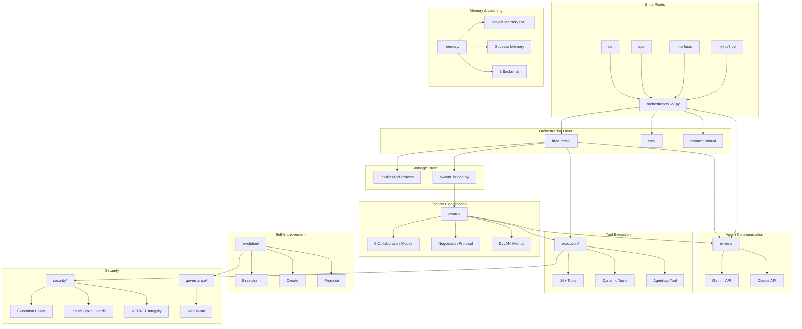

# NEXUS Core


## SYNOPSIS

The **Core** directory contains all 30 backend modules that power NEXUS V10 "SINGULARITY". This is the brain of the multi-agent orchestration system, implementing collaborative intelligence between Gemini and Claude.

---

## THE NEXUS MAP (High-Level Architecture)



---

## MODULE INVENTORY (30 Modules)

| Module | Role | Key Files |
|--------|------|-----------|
| **hive_mind/** | Strategic 7-phase pipeline | orchestrator.py, phases/ |
| **swarm/** | Tactical 6-mode collaboration | hybrid_swarm_engine.py |
| **drivers/** | LLM communication | gemini_driver_v7.py, claude_driver_hybrid.py |
| **execution/** | Tool execution | tool_manager.py (63KB!) |
| **memory/** | RAG + learning | project_memory.py, success_memory.py |
| **evolution/** | Self-improvement | manager.py, phases/ |
| **security/** | Safety layer | execution_policy.py, guards |
| **governance/** | Alignment testing | red_team/ |
| **fsm/** | State machine | states.py, transitions.py |
| **interface/** | REPL + commands | repl.py, commands/ |
| **orchestration/** | Context building | context_builder.py |
| **synapse/** | Protocols | protocol_v7.py, memory_v7.py |
| **ui/** | Dashboard server | dashboard_server.py |
| **telemetry/** | Metrics | telemetry_service.py |
| **prompts/** | Prompt loading | prompt_loader.py |
| **utils/** | Utilities | json_extractor.py |
| **agents/** | Agent registry | unified_registry.py |
| **async_primitives/** | Async support | process_handle.py |
| **bootstrap/** | Project analysis | analyzer.py |
| **mcp/** | MCP integration | server.py |
| **workspace/** | Workspace mgmt | manager.py |
| ... | (10 more) | See individual READMEs |

---

## NAVIGATION TREE

```
core/
├── hive_mind/          → [README](hive_mind/README.md)
├── swarm/              → [README](swarm/README.md)
├── drivers/            → [README](drivers/README.md)
├── execution/          → [README](execution/README.md)
├── memory/             → [README](memory/README.md)
├── evolution/          → [README](evolution/README.md)
├── security/           → [README](security/README.md)
├── governance/red_team/→ [README](governance/red_team/README.md)
├── interface/commands/ → [README](interface/commands/README.md)
└── ... (21 more modules)
```

---

## KEY METRICS

| Metric | Value |
|--------|-------|
| Total Modules | 30 |
| Total Python Files | ~120 |
| Total Lines of Code | ~50,000 |
| Largest File | tool_manager.py (63KB) |
| Test Coverage | tests/ (95 files) |

---

## HIERARCHY

```
NEXUS/
├── nexus7.py           ← Entry point
├── KERNEL.py           ← Immutable alignment
├── core/               ← THIS FOLDER (all backend modules)
├── frontend/           ← Next.js dashboard
├── prompts/            ← System prompts
└── workspace/          ← Runtime data
```
