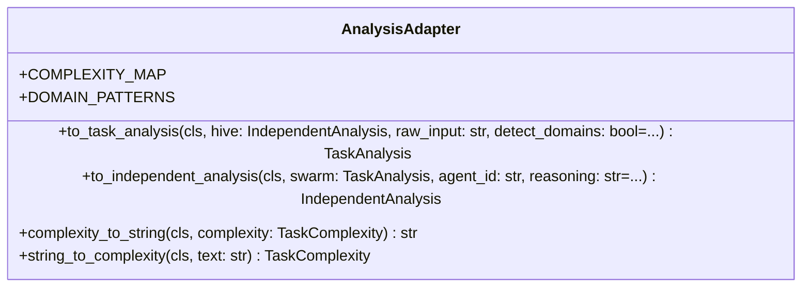

# adapters

NEXUS V8.2.0a - Adapters Module

Provides bidirectional adapters between different analysis types
used in Swarm and HiveMind pipelines.

Adapters:
- AnalysisAdapter: TaskAnalysis <-> IndependentAnalysis

## Overview

| Metric | Value |
|--------|-------|
| **Path** | `C:\Code\NEXUS\NEXUS-N7A\core\adapters` |
| **Modules** | 2 |
| **Total Lines** | 250 |
| **Classes** | 1 |
| **Functions** | 0 |

## Architecture

## Modules

| Module | Description | Classes | Functions |
|--------|-------------|---------|-----------|
| [analysis_adapter](analysis_adapter.py) | NEXUS V8.2.0a - Unified Analysis Adapter | 1 | 0 |

---
*Auto-generated by nexus-doc-generator 1.0.0 - 2025-12-16 19:13*