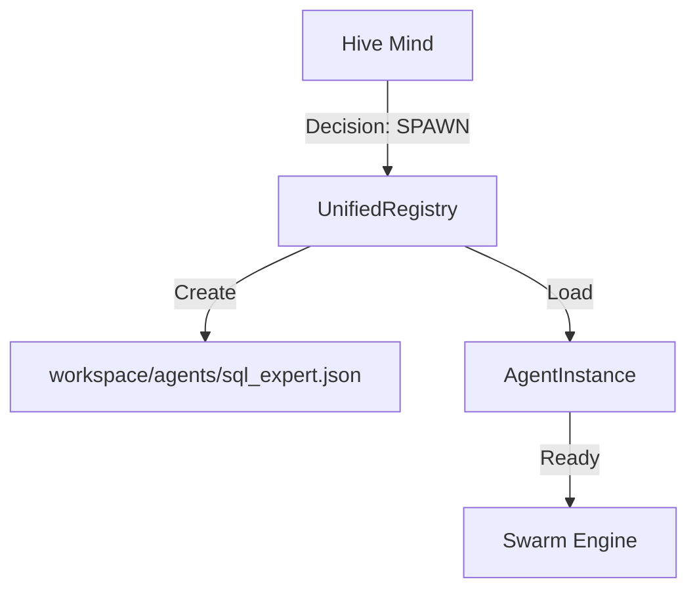

# Agents Module - NEXUS V9.2

## Rôle
Le module `core/agents` centralise la gestion des agents (Gemini, Claude, et agents spécialisés). Il implémente le `UnifiedAgentRegistry` qui permet de découvrir, charger et spawner des agents dynamiquement (Recursive Spawning).

## Fichiers Clés
| Fichier | Lignes | Responsabilité |
|---------|--------|----------------|
| `unified_registry.py` | ~400 | **Registry**: Singleton gérant le cycle de vie des agents (Load, Save, Spawn). |

## API Publique
```python
from core.agents import (
    get_registry,
    UnifiedAgentRegistry,
    AgentDescriptor
)

# Usage
registry = get_registry()
agent = registry.get_agent("Gemini")
new_agent = await registry.spawn_agent("SQL_Expert", "You are a SQL expert...")
```

## Flux de Données

### Recursive Spawning Flow


## Dépendances

**Importe :**
- `core/drivers` : Pour instancier les drivers associés aux agents.
- `core/prompts` : Pour charger les prompts système.

**Importé par :**
- `core/orchestration_v7.py` : Pour charger les agents au démarrage.
- `core/ui/dashboard_server.py` : Pour lister les agents dans le Dashboard.
- `core/hive_mind/architect.py` : Pour spawner de nouveaux agents.

## Configuration

Les agents spawnés sont stockés dans `workspace/agents/*.json` :

```json
{
  "name": "SQL_Expert",
  "model": "gemini-pro",
  "system_prompt": "You are a SQL expert...",
  "capabilities": ["sql", "database"]
}
```

## Tests

- `tests/agents/test_unified_registry.py`
- `tests/e2e/test_recursive_spawning.py`
