# agents

NEXUS V9.1 - Agents Module

Centralized agent management, registry, and services.

## Overview

| Metric | Value |
|--------|-------|
| **Path** | `C:\Code\NEXUS\NEXUS-N7A\core\agents` |
| **Modules** | 3 |
| **Total Lines** | 1130 |
| **Classes** | 9 |
| **Functions** | 2 |

## Architecture

```mermaid
classDiagram
    class SpawnResult {
        +bool success
        +Optional[str] agent_id
        +Optional[str] agent_uuid
        +Optional[Path] agent_path
        +Optional[str] error
        +int prompt_lines
    }
    class AgentInfo {
        +str agent_id
        +str role
        +str created_at
        +str uuid
        +Path path
    }
    class PoolStats {
        +int total_agents
        +int total_invocations
        +float average_importance
        +Dict[str, Dict[str, Any]] agents_detail
    }
    class AgentService {
        +orchestrator
        +workspace_path
        +console
        -_agents_dir
        -__init__(self, orchestrator: 'OrchestratorV7', workspace_path: Path, console: 'ConsoleV7')
        +spawn(self, role: str, force: bool=...) SpawnResult
        +list_agents(self) List[AgentInfo]
        +get_pool_stats(self) Optional[PoolStats]
        -_detect_domains_from_role(self, role: str) List[str]
        -_brainstorm_agent_prompt(self, role: str, agent_uuid: str, domains: List[str]) Optional[str]
        -_extract_inference_config(self, prompt: str) Optional[Dict[str, str]]
        -_validate_prompt_tools(self, prompt: str) List[str]
        -_static_agent_template(self, role: str, agent_uuid: str, domains: List[str]) str
        -_run_redteam_validation(self, prompt: str) bool
        -_create_agent_config(self, role_slug: str, agent_uuid: str, role: str, domains: List[str], inference_config: Dict[str, str], generated_prompt: str) Dict[str, Any]
        -_register_agent_as_tool(self, role_slug: str) None
    }
    class AgentProvider {
        +GEMINI
        +CLAUDE
        +OLLAMA
        +SPAWNED
    }
    Enum <|-- AgentProvider
    class AgentCapability {
        +CODING
        +RESEARCH
        +CREATIVE
        +ANALYSIS
        +GENERAL
    }
    Enum <|-- AgentCapability
    class AgentDescriptor {
        +str id
        +AgentProvider provider
        +str display_name
        +List[AgentCapability] capabilities
        +Dict[str, float] dylan_scores
        +Optional[Path] config_path
        +bool is_available
        +is_builtin(self) bool
    }
    class DriverProtocol {
        +invoke(self, prompt: str, **kwargs) str
    }
    Protocol <|-- DriverProtocol
    class UnifiedAgentRegistry {
        -__init__(self) None
        -_register_builtins(self) None
        +register(self, agent: AgentDescriptor) None
        +unregister(self, agent_id: str) bool
        +register_driver(self, agent_id: str, driver: DriverProtocol) None
        -_normalize_id(self, agent_id: str) str
        +get(self, agent_id: str) Optional[AgentDescriptor]
        +get_driver(self, agent_id: str) Optional[DriverProtocol]
        +get_display_name(self, agent_id: str) str
        +get_alternate(self, agent_id: str) Optional[str]
        +is_gemini(self, agent_id: str) bool
        +is_claude(self, agent_id: str) bool
        +is_builtin(self, agent_id: str) bool
        +list_available(self) List[AgentDescriptor]
        +list_builtins(self) List[AgentDescriptor]
        +list_spawned(self) List[AgentDescriptor]
        +select_for_capability(self, capability: AgentCapability, exclude: Optional[List[str]]=...) Optional[AgentDescriptor]
        +update_dylan_score(self, agent_id: str, capability: str, score: float) bool
        -__contains__(self, agent_id: str) bool
        -__len__(self) int
    }
```

## Modules

| Module | Description | Classes | Functions |
|--------|-------------|---------|-----------|
| [service](service.py) | NEXUS V9.1 - AgentService | 4 | 0 |
| [unified_registry](unified_registry.py) | UnifiedAgentRegistry - Centralized Agent Management for NEXUS V8.4.0 | 5 | 2 |

---
*Auto-generated by nexus-doc-generator 1.0.0 - 2025-12-16 19:13*