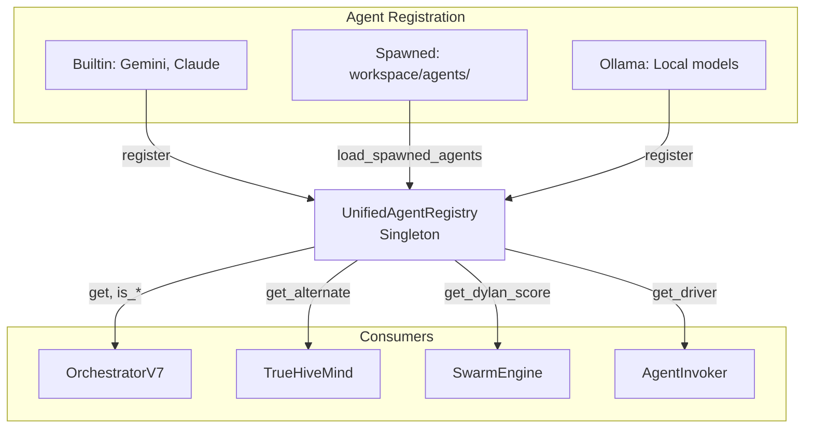

# Module : agents

## Role dans l'Architecture NEXUS V8.4.x

Ce module centralise la **gestion des agents** en unifiant plusieurs composants precedemment disperses:
- `AgentRegistry` (hive_mind/) - Anti-duplication pour spawns
- `AgentPool` (swarm/) - DyLAN scoring + metriques
- `SpawnedAgentLoader` (bootstrap/) - Decouverte workspace/agents/
- `AgentInvoker` (orchestration/) - Routing task → driver

**Probleme resolu**: Remplace 41+ chains `if/else` hardcodees:
```python
# AVANT (anti-pattern)
if "gemini" in agent_id.lower():
    ...
elif agent == "Claude":
    ...

# APRES (O(1) lookup)
agent = registry.get(agent_id)
if registry.is_gemini(agent_id):
    ...
```

**Version**: 8.4.0 | **Ajoute**: V8.4.0

## Composants Cles

| Fichier | Export | Role |
|---------|--------|------|
| `unified_registry.py` | `UnifiedAgentRegistry` | Singleton central pour tous les agents |
| | `AgentDescriptor` | Metadata complete d'un agent |
| | `AgentProvider` | Enum: GEMINI, CLAUDE, OLLAMA, SPAWNED |
| | `AgentCapability` | Enum: CODING, RESEARCH, CREATIVE, ANALYSIS, GENERAL |
| | `DriverProtocol` | Interface que les drivers doivent implementer |
| | `get_registry()` | Singleton accessor |

### UnifiedAgentRegistry

```python
from core.agents import get_registry

registry = get_registry()

# Get agent info (O(1))
agent = registry.get("gemini")
name = registry.get_display_name("gemini")  # "Gemini"

# Check provider
if registry.is_gemini(agent_id):
    # Use Gemini-specific logic

# Get driver
driver = registry.get_driver(agent_id)
await driver.invoke(prompt)

# Alternation (BRAINSTORMING mode)
next_agent = registry.get_alternate("gemini")  # "claude"

# DyLAN score
score = registry.get_dylan_score("claude", AgentCapability.CODING)
```

**Methodes principales**:
| Methode | Return | Description |
|---------|--------|-------------|
| `get(id)` | `AgentDescriptor?` | Lookup O(1) par ID ou alias |
| `get_display_name(id)` | `str` | Nom UI ("Gemini", "Claude") |
| `get_alternate(id)` | `str?` | Agent alternatif pour alternation |
| `get_driver(id)` | `DriverProtocol?` | Driver associe |
| `is_gemini(id)` | `bool` | Check provider Gemini |
| `is_claude(id)` | `bool` | Check provider Claude |
| `is_spawned(id)` | `bool` | Check agent custom |
| `list_all()` | `List[AgentDescriptor]` | Tous les agents |
| `list_available()` | `List[AgentDescriptor]` | Agents disponibles |

### AgentDescriptor

```python
@dataclass
class AgentDescriptor:
    id: str                           # "gemini", "security_expert"
    provider: AgentProvider           # GEMINI, CLAUDE, SPAWNED
    display_name: str                 # "Gemini", "Security Expert"
    capabilities: List[AgentCapability]
    dylan_scores: Dict[str, float]    # Performance par capability
    config_path: Optional[Path]       # Pour agents spawned
    is_available: bool = True
```

### AgentProvider (Enum)

| Value | Description |
|-------|-------------|
| `GEMINI` | Agent Gemini (builtin) |
| `CLAUDE` | Agent Claude (builtin) |
| `OLLAMA` | Models locaux (V8.4.3+) |
| `SPAWNED` | Agents custom dans workspace/agents/ |

### AgentCapability (Enum)

| Value | Agents typiques |
|-------|-----------------|
| `CODING` | Claude (fort), Gemini |
| `RESEARCH` | Gemini (fort), Claude |
| `CREATIVE` | Claude (fort) |
| `ANALYSIS` | Gemini (fort), Claude |
| `GENERAL` | Les deux |

## Architecture & Flux



### Entrees
- **Builtins**: Gemini et Claude enregistres au demarrage
- **Spawned agents**: Charges depuis `workspace/agents/*.json`
- **Drivers**: Enregistres par `AsyncDriverFactory` ou `OrchestratorV7`

### Sorties
- **AgentDescriptor**: Metadata consommee par orchestration
- **Drivers**: Retournes pour invocation
- **DyLAN scores**: Utilises par `ModeSelector` pour routing

### Configuration

| Variable ENV | Default | Description |
|--------------|---------|-------------|
| `AGENTS_DIR` | `workspace/agents/` | Dossier des agents spawned |
| `ENABLE_OLLAMA` | `False` | Activer support Ollama (V8.4.3+) |

## Dependances

### Utilise
- `dataclasses` (stdlib) - Structures de donnees
- `typing.Protocol` (stdlib) - Interface DriverProtocol
- `pathlib` (stdlib) - Chemins config

### Utilise par
- `core/orchestration_v7.py` - Alternation, display names
- `core/orchestration/agent_invoker.py` - Driver lookup
- `core/hive_mind/agent_registry.py` - Anti-duplication (wrap)
- `core/swarm/agent_pool.py` - DyLAN metrics
- `core/swarm/mode_selector.py` - Capability routing
- `core/bootstrap/agent_loader.py` - Spawn discovery

## Migration depuis Ancien Code

| Ancien pattern | Nouveau pattern |
|----------------|-----------------|
| `if "gemini" in id.lower()` | `registry.is_gemini(id)` |
| `if agent == "Claude"` | `registry.is_claude(id)` |
| `driver_map[agent]` | `registry.get_driver(agent)` |
| `AGENT_NAMES["gemini"]` | `registry.get_display_name("gemini")` |
| `get_alternate_agent()` | `registry.get_alternate(agent)` |

## Tests Associes

- `tests/test_unified_registry.py` - Tests unitaires
  - Registration/unregistration
  - O(1) lookup
  - Alias resolution
  - Driver association
  - DyLAN score retrieval
  - Spawned agent loading

## Version History

| Version | Date | Changements |
|---------|------|-------------|
| 8.4.0 | 2024-12-10 | Creation initiale (unifie AgentRegistry, AgentPool, SpawnedAgentLoader) |
| 8.4.3 | TBD | Support Ollama prevu |
