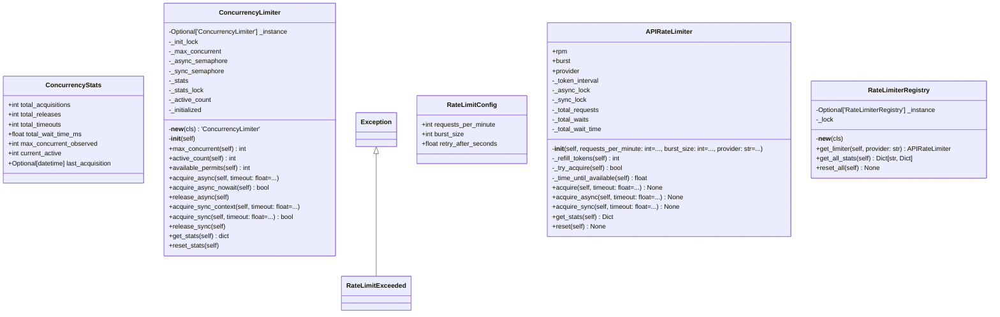

# api

API Module - Rate Limiting and API Management

NEXUS V8.4.5 - Bug Fixes Phase

Provides:
- APIRateLimiter: Token bucket rate limiter for API calls
- Prevents 429 Too Many Requests errors in PARALLEL mode

## Overview

| Metric | Value |
|--------|-------|
| **Path** | `C:\Code\NEXUS\NEXUS-N7A\core\api` |
| **Modules** | 3 |
| **Total Lines** | 796 |
| **Classes** | 6 |
| **Functions** | 5 |

## Architecture

## Modules

| Module | Description | Classes | Functions |
|--------|-------------|---------|-----------|
| [concurrency_limiter](concurrency_limiter.py) | V11 SYNCHROTRON: Global Concurrency Limiting for Agent Invocations. | 2 | 3 |
| [rate_limiter](rate_limiter.py) | API Rate Limiter - Token Bucket Implementation | 4 | 2 |

## Subpackages

| Package | Description | Modules |
|---------|-------------|---------|
| [cerebro/](C:\Code\NEXUS\NEXUS-N7A\core\api\cerebro/README.md) |  | 0 |

## Aggregated Statistics

Statistics from all subpackages:

| Metric | Value |
|--------|-------|
| Subpackages | 1 |
| Total Modules | 0 |
| Total Lines of Code | 0 |
| Total Classes | 0 |
| Total Functions | 0 |

---
*Auto-generated by nexus-doc-generator 1.0.0 - 2025-12-16 19:13*