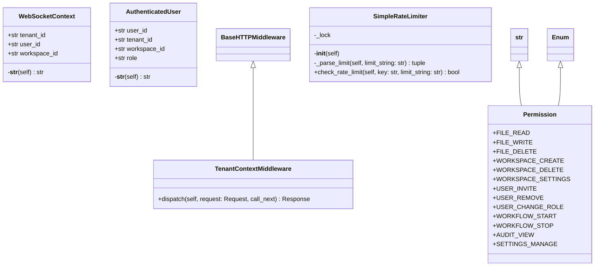

# cerebro

NEXUS V10 CEREBRO - FastAPI Application Package

WebSocket API for external UI observation of NEXUS events.

Usage:
    # Start server
    uvicorn core.api.cerebro.app:create_cerebro_app --factory --port 8080

    # Or import app factory
    from core.api.cerebro import create_cerebro_app
    app = create_cerebro_app()

## Overview

| Metric | Value |
|--------|-------|
| **Path** | `C:\Code\NEXUS\NEXUS-N7A\core\api\cerebro` |
| **Modules** | 6 |
| **Total Lines** | 1193 |
| **Classes** | 5 |
| **Functions** | 23 |

## Architecture

## Modules

| Module | Description | Classes | Functions |
|--------|-------------|---------|-----------|
| [app](app.py) | NEXUS V12.2 CEREBRO - FastAPI Application Factory | 0 | 2 |
| [deps](deps.py) | NEXUS V10 CEREBRO - FastAPI Dependencies | 2 | 6 |
| [middleware](middleware.py) | NEXUS V10 CEREBRO - Tenant Context Middleware | 1 | 2 |
| [rate_limit](rate_limit.py) | NEXUS V12.1 RETINA - HTTP Rate Limiting for CEREBRO API | 1 | 8 |
| [rbac](rbac.py) | NEXUS V12.2 IRONCLAD - Role-Based Access Control | 1 | 5 |

## Subpackages

| Package | Description | Modules |
|---------|-------------|---------|
| [routes/](C:\Code\NEXUS\NEXUS-N7A\core\api\cerebro\routes/README.md) |  | 0 |

## Aggregated Statistics

Statistics from all subpackages:

| Metric | Value |
|--------|-------|
| Subpackages | 1 |
| Total Modules | 0 |
| Total Lines of Code | 0 |
| Total Classes | 0 |
| Total Functions | 0 |

---
*Auto-generated by nexus-doc-generator 1.0.0 - 2025-12-16 19:13*