# routes

NEXUS V10 CEREBRO - API Routes Package
V11.5 CORTEX: Extended with state, interactions, workflow, files endpoints
V11.6 KEYMAKER: Authentication endpoints

Routes:
- health: Health check endpoints (/health, /health/ready)
- stream: WebSocket streaming endpoint (/ws/stream)
- state: State snapshot for F5 recovery (/api/state/snapshot)
- interactions: Human-in-the-loop (/api/interactions/{id}/reply)
- workflow: Task execution control (/api/workflow/start)
- files: Secure file access (/api/files/content)
- auth: Authentication (V11.6) (/api/auth/login, /api/auth/me)

## Overview

| Metric | Value |
|--------|-------|
| **Path** | `C:\Code\NEXUS\NEXUS-N7A\core\api\cerebro\routes` |
| **Modules** | 9 |
| **Total Lines** | 2238 |
| **Classes** | 11 |
| **Functions** | 37 |

## Architecture

```mermaid
classDiagram
    class LoginRequest {
        +str username
        +str password
    }
    BaseModel <|-- LoginRequest
    class TokenResponse {
        +str access_token
        +str token_type
        +int expires_in
        +str tenant_id
        +str user_id
    }
    BaseModel <|-- TokenResponse
    class UserInfo {
        +str user_id
        +str tenant_id
        +str workspace_id
        +bool authenticated
    }
    BaseModel <|-- UserInfo
    class FileWriteRequest {
        +str path
        +str content
    }
    BaseModel <|-- FileWriteRequest
    class InteractionResponse {
        +Any response
    }
    BaseModel <|-- InteractionResponse
    class UserResponse {
        +str id
        +str username
        +str email
        +str role
        +bool is_active
        +Optional[datetime] created_at
        +Optional[datetime] last_login
    }
    BaseModel <|-- UserResponse
    class UserListResponse {
        +List[UserResponse] users
        +int total
    }
    BaseModel <|-- UserListResponse
    class InviteUserRequest {
        +str username
        +EmailStr email
        +str role
        +Optional[str] password
    }
    BaseModel <|-- InviteUserRequest
    class ChangeRoleRequest {
        +str role
    }
    BaseModel <|-- ChangeRoleRequest
    class WorkflowStartRequest {
        +str task
        +Optional[str] complexity
    }
    BaseModel <|-- WorkflowStartRequest
    class WorkflowResponse {
        +str workflow_id
        +str status
        +Optional[str] task
        +Optional[Any] result
        +Optional[str] error
    }
    BaseModel <|-- WorkflowResponse
```

## Modules

| Module | Description | Classes | Functions |
|--------|-------------|---------|-----------|
| [auth](auth.py) | NEXUS V12.2 IRONCLAD - Authentication Endpoints | 3 | 7 |
| [files](files.py) | NEXUS V12.2 IRONCLAD - Secure File Access Endpoints | 1 | 6 |
| [health](health.py) | NEXUS V10 CEREBRO - Health Check Endpoints | 0 | 4 |
| [interactions](interactions.py) | NEXUS V11.5 CORTEX - Interaction Response Endpoints | 1 | 2 |
| [state](state.py) | NEXUS V11.5 CORTEX - State Snapshot Endpoint | 0 | 2 |
| [stream](stream.py) | NEXUS V12.2 IRONCLAD - WebSocket Streaming Endpoint | 0 | 3 |
| [users](users.py) | NEXUS V12.2 IRONCLAD - User Management API | 4 | 8 |
| [workflow](workflow.py) | NEXUS V12.3 SCALE-OUT - Workflow Control Endpoints | 2 | 5 |

---
*Auto-generated by nexus-doc-generator 1.0.0 - 2025-12-16 19:13*