# async_primitives

NEXUS V9.5 Async Primitives
===========================

Core async building blocks for the Async-First architecture.

Components:
- CancellationToken: Hierarchical cancellation with propagation
- AsyncProcessHandle: Track subprocess by session_uuid
- AsyncRWLock: Multiple readers OR single writer lock
- AsyncBlackboard: Thread-safe async shared state
- SafeTaskManager: Fire-and-forget task error tracking (V9.5)
- EventBus: Lightweight async pub/sub for sync events (V9.5)

Usage:
    from core.async_primitives import (
        CancellationToken,
        AsyncProcessHandle,
        AsyncRWLock,
        AsyncBlackboard,
        SafeTaskManager,
        create_safe_task,
        EventBus,
        SyncEvent,
        get_event_bus,
    )

## Overview

| Metric | Value |
|--------|-------|
| **Path** | `C:\Code\NEXUS\NEXUS-N7A\core\async_primitives` |
| **Modules** | 7 |
| **Total Lines** | 2066 |
| **Classes** | 16 |
| **Functions** | 6 |

## Architecture

```mermaid
classDiagram
    class BlackboardEntry {
        +Any value
        +datetime created_at
        +datetime updated_at
        +Optional[str] source
        +Optional[float] ttl_seconds
        +int version
        +is_expired(self) bool
    }
    class AsyncBlackboard {
        -_lock
        -__init__(self, initial_data: Optional[Dict[str, Any]]=..., instrumented: bool=...)
        +get(self, key: str, default: T=..., include_expired: bool=...) Union[Any, T]
        +set(self, key: str, value: Any, source: Optional[str]=..., ttl_seconds: Optional[float]=...) int
        +delete(self, key: str) bool
        +update(self, updates: Dict[str, Any], source: Optional[str]=...) None
        +get_or_set(self, key: str, default_factory: Callable[..., T], source: Optional[str]=..., ttl_seconds: Optional[float]=...) T
        +snapshot(self, deep_copy: bool=...) Dict[str, Any]
        +keys(self, include_expired: bool=...) List[str]
        +contains(self, key: str) bool
        +clear(self) int
        +clear_expired(self) int
        +get_metadata(self, key: str) Optional[Dict[str, Any]]
        +namespaced_keys(self, namespace: str) List[str]
        +size(self) int
        +get_with_version(self, key: str, default: T=..., include_expired: bool=...) Tuple[Union[Any, T], int]
        +compare_and_set(self, key: str, expected_version: int, new_value: Any, source: Optional[str]=..., ttl_seconds: Optional[float]=...) Tuple[bool, int]
        +expire_if_version(self, key: str, expected_version: int) Tuple[bool, int]
        +update_if_fresh(self, key: str, new_value: Any, max_age_seconds: float, source: Optional[str]=...) Tuple[bool, int]
        -__repr__(self) str
    }
    class CancellationToken {
        -bool _cancelled
        -Optional[CancellationToken] _parent
        -List[CancellationToken] _children
        -List[Callable] _callbacks
        -Optional[str] _cancel_reason
        -Optional[datetime] _cancelled_at
        +is_cancelled(self) bool
        +cancel_reason(self) Optional[str]
        +cancel(self, reason: Optional[str]=...) None
        +check(self) None
        +create_child(self) CancellationToken
        +on_cancel(self, callback: Callable) None
        +remove_callback(self, callback: Callable) bool
        -__enter__(self)
        -__exit__(self, exc_type, exc_val, exc_tb)
        -__repr__(self) str
    }
    class CancellationTokenSource {
        -_root
        -__init__(self)
        +token(self) CancellationToken
        +create_linked_token(self) CancellationToken
        +cancel(self, reason: Optional[str]=...) None
        +is_cancelled(self) bool
    }
    class EventType {
        +CHECKPOINT_CREATED
        +CHECKPOINT_VALIDATED
        +CHECKPOINT_FAILED
        +ROLLBACK_REQUESTED
        +ROLLBACK_COMPLETED
        +ROLLBACK_FAILED
        +STATE_CHANGE
        +STATE_MISMATCH
        +CIRCUIT_BREAKER_OPEN
        +CIRCUIT_BREAKER_CLOSE
        +FALLBACK_ACTIVATED
        +TASK_STARTED
        +TASK_COMPLETED
        +TASK_FAILED
    }
    Enum <|-- EventType
    class SyncEvent {
        +str event_type
        +str source
        +str task_id
        +Dict[str, Any] payload
        +float timestamp
        +Optional[str] correlation_id
        -__post_init__(self)
    }
    class EventBus {
        -_handler_timeout
        -_keep_history
        -_max_history
        -_processing
        -_stats
        -__init__(self, max_queue_size: int=..., handler_timeout: float=..., keep_history: bool=..., max_history: int=...)
        +subscribe(self, event_type: str, handler: EventHandler) None
        +unsubscribe(self, event_type: str, handler: EventHandler) bool
        +publish(self, event: SyncEvent) bool
        +publish_and_wait(self, event: SyncEvent, response_type: str, timeout: float=...) Optional[SyncEvent]
        +get_history(self, event_type: Optional[str]=..., task_id: Optional[str]=..., limit: int=...) List[SyncEvent]
        +get_stats(self) Dict[str, int]
        +clear_history(self) None
        +reset_stats(self) None
    }
    class ProcessState {
        +RUNNING
        +TERMINATED
        +KILLED
        +COMPLETED
        +FAILED
    }
    str <|-- ProcessState
    Enum <|-- ProcessState
    class AsyncProcessHandle {
        +asyncio.subprocess.Process proc
        +str session_uuid
        +Optional[str] task_id
        +Optional[str] agent_id
        +datetime created_at
        +Optional[datetime] terminated_at
        +ProcessState state
        +Dict[str, Any] metadata
        +is_running(self) bool
        +returncode(self) Optional[int]
        +pid(self) Optional[int]
        +runtime_seconds(self) float
        +terminate_gracefully(self, timeout: float=...) bool
        +wait(self, timeout: Optional[float]=...) int
        +read_stdout(self) bytes
        +read_stderr(self) bytes
        +to_dict(self) Dict[str, Any]
        -__repr__(self) str
    }
    class ProcessHandleRegistry {
        -_lock
        -__init__(self)
        +register(self, handle: AsyncProcessHandle) None
        +unregister(self, session_uuid: str) Optional[AsyncProcessHandle]
        +get(self, session_uuid: str) Optional[AsyncProcessHandle]
        +cancel_by_uuid(self, session_uuid: str, timeout: float=...) bool
        +cancel_by_task_id(self, task_id: str, timeout: float=...) int
        +cancel_all(self, timeout: float=...) int
        +list_active(self) list[Dict[str, Any]]
        +active_count(self) int
        -__len__(self) int
    }
    class AsyncRWLock {
        -__init__(self)
        +read(self)
        +write(self)
        +readers(self) int
        +is_write_locked(self) bool
        +pending_writers(self) int
        -__repr__(self) str
    }
    class AsyncRWLockWithTimeout {
        +read_with_timeout(self, timeout: float)
        +write_with_timeout(self, timeout: float)
        -_wait_for_read(self)
        -_wait_for_write(self)
    }
    AsyncRWLock <|-- AsyncRWLockWithTimeout
    class RWLockStats {
        +int total_reads
        +int total_writes
        +float read_wait_time_ms
        +float write_wait_time_ms
        +int current_readers
        +bool has_writer
        +int pending_writers
    }
    class InstrumentedAsyncRWLock {
        -_total_reads
        -_total_writes
        -_read_wait_time
        -_write_wait_time
        -__init__(self)
        +read(self)
        +write(self)
        +stats(self) RWLockStats
    }
    AsyncRWLock <|-- InstrumentedAsyncRWLock
    class TaskInfo {
        +str name
        +datetime created_at
        +asyncio.Task task
        +Optional[Callable[..., None]] on_error
    }
```

## Modules

| Module | Description | Classes | Functions |
|--------|-------------|---------|-----------|
| [blackboard](blackboard.py) | AsyncBlackboard - Thread-Safe Async Shared State. | 2 | 1 |
| [cancellation](cancellation.py) | CancellationToken - Hierarchical Cancellation for Async Operations. | 2 | 0 |
| [event_bus](event_bus.py) | Event Bus - V9.5 | 3 | 2 |
| [process_handle](process_handle.py) | AsyncProcessHandle - Track Async Subprocess with Session Context. | 3 | 2 |
| [rwlock](rwlock.py) | AsyncRWLock - Async Read-Write Lock. | 4 | 0 |
| [safe_task_manager](safe_task_manager.py) | Safe Task Manager - V9.5 | 2 | 1 |

---
*Auto-generated by nexus-doc-generator 1.0.0 - 2025-12-16 19:13*