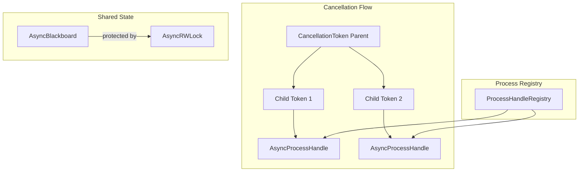
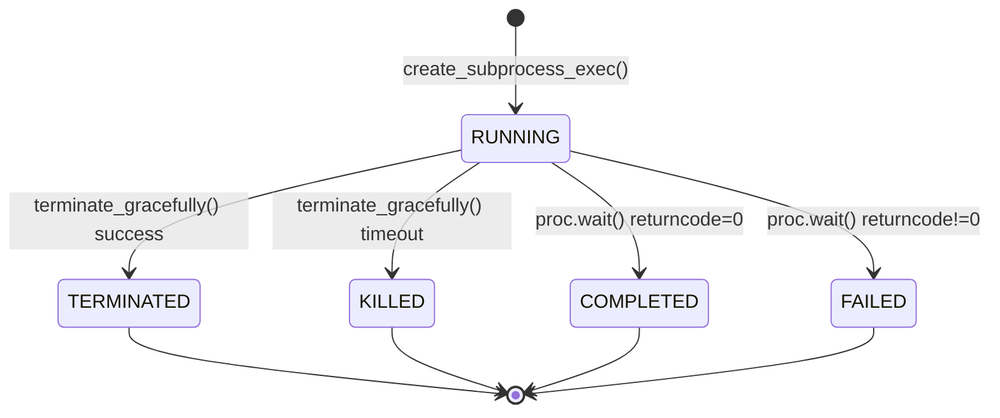

# Module : async_primitives

## Role dans l'Architecture NEXUS V8.4.x

Ce module fournit les **primitives asynchrones fondamentales** pour l'architecture "Async-First" de NEXUS V9+. Ces composants permettent:
- L'annulation hiérarchique des opérations longues (LLM calls)
- La gestion thread-safe de l'etat partage entre agents
- Le tracking des subprocess avec isolation par session UUID
- Le controle de concurrence lectures/ecritures

**Version**: 9.0.0 | **Ajoute**: V8.4.4

## Composants Cles

| Fichier | Classe | Role |
|---------|--------|------|
| `cancellation.py` | `CancellationToken` | Annulation hierarchique avec propagation parent→enfants |
| `blackboard.py` | `AsyncBlackboard` | Etat partage thread-safe avec TTL et namespaces |
| `process_handle.py` | `AsyncProcessHandle` | Tracking subprocess par session_uuid |
| `rwlock.py` | `AsyncRWLock` | Lock lecteurs multiples OU ecrivain exclusif |

### CancellationToken

Pattern inspire de .NET pour annulation gracieuse:
```python
token = CancellationToken()
child = token.create_child()

async def long_operation(token: CancellationToken):
    while not token.is_cancelled:
        await do_work()
        token.check()  # Raises CancelledError si annule

# Annuler (propage aux enfants)
token.cancel(reason="User interrupt")
```

**Caracteristiques**:
- Propagation parent → enfants automatique
- Callbacks executees a l'annulation
- `check()` leve `asyncio.CancelledError`
- Thread-safe via boolean atomique

### AsyncBlackboard

Memoire partagee entre agents et phases:
```python
bb = AsyncBlackboard()
await bb.set("analysis_result", {"score": 0.95}, ttl_seconds=3600)
result = await bb.get("analysis_result")

# Atomic get-or-set
value = await bb.get_or_set("cache_key", compute_default)

# Safe iteration
data = await bb.snapshot()
```

**Caracteristiques**:
- `BlackboardEntry` avec metadata (created_at, source, TTL)
- Expiration automatique via `is_expired`
- Snapshot pour iteration safe
- Namespaced keys pour organisation

### AsyncProcessHandle

Tracking des subprocess CLI (claude, gemini):
```python
proc = await asyncio.create_subprocess_exec("gemini", "-p", prompt)
handle = AsyncProcessHandle(proc=proc, session_uuid="abc123")

# Terminaison gracieuse
await handle.terminate_gracefully(timeout=2.0)  # SIGTERM puis SIGKILL
```

**ProcessState enum**:
- `RUNNING` → `TERMINATED` (graceful) | `KILLED` (forced)
- `COMPLETED` (success) | `FAILED` (error)

**ProcessHandleRegistry** (singleton):
- `register(handle)` / `unregister(session_uuid)`
- `cancel_by_uuid(uuid)` - Annule un process specifique
- `cancel_all()` - Annule tous les process (Ctrl+C handler)

### AsyncRWLock

Lock Read-Write avec priorite ecrivains:
```python
lock = AsyncRWLock()

# Lectures concurrentes
async with lock.read():
    data = shared_dict["key"]

# Ecriture exclusive
async with lock.write():
    shared_dict["key"] = new_value
```

**Caracteristiques**:
- Multiple readers simultanes
- Writers ont acces exclusif
- Priorite aux writers (anti-starvation)
- `InstrumentedAsyncRWLock` pour metriques

## Architecture & Flux



### Entrees
- **CancellationToken**: Cree par `AsyncHiveMindAdapter` ou `OrchestratorV7.process_turn_async()`
- **AsyncBlackboard**: Instancie par `TrueHiveMind` pour partage inter-phases
- **AsyncProcessHandle**: Cree par `AsyncClaudeDriver` / `AsyncGeminiDriver`

### Sorties
- **CancelledError**: Propagee aux coroutines pour cleanup
- **Blackboard data**: Consommee par phases HiveMind et SagaManager
- **Process status**: Utilisee par telemetry et logging

### Configuration

| Variable ENV | Default | Description |
|--------------|---------|-------------|
| `ASYNC_BLACKBOARD_DEFAULT_TTL` | `None` | TTL par defaut des entries |
| `PROCESS_TERMINATE_TIMEOUT` | `2.0` | Timeout avant SIGKILL |

## Dependances

### Utilise
- `asyncio` (stdlib) - Event loop et subprocess
- `dataclasses` (stdlib) - Structures de donnees
- `weakref` (stdlib) - References faibles pour cleanup

### Utilise par
- `core/drivers/async_claude_driver.py` - CancellationToken, AsyncProcessHandle
- `core/drivers/async_gemini_driver.py` - CancellationToken, AsyncProcessHandle
- `core/drivers/async_factory.py` - ProcessHandleRegistry
- `core/hive_mind/async_adapter.py` - CancellationToken, AsyncBlackboard
- `core/hive_mind/saga_manager.py` - AsyncBlackboard (optionnel)

## Diagramme: Lifecycle d'un Process



## Tests Associes

- `tests/test_async_primitives.py` - Tests unitaires (40+ tests)
  - CancellationToken: propagation, callbacks, check()
  - AsyncBlackboard: CRUD, TTL, snapshot
  - AsyncRWLock: concurrent reads, exclusive writes
  - ProcessHandleRegistry: register, cancel_by_uuid, cancel_all

## Anti-Patterns a Eviter

| Anti-Pattern | Correct |
|--------------|---------|
| `token._cancelled = True` | `token.cancel()` |
| `await bb._data[key]` | `await bb.get(key)` |
| `proc.terminate()` sans cleanup | `handle.terminate_gracefully()` |
| Lock manuel sans context manager | `async with lock.read():` |

## Version History

| Version | Date | Changements |
|---------|------|-------------|
| 9.0.0 | 2024-12-10 | Creation initiale (V8.4.4 Blind Spot Remediations) |
