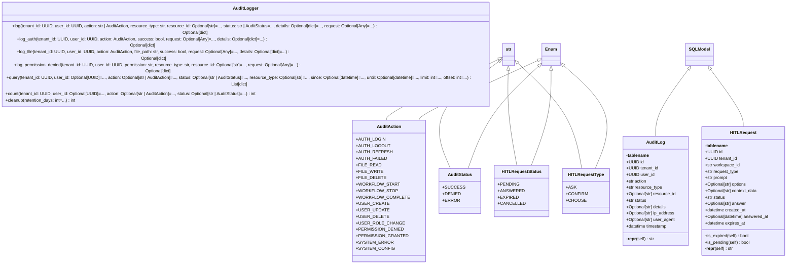

# audit

NEXUS V12.2 IRONCLAD - Audit Module

Provides append-only audit logging for compliance and security.

Quick Start:
    from core.audit import AuditLogger, AuditAction, AuditStatus

    # Log a file read
    await AuditLogger.log_file(
        tenant_id=user.tenant_id,
        user_id=user.id,
        action=AuditAction.FILE_READ,
        file_path="/path/to/file.py",
        success=True,
        request=request,
    )

    # Query recent denials
    denials = await AuditLogger.query(
        tenant_id=user.tenant_id,
        status=AuditStatus.DENIED,
        limit=50,
    )

Components:
    - AuditLog: SQLModel for audit entries (append-only)
    - HITLRequest: SQLModel for Human-in-the-Loop persistence
    - AuditLogger: Async-safe logging interface

Author: Claude (NEXUS V12.2 IRONCLAD)
Date: 2025-12-16

## Overview

| Metric | Value |
|--------|-------|
| **Path** | `C:\Code\NEXUS\NEXUS-N7A\core\audit` |
| **Modules** | 3 |
| **Total Lines** | 693 |
| **Classes** | 7 |
| **Functions** | 4 |

## Architecture

## Modules

| Module | Description | Classes | Functions |
|--------|-------------|---------|-----------|
| [audit_logger](audit_logger.py) | NEXUS V12.2 IRONCLAD - Audit Logger | 1 | 4 |
| [models](models.py) | NEXUS V12.2 IRONCLAD - Audit Models | 6 | 0 |

---
*Auto-generated by nexus-doc-generator 1.0.0 - 2025-12-16 19:13*