# bootstrap

NEXUS V9.1 - Bootstrap Module

Components:
- AutoBootstrap: Generates NEXUS.md when deployed to a new project
- SpawnedAgentLoader: Discovers spawned agents from workspace/agents/
- BootstrapService: Service layer for bootstrap operations (V9.1)
- SpinoffService: Service layer for specialization/spinoff operations (V9.1)

## Overview

| Metric | Value |
|--------|-------|
| **Path** | `C:\Code\NEXUS\NEXUS-N7A\core\bootstrap` |
| **Modules** | 4 |
| **Total Lines** | 1906 |
| **Classes** | 7 |
| **Functions** | 4 |

## Architecture

```mermaid
classDiagram
    class InferenceConfig {
        +str provider
        +str model
        +Optional[str] reasoning
    }
    class SpawnedAgentConfig {
        +str agent_id
        +str role
        +str created_at
        +str parent
        +str mission
        +List[str] domains
        +List[str] tools_priority
        +Path workspace_path
        +Optional[Path] system_prompt_path
        +Optional[str] uuid
        +Optional[InferenceConfig] inference
    }
    class SpawnedAgentLoader {
        +PROVIDER_SPAWNED
        +workspace_path
        +agents_dir
        -__init__(self, workspace_path: Path)
        +discover_spawned_agents(self) List[AgentProfile]
        -_load_agent_from_dir(self, agent_dir: Path) Optional[AgentProfile]
        -_parse_birth_certificate(self, cert_data: Dict[str, Any], agent_dir: Path) Optional[SpawnedAgentConfig]
        +load_agent_config(self, agent_id: str) Optional[SpawnedAgentConfig]
        +load_system_prompt(self, agent_id: str) Optional[str]
        +get_agent_workspace(self, agent_id: str) Optional[Path]
    }
    class ProjectAnalysis {
        +List[str] languages
        +List[str] frameworks
        +List[str] databases
        +List[str] tools
        +List[str] directories
        +List[str] key_files
        +Dict[str, str] commands
        +str indentation
        +str naming_style
        +bool has_tests
        +bool has_docs
        +bool has_ci
        +str project_name
        +str analysis_date
    }
    class AutoBootstrap {
        +LANGUAGE_PATTERNS
        +FRAMEWORK_PATTERNS
        +DATABASE_PATTERNS
        +TOOL_PATTERNS
        +project_path
        -__init__(self, project_path: Path)
        +analyze(self) ProjectAnalysis
        -_analyze_directories(self) List[str]
        -_find_key_files(self) List[str]
        -_detect_languages(self) List[str]
        -_detect_frameworks(self) List[str]
        -_detect_databases(self) List[str]
        -_detect_tools(self) List[str]
        -_discover_commands(self) Dict[str, str]
        -_detect_indentation(self) str
        -_detect_naming_style(self) str
        -_has_tests(self) bool
        -_has_docs(self) bool
        -_has_ci(self) bool
        +generate_nexus_md(self, analysis: Optional[ProjectAnalysis]=...) str
        -_extract_project_description(self) Optional[str]
        -_detect_language_version(self, language: str) Optional[str]
        -_detect_entry_points(self) Dict[str, str]
        -_detect_test_framework(self) str
        -_detect_ci_type(self) str
        -_detect_protected_files(self) Dict[str, str]
        -_get_framework_rules(self, frameworks: List[str]) List[str]
        -_detect_architecture_patterns(self) List[str]
        -_detect_important_files(self) Dict[str, str]
        +save(self, content: Optional[str]=..., path: Optional[Path]=...) Path
        +needs_bootstrap(self) bool
    }
    class BootstrapService {
        +console
        -_interaction
        -__init__(self, console: 'ConsoleV7', interaction: Optional['InteractionProvider']=...)
        +bootstrap(self, project_path: Optional[Path]=...) ServiceResult
        -_confirm_overwrite(self) bool
    }
    class SpinoffService {
        +orchestrator
        +console
        +workspace_path
        +nexus_root
        -__init__(self, orchestrator: 'OrchestratorV7', console: 'ConsoleV7', workspace_path: Path, nexus_root: Path)
        +specialize(self, mission: str) ServiceResult
        -_brainstorm_spinoff(self, parent_id: str, parent_path: Path, mission: str) List[Dict[str, Any]]
    }
```

## Modules

| Module | Description | Classes | Functions |
|--------|-------------|---------|-----------|
| [agent_loader](agent_loader.py) | Spawned Agent Loader - NEXUS V7.5 HIVE MIND | 3 | 1 |
| [auto_bootstrap](auto_bootstrap.py) | AutoBootstrap - Automatic NEXUS.md Generation | 2 | 1 |
| [service](service.py) | NEXUS V9.1 - BootstrapService & SpinoffService | 2 | 2 |

---
*Auto-generated by nexus-doc-generator 1.0.0 - 2025-12-16 19:13*