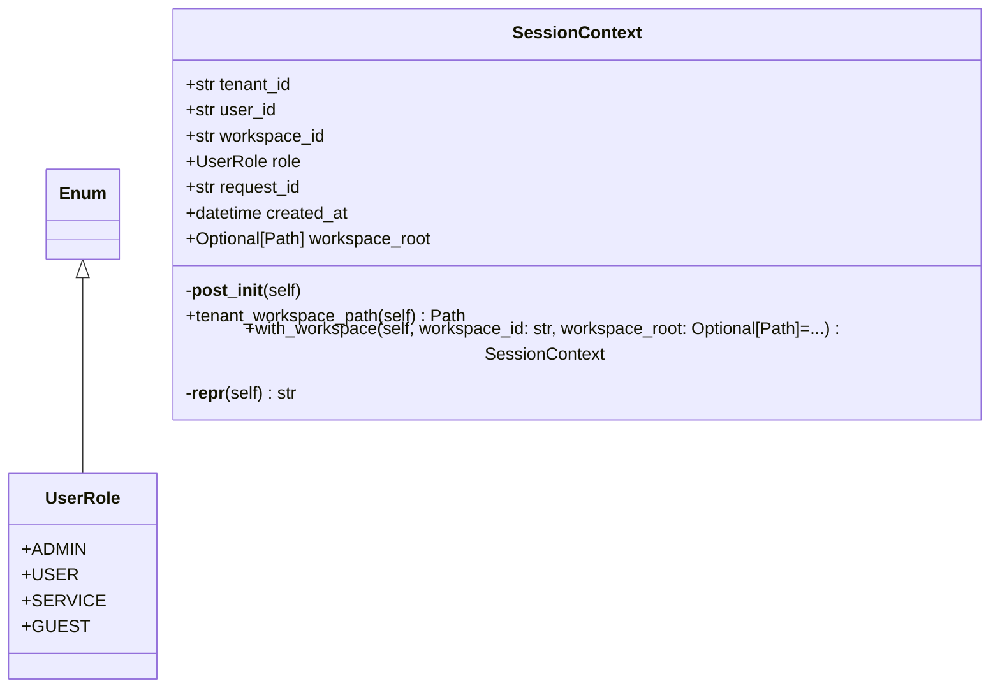

# context

Context Module - Multi-Tenant Session Management.

NEXUS V10 PRISM - The Invisible Spine

This module provides request-scoped context for multi-tenant isolation
using Python's contextvars.

Quick Start:
    from core.context import use_context, get_current_session

    # Set context for a request
    with use_context(tenant_id="acme", user_id="alice"):
        ctx = get_current_session()
        print(ctx.tenant_id)  # "acme"

    # Async version
    async with use_context_async(tenant_id="acme"):
        ctx = get_current_session()

    # Decorator for required context
    @require_context
    def tenant_specific_operation():
        ctx = get_current_session()
        ...

Author: Claude (NEXUS PRISM V10)
Date: 2025-12-15

## Overview

| Metric | Value |
|--------|-------|
| **Path** | `C:\Code\NEXUS\NEXUS-N7A\core\context` |
| **Modules** | 2 |
| **Total Lines** | 438 |
| **Classes** | 2 |
| **Functions** | 8 |

## Architecture

## Modules

| Module | Description | Classes | Functions |
|--------|-------------|---------|-----------|
| [session](session.py) | SessionContext - The Invisible Spine for Multi-Tenant Isolation. | 2 | 8 |

---
*Auto-generated by nexus-doc-generator 1.0.0 - 2025-12-16 19:13*