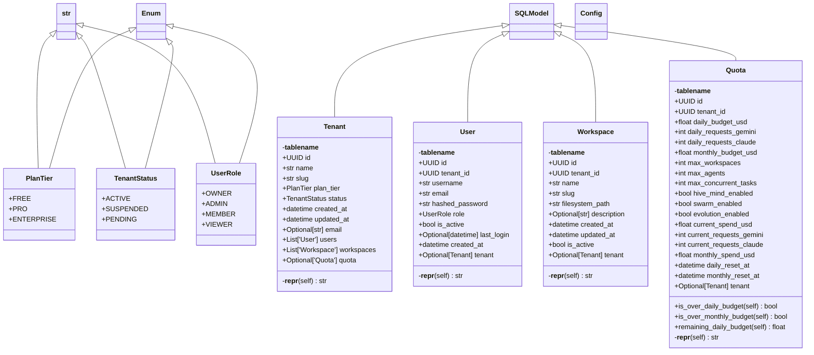

# db

Database Module - Multi-Tenant Control Plane.

NEXUS V10 PRISM - SQLModel ORM

This module provides the database layer for multi-tenant management.

Quick Start:
    from core.db import init_db, get_session, Tenant, Workspace

    # Initialize database (creates tables)
    init_db()

    # Create a tenant
    with get_session() as session:
        tenant = Tenant(name="Acme Corp", slug="acme")
        session.add(tenant)

    # Query tenants
    with get_session() as session:
        tenant = get_tenant_by_slug(session, "acme")

Author: Claude (NEXUS PRISM V10)
Date: 2025-12-15

## Overview

| Metric | Value |
|--------|-------|
| **Path** | `C:\Code\NEXUS\NEXUS-N7A\core\db` |
| **Modules** | 3 |
| **Total Lines** | 668 |
| **Classes** | 8 |
| **Functions** | 9 |

## Architecture

## Modules

| Module | Description | Classes | Functions |
|--------|-------------|---------|-----------|
| [engine](engine.py) | Database Engine - SQLModel/SQLAlchemy Configuration. | 0 | 8 |
| [models](models.py) | Database Models - Multi-Tenant Control Plane. | 8 | 1 |

---
*Auto-generated by nexus-doc-generator 1.0.0 - 2025-12-16 19:13*