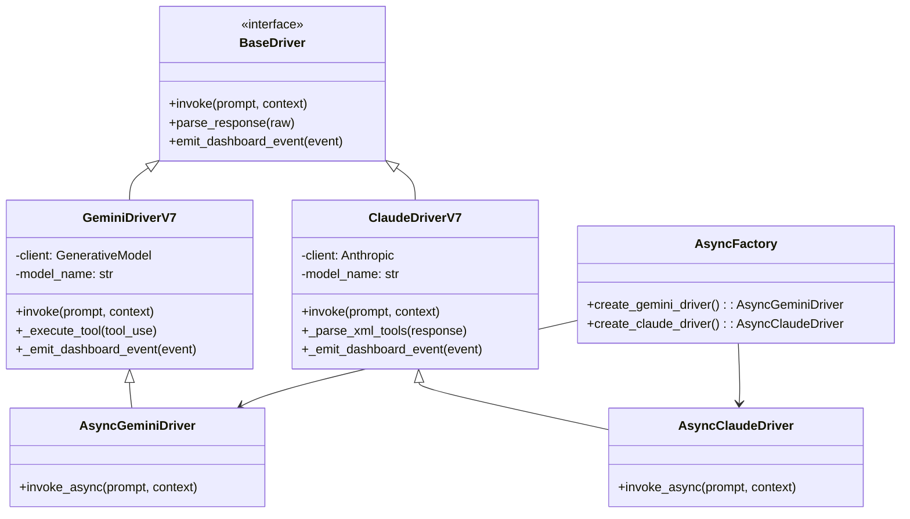

# Drivers Module


## SYNOPSIS

The **Drivers** module provides LLM communication interfaces for Gemini and Claude. Each driver handles API calls, response parsing, tool execution, and dashboard event emission.

Both sync and async variants are available for different orchestration modes.

---

## COMPONENT MAP (Mermaid)



---

## INTERACTION MATRIX

| Component | Calls (Outbound) | Called By (Inbound) | Data Type Exchanged |
|-----------|------------------|---------------------|---------------------|
| `gemini_driver_v7.py` | Google Generative AI, EventBus | All orchestrators | `LightMessageV7`, `HeavyMessageV7` |
| `claude_driver_hybrid.py` | Anthropic API, EventBus | All orchestrators | Natural text + XML tools |
| `async_gemini_driver.py` | genai.aio | HiveMind async_adapter | Async responses |
| `async_claude_driver.py` | anthropic.AsyncAnthropic | HiveMind async_adapter | Async responses |
| `async_factory.py` | Driver constructors | context_builder | Driver instances |

---

## FILE INVENTORY

| File | Lines | Size | Role |
|------|-------|------|------|
| `__init__.py` | 35 | 1.2KB | Module exports |
| `gemini_driver_v7.py` | 1000 | 36.6KB | Sync Gemini driver (JSON protocol) |
| `claude_driver_hybrid.py` | 630 | 23.2KB | Sync Claude driver (hybrid XML) |
| `async_gemini_driver.py` | 450 | 16.3KB | Async Gemini driver |
| `async_claude_driver.py` | 360 | 13.1KB | Async Claude driver |
| `async_factory.py` | 220 | 7.8KB | Driver factory |
| `async_adapter.py` | 130 | 4.6KB | Sync/async bridge |

---

## HIERARCHY

```
core/
└── drivers/                    ← THIS FOLDER
    ├── gemini_driver_v7.py     ← Main Gemini (sync)
    ├── claude_driver_hybrid.py ← Main Claude (sync)
    ├── async_gemini_driver.py  ← Async Gemini
    ├── async_claude_driver.py  ← Async Claude
    └── async_factory.py        ← Factory
```

---

## KEY PATTERNS

- **Protocol Difference**: Gemini uses strict JSON, Claude uses natural + XML
- **Dashboard Events**: Both emit WebSocket events for UI
- **Model Routing**: Drivers support multiple model tiers (Opus/Sonnet, Pro/Flash)
- **Tool Parsing**: XML parsing for Claude, JSON for Gemini
