# drivers

NEXUS V11 Drivers Module

V11 Abstraction Layer (F31-F33 fixes):
- DriverProtocol: Unified interface for CLI/API drivers
- CLIAdapters: Protocol-compliant wrappers for existing CLI drivers
- SessionProtocol: Abstracted session management (F32)
- ToolExecutorProtocol: Abstracted tool execution (F33)

V9 Async-First Architecture:
- AsyncClaudeDriver: True non-blocking Claude CLI driver
- AsyncGeminiDriver: True non-blocking Gemini CLI driver
- AsyncDriverFactory: Unified driver creation and management

Legacy sync drivers kept for backwards compatibility.

## Overview

| Metric | Value |
|--------|-------|
| **Path** | `C:\Code\NEXUS\NEXUS-N7A\core\drivers` |
| **Modules** | 11 |
| **Total Lines** | 5154 |
| **Classes** | 30 |
| **Functions** | 14 |

## Architecture

```mermaid
classDiagram
    class AsyncDriverAdapter {
        +driver
        -__init__(self, sync_driver: Any)
        +invoke_async(self, context: str, session_uuid: Optional[str]=...) Dict
        +invoke_stream_async(self, context: str, on_token: Callable[..., None], session_uuid: Optional[str]=...) Dict
    }
    class AsyncClaudeDriverConfig {
        +str cli_path
        +float timeout
        +str model
        +Path workspace_path
        +bool verbose
    }
    class AsyncClaudeDriver {
        +config
        +workspace_path
        +io_buffer
        -_registry
        -__init__(self, config: AsyncClaudeDriverConfig)
        +invoke(self, context: str, session_uuid: Optional[str]=..., token: Optional[CancellationToken]=..., task_id: Optional[str]=...) Dict[str, Any]
        +invoke_stream(self, context: str, session_uuid: Optional[str]=..., token: Optional[CancellationToken]=..., task_id: Optional[str]=..., on_token: Optional[Callable[..., None]]=...) AsyncIterator[str]
        +cancel_by_uuid(self, session_uuid: str) bool
        +cancel_all(self) int
        +active_process_count(self) int
        +list_active_processes(self) list[Dict[str, Any]]
        -_parse_hybrid_response(self, raw_text: str) Dict[str, Any]
        -_parse_keyvalue_args(self, args_text: str) Dict[str, str]
        +invoke_sync(self, context: str, session_uuid: Optional[str]=..., task_id: Optional[str]=...) Dict[str, Any]
    }
    class AsyncDriverFactory {
        +config
        +workspace_path
        -_registry
        -__init__(self, config: Any, workspace_path: Path)
        +get_claude_driver(self, model: Optional[str]=...) AsyncClaudeDriver
        +get_gemini_driver(self, model: Optional[str]=...) AsyncGeminiDriver
        +get_driver(self, agent_id: str, model: Optional[str]=...)
        +cancel_by_uuid(self, session_uuid: str) bool
        +cancel_by_task_id(self, task_id: str) int
        +cancel_all(self) int
        +list_active_processes(self) list[Dict[str, Any]]
        +active_process_count(self) int
    }
    class AsyncGeminiDriverConfig {
        +str cli_path
        +float timeout
        +str model
        +Path workspace_path
        +bool verbose
        +bool use_session_resume
        +str approval_mode
        +str allowed_tools
    }
    class AsyncGeminiDriver {
        +config
        +workspace_path
        +io_buffer
        -_session_active
        -_registry
        -__init__(self, config: AsyncGeminiDriverConfig)
        +invoke(self, context: str, session_uuid: Optional[str]=..., token: Optional[CancellationToken]=..., task_id: Optional[str]=..., isolated_env: Optional[Dict[str, str]]=...) Dict[str, Any]
        +invoke_stream(self, context: str, session_uuid: Optional[str]=..., token: Optional[CancellationToken]=..., task_id: Optional[str]=..., on_token: Optional[Callable[..., None]]=..., isolated_env: Optional[Dict[str, str]]=...) AsyncIterator[str]
        +cancel_by_uuid(self, session_uuid: str) bool
        +cancel_all(self) int
        +active_process_count(self) int
        +list_active_processes(self) list[Dict[str, Any]]
        -_get_nexus_root(self) Path
        -_extract_and_parse_json(self, output_text: str) Dict[str, Any]
        -_normalize_response(self, data: Any) Dict[str, Any]
        +invoke_sync(self, context: str, session_uuid: Optional[str]=..., task_id: Optional[str]=..., isolated_env: Optional[Dict[str, str]]=...) Dict[str, Any]
    }
    class ClaudeDriverHybrid {
        +cli_path
        +workspace_path
        +io_buffer
        +timeout
        +model
        +agent_id
        -__init__(self, config, workspace_path: Path, model: Optional[str]=..., agent_id: Optional[str]=...)
        -_validate_output(self, response: Dict) Dict
        +invoke(self, context: str, session_uuid: Optional[str]=...) Dict
        +invoke_stream(self, context: str, on_token: Callable[..., None], session_uuid: Optional[str]=...) Dict
        +send_message_async(self, prompt: str, session_uuid: Optional[str]=...) Dict
        -_parse_hybrid_response(self, raw_text: str) Dict
        -_parse_keyvalue_args(self, args_text: str) Dict
        +invoke_with_retry(self, context: str, max_retries: int=...) Dict
    }
    class GeminiCLIAdapter {
        -_driver
        -_config
        -__init__(self, config: Optional[AsyncGeminiDriverConfig]=..., workspace_path: Optional[Path]=...)
        +invoke(self, prompt: str, session_id: Optional[str]=..., system_prompt: Optional[str]=..., tools: Optional[List[Dict[str, Any]]]=..., isolated_env: Optional[Dict[str, str]]=..., timeout: Optional[float]=..., **kwargs) DriverResponse
        +invoke_stream(self, prompt: str, session_id: Optional[str]=..., system_prompt: Optional[str]=..., tools: Optional[List[Dict[str, Any]]]=..., isolated_env: Optional[Dict[str, str]]=..., timeout: Optional[float]=..., **kwargs) AsyncIterator[StreamChunk]
        +cancel(self, session_id: Optional[str]=...) bool
        +health_check(self) bool
    }
    BaseAsyncDriver <|-- GeminiCLIAdapter
    class ClaudeCLIAdapter {
        -_driver
        -_config
        -__init__(self, config: Optional[AsyncClaudeDriverConfig]=..., workspace_path: Optional[Path]=...)
        +invoke(self, prompt: str, session_id: Optional[str]=..., system_prompt: Optional[str]=..., tools: Optional[List[Dict[str, Any]]]=..., isolated_env: Optional[Dict[str, str]]=..., timeout: Optional[float]=..., **kwargs) DriverResponse
        +invoke_stream(self, prompt: str, session_id: Optional[str]=..., system_prompt: Optional[str]=..., tools: Optional[List[Dict[str, Any]]]=..., isolated_env: Optional[Dict[str, str]]=..., timeout: Optional[float]=..., **kwargs) AsyncIterator[StreamChunk]
        +cancel(self, session_id: Optional[str]=...) bool
        +health_check(self) bool
    }
    BaseAsyncDriver <|-- ClaudeCLIAdapter
    class GeminiDriverV7 {
        +cli_path
        +workspace_path
        +io_buffer
        +timeout
        +model
        +agent_id
        +use_session_resume
        -_session_active
        +config
        +persistent
        -_persistent_process
        -__init__(self, config, workspace_path: Path, model: Optional[str]=..., agent_id: Optional[str]=..., persistent: Optional[bool]=...)
        -_init_persistent(self)
        -_validate_output(self, response: Dict) Dict
        -_enforce_json_format(self, context: str) str
        +invoke(self, context: str, session_uuid: Optional[str]=..., isolated_env: Optional[Dict[str, str]]=...) Dict
        +invoke_stream(self, context: str, on_token: Callable[..., None], session_uuid: Optional[str]=..., isolated_env: Optional[Dict[str, str]]=...) Dict
        +send_message_async(self, prompt: str, session_uuid: Optional[str]=..., isolated_env: Optional[Dict[str, str]]=...) Dict
        +invoke_with_retry(self, context: str, max_retries: int=..., session_uuid: Optional[str]=..., isolated_env: Optional[Dict[str, str]]=...) Dict
        -_invoke_subprocess(self, context: str, session_uuid: Optional[str]=..., isolated_env: Optional[Dict[str, str]]=...) Dict
        -_extract_json(self, text: str, fallback_to_error: bool=...) Dict
        -_invoke_subprocess_stream(self, context: str, on_token: Callable[..., None], session_uuid: Optional[str]=..., isolated_env: Optional[Dict[str, str]]=...) Dict
    }
    class Result {
    }
    class DriverResponseStatus {
        +SUCCESS
        +ERROR
        +TIMEOUT
        +CANCELLED
        +RATE_LIMITED
    }
    Enum <|-- DriverResponseStatus
    class ToolCall {
        +str name
        +Dict[str, Any] arguments
        +Optional[str] id
        +to_dict(self) Dict[str, Any]
    }
    class DriverResponse {
        +str content
        +DriverResponseStatus status
        +Optional[str] model
        +str provider
        +Optional[str] session_id
        +List[ToolCall] tool_calls
        +float latency_ms
        +int input_tokens
        +int output_tokens
        +Optional[str] error_message
        +Optional[str] error_code
        +Optional[Dict[str, Any]] raw
        +datetime timestamp
        +is_success(self) bool
        +has_tool_calls(self) bool
        +to_dict(self) Dict[str, Any]
    }
    class StreamChunk {
        +str content
        +bool is_final
        +Optional[ToolCall] tool_call
        +float latency_ms
        +int input_tokens
        +int output_tokens
    }
```

## Modules

| Module | Description | Classes | Functions |
|--------|-------------|---------|-----------|
| [async_adapter](async_adapter.py) | Async adapter for synchronous LLM drivers. | 1 | 1 |
| [async_claude_driver](async_claude_driver.py) | AsyncClaudeDriver - TRUE Non-blocking Claude CLI Driver. | 2 | 1 |
| [async_factory](async_factory.py) | Async Driver Factory - Create and Manage Async Drivers. | 1 | 3 |
| [async_gemini_driver](async_gemini_driver.py) | AsyncGeminiDriver - TRUE Non-blocking Gemini CLI Driver. | 2 | 1 |
| [claude_driver_hybrid](claude_driver_hybrid.py) | Claude Hybrid Driver V7 - Mode Hybride avec Dynamic Model Selection | 1 | 1 |
| [cli_adapter](cli_adapter.py) | CLI Driver Adapters - V11 Wrappers for Protocol Compliance. | 2 | 3 |
| [gemini_driver_v7](gemini_driver_v7.py) | Gemini Driver V7 Chrysalis - JSON Strict Mode | 2 | 1 |
| [protocol](protocol.py) | Driver Protocol - V11 Abstraction Layer for CLI/API Independence. | 8 | 0 |
| [session_abstraction](session_abstraction.py) | Session Abstraction Layer - V11 CLI/API Independent Sessions. | 6 | 1 |
| [tool_executor](tool_executor.py) | Tool Executor Abstraction - V11 CLI/API Independent Tool Execution. | 5 | 2 |

---
*Auto-generated by nexus-doc-generator 1.0.0 - 2025-12-16 19:13*