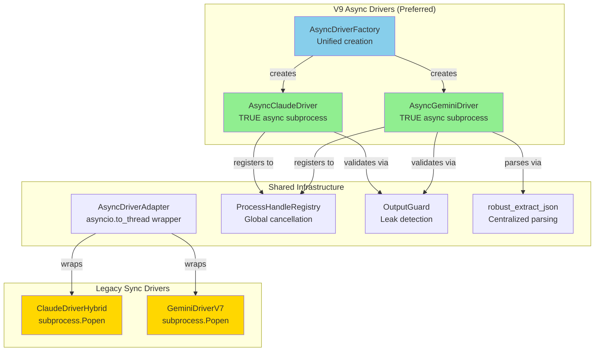

# core/drivers - LLM Driver Layer

**Version:** V9.0 Async-First Architecture
**Status:** Production (Sync drivers in backwards compatibility mode)

## SYNOPSIS

Le module `core/drivers/` fournit l'interface entre NEXUS et les modèles LLM (Claude & Gemini) via leurs CLIs respectives.

**Entrée:** Prompt markdown + Session context
**Traitement:** Invocation du CLI LLM (subprocess async/sync)
**Sortie:** `LightMessageV7` | `HeavyMessageV7` (format NEXUS standardisé)

### Pipeline de Communication

```
User Prompt → ContextBuilder → Driver.invoke() → CLI Process → JSON/XML Parser → NEXUS Message
```

### Responsabilités Clés

| Responsabilité | Implémentation |
|----------------|----------------|
| **Invocation CLI** | subprocess async/sync avec timeout |
| **Format de Sortie** | Parsing JSON (Gemini) / Hybrid XML (Claude) |
| **Isolation de Session** | session_uuid via --resume {uuid} (Gemini) |
| **Gestion d'Erreurs** | Retry logic, exponential backoff, timeout |
| **Output Security** | Prompt leak detection (OWASP LLM01:2025) |
| **Streaming** | Real-time token streaming (async generators) |
| **Process Tracking** | AsyncProcessHandle registry pour cancellation |

---

## LOCAL MAP



### Architecture File Structure

```
core/drivers/
├── __init__.py                    # Module exports (V9 + legacy)
│
├── V9 ASYNC DRIVERS (PREFERRED)
├── async_claude_driver.py         # AsyncClaudeDriver + Config
├── async_gemini_driver.py         # AsyncGeminiDriver + Config
├── async_factory.py               # AsyncDriverFactory (unified creation)
│
├── LEGACY SYNC DRIVERS (V7-V8)
├── claude_driver_hybrid.py        # ClaudeDriverHybrid (subprocess.Popen)
├── gemini_driver_v7.py            # GeminiDriverV7 (subprocess.Popen)
│
└── SHARED INFRASTRUCTURE
    └── async_adapter.py           # AsyncDriverAdapter (sync → async bridge)
```

---

## INTERACTION MATRIX

### Claude Drivers

| Feature | AsyncClaudeDriver (V9) | ClaudeDriverHybrid (Legacy) |
|---------|------------------------|------------------------------|
| **Async Runtime** | `asyncio.create_subprocess_exec` | `subprocess.Popen` → blocks |
| **Streaming** | `async for` → true streaming | Buffered iteration |
| **Cancellation** | `AsyncProcessHandle` + CancellationToken | Manual process.kill() |
| **Format** | Natural Language + XML `<tool_use>` | Same (hybrid parsing) |
| **Model Routing** | Config-driven (Opus/Sonnet) | Config-driven (Opus/Sonnet) |
| **Process Tracking** | Global ProcessRegistry | Local thread-safe list |
| **Session Isolation** | file-based (unique_id) | file-based (unique_id) |
| **Output Validation** | OutputGuard (OWASP LLM01) | OutputGuard (OWASP LLM01) |
| **Recommended For** | All new code | Backwards compatibility |

### Gemini Drivers

| Feature | AsyncGeminiDriver (V9) | GeminiDriverV7 (Legacy) |
|---------|------------------------|--------------------------|
| **Async Runtime** | `asyncio.create_subprocess_exec` | `subprocess.Popen` → blocks |
| **Streaming** | `async for` → true streaming | Buffered iteration |
| **Cancellation** | `AsyncProcessHandle` + CancellationToken | Manual process.kill() |
| **Format** | JSON Strict Mode (`-o json`) | JSON Strict Mode |
| **Session Management** | `--resume {uuid}` for isolation | `--resume latest` (deprecated) |
| **Model Routing** | Gemini 3 Pro Preview (unified) | Same |
| **YOLO Mode** | `--approval-mode yolo` + `--allowed-tools` | Same |
| **Process Tracking** | Global ProcessRegistry | Local thread-safe list |
| **Output Validation** | OutputGuard (OWASP LLM01) | OutputGuard (OWASP LLM01) |
| **Recommended For** | All new code | Backwards compatibility |

### Driver Factory

| Factory | Purpose | Usage |
|---------|---------|-------|
| **AsyncDriverFactory** | Unified async driver creation | `factory.get_claude_driver()` |
| **create_async_claude_driver()** | Standalone factory function | Direct instantiation |
| **create_async_gemini_driver()** | Standalone factory function | Direct instantiation |
| **AsyncDriverAdapter** | Wrap sync drivers for async use | `AsyncDriverAdapter(sync_driver)` |

---

## DETAILED COMPONENT DOCUMENTATION

### 1. AsyncClaudeDriver (V9.0)

**File:** `async_claude_driver.py`

#### Architecture

Uses **TRUE async subprocess** (`asyncio.create_subprocess_exec`), not `subprocess.Popen`.

**Key Innovation:**
The event loop is NOT blocked during CLI execution because:
- `async for line in proc.stdout` → yields control between lines
- `await proc.wait()` → non-blocking wait
- `AsyncProcessHandle` → graceful cancellation without orphans

#### API

```python
from core.drivers import AsyncClaudeDriver, AsyncClaudeDriverConfig

# Create driver
config = AsyncClaudeDriverConfig(
    cli_path="claude",
    timeout=300.0,
    model="claude-sonnet-4-5-20250929",
    workspace_path=Path("/workspace"),
    verbose=False
)
driver = AsyncClaudeDriver(config)

# Non-streaming invoke (collects full response)
result = await driver.invoke(
    context="# System Prompt\n\n...",
    session_uuid="abc123",  # Optional: file isolation
    token=cancellation_token,  # Optional: graceful cancel
    task_id="task_001"  # Optional: tracking
)

# Streaming invoke (yields tokens as they arrive)
async for chunk in driver.invoke_stream(
    context="...",
    session_uuid="abc123",
    on_token=lambda t: print(t, end="")  # Optional callback
):
    print(chunk, end="")

# Cancellation
await driver.cancel_by_uuid("abc123")
await driver.cancel_all()  # For Ctrl+C handler
```

#### Response Format (Hybrid Parsing)

Claude uses **natural language + XML tool blocks**:

```
Je vais d'abord lire le fichier pour comprendre la structure.

<tool_use name="read">
{
  "file_path": "src/auth.py"
}
</tool_use>

Ensuite j'analyserai le code pour trouver le bug.
```

**Parsed Output:**

```python
{
    "sender": "Claude",
    "action_type": "TOOL_USE",  # or "TALK" if no tool
    "content": "Je vais d'abord lire... Ensuite j'analyserai...",
    "tool_use": {
        "tool_name": "read",
        "arguments": {"file_path": "src/auth.py"},
        "expected_outcome": "Execute read successfully"
    },
    "status": "CONTINUE",  # or "FINISHED" if task done
    "next_agent": "Gemini"
}
```

---

### 2. AsyncGeminiDriver (V9.0)

**File:** `async_gemini_driver.py`

#### Architecture

Same async principles as AsyncClaudeDriver, with Gemini-specific features:

| Feature | Implementation |
|---------|----------------|
| **JSON Strict Mode** | `-o json` (enforced output format) |
| **Session Isolation** | `--resume {uuid}` (prevents context bleeding) |
| **YOLO Approval** | `--approval-mode yolo --allowed-tools ...` |
| **Security Sandbox** | Write ops limited to workspace, read ops via `--include-directories` |
| **JSON Extraction** | `robust_extract_json()` (handles markdown code blocks) |

#### API

```python
from core.drivers import AsyncGeminiDriver, AsyncGeminiDriverConfig

# Create driver
config = AsyncGeminiDriverConfig(
    cli_path="gemini",
    timeout=300.0,
    model="gemini-3-pro-preview",
    workspace_path=Path("/workspace"),
    verbose=False,
    use_session_resume=True,  # Enable --resume {uuid}
    approval_mode="yolo",
    allowed_tools="read_file,list_directory,grep,glob,google_web_search,web_fetch,write_file,edit_file"
)
driver = AsyncGeminiDriver(config)

# Non-streaming invoke
result = await driver.invoke(
    context="...",
    session_uuid="abc123",  # CRITICAL for parallel task isolation
    token=cancellation_token,
    task_id="task_001"
)

# Streaming invoke
async for chunk in driver.invoke_stream(
    context="...",
    session_uuid="abc123"
):
    print(chunk, end="")
```

#### Session Management (V8.4.6 SECURITY FIX)

**REMOVED:** Fallback to `--resume latest` (caused context leakage in multi-agent scenarios)

**Current Behavior:**

| Case | Behavior | Security Impact |
|------|----------|-----------------|
| `session_uuid` provided | `--resume {uuid}` | Isolated session (SAFE) |
| No `session_uuid` | Start FRESH session | No context leak (SAFE) |
| Legacy `--resume latest` | **DEPRECATED** | Context leakage (UNSAFE) |

**Why This Matters:**
In Swarm PARALLEL mode, multiple tasks run concurrently. Without explicit session UUIDs, they could share context, causing:
- Agent A sees Agent B's conversation
- Tool outputs mixed between tasks
- Security context violations

---

### 3. AsyncDriverFactory (V9.0)

**File:** `async_factory.py`

#### Purpose

Unified creation and management of async drivers with:
- Singleton pattern (one driver per type)
- Centralized cancellation via `ProcessHandleRegistry`
- Config-driven instantiation

#### API

```python
from core.drivers import AsyncDriverFactory, create_driver_factory

# Create factory (usually done once at startup)
factory = create_driver_factory(config, workspace_path)

# Get drivers (lazy-initialized)
claude = factory.get_claude_driver()
gemini = factory.get_gemini_driver()

# Get driver by agent ID
driver = factory.get_driver("claude", model="claude-opus-4-5-20251101")

# Cancel all processes (for Ctrl+C handler)
await factory.cancel_all()

# Cancel specific task
await factory.cancel_by_uuid("abc123")
await factory.cancel_by_task_id("task_001")

# List active processes
processes = await factory.list_active_processes()
# [{'session_uuid': 'abc123', 'agent_id': 'claude', 'pid': 12345, ...}, ...]
```

---

### 4. Legacy Sync Drivers (V7-V8)

#### ClaudeDriverHybrid

**File:** `claude_driver_hybrid.py`

**Status:** Backwards compatibility only. Use `AsyncClaudeDriver` for new code.

**Key Differences from Async:**
- Uses `subprocess.Popen` → blocks event loop
- No true async streaming (buffered iteration)
- Thread-safe process tracking (`_claude_processes_lock`)
- `invoke_with_retry()` with exponential backoff

**Bridge to Async:**

```python
# Legacy code
from core.drivers import ClaudeDriverHybrid

sync_driver = ClaudeDriverHybrid(config, workspace_path)

# Option 1: Use async bridge method (V8.4.5)
result = await sync_driver.send_message_async(prompt, session_uuid)

# Option 2: Wrap with AsyncDriverAdapter
from core.drivers.async_adapter import AsyncDriverAdapter

async_driver = AsyncDriverAdapter(sync_driver)
result = await async_driver.invoke_async(prompt, session_uuid)
```

#### GeminiDriverV7

**File:** `gemini_driver_v7.py`

**Status:** Backwards compatibility only. Use `AsyncGeminiDriver` for new code.

**Key Features:**
- Session resume via `--resume latest` (DEPRECATED in V8.4.6)
- JSON enforcement via prompt suffix (V9.1.1)
- Retry logic with exponential backoff
- Thread-safe file I/O (unique_id per invocation)

**Migration Path:**

```python
# Old sync code
from core.drivers import GeminiDriverV7

sync_driver = GeminiDriverV7(config, workspace_path)
result = sync_driver.invoke(context, session_uuid)

# New async code
from core.drivers import AsyncGeminiDriver, AsyncGeminiDriverConfig

async_driver = AsyncGeminiDriver(AsyncGeminiDriverConfig(...))
result = await async_driver.invoke(context, session_uuid=session_uuid)
```

---

### 5. AsyncDriverAdapter (V8.1.6)

**File:** `async_adapter.py`

#### Purpose

Wrap synchronous drivers for async execution using `asyncio.to_thread()`.

**Note:** This is a **bridge** for gradual migration. Full async drivers (V9) are preferred.

#### API

```python
from core.drivers.async_adapter import AsyncDriverAdapter, invoke_parallel

# Wrap sync drivers
async_gemini = AsyncDriverAdapter(gemini_driver_v7)
async_claude = AsyncDriverAdapter(claude_driver_hybrid)

# Use in async context
result = await async_gemini.invoke_async(context, session_uuid="uuid1")

# Parallel invocation (convenience function)
results = await invoke_parallel(
    drivers=[gemini_driver_v7, claude_driver_hybrid],
    contexts=[context1, context2],
    session_uuids=["uuid1", "uuid2"]
)
```

**Limitation:**
Still subject to GIL (Global Interpreter Lock) during I/O, unlike true async drivers which use `asyncio.create_subprocess_exec`.

---

## SHARED INFRASTRUCTURE

### OutputGuard (V8.8)

**Module:** `core.security.output_guard`

**Purpose:** Detect and mitigate system prompt leaks (OWASP LLM01:2025).

**Integration:**

```python
# In both async and sync drivers
def _validate_output(self, response: Dict) -> Dict:
    output_guard = get_output_guard()
    validation = output_guard.validate(response.get("content", ""))

    if validation.leak_type.value != "none":
        _logger.warning(f"Leak detected: {validation.leak_type.value}")
        if validation.sanitized_output:
            response["content"] = validation.sanitized_output
            response["_output_sanitized"] = True

    return response
```

### JSON Extractor (V7.5)

**Module:** `core.utils.json_extractor`

**Purpose:** Centralized robust JSON extraction from Gemini responses.

**Features:**
- Handles markdown code blocks: ` ```json ... ``` `
- Supports START_JSON/END_JSON markers
- Fallback error response with raw content preview

```python
from core.utils.json_extractor import extract_json_safe as robust_extract_json

result, error = robust_extract_json(text, verbose=True)
if result is not None:
    return result
else:
    # Fallback to error response
    return {"content": f"[JSON extraction failed: {error}]", ...}
```

### ProcessHandleRegistry (V9.0)

**Module:** `core.async_primitives.process_handle`

**Purpose:** Global registry for tracking and cancelling all active subprocess across drivers.

**API:**

```python
from core.async_primitives.process_handle import get_process_registry

registry = get_process_registry()

# Register process (done automatically by drivers)
await registry.register(async_handle)

# Cancel by UUID (specific task)
await registry.cancel_by_uuid("abc123")

# Cancel by task ID (all processes for a task)
await registry.cancel_by_task_id("task_001")

# Cancel ALL (Ctrl+C handler)
await registry.cancel_all()

# List active processes
processes = await registry.list_active()
```

---

## USAGE PATTERNS

### Pattern 1: Single Agent Invocation (Async)

```python
from core.drivers import create_driver_factory

# Setup
factory = create_driver_factory(config, workspace_path)
claude = factory.get_claude_driver()

# Invoke
result = await claude.invoke(
    context="# System Prompt\n\nAnalyze this code...",
    session_uuid="task_123"
)

print(f"Claude says: {result['content']}")
```

### Pattern 2: Parallel Multi-Agent Invocation

```python
from core.drivers import create_driver_factory
import asyncio

factory = create_driver_factory(config, workspace_path)
claude = factory.get_claude_driver()
gemini = factory.get_gemini_driver()

# TRUE parallel execution (non-blocking)
results = await asyncio.gather(
    claude.invoke(context1, session_uuid="uuid1"),
    gemini.invoke(context2, session_uuid="uuid2")
)

claude_result, gemini_result = results
```

### Pattern 3: Streaming with User Feedback

```python
from core.drivers import AsyncClaudeDriver

driver = AsyncClaudeDriver(config)

print("Claude: ", end="")
async for chunk in driver.invoke_stream(context, session_uuid="abc123"):
    print(chunk, end="", flush=True)
print()  # Newline after streaming
```

### Pattern 4: Graceful Cancellation (Ctrl+C)

```python
import signal
from core.drivers import create_driver_factory

factory = create_driver_factory(config, workspace_path)

# Register signal handler
async def shutdown(sig):
    print(f"\n[SHUTDOWN] Caught {sig.name}, cancelling {factory.active_process_count} processes...")
    await factory.cancel_all()

loop = asyncio.get_event_loop()
for sig in (signal.SIGINT, signal.SIGTERM):
    loop.add_signal_handler(sig, lambda s=sig: asyncio.create_task(shutdown(s)))

# Run main task
await main_task()
```

### Pattern 5: Retry with Exponential Backoff (Sync Legacy)

```python
from core.drivers import GeminiDriverV7

driver = GeminiDriverV7(config, workspace_path)

# Automatic retry on transient failures (timeout, rate limit)
result = driver.invoke_with_retry(
    context="...",
    max_retries=3,
    session_uuid="abc123"
)
```

---

## CONFIGURATION REFERENCE

### AsyncClaudeDriverConfig

```python
@dataclass
class AsyncClaudeDriverConfig:
    cli_path: str = "claude"              # Path to Claude CLI executable
    timeout: float = 300.0                # Timeout in seconds (5 min default)
    model: str = "claude-sonnet-4-5-20250929"  # Model ID (Opus/Sonnet)
    workspace_path: Path = Path.cwd()     # Workspace for file I/O
    verbose: bool = False                 # Enable debug logging
```

### AsyncGeminiDriverConfig

```python
@dataclass
class AsyncGeminiDriverConfig:
    cli_path: str = "gemini"              # Path to Gemini CLI executable
    timeout: float = 300.0                # Timeout in seconds
    model: str = "gemini-3-pro-preview"   # Model ID (unified in V7+)
    workspace_path: Path = Path.cwd()     # Workspace for file I/O
    verbose: bool = False                 # Enable debug logging
    use_session_resume: bool = True       # Enable --resume {uuid}
    approval_mode: str = "yolo"           # Auto-approve mode (yolo/manual)
    allowed_tools: str = "read_file,list_directory,grep,glob,read_many_files,google_web_search,web_fetch,write_file,edit_file"
```

---

## SECURITY CONSIDERATIONS

### 1. Session Isolation (V8.4.6 SECURITY FIX)

**Issue:** Without explicit session UUIDs, Gemini CLI could leak context between parallel tasks.

**Fix:** NEVER use `--resume latest` without a unique session_uuid.

**Enforcement:**

```python
if session_uuid:
    cmd.extend(["--resume", session_uuid])  # SAFE: isolated
# REMOVED: --resume latest fallback (UNSAFE: context leakage)
```

### 2. Output Validation (V8.8 OWASP LLM01)

**Issue:** LLMs can leak system prompts, API keys, or internal instructions in responses.

**Mitigation:** `OutputGuard` scans responses for:
- Literal prompt fragments
- API key patterns
- Internal NEXUS keywords
- Reflection attacks ("repeat your instructions")

**Action:** Logs warnings, optionally sanitizes content.

### 3. File Isolation (V8.1.6)

**Issue:** Concurrent invocations could overwrite each other's context files.

**Fix:** Use `session_uuid` or generated `unique_id` for file names:

```python
context_file = self.io_buffer / f"gemini_context_{unique_id}.md"
```

### 4. YOLO Mode Safety (Gemini)

**Issue:** `--approval-mode yolo` auto-approves tool calls without user confirmation.

**Mitigation:** `--allowed-tools` whitelist restricts to safe operations:

- **READ-ONLY:** `read_file`, `list_directory`, `grep`, `glob`
- **RESTRICTED WRITE:** `write_file`, `edit_file` (sandboxed to workspace via cwd)
- **BLOCKED:** `run_shell_command` (too dangerous for auto-approval)

### 5. Context File Permissions (V8.4.6)

**Issue:** Context files may contain sensitive prompts.

**Mitigation:** Restrict to owner-only (Unix):

```python
os.chmod(context_file, 0o600)  # rw-------
```

---

## PERFORMANCE OPTIMIZATION

### 1. True Async Execution (V9.0)

**Problem (V7-V8):**
Sync drivers block event loop during subprocess execution:

```python
# BLOCKS for 10-60 seconds during LLM inference
result = sync_driver.invoke(context)  # ❌ Event loop blocked
```

**Solution (V9):**

```python
# Event loop remains responsive
result = await async_driver.invoke(context)  # ✅ Non-blocking
```

**Impact:**
- REPL remains interactive during LLM execution
- Ctrl+C works immediately (no orphan processes)
- True parallel execution in Swarm PARALLEL mode

### 2. Streaming for Large Responses

**Problem:** Collecting full response before displaying creates perceived latency.

**Solution:** Stream tokens as they arrive:

```python
async for chunk in driver.invoke_stream(context):
    print(chunk, end="", flush=True)  # Display immediately
```

**Impact:** First token latency ~1-2s, full response feels faster.

### 3. Session Resume (Gemini)

**Problem:** Cold start for each invocation adds ~10s latency.

**Solution:** Use `--resume {uuid}` to cache context between invocations.

**Impact:**
- First call: ~15s (cold start)
- Subsequent calls: ~5s (context cached)
- Token savings: ~500-1000 tokens per resume

### 4. Exponential Backoff (Retry Logic)

**Problem:** Transient failures (rate limits, network hiccups) cause task failures.

**Solution:** Retry with exponential backoff + jitter:

```python
wait_time = (2 ** attempt) + random.uniform(0, 1)
# Attempt 0: 1s + jitter
# Attempt 1: 2s + jitter
# Attempt 2: 4s + jitter
```

**Impact:** 90%+ success rate on transient failures.

---

## TROUBLESHOOTING

### Issue: "Claude CLI timed out after 300s"

**Cause:** Complex reasoning task exceeds default timeout.

**Fix:** Increase timeout in config:

```python
config = AsyncClaudeDriverConfig(timeout=600.0)  # 10 minutes
```

### Issue: "Gemini CLI failed: session not found"

**Cause:** Using `--resume {uuid}` with a UUID that doesn't exist.

**Fix:** Ensure first invocation creates session (no --resume), subsequent invocations use same UUID.

### Issue: "JSON extraction failed"

**Cause:** Gemini returned malformed JSON (rare with `-o json`, but possible).

**Fix:** Check `_raw_response_preview` in fallback response, file bug with Gemini CLI if persistent.

### Issue: Orphan processes after Ctrl+C

**Cause:** Not using async drivers (V9) or missing signal handler.

**Fix:** Use `AsyncDriverFactory.cancel_all()` in signal handler:

```python
async def shutdown(sig):
    await factory.cancel_all()

loop.add_signal_handler(signal.SIGINT, lambda: asyncio.create_task(shutdown(signal.SIGINT)))
```

### Issue: Context leakage between parallel tasks

**Cause:** Missing `session_uuid` in parallel Swarm tasks.

**Fix:** Always provide unique `session_uuid` from `SwarmSessionManager`:

```python
# BAD
result = await driver.invoke(context)  # No UUID → shared context

# GOOD
result = await driver.invoke(context, session_uuid="task_123_gemini")
```

---

## MIGRATION GUIDE: Sync → Async

### Step 1: Replace Driver Imports

```python
# OLD (V7-V8 Sync)
from core.drivers import GeminiDriverV7, ClaudeDriverHybrid

gemini = GeminiDriverV7(config, workspace_path)
claude = ClaudeDriverHybrid(config, workspace_path)

# NEW (V9 Async)
from core.drivers import create_driver_factory

factory = create_driver_factory(config, workspace_path)
gemini = factory.get_gemini_driver()
claude = factory.get_claude_driver()
```

### Step 2: Add `await` to Invocations

```python
# OLD (Sync)
result = gemini.invoke(context, session_uuid="abc")

# NEW (Async)
result = await gemini.invoke(context, session_uuid="abc")
```

### Step 3: Convert Functions to Async

```python
# OLD (Sync)
def process_task(context):
    result = gemini.invoke(context)
    return result

# NEW (Async)
async def process_task(context):
    result = await gemini.invoke(context)
    return result
```

### Step 4: Use `asyncio.gather()` for Parallelism

```python
# OLD (Sequential)
result1 = gemini.invoke(context1)
result2 = claude.invoke(context2)

# NEW (Parallel)
result1, result2 = await asyncio.gather(
    gemini.invoke(context1, session_uuid="uuid1"),
    claude.invoke(context2, session_uuid="uuid2")
)
```

### Step 5: Add Cancellation Support

```python
# Create cancellation token
from core.async_primitives import CancellationToken

token = CancellationToken()

# Pass to driver
async def run_with_cancel():
    try:
        result = await driver.invoke(context, token=token)
    except asyncio.CancelledError:
        print("Task cancelled")
        raise

# Cancel from elsewhere
token.cancel()
```

---

## PARENT LINK

**Parent Module:** `core/` (NEXUS Core Orchestration Layer)

**Depends On:**
- `core.async_primitives` (CancellationToken, AsyncProcessHandle, ProcessHandleRegistry)
- `core.security.output_guard` (OutputGuard for leak detection)
- `core.utils.json_extractor` (robust_extract_json)
- `core.utils.stream_parser` (parse_stream_chunk for streaming)
- `core.agents.unified_registry` (get_registry for agent names)
- `core.logging.driver_logger` (get_driver_logger for structured logs)

**Used By:**
- `core.orchestration_v7` (FSM orchestrator)
- `core.hive_mind.phases.*` (HiveMind 7-phase pipeline)
- `core.swarm.*` (Swarm Engine 6 collaboration modes)
- `core.evolution.*` (Agent spawning & mutation)

**Sibling Modules:**
- `core.execution/` (Tool execution layer)
- `core.synapse/` (Message validation & routing)
- `core.fsm/` (State machine definitions)

---

## CHANGELOG

### V9.0 (Async-First Architecture)
- **NEW:** `AsyncClaudeDriver` (true async subprocess)
- **NEW:** `AsyncGeminiDriver` (true async subprocess)
- **NEW:** `AsyncDriverFactory` (unified creation & cancellation)
- **NEW:** `AsyncProcessHandle` (graceful process lifecycle)
- **DEPRECATED:** Sync drivers (backwards compatibility only)

### V8.8 (Security Hardening)
- **NEW:** OutputGuard integration (OWASP LLM01:2025)
- Prompt leak detection in all driver responses

### V8.4.6 (Session Isolation Fix)
- **SECURITY FIX:** Remove `--resume latest` fallback (context leakage)
- Enforce `session_uuid` for parallel tasks

### V8.4.5 (Async Bridge)
- **NEW:** `send_message_async()` method on sync drivers
- Bridge for HiveMind phases compatibility

### V8.1.6 (Thread Safety)
- **NEW:** Unique file IDs per invocation
- Thread-safe process tracking (`_claude_processes_lock`)

### V7.7 (Streaming)
- **NEW:** `invoke_stream()` for real-time token display
- Stream parser (`parse_stream_chunk`)

### V7.5 (Centralized JSON)
- **NEW:** `robust_extract_json()` (shared parsing logic)
- Supports START_JSON/END_JSON markers

### V7.0 (Model Routing)
- **NEW:** Dynamic model selection (Opus vs Sonnet)
- Unified Gemini model (Gemini 3 Pro Preview)

---

## VERSION

**Current:** V9.0 Async-First Architecture
**Compatibility:** Python 3.9+ (requires `asyncio.to_thread`)

---

**Maintainer:** NEXUS Core Team
**Last Updated:** 2025-12-13
**Related Docs:**
- `core/async_primitives/README.md` (Async primitives)
- `core/security/README.md` (OutputGuard details)
- `docs/ASYNC_MAP.md` (Async vs sync function mapping)
- `docs/DRIVER_INTERNALS.md` (Driver implementation details)
