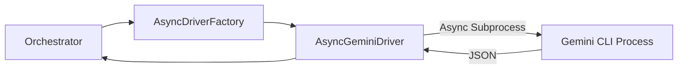

# Drivers Module - NEXUS V9.2

## Rôle
Le module `core/drivers` fournit l'interface de communication avec les LLMs (Gemini et Claude). En V9.2, l'architecture privilégie les drivers asynchrones (`AsyncGeminiDriver`, `AsyncClaudeDriver`) pour une exécution non-bloquante et une meilleure gestion des timeouts.

## Fichiers Clés
| Fichier | Lignes | Responsabilité |
|---------|--------|----------------|
| `async_gemini_driver.py` | ~350 | **Gemini Async**: Driver CLI asynchrone pour Gemini (JSON I/O). |
| `async_claude_driver.py` | ~300 | **Claude Async**: Driver CLI asynchrone pour Claude (Hybrid I/O). |
| `async_factory.py` | ~150 | **Factory**: Crée les instances de drivers selon la configuration. |
| `gemini_driver_v7.py` | ~750 | **Legacy Sync**: Ancien driver synchrone (maintenu pour compatibilité). |
| `claude_driver_hybrid.py` | ~450 | **Legacy Sync**: Ancien driver synchrone. |

## API Publique
```python
from core.drivers import (
    create_async_gemini_driver,
    create_async_claude_driver,
    AsyncDriverFactory
)

# Usage
factory = AsyncDriverFactory(config)
driver = await factory.create_driver("Gemini")
response = await driver.send_message("Hello", context)
```

## Flux de Données

### Async Execution Flow


## Dépendances

**Importe :**
- `asyncio` : Gestion des subprocess asynchrones.
- `core/security` : Validation des entrées/sorties (`InputGuard`, `OutputGuard`).

**Importé par :**
- `core/orchestration/agent_invoker.py` : Exécution des tours d'agents.
- `core/hive_mind/orchestrator.py` : Négociation et débats.

## Configuration

| Variable | Default | Description |
|----------|---------|-------------|
| `USE_ASYNC_DRIVERS` | `True` | Active les drivers asynchrones par défaut. |
| `GEMINI_TIMEOUT` | `300` | Timeout en secondes pour Gemini. |

## Tests

- `tests/drivers/test_async_gemini_driver.py`
- `tests/drivers/test_async_claude_driver.py`
- `tests/drivers/test_async_factory.py`
