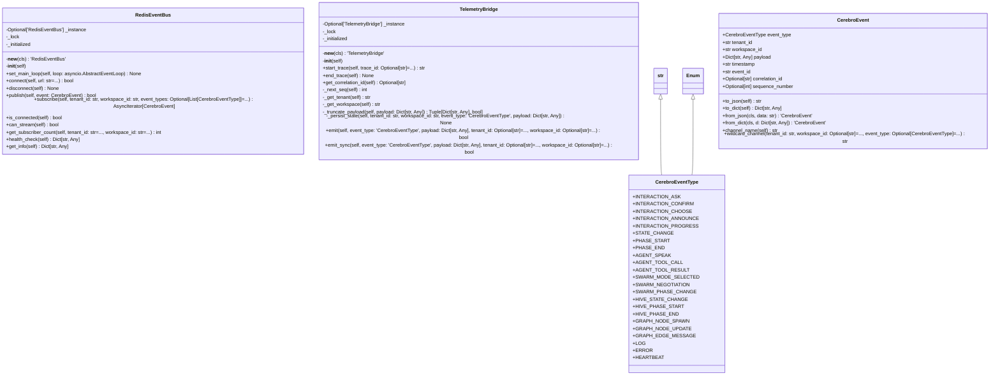

# events

NEXUS V10 CEREBRO - Events Package

Redis-based event bus for external UI observation.
Coexists with internal EventBus (core/async_primitives/event_bus.py).

Usage:
    from core.events import CerebroEvent, CerebroEventType, get_redis_bus

    # Publish event
    event = CerebroEvent(
        event_type=CerebroEventType.INTERACTION_ASK,
        tenant_id="tenant_123",
        workspace_id="default",
        payload={"prompt": "Continue?"}
    )
    await get_redis_bus().publish(event)

## Overview

| Metric | Value |
|--------|-------|
| **Path** | `C:\Code\NEXUS\NEXUS-N7A\core\events` |
| **Modules** | 4 |
| **Total Lines** | 1220 |
| **Classes** | 4 |
| **Functions** | 10 |

## Architecture

## Modules

| Module | Description | Classes | Functions |
|--------|-------------|---------|-----------|
| [redis_bus](redis_bus.py) | NEXUS V10 CEREBRO - Redis Event Bus | 1 | 4 |
| [telemetry_bridge](telemetry_bridge.py) | NEXUS V10 CEREBRO: SYNAPSE - TelemetryBridge | 1 | 2 |
| [types](types.py) | NEXUS V10 CEREBRO - Event Types | 2 | 4 |

---
*Auto-generated by nexus-doc-generator 1.0.0 - 2025-12-16 19:13*