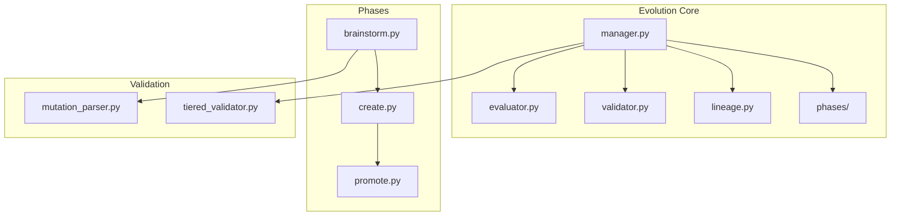

# Evolution Module


## SYNOPSIS

The **Evolution** module enables NEXUS self-improvement through AI-driven mutation and offspring creation. It implements the complete evolution pipeline: brainstorming mutations, creating child directories, validating with Red Team, and promoting successful offspring.

This is the **self-improvement engine** of NEXUS.

---

## COMPONENT MAP (Mermaid)



---

## INTERACTION MATRIX

| Component | Calls (Outbound) | Called By (Inbound) | Data Type Exchanged |
|-----------|------------------|---------------------|---------------------|
| `manager.py` | phases/, lineage, validator | REPL /evolve command | `EvolutionResult` |
| `lineage.py` | LINEAGE.json, file system | manager, phases | `LineageInfo` |
| `validator.py` | Red Team, subprocess | manager | `ValidationResult` |
| `evaluator.py` | Fitness metrics | manager | `EvaluationScore` |
| `mutation_parser.py` | Regex, AST | brainstorm phase | `List[Mutation]` |
| `phases/` | Orchestrator, MutationParser | manager | Phase results |

---

## FILE INVENTORY

| File | Lines | Size | Role |
|------|-------|------|------|
| `manager.py` | 540 | 19.6KB | Main evolution orchestrator |
| `lineage.py` | 360 | 12.9KB | Lineage tracking & persistence |
| `validator.py` | 720 | 26.4KB | Full validation pipeline |
| `tiered_validator.py` | 540 | 19.5KB | Tiered validation (fast/full) |
| `evaluator.py` | 500 | 18.1KB | Fitness evaluation |
| `mutation_parser.py` | 420 | 15.0KB | SEARCH/REPLACE parsing |
| `phases/` | (see phases/README.md) | 3 phase files |

---

## HIERARCHY

```
core/
└── evolution/              ← THIS FOLDER
    ├── manager.py          ← Main entry (/evolve)
    ├── lineage.py          ← LINEAGE.json management
    ├── validator.py        ← Full Red Team validation
    ├── evaluator.py        ← Fitness scoring
    └── phases/             ← Brainstorm, Create, Promote
```

---

## KEY PATTERNS

- **LINEAGE.json**: Tracks parent-child relationships
- **Tiered Validation**: Fast checks before expensive Red Team
- **SEARCH/REPLACE Format**: Mutations extracted as patches
