# evolution

NEXUS V7.5 Evolution Engine

Handles self-modification, lineage tracking, child evaluation, and validation.

Modules:
- manager.py: Central orchestrator (V7.5 Phase 0a - extracted from repl.py)
- models.py: Dataclasses for evolution operations (V7.5 Phase 0a)
- phases/: Individual phase implementations
- lineage.py: Manages LINEAGE.json and ancestry tree
- evaluator.py: Runs benchmarks and compares to parent
- validator.py: Validates children before promotion (syntax, import, smoke, benchmark, redteam)
- tiered_validator.py: V7 fast-fail validation with parallel benchmarks
- rate_limiter.py: Controls evolution frequency

Note: Child creation uses emergent JSON patches from Gemini+Claude symbiotic debate.
V7.5: Evolution logic is being extracted from repl.py to manager.py for better separation.

## Overview

| Metric | Value |
|--------|-------|
| **Path** | `C:\Code\NEXUS\NEXUS-N7A\core\evolution` |
| **Modules** | 10 |
| **Total Lines** | 4127 |
| **Classes** | 29 |
| **Functions** | 23 |

## Architecture

```mermaid
classDiagram
    class EvaluationError {
    }
    Exception <|-- EvaluationError
    class LineageError {
    }
    Exception <|-- LineageError
    class EvolutionManager {
        +workspace_path
        +nexus_root
        +config
        +orchestrator
        +rate_limiter
        +progress_callback
        +children_path
        +archive_path
        +lineage_path
        +validator
        -_brainstorm_phase
        -_create_phase
        -_promote_phase
        -__init__(self, workspace_path: Path, nexus_root: Path, config: Any, orchestrator: Any, rate_limiter: Optional[EvolutionRateLimiter]=..., progress_callback: Optional[ProgressCallback]=...)
        -_report_progress(self, message: str, progress: float=...)
        +brainstorm_mutations(self, parent_id: str, child_count: int=..., focus_areas: Optional[List[str]]=...) BrainstormResult
        +brainstorm_specialist(self, parent_id: str, mission: str) BrainstormResult
        +create_children(self, mutations: List[MutationProposal], parent_id: Optional[str]=..., generation: Optional[int]=...) ChildCreationResult
        +validate_children(self, children: List[str], tier: ValidationTier=...) List[ValidationResult]
        +evaluate_fitness(self, children: List[str], parent_id: str) List[EvaluationResult]
        +promote_child(self, child_id: str, fitness_score: float, generation: Optional[int]=..., child_metadata: Optional[Dict]=...) PromotionResult
        +archive_child(self, child_id: str, reason: str, generation: Optional[int]=..., fitness_score: float=...) ArchiveResult
        +run_evolution_cycle(self, child_count: int=..., focus_areas: Optional[List[str]]=...) EvolutionResult
        +run_specialization(self, mission: str) SpecializationResult
        +get_status(self) EvolutionStatus
    }
    class EvolutionPhaseStatus {
        +PENDING
        +IN_PROGRESS
        +COMPLETED
        +FAILED
        +SKIPPED
    }
    Enum <|-- EvolutionPhaseStatus
    class MutationProposal {
        +str id
        +str name
        +str description
        +List[str] files_to_modify
        +List[Dict[str, Any]] patches
        +str rationale
        +str source_agent
        +float confidence
        +Dict[str, Any] metadata
    }
    class ChildCreationResult {
        +bool success
        +List[str] children_created
        +List[str] errors
        +List[str] warnings
        +float duration_seconds
    }
    class ValidationResult {
        +str child_id
        +bool passed
        +int tier_reached
        +List[str] errors
        +List[str] warnings
        +Dict[str, Any] details
    }
    class EvaluationResult {
        +str child_id
        +float fitness_score
        +float parent_score
        +float improvement_pct
        +Dict[str, float] metrics
        +bool passed_threshold
        +Optional[float] red_team_score
    }
    class PromotionResult {
        +bool success
        +str child_id
        +int new_generation
        +Optional[str] backup_path
        +List[str] errors
    }
    class ArchiveResult {
        +bool success
        +str child_id
        +Optional[str] archive_path
        +str reason
    }
    class BrainstormResult {
        +List[MutationProposal] mutations
        +int debate_turns
        +bool consensus_reached
        +float duration_seconds
        +List[str] errors
        +Optional[str] generated_prompt
    }
    class EvolutionResult {
        +bool success
        +str phase_reached
        +int mutations_proposed
        +int children_created
        +int children_validated
        +Optional[str] winner_id
        +Optional[float] winner_score
        +bool promoted
        +List[str] errors
        +float duration_seconds
        +datetime started_at
        +Optional[datetime] completed_at
    }
    class SpecializationResult {
        +bool success
        +Optional[str] agent_id
        +Optional[str] agent_path
        +str mission
        +List[str] errors
    }
    class EvolutionStatus {
        +int current_generation
        +int total_children
        +int pending_children
        +Optional[datetime] last_evolution
        +int rate_limit_remaining
        +bool can_evolve
        +Optional[str] block_reason
    }
    class EvolutionContext {
        +str parent_id
        +str objective
        +int child_count
        +EvolutionPhaseStatus current_phase
        +List[MutationProposal] mutations
        +List[str] children
        +List[EvaluationResult] evaluations
        +List[str] errors
    }
```

## Modules

| Module | Description | Classes | Functions |
|--------|-------------|---------|-----------|
| [evaluator](evaluator.py) | Evaluator - Task Fitness Benchmarking & Child Selection | 1 | 9 |
| [lineage](lineage.py) | Lineage Manager - Phylogeny Tracking & LINEAGE.json Operations | 1 | 12 |
| [manager](manager.py) | Evolution Manager - V7.5 Phase 0a | 1 | 0 |
| [models](models.py) | Evolution Models - V7.5 Phase 0a | 12 | 0 |
| [mutation_parser](mutation_parser.py) | Mutation Parser V7 - Format SEARCH/REPLACE | 2 | 1 |
| [rate_limiter](rate_limiter.py) | Rate Limiter - Contrôle des générations évolutives | 1 | 0 |
| [service](service.py) | NEXUS V9.1 - EvolutionService | 2 | 1 |
| [tiered_validator](tiered_validator.py) | Tiered Validator - Fast-Fail Validation Pipeline for NEXUS V7 | 4 | 0 |
| [validator](validator.py) | Child Validator - Automated Validation Pipeline for NEXUS Children | 5 | 0 |

## Subpackages

| Package | Description | Modules |
|---------|-------------|---------|
| [phases/](C:\Code\NEXUS\NEXUS-N7A\core\evolution\phases/README.md) |  | 0 |

## Aggregated Statistics

Statistics from all subpackages:

| Metric | Value |
|--------|-------|
| Subpackages | 1 |
| Total Modules | 0 |
| Total Lines of Code | 0 |
| Total Classes | 0 |
| Total Functions | 0 |

---
*Auto-generated by nexus-doc-generator 1.0.0 - 2025-12-16 19:13*