# phases

Evolution Phases - V7.5 Phase 0a

Individual phase implementations for the evolution pipeline.
Each phase is a separate module that can be tested independently.

Phases:
1. brainstorm.py - AI-driven mutation proposal generation [IMPLEMENTED]
2. create.py - Child instance creation from mutations [IMPLEMENTED]
3. validate.py - Tiered validation dispatch (uses existing TieredValidator)
4. evaluate.py - Fitness evaluation (uses existing evaluator.py)
5. promote.py - Winner promotion and archiving [IMPLEMENTED]

## Overview

| Metric | Value |
|--------|-------|
| **Path** | `C:\Code\NEXUS\NEXUS-N7A\core\evolution\phases` |
| **Modules** | 4 |
| **Total Lines** | 1209 |
| **Classes** | 4 |
| **Functions** | 4 |

## Architecture

```mermaid
classDiagram
    class BrainstormPhase {
        +orchestrator
        +workspace_path
        +progress_callback
        -_abort_requested
        -__init__(self, orchestrator: Any, workspace_path: Path, progress_callback: Optional[ProgressCallback]=...)
        -_report_progress(self, message: str, progress: float=...)
        +request_abort(self)
        -_clear_context(self)
        -_cleanup_hallucinations(self)
        -_load_lineage_context(self, parent_path: Path) str
        -_extract_search_replace_blocks(self, text: str) List[Dict]
        -_extract_generated_prompt(self, content: str, min_lines: int=...) Optional[str]
        -_extract_mutations(self, final_content: str, child_count: int) Optional[List[Dict]]
        +run(self, parent_id: str, parent_path: Path, child_count: int=..., focus_areas: Optional[List[str]]=..., mode: str=..., custom_task: Optional[str]=...) BrainstormResult
    }
    class SecurityError {
    }
    Exception <|-- SecurityError
    class CreatePhase {
        +workspace_path
        +nexus_root
        +project_root
        +generation_active
        +progress_callback
        +mutation_validator
        -__init__(self, workspace_path: Path, nexus_root: Path, progress_callback: Optional[ProgressCallback]=...)
        -_report_progress(self, message: str, progress: float=...)
        -_validate_mutation_path(self, file_path: str) tuple[bool, str]
        -_apply_mutation(self, child_dir: Path, mutation: Dict[str, Any]) tuple[bool, str]
        -_create_birth_certificate(self, child_dir: Path, child_id: str, parent_id: str, generation: int, mutation: Dict[str, Any]) Path
        +create_child(self, mutation: MutationProposal, parent_id: str, generation: int, child_index: int) tuple[Optional[str], Optional[Path], List[str]]
        +run(self, mutations: List[MutationProposal], parent_id: str, generation: int) ChildCreationResult
    }
    class PromotePhase {
        +workspace_path
        +nexus_root
        +project_root
        +progress_callback
        -__init__(self, workspace_path: Path, nexus_root: Path, progress_callback: Optional[ProgressCallback]=...)
        -_report_progress(self, message: str, progress: float=...)
        +promote_child(self, child_id: str, fitness_score: float, generation: int, child_metadata: Optional[Dict[str, Any]]=...) PromotionResult
        +archive_rejected_child(self, child_id: str, generation: int, reason: str=..., fitness_score: float=...) ArchiveResult
    }
```

## Modules

| Module | Description | Classes | Functions |
|--------|-------------|---------|-----------|
| [brainstorm](brainstorm.py) | Brainstorm Phase - V7.5 Phase 0a | 1 | 1 |
| [create](create.py) | Create Phase - V7.5 Phase 0a | 2 | 1 |
| [promote](promote.py) | Promote Phase - V7.5 Phase 0a | 1 | 2 |

---
*Auto-generated by nexus-doc-generator 1.0.0 - 2025-12-16 19:13*