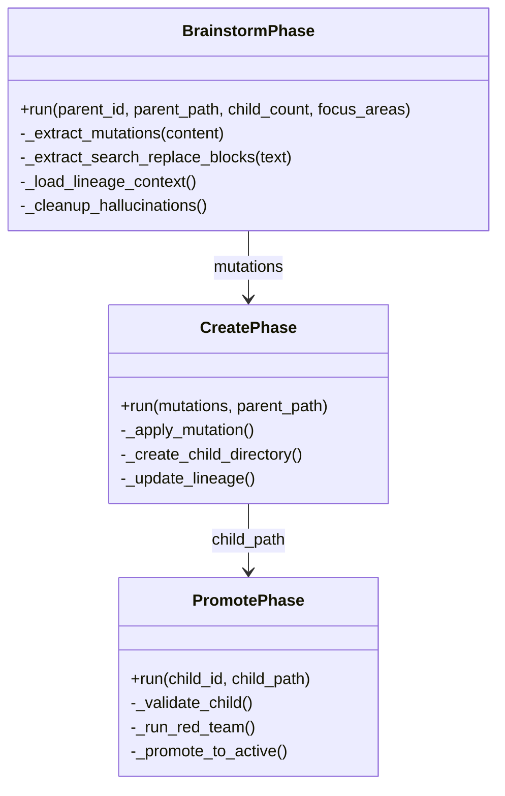

# Evolution Phases


## SYNOPSIS

The **Evolution Phases** implement the agent mutation pipeline for creating specialized NEXUS offspring. This module enables self-improvement through collaborative brainstorming between Gemini and Claude agents.

The pipeline follows: **Brainstorm → Create → Promote**.

---

## COMPONENT MAP (Mermaid)



---

## INTERACTION MATRIX

| Component | Calls (Outbound) | Called By (Inbound) | Data Type Exchanged |
|-----------|------------------|---------------------|---------------------|
| `brainstorm.py` | OrchestratorV7, MutationParser, json_extractor | evolution_manager.py | `BrainstormResult` |
| `create.py` | LineageManager, file system ops | evolution_manager.py | `CreateResult` |
| `promote.py` | RedTeamValidator, LineageManager | evolution_manager.py | `PromoteResult` |

---

## FILE INVENTORY

| File | Lines | Size | Role |
|------|-------|------|------|
| `__init__.py` | 25 | 854B | Phase exports |
| `brainstorm.py` | 457 | 17.3KB | AI-driven mutation proposal |
| `create.py` | 320 | 11.5KB | Child directory creation |
| `promote.py` | 350 | 12.5KB | Red Team validation & promotion |

---

## HIERARCHY

```
core/
└── evolution/
    ├── evolution_manager.py  ← Orchestrates phases
    ├── lineage_manager.py    ← Lineage tracking
    ├── mutation_parser.py    ← Mutation extraction
    └── phases/               ← THIS FOLDER
        ├── brainstorm.py
        ├── create.py
        └── promote.py
```

---

## KEY PATTERNS

- **SEARCH/REPLACE Blocks**: Brainstorm extracts mutations using SEARCH/REPLACE format
- **Subprocess Isolation**: Children run in separate processes for purity
- **Progress Callbacks**: `ProgressCallback = Callable[[str, float], None]`
