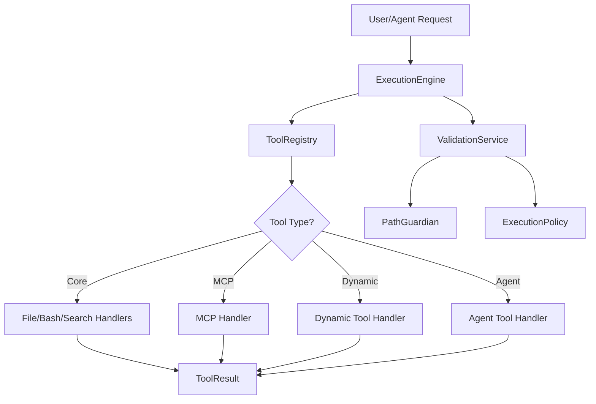

# Execution Module

## Synopsis
The execution module is NEXUS's centralized tool orchestration system. It coordinates tool registration, security validation, and execution across all tool types including core tools (bash, read, write, grep), MCP tools, dynamic runtime-generated tools, and agent-as-tool invocations. Refactored in V9.5 from a monolithic 1848 LOC architecture into modular components with clear separation of concerns.

## Component Map

| File | Purpose | Key Exports |
|------|---------|-------------|
| `__init__.py` | Module exports and version | `ExecutionEngine`, `ToolRegistry`, `ValidationService`, `ToolResult`, `BaseHandler` |
| `execution_engine.py` | Main execution orchestrator | `ExecutionEngine`, `get_execution_engine()` |
| `tool_registry.py` | Tool registration and discovery | `ToolRegistry`, `ToolMetadata`, `get_tool_registry()` |
| `validation_service.py` | Path and security validation | `ValidationService` |
| `tool_manager.py` | Legacy wrapper (V9.6) | `ToolManager`, `ToolResult` |
| `agent_tools.py` | Agent-as-Tool registry (V7.8) | `AgentToolRegistry`, `AgentToolDefinition`, `AgentToolResult` |
| `dynamic_tools.py` | Runtime Python tool generation (V7.8) | `DynamicToolManager`, `ToolCreationResult`, `ToolExecutionResult` |
| `handlers/` | Individual tool handlers | See handlers/README.md |

## Architecture



## Key Interfaces

### ExecutionEngine
Main entry point for tool execution. Coordinates registry, validation, and handler execution.

```python
engine = ExecutionEngine(workspace_path)
result = engine.execute(tool_request)  # Returns ToolResult
```

**Methods:**
- `execute(tool_request)` - Execute a tool request
- `execute_by_name(tool_name, arguments)` - Execute by name and args
- `register_handler(name, handler, category, description)` - Register custom handler
- `has_tool(name)` - Check if tool exists
- `list_tools()` - List all available tools
- `set_evolution_mode(enabled)` - Enable/disable evolution mode
- `get_stats()` - Get execution statistics

### ToolRegistry
Tool registration and name normalization. Handles aliases (Gemini CLI → NEXUS).

```python
registry = ToolRegistry()
registry.register("my_tool", handler_func, category="custom")
handler = registry.get_handler("my_tool")
```

**Tool Categories:**
- `core` - Built-in tools (bash, read, write, grep, etc.)
- `mcp` - MCP server tools
- `dynamic` - Runtime-generated Python tools
- `swarm` - Swarm delegation tools

**Aliases:**
```python
read_file → read
write_file → write
edit_file → edit
list_directory → list_dir
run_shell_command → bash
google_web_search → web_search
```

### ValidationService
Security validation for tool execution. Handles evolution mode restrictions.

```python
validator = ValidationService(workspace_path, parent_path, generation_active)
if validator.is_evolution_safe_read(path):
    # Safe to read during evolution
```

**Evolution Mode Constraints:**
- **Reads allowed**: `../core/`, `../prompts/`, `../benchmarks/`, `../README.md`
- **Lists allowed**: `../core`, `../prompts`, `../benchmarks`
- **Writes allowed**: `../../GENERATION_ACTIVE/**` ONLY
- **Forbidden**: `.env`, `NEXUS_V5_PRAGMATIC`, `.git`, `__pycache__`

### Agent-as-Tool (V7.8 Phase 15)
Exposes spawned agents as callable tools, enabling fractal agent invocation patterns.

```python
registry = AgentToolRegistry(workspace_path, agent_pool, invoker)
registry.refresh()  # Discover spawned agents
result = registry.execute_agent_tool("agent_security_expert", {
    "task": "Analyze this code for SQL injection"
})
```

**Features:**
- Automatic registration of spawned agents as tools
- Tool naming: `agent_{agent_id}`
- Recursive invocation: agents can call other agents
- Integration with Swarm Engine for parallel agent execution

### Dynamic Tools (V7.8 Phase 12.5)
Runtime generation of custom Python tools with AST validation and subprocess isolation.

```python
manager = DynamicToolManager(workspace_path)
result = manager.create_tool(
    name="fibonacci",
    code="def run(n): return [0,1] if n<=2 else ...",
    description="Calculate fibonacci sequence"
)
result = manager.execute_tool("fibonacci", {"n": 10})
```

**Security:**
- AST-based code validation (CodeValidator)
- Subprocess isolation (no direct exec())
- 30-second timeout
- 50KB output limit

## Dependencies

### Internal
- `core.security.PathGuardian` - Path validation
- `core.security.ExecutionPolicy` - Command validation
- `core.security.execution_policy.CodeValidator` - Dynamic code validation
- `core.mcp.MCPRegistry` - MCP server tools
- `core.orchestration.agent_invoker.AgentInvoker` - Agent tool invocation
- `core.swarm.agent_metrics.AgentPool` - Agent profiles
- `core.bootstrap.agent_loader.SpawnedAgentLoader` - Agent configs

### External
- `subprocess` - Dynamic tool execution
- `json` - Tool argument serialization
- `pathlib` - Path operations
- `logging` - Execution logging

## Integration Points

### Used By
- `core.orchestration_v7.Orchestrator` - Main FSM orchestrator
- `core.drivers.gemini_driver.GeminiDriver` - Gemini tool execution
- `core.drivers.claude_driver.ClaudeDriver` - Claude tool execution
- `core.swarm.SwarmEngine` - Swarm mode tool delegation

### Uses
- `handlers/` - Individual tool implementations
- `core.security` - Multi-layer security validation
- `core.mcp` - Model Context Protocol tools
- `core.orchestration.agent_invoker` - Agent-as-tool execution

## Evolution and Multi-Tenancy (V10 PRISM)

All components support tenant-scoped instances via `ServiceFactory`:
```python
# V10: Tenant-scoped access
from core.context import has_active_session
from core.factory import ServiceFactory

if has_active_session():
    engine = ServiceFactory.get_execution_engine()
    registry = ServiceFactory.get_tool_registry()

# Legacy: Global singleton
engine = get_execution_engine(workspace_path)
```

## Statistics Tracking

ExecutionEngine tracks execution metrics:
- `total_executions` - Total tool calls
- `successful` - Successful executions
- `failed` - Failed executions
- `blocked` - Security-blocked executions

Access via `engine.get_stats()`.