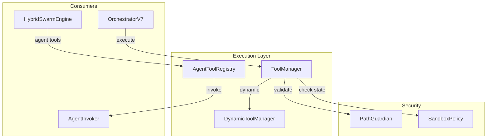

# Module: Execution - Tool Dispatch Layer

**Version**: 8.3.x TRUE HIVE MIND
**Last Updated**: 2025-12-09

---

## Rôle dans l'Architecture NEXUS V8.3.x

Couche d'exécution centralisée des outils NEXUS avec enforcement des politiques de sécurité.

**Principe**: Tous les outils passent par `ToolManager` qui vérifie les permissions avant exécution.

**Nouveauté V8.3.1**: SwarmTool - Swarm comme outil invocable via `swarm_delegate`.

---

## Alignement ROADMAP

| Phase | Impact sur ce module | Status |
|-------|---------------------|--------|
| **Phase 5: Agent Factory** | Outils accessibles aux agents spawnés | ✅ |
| **Phase 7: Session Isolation** | Outils exécutés dans contexte isolé | ✅ |
| **Phase 9: Fast Path** | Bypass ToolManager pour outils read-only | ✅ |
| **Phase 12.5: Dynamic Tools** | Agents peuvent créer leurs propres outils | ✅ |
| **Phase 15: Agent-as-Tool** | Agents spawnés invocables comme outils | ✅ |
| **V8.3.1: SwarmTool** | **[NOUVEAU]** `swarm_delegate` pour invocation Swarm | ✅ |

---

## Composants Principaux

| Fichier | Rôle | Classes/Fonctions clés |
|---------|------|------------------------|
| `tool_manager.py` | Dispatcher central 16+ outils | `ToolManager`, `ToolResult` |
| `dynamic_tools.py` | Création outils à la volée | `DynamicToolManager`, `CodeValidator` |
| `agent_tools.py` | Agents comme outils | `AgentToolRegistry`, `AgentToolDefinition` |
| `__init__.py` | Exports publics | `ToolManager` |

---

## 1. ToolManager (tool_manager.py)

**Classe**: `ToolManager`

Dispatcher central pour les 16+ outils NEXUS (11 core + 4 dynamic + 1 swarm).

### Outils Disponibles

| Outil | Description | Permissions |
|-------|-------------|-------------|
| `read`, `read_file` | Lecture fichier | Toujours autorisé |
| `write`, `write_file` | Écriture fichier | Workspace + Evolution |
| `edit` | Search/Replace texte | Workspace + Evolution |
| `list_dir` | Liste répertoire | Toujours autorisé |
| `glob` | Recherche fichiers par pattern | Toujours autorisé |
| `grep` | Recherche code par regex | Toujours autorisé |
| `bash`, `run_shell_command` | Commandes shell | Restreint (sandbox) |
| `git` | Operations Git (status/diff/log) | Read-only |
| `web_search` | Recherche Google (via Gemini) | Toujours autorisé |
| `web_fetch` | Récupération contenu URL | Toujours autorisé |
| `todo_write` | Gestion liste tâches | Workspace only |
| `create_tool` | Créer outil dynamique | Workspace only |
| `delete_tool` | Supprimer outil dynamique | Workspace only |
| `list_dynamic_tools` | Lister outils créés | Toujours autorisé |
| `run_dynamic_tool` | Exécuter outil dynamique | Workspace only |
| **`swarm_delegate`** | **[V8.3.1]** Déléguer au Swarm | Depth Guard (max 2) |

---

## 2. DynamicToolManager (dynamic_tools.py) - Phase 12.5

Permet aux agents de créer des outils Python à la volée.

### Sécurité
- Code validé via AST analysis
- Exécution subprocess isolée
- Timeout 30 secondes

### Workflow Création

```
Agent Request: create_tool(name, code, description)
     |
     v
CodeValidator.validate_code() [AST Analysis]
     |
     +--[UNSAFE]--> ValidationError
     |
     +--[SAFE]--> workspace/tools/generated/{name}.py
                  {name}.meta.json
```

### Workflow Exécution

```
Agent Request: run_dynamic_tool(name, args)
     |
     v
subprocess.run(python, tool.py, json.dumps(args))
     |
     +--[TIMEOUT 30s]--> TimeoutError
     |
     +--[SUCCESS]--> JSON Output
```

---

## 3. AgentToolRegistry (agent_tools.py) - Phase 15 **[NOUVEAU V7.8]**

**Vision Fractale**: Expose les agents spawnés comme outils invocables.

### Architecture

```
┌──────────────────────────────────────────────────────────────┐
│  Swarm Engine                                                 │
│  ┌─────────────────┐    ┌─────────────────────────────────┐ │
│  │ Task: "Analyze  │───>│ AgentToolRegistry               │ │
│  │ security vulns" │    │ ┌───────────────────────────┐   │ │
│  └─────────────────┘    │ │ agent_security_expert     │   │ │
│                         │ │ agent_code_reviewer       │   │ │
│                         │ │ agent_test_writer         │   │ │
│                         │ └───────────────────────────┘   │ │
│                         └────────────────┬────────────────┘ │
│                                          │                   │
│                                          ▼                   │
│                         ┌─────────────────────────────────┐ │
│                         │ AgentInvoker.invoke_spawned()   │ │
│                         └─────────────────────────────────┘ │
└──────────────────────────────────────────────────────────────┘
```

### Classes

**AgentToolDefinition**
```python
@dataclass
class AgentToolDefinition:
    tool_name: str      # "agent_security_expert"
    agent_id: str       # "security_expert"
    description: str
    capabilities: List[str]
    domains: List[str]
```

**AgentToolRegistry**
```python
class AgentToolRegistry:
    def refresh(self) -> int:
        """Scan workspace/agents/ et enregistre comme outils"""

    def list_agent_tools(self, domain: str = None) -> List[AgentToolDefinition]:
        """Liste les agents disponibles (filtrable par domaine)"""

    def execute_agent_tool(self, agent_id: str, args: Dict) -> Dict:
        """Invoque un agent spawnné avec une tâche"""
```

### Usage

```python
from core.execution.agent_tools import AgentToolRegistry

registry = AgentToolRegistry(workspace_path, agent_pool, invoker)
registry.refresh()  # Découvre agents dans workspace/agents/

# Lister les agents-outils disponibles
tools = registry.list_agent_tools()
# [AgentToolDefinition(tool_name="agent_security_expert", ...)]

# Invoquer un agent comme outil
result = registry.execute_agent_tool("security_expert", {
    "task": "Analyze this code for SQL injection",
    "context": "SELECT * FROM users WHERE id = '" + user_input + "'"
})
```

### Intégration REPL

Lors du `/spawn`, l'agent est automatiquement enregistré:

```python
# Dans repl.py
self.orchestrator.agent_tool_registry.refresh()
```

---

## Intégration Sécurité

```
Agent Request
     |
     v
ToolManager.execute(tool_name, args)
     |
     v
PathGuardian.validate_{read|write}()
     |
     +--[DENY]--> SecurityError
     |
     +--[ALLOW]--> Tool Execution --> Result
```

**Zones de permissions**:
- **Workspace**: `workspace/` - Read/Write
- **Agents**: `workspace/agents/` - Read/Write
- **Evolution**: `GENERATION_ACTIVE/` - Read/Write (mode évolution)
- **Parent**: `core/`, `prompts/` - Read-Only

---

## Interactions et Flux de Données



---

## Mode Evolution

```python
tool_manager.set_evolution_mode(True)
# Write autorisé vers GENERATION_ACTIVE/
# Création d'enfants avec mutations
tool_manager.set_evolution_mode(False)
```

---

## Tests

| Fichier | Tests | Couverture |
|---------|-------|------------|
| `test_tool_manager.py` | 20+ | Permissions, execution |
| `test_dynamic_tools.py` | 52 | AST validation, CRUD, timeout |
| `test_agent_as_tool.py` | 26 | Registry, invocation, concurrence |

```bash
python -m pytest tests/test_tool_manager.py tests/test_dynamic_tools.py tests/test_agent_as_tool.py -v
```

---

## Notes d'Audit Local

### [V7.8] Nouveautés Phase 15
- `agent_tools.py` ajouté (510 lignes)
- `AgentToolRegistry` pour exposition agents comme outils
- Intégration automatique sur `/spawn`
- 26 tests unitaires

### Points d'attention
- **AGENT_TOOL_PREFIX = "agent_"** : Naming convention
- **DEFAULT_TIMEOUT = 120s** : Timeout invocation agent
- **Thread-safe** : Concurrent execution supportée

---

---

## 4. SwarmTool (V8.3.1) - swarm_delegate

**Nouveauté V8.3.1**: Permet aux agents d'invoquer le Swarm Engine à n'importe quelle phase HiveMind.

### Architecture

```
Agent → ToolManager.execute("swarm_delegate") → SwarmBridge.delegate() → HybridSwarmEngine
```

### Paramètres

| Paramètre | Type | Description |
|-----------|------|-------------|
| `task` | str | Sous-tâche à déléguer (obligatoire) |
| `mode` | str | Mode de collaboration (parallel, sequential, etc.) |
| `phase` | str | Phase HiveMind pour validation guardrails (optionnel) |
| `context_categories` | List[str] | Catégories de contexte à inclure (optionnel) |

### Exemple

```python
# Via ToolManager
result = tool_manager.execute(ToolUse(
    tool_name="swarm_delegate",
    arguments={
        "task": "Run security review on auth module",
        "mode": "red_blue",
        "phase": "diagnosis"
    }
))
```

### Depth Guard (Anti-Recursion)

Prévient la "Inception Trap":

```
MAX_SWARM_DEPTH = 2

Swarm → swarm_delegate → Swarm (depth=1)
                      → swarm_delegate → Swarm (depth=2) ✅
                                      → swarm_delegate → BLOCKED ❌
```

### Attribut SwarmBridge

`ToolManager.swarm_bridge` doit être configuré par l'orchestrateur:

```python
tool_manager = ToolManager(workspace_path)
tool_manager.swarm_bridge = SwarmBridge(swarm_engine, context_manager)
```

---

## Voir Aussi

- [core/orchestration/README.md](../orchestration/README.md) - Intègre AgentToolRegistry
- [core/swarm/README.md](../swarm/README.md) - Utilise agents comme outils
- [core/hive_mind/README.md](../hive_mind/README.md) - SwarmBridge documentation
- [core/security/README.md](../security/README.md) - PathGuardian & policies
