# execution

NEXUS V9.5 Execution Module

Refactored from monolithic tool_manager.py (1848 LOC).

Modules:
- tool_registry: Tool registration and discovery
- validation_service: Path and security validation
- execution_engine: Centralized tool execution
- handlers/: Individual tool handlers

Usage:
    from core.execution import ExecutionEngine, ToolResult
    engine = ExecutionEngine(workspace_path)
    result = engine.execute(tool_request)

## Overview

| Metric | Value |
|--------|-------|
| **Path** | `C:\Code\NEXUS\NEXUS-N7A\core\execution` |
| **Modules** | 7 |
| **Total Lines** | 2379 |
| **Classes** | 12 |
| **Functions** | 7 |

## Architecture

```mermaid
classDiagram
    class AgentToolDefinition {
        +str tool_name
        +str agent_id
        +str description
        +List[str] capabilities
        +List[str] domains
        +to_dict(self) Dict[str, Any]
    }
    class AgentToolResult {
        +bool success
        +str agent_id
        +str output
        +Optional[str] error
        +float duration_seconds
        +to_dict(self) Dict[str, Any]
    }
    class AgentToolRegistry {
        +workspace_path
        +agents_dir
        -_agent_pool
        -_agent_invoker
        -_agent_loader
        -_logger
        -__init__(self, workspace_path: Path, agent_pool: Optional['AgentPool']=..., agent_invoker: Optional['AgentInvoker']=..., agent_loader: Optional['SpawnedAgentLoader']=...)
        +set_dependencies(self, agent_pool: 'AgentPool', agent_invoker: 'AgentInvoker', agent_loader: 'SpawnedAgentLoader') None
        +refresh(self) int
        -_create_tool_definition(self, agent_profile: 'AgentProfile') AgentToolDefinition
        +list_agent_tools(self) List[AgentToolDefinition]
        +get_tool_definition(self, tool_name: str) Optional[AgentToolDefinition]
        +is_agent_tool(self, tool_name: str) bool
        +execute_agent_tool(self, tool_name: str, args: Dict[str, Any]) AgentToolResult
        +create_tool_handler(self, tool_name: str) Callable[..., 'ToolResult']
        +register_with_tool_manager(self, tool_manager: 'ToolManager') int
        +get_tools_for_domain(self, domain: str) List[AgentToolDefinition]
        +get_summary(self) Dict[str, Any]
    }
    class ToolCreationResult {
        +bool success
        +str tool_name
        +Optional[Path] tool_path
        +Optional[str] error
        +List[str] validation_violations
    }
    class ToolExecutionResult {
        +bool success
        +str output
        +str error
        +int return_code
        +bool timed_out
    }
    class ToolMetadata {
        +str name
        +str description
        +str created_at
        +str created_by
        +int version
    }
    class DynamicToolManager {
        +workspace_path
        +tools_dir
        -_validator
        -_logger
        -__init__(self, workspace_path: Path)
        -_load_existing_tools(self) None
        +create_tool(self, name: str, code: str, description: str=...) ToolCreationResult
        +execute_tool(self, name: str, args: Optional[Dict[str, Any]]=...) ToolExecutionResult
        +delete_tool(self, name: str) Tuple[bool, str]
        +list_tools(self) List[ToolMetadata]
        +get_tool_info(self, name: str) Optional[ToolMetadata]
        +cleanup_all(self) int
        -_validate_tool_name(self, name: str) bool
        -_has_run_function(self, code: str) bool
    }
    class ExecutionEngine {
        +workspace_path
        +registry
        +validation_service
        -_stats
        -__init__(self, workspace_path: Path, registry: Optional[ToolRegistry]=..., validation_service: Optional[ValidationService]=...)
        -_initialize_handlers(self) None
        +execute(self, tool_request: Any) ToolResult
        +execute_by_name(self, tool_name: str, arguments: Dict[str, Any]) ToolResult
        +register_handler(self, name: str, handler: Callable[..., ToolResult], category: str=..., description: str=...) None
        +has_tool(self, name: str) bool
        +list_tools(self) list[str]
        +set_evolution_mode(self, enabled: bool) None
        +get_stats(self) Dict[str, int]
        +reset_stats(self) None
    }
    class ToolManager {
        +TOOL_ALIASES
        +workspace_path
        +evolution_mode
        +parent_path
        +project_root
        +generation_active
        +path_guardian
        +execution_policy
        -_logger
        -_handlers
        -__init__(self, workspace_path: Path)
        +swarm_bridge(self) Optional[Any]
        +swarm_bridge(self, bridge: Any) None
        +execute(self, tool_request) ToolResult
        -_is_evolution_safe_read(self, path: Path) bool
        -_is_evolution_safe_list(self, path: Path) bool
        -_is_evolution_safe_write(self, path: Path) bool
        -_init_mcp_tools(self) None
        -_register_mcp_server_tools(self, server_name: str) None
        -_create_mcp_tool_handler(self, server_name: str, tool_name: str) Callable[..., ToolResult]
        -_execute_mcp_tool(self, server_name: str, tool_name: str, args: Dict) ToolResult
        +get_mcp_tools(self) List[str]
        +reload_mcp_tools(self) int
        +close_mcp(self) None
        -_init_dynamic_tools(self) None
        +get_dynamic_tools(self) List[str]
    }
    class ToolMetadata {
        +str name
        +str description
        +Dict[str, Any] schema
        +str category
        +bool enabled
        +List[str] aliases
    }
    class ToolRegistry {
        +Dict[str, str] TOOL_ALIASES
        +Set[str] CORE_TOOLS
        -__init__(self)
        +normalize_name(self, tool_name: str) str
        +register(self, name: str, handler: Callable, description: str=..., schema: Optional[Dict[str, Any]]=..., category: str=..., aliases: Optional[List[str]]=...) None
        +unregister(self, name: str) bool
        +get_handler(self, name: str) Optional[Callable]
        +has_tool(self, name: str) bool
        +get_metadata(self, name: str) Optional[ToolMetadata]
        +list_tools(self, category: Optional[str]=...) List[str]
        +list_core_tools(self) List[str]
        +list_mcp_tools(self) List[str]
        +list_dynamic_tools(self) List[str]
        +register_mcp_tool(self, name: str, handler: Callable, server_name: str, description: str=...) None
        +get_mcp_server(self, tool_name: str) Optional[str]
        +register_dynamic_tool(self, name: str, handler: Callable, description: str=..., schema: Optional[Dict[str, Any]]=...) None
        +is_dynamic_tool(self, name: str) bool
        +get_all_aliases(self) Dict[str, str]
        +to_dict(self) Dict[str, Any]
    }
    class ValidationService {
        +workspace_path
        +parent_path
        +generation_active
        +path_guardian
        +execution_policy
        +evolution_mode
        -_forbidden_patterns
        -_evolution_read_prefixes
        -_evolution_root_files
        -_evolution_list_prefixes
        -__init__(self, workspace_path: Path, parent_path: Optional[Path]=..., generation_active: Optional[Path]=...)
        +is_evolution_safe_read(self, path: Path) bool
        +is_evolution_safe_list(self, path: Path) bool
        +is_evolution_safe_write(self, path: Path) bool
        +validate_path(self, path: Path, operation: OperationType, allow_parent_read: bool=...) bool
        +validate_command(self, command: str) tuple[bool, Optional[str]]
        +set_evolution_mode(self, enabled: bool) None
    }
```

## Modules

| Module | Description | Classes | Functions |
|--------|-------------|---------|-----------|
| [agent_tools](agent_tools.py) | NEXUS V7.8 - Agent-as-Tool Registry (Phase 15: Vision Fractale) | 3 | 1 |
| [dynamic_tools](dynamic_tools.py) | NEXUS V7.8 - Dynamic Tool Manager (Phase 12.5) | 4 | 2 |
| [execution_engine](execution_engine.py) | ExecutionEngine - Centralized Tool Execution Orchestrator. | 1 | 2 |
| [tool_manager](tool_manager.py) | Tool Manager V9.6 - Thin Wrapper over Handler Registry | 1 | 0 |
| [tool_registry](tool_registry.py) | ToolRegistry - Tool Registration and Discovery. | 2 | 2 |
| [validation_service](validation_service.py) | ValidationService - Path and Security Validation for Tool Execution. | 1 | 0 |

## Subpackages

| Package | Description | Modules |
|---------|-------------|---------|
| [handlers/](C:\Code\NEXUS\NEXUS-N7A\core\execution\handlers/README.md) |  | 0 |

## Aggregated Statistics

---
*Auto-generated by nexus-doc-generator 1.0.0 - 2025-12-16 19:13*