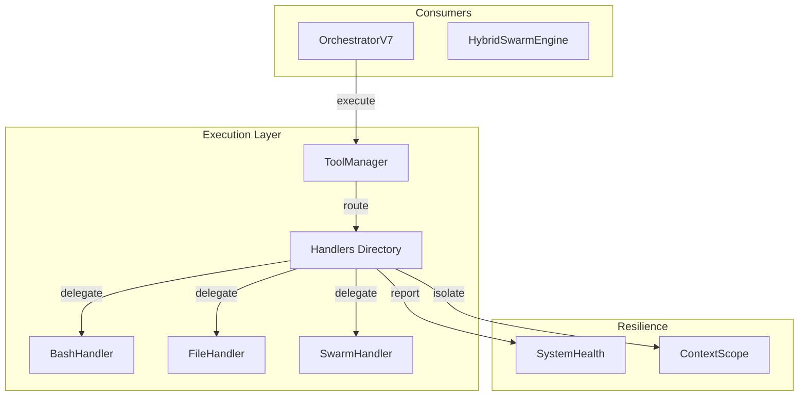

# Module: Execution - Modular Tool Dispatch Layer

**Version**: 9.6 Sprint 5.3
**Last Updated**: 2025-12-13

---

## Rôle dans l'Architecture NEXUS V9.6

Couche d'exécution modulaire des outils NEXUS avec enforcement des politiques de sécurité et monitoring unifié.

**Refactoring V9.6**: `ToolManager` agit maintenant comme un routeur vers des **Handlers spécialisés** (`core/execution/handlers/`).

---

## Architecture Modulaire (Handlers)

L'exécution est déléguée à des handlers spécialisés pour réduire la complexité du `ToolManager`.

```
ToolManager (Router)
    │
    ├── BashHandler (bash, run_shell_command)
    ├── FileHandler (read, write, edit, list_dir)
    ├── GitHandler (git)
    ├── SearchHandler (grep, glob)
    ├── WebHandler (web_search, web_fetch)
    ├── SwarmHandler (swarm_delegate)
    ├── DynamicToolsHandler (create_tool, run_dynamic_tool)
    └── AgentToolHandler (agent_tools)
```

---

## Composants Principaux

| Fichier | Rôle | Classes/Fonctions clés |
|---------|------|------------------------|
| `tool_manager.py` | Routeur central | `ToolManager` |
| `handlers/` | Répertoire des handlers | `BaseHandler` |
| `handlers/bash_handler.py` | Exécution Shell | `BashHandler` |
| `handlers/file_handlers.py` | Opérations Fichiers | `FileHandler` |
| `handlers/swarm_handler.py` | Invocation Swarm | `SwarmHandler` |
| `dynamic_tools.py` | Création outils à la volée | `DynamicToolManager` |

---

## 1. ToolManager (tool_manager.py)

**Classe**: `ToolManager`

Routeur central qui:
1. Reçoit la requête `ToolUse`
2. Identifie le handler approprié via `TOOL_HANDLERS_MAP`
3. Délègue l'exécution
4. Retourne le `ToolResult` standardisé

### Outils & Handlers

| Outil | Handler | Permissions |
|-------|---------|-------------|
| `read`, `read_file` | `FileHandler` | Toujours autorisé |
| `write`, `write_file` | `FileHandler` | Workspace + Evolution |
| `edit` | `FileHandler` | Workspace + Evolution |
| `list_dir` | `FileHandler` | Toujours autorisé |
| `glob` | `SearchHandler` | Toujours autorisé |
| `grep` | `SearchHandler` | Toujours autorisé |
| `bash`, `run_shell_command` | `BashHandler` | Restreint (sandbox) |
| `git` | `GitHandler` | Read-only |
| `web_search` | `WebHandler` | Toujours autorisé |
| `web_fetch` | `WebHandler` | Toujours autorisé |
| `swarm_delegate` | `SwarmHandler` | Depth Guard (max 2) |

---

## 2. System Resilience (SystemHealth)

**Nouveauté V9.5**: Intégration avec `core/resilience/system_health.py`.

- **Monitoring**: Chaque handler rapporte son état de santé.
- **ContextScope**: Isolation des contextes d'exécution pour éviter les fuites.
- **CircuitBreaker**: Protection contre les pannes en cascade (Web, Swarm).

---

## 3. Dynamic Tools & Agents

Le support pour les outils dynamiques et les agents-as-tools est maintenu via des handlers dédiés:

- **DynamicToolsHandler**: Gère `create_tool`, `run_dynamic_tool`.
- **AgentToolHandler**: Gère l'invocation des agents via `AgentToolRegistry`.

---

## Interactions et Flux de Données



---

## Tests

Les tests ont été mis à jour pour refléter la nouvelle structure:

```bash
python -m pytest tests/test_tool_manager.py tests/test_handlers/ -v
```

---

## Voir Aussi

- [core/orchestration/README.md](../orchestration/README.md)
- [core/resilience/README.md](../resilience/README.md) (si disponible)