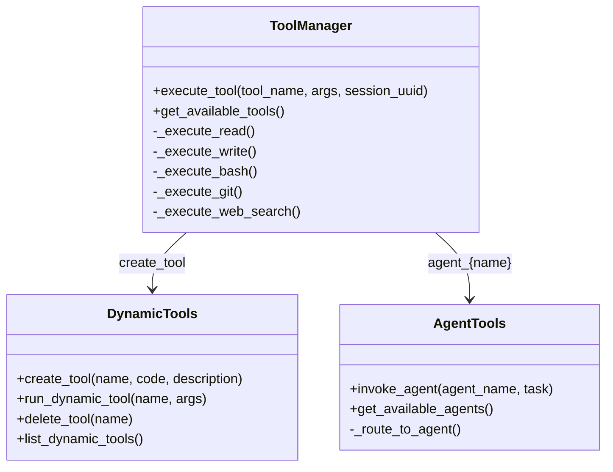

# Execution Module


## SYNOPSIS

The **Execution** module provides tool execution capabilities for agents. It includes the core tool manager (16+ built-in tools), dynamic tool creation, and agent-as-tool invocation.

This is the **action layer** of NEXUS.

---

## COMPONENT MAP (Mermaid)



---

## INTERACTION MATRIX

| Component | Calls (Outbound) | Called By (Inbound) | Data Type Exchanged |
|-----------|------------------|---------------------|---------------------|
| `tool_manager.py` | File system, subprocess, web APIs | Drivers, HiveMind phases | `ToolResult` |
| `dynamic_tools.py` | AST, subprocess | tool_manager | `DynamicToolResult` |
| `agent_tools.py` | Orchestrator, workspace/agents/ | tool_manager | `AgentResponse` |

---

## BUILT-IN TOOLS (16+)

| Category | Tools |
|----------|-------|
| **Files** | `read`, `write`, `edit`, `list_dir` |
| **Search** | `glob`, `grep`, `web_search`, `web_fetch` |
| **Execution** | `bash`, `git` |
| **Planning** | `todo_write` |
| **Dynamic** | `create_tool`, `run_dynamic_tool`, `delete_tool`, `list_dynamic_tools` |
| **Agents** | `agent_{name}` (for each spawned agent) |
| **Swarm** | `swarm_delegate` |

---

## FILE INVENTORY

| File | Lines | Size | Role |
|------|-------|------|------|
| `tool_manager.py` | 1740 | 63.6KB | Main tool execution |
| `dynamic_tools.py` | 420 | 15.1KB | Runtime tool creation |
| `agent_tools.py` | 510 | 18.7KB | Agent invocation |
| `__init__.py` | 5 | 32B | Exports |

---

## HIERARCHY

```
core/
└── execution/              ← THIS FOLDER
    ├── tool_manager.py     ← Main (63KB, largest file!)
    ├── dynamic_tools.py    ← Runtime tools
    └── agent_tools.py      ← Agent-as-tool
```

---

## KEY PATTERNS

- **Session Isolation**: All tools receive `session_uuid` for V10
- **Sandbox Policy**: `bash` restricted via ExecutionPolicy
- **AST Validation**: Dynamic tools validated before execution
