# handlers

Tool Handlers - NEXUS V9.6 Sprint 5.2b

Extracted from tool_manager.py for Single Responsibility.
Each handler focuses on one category of tools.

Modules:
- base: BaseHandler protocol and ToolResult
- bash_handler: bash command execution
- file_handlers: read, write, edit, list_dir
- search_handlers: glob, grep
- git_handler: git operations
- web_handlers: web_search, web_fetch
- todo_handler: todo_write
- dynamic_tools_handler: create, delete, list, run dynamic tools
- mcp_handler: MCP server tools
- swarm_handler: swarm delegation

## Overview

| Metric | Value |
|--------|-------|
| **Path** | `C:\Code\NEXUS\NEXUS-N7A\core\execution\handlers` |
| **Modules** | 11 |
| **Total Lines** | 2256 |
| **Classes** | 21 |
| **Functions** | 11 |

## Architecture

```mermaid
classDiagram
    class ToolResult {
        +str tool_name
        +str status
        +str output
        +str error
        +to_dict(self) Dict[str, Any]
        +success(self) bool
        +failed(self) bool
        +ok(cls, tool_name: str, output: str) 'ToolResult'
        +fail(cls, tool_name: str, error: str, output: str=...) 'ToolResult'
        +make_error(cls, tool_name: str, error_msg: str) 'ToolResult'
    }
    class HandlerProtocol {
        +execute(self, args: Dict[str, Any]) ToolResult
    }
    Protocol <|-- HandlerProtocol
    class BaseHandler {
        +workspace_path
        +validation_service
        -_logger
        -__init__(self, workspace_path: Path, validation_service: Any=...)
        +tool_name(self) str
        +execute(self, args: Dict[str, Any]) ToolResult
        -_resolve_path(self, path_str: str) Path
        -_validate_path(self, path: Path, operation: str=...) bool
        -_validate_path_str(self, path_str: str, operation: str=...) bool
        -_ok(self, output: str) ToolResult
        -_fail(self, error: str, output: str=...) ToolResult
        -_error(self, error: str) ToolResult
    }
    class BashHandler {
        +execution_policy
        +timeout
        -__init__(self, workspace_path: Path, validation_service: Optional[Any]=..., execution_policy: Optional[ExecutionPolicy]=..., timeout: float=...)
        +tool_name(self) str
        +execute(self, args: Dict[str, Any]) ToolResult
        -_execute_simple(self, executable: str, arguments: list[str]) subprocess.CompletedProcess
        -_execute_complex(self, command: str) subprocess.CompletedProcess
    }
    BaseHandler <|-- BashHandler
    class DynamicToolsHandlerBase {
        -_dynamic_tool_manager
        -__init__(self, workspace_path: Path, validation_service: Any=..., dynamic_tool_manager: Optional[Any]=...)
        -_get_manager(self) Optional[Any]
        -_manager_not_available(self) ToolResult
    }
    BaseHandler <|-- DynamicToolsHandlerBase
    class CreateToolHandler {
        +tool_name(self) str
        +execute(self, args: Dict[str, Any]) ToolResult
    }
    DynamicToolsHandlerBase <|-- CreateToolHandler
    class DeleteToolHandler {
        +tool_name(self) str
        +execute(self, args: Dict[str, Any]) ToolResult
    }
    DynamicToolsHandlerBase <|-- DeleteToolHandler
    class ListDynamicToolsHandler {
        +tool_name(self) str
        +execute(self, args: Dict[str, Any]) ToolResult
    }
    DynamicToolsHandlerBase <|-- ListDynamicToolsHandler
    class RunDynamicToolHandler {
        +tool_name(self) str
        +execute(self, args: Dict[str, Any]) ToolResult
    }
    DynamicToolsHandlerBase <|-- RunDynamicToolHandler
    class ReadHandler {
        +tool_name(self) str
        +execute(self, args: Dict[str, Any]) ToolResult
    }
    BaseHandler <|-- ReadHandler
    class WriteHandler {
        +tool_name(self) str
        +execute(self, args: Dict[str, Any]) ToolResult
    }
    BaseHandler <|-- WriteHandler
    class EditHandler {
        +tool_name(self) str
        +execute(self, args: Dict[str, Any]) ToolResult
    }
    BaseHandler <|-- EditHandler
    class ListDirHandler {
        +tool_name(self) str
        +execute(self, args: Dict[str, Any]) ToolResult
    }
    BaseHandler <|-- ListDirHandler
    class GitHandler {
        +SAFE_OPS
        +BLOCKED_OPS
        +tool_name(self) str
        +execute(self, args: Dict[str, Any]) ToolResult
    }
    BaseHandler <|-- GitHandler
    class MCPToolHandler {
        -_mcp_registry
        -_server_name
        -_mcp_tool_name
        -__init__(self, workspace_path: Path, validation_service: Any=..., mcp_registry: Optional[Any]=..., server_name: str=..., mcp_tool_name: str=...)
        +tool_name(self) str
        +execute(self, args: Dict[str, Any]) ToolResult
    }
    BaseHandler <|-- MCPToolHandler
```

## Modules

| Module | Description | Classes | Functions |
|--------|-------------|---------|-----------|
| [base](base.py) | Base Handler - Foundation for all tool handlers. | 3 | 0 |
| [bash_handler](bash_handler.py) | Bash Handler - Shell command execution with security hardening. | 1 | 1 |
| [dynamic_tools_handler](dynamic_tools_handler.py) | Dynamic Tools Handler - Create, delete, list, run dynamic Python tools. | 5 | 1 |
| [file_handlers](file_handlers.py) | File Handlers - read, write, edit, list_dir. | 4 | 1 |
| [git_handler](git_handler.py) | Git Handler - Execute git operations. | 1 | 1 |
| [mcp_handler](mcp_handler.py) | MCP Handler - Execute Model Context Protocol tools. | 1 | 2 |
| [search_handlers](search_handlers.py) | Search Handlers - glob and grep. | 2 | 1 |
| [swarm_handler](swarm_handler.py) | Swarm Handler - Delegate subtasks to Swarm Engine. | 1 | 1 |
| [todo_handler](todo_handler.py) | Todo Handler - Task/plan management. | 1 | 1 |
| [web_handlers](web_handlers.py) | Web Handlers - Web search and fetch operations. | 2 | 1 |

---
*Auto-generated by nexus-doc-generator 1.0.0 - 2025-12-16 19:13*