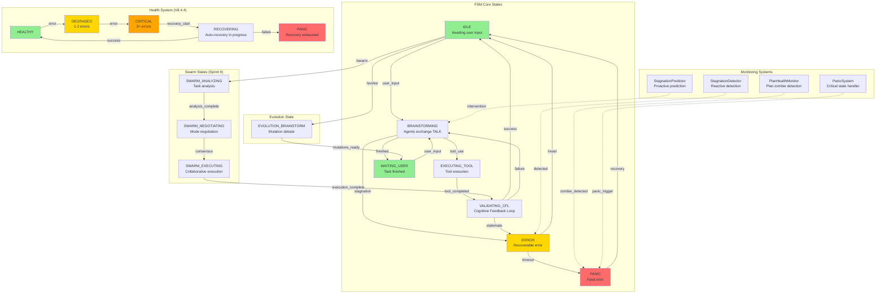

# core/fsm - Finite State Machine Module

**NEXUS V7/V8 - État machine orchestration layer**

---

## SYNOPSIS

**Entrée:** User input + Current orchestrator state
**Traitement:** FSM state transitions, health monitoring, stagnation detection
**Sortie:** Next state + Actions + Recovery strategies

Le module FSM fournit la couche d'orchestration de bas niveau pour NEXUS, gérant les transitions d'état, la détection de stagnation, et les stratégies de récupération automatique.

---

## LOCAL MAP



---

## INTERACTION MATRIX

### Core FSM Components

| Component | Role | Interacts With | Data Flow |
|-----------|------|----------------|-----------|
| **OrchestratorState** | State enum (11 states) | orchestration_v7.py | State transitions via TRANSITION_MATRIX |
| **TransitionGuard** | Validation rules | orchestration_v7.py | Guards for state transitions |
| **TaskExecutionContext** | Immutable task context | All modules | Thread-safe agent attribution |

### Health & Recovery Systems (V8.4.4)

| Component | Role | Interacts With | Data Flow |
|-----------|------|----------------|-----------|
| **HealthStateMachine** | Auto-recovery FSM | orchestration_v7.py | Error count → Recovery strategies |
| **RecoveryStrategy** | Recovery action | HealthStateMachine | Action execution → Success/Failure |
| **PanicSystem** | Critical state handler | orchestration_v7.py | Panic triggers → Escalation |

### Monitoring Systems

| Component | Role | Interacts With | Data Flow |
|-----------|------|----------------|-----------|
| **StagnationDetector** | Reactive stagnation | orchestration_v7.py | Message similarity → Warning injection |
| **StagnationPredictor** | Proactive prediction | orchestration_v7.py | Leading indicators → Nudge/Intervene |
| **PlanHealthMonitor** | Plan zombie detection | orchestration_v7.py | Plan state → Health status |

### External Interactions

```
orchestration_v7.py
    ├─> OrchestratorState (read current state)
    ├─> TransitionGuard (validate transitions)
    ├─> TaskExecutionContext (create/pass context)
    ├─> HealthStateMachine (record errors, attempt recovery)
    ├─> StagnationDetector (add messages, check stagnation)
    ├─> StagnationPredictor (predict, get nudges)
    ├─> PlanHealthMonitor (check plan health)
    └─> PanicSystem (trigger panic, check status)

hive_mind/
    ├─> OrchestratorState (HiveMind states extend FSM states)
    └─> TaskExecutionContext (HiveMind session context)

swarm/
    ├─> OrchestratorState (SWARM_* states)
    └─> TaskExecutionContext (Swarm execution context)

evolution/
    ├─> OrchestratorState (EVOLUTION_BRAINSTORM)
    └─> TaskExecutionContext (Evolution session)
```

---

## PARENT LINK

**Module parent:** [core/](../README.md)
**Orchestration:** [core/orchestration_v7.py](../orchestration_v7.py)
**Related modules:**
- [core/hive_mind/](../hive_mind/README.md) - High-level HiveMind pipeline (24 states)
- [core/swarm/](../swarm/README.md) - Hybrid Swarm Engine (6 collaboration modes)
- [core/drivers/](../drivers/README.md) - Agent drivers (Gemini/Claude)

---

## ARCHITECTURE

### State Machine Design

NEXUS utilizes a **hierarchical FSM** architecture:

1. **Low-Level FSM** (this module): 11 core states for basic orchestration
2. **High-Level HiveMind** (core/hive_mind): 24 states for complex task pipelines
3. **Swarm FSM** (core/swarm): 6 collaboration modes with negotiation

### State Hierarchy

```
OrchestratorState (11 states)
├─ Core Flow: IDLE → BRAINSTORMING → EXECUTING_TOOL → VALIDATING_CFL
├─ Completion: WAITING_USER
├─ Error Handling: ERROR → PANIC
├─ Swarm Extension: SWARM_ANALYZING → SWARM_NEGOTIATING → SWARM_EXECUTING
└─ Evolution: EVOLUTION_BRAINSTORM

HealthState (5 states)
└─ HEALTHY → DEGRADED → CRITICAL → RECOVERING → PANIC
```

### Immutability Pattern

**TaskExecutionContext** uses immutability for thread-safety:

```python
# Create context
context = TaskExecutionContext.create("Analyze codebase")

# Immutable updates
new_context = context.with_agent("Claude")
next_context = context.next_iteration()
swapped = context.swap_agent()

# Thread-safe PARALLEL mode
# Each thread has its own context instance
```

---

## COMPONENTS

### 1. states.py

**Purpose:** Core FSM states and transition matrix

**Exports:**
- `OrchestratorState` - Enum of 11 states
- `TransitionGuard` - Validation rules for transitions
- `TRANSITION_MATRIX` - Valid state transitions

**States:**
- `IDLE` - Awaiting user input
- `BRAINSTORMING` - Agents exchange TALK messages
- `EXECUTING_TOOL` - Synchronous tool execution
- `VALIDATING_CFL` - Cognitive Feedback Loop validation
- `EVOLUTION_BRAINSTORM` - Mutation design debate (30 turns max)
- `WAITING_USER` - Task finished, awaiting input
- `ERROR` - Recoverable error (use /reset)
- `PANIC` - Fatal error (restart required)
- `SWARM_ANALYZING` - Swarm task analysis
- `SWARM_NEGOTIATING` - Swarm mode negotiation
- `SWARM_EXECUTING` - Swarm collaborative execution

**Transition Guards:**
```python
TransitionGuard.can_start_brainstorming(user_input: str) -> bool
TransitionGuard.can_execute_tool(message: dict) -> bool
TransitionGuard.is_task_finished(message: dict) -> bool
TransitionGuard.should_switch_agent(message: dict, current_agent: str) -> bool
TransitionGuard.is_brainstorm_message(message: dict) -> bool
```

---

### 2. context.py

**Purpose:** Immutable task execution context (V7.5)

**Problem Solved:** Global `self.active_agent` caused race conditions in PARALLEL mode

**Solution:** Each task gets isolated, immutable context

**Class:** `TaskExecutionContext`

**Fields:**
- `task_id: str` - Unique UUID per task
- `current_agent: str` - Current active agent
- `objective: str` - Task description
- `iteration: int` - Current iteration count
- `tool_requesting_agent: Optional[str]` - Agent that requested tool
- `validation_agent: Optional[str]` - Agent validating result

**Methods:**
```python
# Factory
TaskExecutionContext.create(objective, initial_agent="Gemini")

# Immutable updates
.with_agent(agent: str) -> TaskExecutionContext
.with_iteration(iteration: int) -> TaskExecutionContext
.with_tool_request(agent: str) -> TaskExecutionContext
.with_validation(agent: str) -> TaskExecutionContext
.swap_agent() -> TaskExecutionContext  # Gemini ↔ Claude
.next_iteration() -> TaskExecutionContext  # iteration++
```

**Usage:**
```python
# Create context for new task
context = TaskExecutionContext.create("Fix bug in auth.py")

# Pass through orchestrator methods
result = orchestrator._invoke_agent(context, task_type="reasoning")

# Switch agent immutably
new_context = context.with_agent("Claude")

# Thread-safe PARALLEL mode
gemini_ctx = context.with_agent("Gemini")
claude_ctx = context.with_agent("Claude")
# Both can execute simultaneously
```

---

### 3. health_state_machine.py

**Purpose:** Auto-recovery FSM with health monitoring (V8.4.4)

**Problem Solved:** System entered PANIC too quickly without trying recovery

**Solution:** 5-state health FSM with automatic recovery strategies

**Class:** `HealthStateMachine`

**States:**
- `HEALTHY` - Normal operation
- `DEGRADED` - 1-2 errors, monitoring
- `CRITICAL` - 3+ errors, attempting recovery
- `RECOVERING` - Recovery in progress
- `PANIC` - All recovery failed, escalate to user

**Recovery Strategies (executed in sequence):**
1. **reset_stagnation** - Clear stagnation detector
2. **switch_agent** - Swap Gemini ↔ Claude
3. **compress_context** - Reduce context window
4. **clear_tool_cache** - Clear tool execution cache
5. **rollback_phase** - Rollback via SagaManager (if available)

**Usage:**
```python
# Initialize with orchestrator
health = HealthStateMachine(orchestrator)

# Register custom recovery strategy
health.add_strategy(RecoveryStrategy(
    name="custom_fix",
    description="Custom recovery logic",
    action=my_recovery_function,
    cooldown_seconds=60.0,
    max_attempts=3
))

# Record errors
await health.record_error("TOOL_FAILURE", "grep failed")
# Auto-recovery triggered if CRITICAL

# Record successes
health.record_success()  # Improves health

# Check state
if health.state == HealthState.PANIC:
    # Escalate to user
    ...

# Manual reset
health.reset()
```

**State Transitions:**
```
HEALTHY --[error]--> DEGRADED --[error]--> CRITICAL
DEGRADED --[success]--> HEALTHY
CRITICAL --[recovery_start]--> RECOVERING
RECOVERING --[recovery_success]--> HEALTHY
RECOVERING --[recovery_failed]--> CRITICAL
RECOVERING --[panic]--> PANIC
PANIC --[reset]--> HEALTHY (manual only)
```

**Features:**
- **Cooldown** - Strategies have cooldown periods (e.g., 30s)
- **Max Attempts** - Limit retry count per strategy
- **History** - Full state transition history for debugging
- **Callbacks** - Register callbacks on state changes
- **Status** - Get detailed health status dict

---

### 4. panic_system.py

**Purpose:** Panic state handler with logging

**Panic Triggers:**
- **STALEMATE** - Max stalemate counter reached (default: 5)
- **CONSECUTIVE_ERRORS** - 3+ consecutive errors
- **INFINITE_LOOP** - Detected infinite loop
- **ZOMBIE_PLAN** - Plan completely dead (all PENDING)

**Class:** `PanicSystem`

**Methods:**
```python
# Initialize
panic = PanicSystem(workspace_path, max_stalemate=5)

# Stalemate detection
if panic.check_stalemate():
    # Panic triggered
    ...
panic.reset_stalemate()  # Reset on progress

# Error recording
if panic.record_error("TOOL_FAILURE", "grep crashed"):
    # Panic triggered after 3 errors
    ...
panic.reset_errors()  # Reset on success

# Explicit panic
panic.trigger_panic_explicit("INFINITE_LOOP", "Detected 10 identical cycles")

# Check state
if panic.is_panicked():
    info = panic.get_panic_info()
    # {"timestamp": "...", "reason": "...", "details": "..."}

# Recovery
panic.clear_panic()

# Status
status = panic.get_status()
# {"is_panicked": bool, "panic_reason": str, ...}
```

**Panic Files:**
- `workspace/.nexus/panic/panic.json` - Current panic state
- `workspace/.nexus/panic/panic_history.jsonl` - Panic event log

---

### 5. stagnation_detector.py

**Purpose:** Reactive stagnation detection via message similarity

**Problem:** Agents discuss in loops without taking action

**Solution:** Detect when last 3 messages are 80%+ similar

**Class:** `StagnationDetector`

**Algorithm:**
1. Store last N messages (default: 3)
2. Normalize (lowercase, strip)
3. Compute pairwise similarity (difflib.SequenceMatcher)
4. If 2+ pairs > 80% similar → stagnation

**Usage:**
```python
# Initialize
detector = StagnationDetector(
    similarity_threshold=0.8,
    window_size=3
)

# Add messages
detector.add_message("Je pense qu'on devrait lire auth.py")
detector.add_message("Oui, lisons auth.py d'abord")
detector.add_message("D'accord, lire auth.py")

# Check stagnation
if detector.is_stagnant():
    # Inject warning
    warning = detector.get_stagnation_message()
    # Forces agents to take action

# Reset
detector.reset()

# Statistics
stats = detector.get_stats()
# {"message_count": 3, "similarity_scores": [0.85, 0.90], ...}
```

**V8.0 Integration - StrategyBlacklist:**
```python
# Set blacklist
detector.set_strategy_blacklist(blacklist)

# Auto-report stagnation
if detector.check_and_report(task_context="Fix auth bug"):
    # Stagnation reported to blacklist with STAGNATION category
    ...
```

**V8.0.1 - Hot-Swap Lead Agent:**
```python
# Check if lead should swap
if detector.should_swap_lead(current_lead="gemini", failure_count=2):
    rec = detector.get_swap_recommendation("gemini")
    # {"should_swap": True, "new_lead": "claude", "reason": "..."}
```

**Warning Message:**
```markdown
## ⚠️ ALERTE STAGNATION DÉTECTÉE

**Vous vous répétez depuis 3 tours sans prendre d'action concrète.**

**VOUS DEVEZ MAINTENANT:**
1. Prendre une décision claire (quel outil utiliser?)
2. Exécuter l'action (utiliser <tool_use>)
3. Arrêter de discuter

**Agissez immédiatement ou je passerai à l'agent suivant.**
```

---

### 6. plan_health.py

**Purpose:** Plan zombie detection (4 health levels)

**Health Levels:**
1. **HEALTHY** - Plan active and progressing
2. **WARNING** - No progress for N turns (default: 10)
3. **STAGNANT** - No completed steps for N turns (default: 20)
4. **ZOMBIE** - All steps PENDING for N turns (default: 30)

**Class:** `PlanHealthMonitor`

**Usage:**
```python
# Initialize
monitor = PlanHealthMonitor(
    warning_threshold=10,
    stagnant_threshold=20,
    zombie_threshold=30
)

# Check plan health
result = monitor.check_health(current_plan, current_turn)
# {
#     "status": "HEALTHY|WARNING|STAGNANT|ZOMBIE",
#     "message": "Description",
#     "turns_since_progress": 15,
#     "turns_since_completion": 25,
#     "turns_since_creation": 40,
#     "recommendation": "Action"
# }

# Reset for new plan
monitor.reset()
```

**Detection Logic:**
- **Progress** - Any step status changed
- **Completion** - Any step → COMPLETED
- **Zombie** - All steps PENDING for > zombie_threshold

**Recommendations:**
- `WARNING` - "Vérifier si les agents sont bloqués"
- `STAGNANT` - "Forcer une étape à complétion"
- `ZOMBIE` - "CRITICAL: Réinitialiser le plan"

---

### 7. stagnation_predictor.py

**Purpose:** Proactive stagnation prediction (V8.4.4)

**Problem:** StagnationDetector is reactive (detects AFTER 3 similar messages)

**Solution:** Predict stagnation BEFORE it happens using leading indicators

**Class:** `StagnationPredictor`

**Leading Indicators:**
- **Hesitation signals:** "let me think", "réfléchissons"
- **Indecision signals:** "we should consider", "on pourrait"
- **Non-commitment:** "I agree but", "d'accord mais"
- **Uncertainty:** "perhaps", "peut-être"

**Trajectory Signals:**
- Message length decreasing → Running out of ideas
- Similarity increasing → Converging without action
- Tool mentions without use → Discussing instead of doing

**Prediction Levels:**
- `CONTINUE` (< 0.4) - Normal operation
- `MONITOR` (0.4-0.6) - Watch closely
- `NUDGE` (0.6-0.8) - Gentle reminder
- `INTERVENE` (> 0.8) - Full intervention

**Usage:**
```python
# Initialize
predictor = StagnationPredictor(
    window_size=5,
    enable_trajectory=True,
    enable_indicators=True
)

# Add messages
predictor.add_message("Let me think about this approach...", has_tool_use=False)
predictor.add_message("Maybe we should consider reading the file", has_tool_use=False)

# Predict
result = predictor.predict()
# PredictionResult(
#     probability=0.65,
#     level=PredictionLevel.NUDGE,
#     factors={
#         "leading_indicators": 0.25,
#         "trajectory": 0.15,
#         "tool_mention_no_use": 0.40,
#         "similarity_increase": 0.10
#     },
#     recommendation="Send gentle reminder (top factor: tool_mention_no_use)",
#     nudge_message="💡 We've discussed using tools. Shall we actually execute one?"
# )

# Get nudge/intervention message
if result.level == PredictionLevel.NUDGE:
    # Send gentle reminder
    print(result.nudge_message)
elif result.level == PredictionLevel.INTERVENE:
    # Full intervention
    print(result.nudge_message)

# Reset
predictor.reset()

# Statistics
stats = predictor.get_stats()
```

**Factor Weights:**
- Leading indicators: 35%
- Trajectory analysis: 35%
- Tool mention without use: 15%
- Similarity increase: 15%

**Nudge Messages:**
```
NUDGE (0.6-0.8):
  "💡 We've discussed using tools. Shall we actually execute one?"

INTERVENE (> 0.8):
  "⚠️ PROACTIVE STAGNATION WARNING
   Analysis shows high probability of unproductive discussion loop.
   Execute a concrete tool use NOW or explicitly decide to move on."
```

---

## USAGE PATTERNS

### Basic FSM Transition

```python
from core.fsm import OrchestratorState, TransitionGuard

# Check if transition is valid
if TransitionGuard.can_start_brainstorming(user_input):
    state = OrchestratorState.BRAINSTORMING
```

### Thread-Safe Context

```python
from core.fsm import TaskExecutionContext

# Create context
context = TaskExecutionContext.create("Analyze auth.py")

# Pass through orchestrator
result = orchestrator._invoke_agent(context)

# Immutable updates
new_context = context.with_agent("Claude").next_iteration()
```

### Health Monitoring with Auto-Recovery

```python
from core.fsm import HealthStateMachine, RecoveryStrategy

# Initialize
health = HealthStateMachine(orchestrator, auto_recover=True)

# Add custom recovery
async def custom_recovery():
    # Custom recovery logic
    return True

health.add_strategy(RecoveryStrategy(
    name="custom",
    description="Custom fix",
    action=custom_recovery
))

# In orchestrator loop
try:
    result = execute_tool(...)
    health.record_success()
except Exception as e:
    await health.record_error("TOOL_FAILURE", str(e))
    # Auto-recovery triggered if CRITICAL

    if health.is_panic:
        # Escalate to user
        raise
```

### Stagnation Detection + Prediction

```python
from core.fsm import StagnationDetector, StagnationPredictor

# Reactive detector
detector = StagnationDetector()

# Proactive predictor
predictor = StagnationPredictor()

# In brainstorming loop
for message in conversation:
    # Add to both
    detector.add_message(message.content)
    predictor.add_message(message.content, has_tool_use=message.has_tool)

    # Proactive prediction
    prediction = predictor.predict()
    if prediction.level == PredictionLevel.NUDGE:
        # Send gentle reminder
        inject_message(prediction.nudge_message)
    elif prediction.level == PredictionLevel.INTERVENE:
        # Full intervention
        inject_message(prediction.nudge_message)

    # Reactive detection (fallback)
    if detector.is_stagnant():
        # Force action
        inject_message(detector.get_stagnation_message())
```

### Plan Health Monitoring

```python
from core.fsm import PlanHealthMonitor

monitor = PlanHealthMonitor()

# In planning loop
result = monitor.check_health(current_plan, turn_number)

if result["status"] == "ZOMBIE":
    # Plan is dead, reset
    panic_system.trigger_panic_explicit("ZOMBIE_PLAN", result["message"])
elif result["status"] == "STAGNANT":
    # Force completion
    force_step_completion()
elif result["status"] == "WARNING":
    # Monitor closely
    log_warning(result["message"])
```

---

## INTEGRATION POINTS

### With orchestration_v7.py

```python
class OrchestratorV7:
    def __init__(self, ...):
        # FSM state
        self.state = OrchestratorState.IDLE

        # Health system (V8.4.4)
        self.health_fsm = HealthStateMachine(self)

        # Monitoring systems
        self.stagnation_detector = StagnationDetector()
        self.stagnation_predictor = StagnationPredictor()
        self.plan_health = PlanHealthMonitor()
        self.panic_system = PanicSystem(workspace_path)

    async def _orchestration_loop(self, user_input: str):
        # Create task context
        context = TaskExecutionContext.create(user_input)

        # State transitions
        self.state = OrchestratorState.BRAINSTORMING

        while not finished:
            # Proactive stagnation prediction
            prediction = self.stagnation_predictor.predict()
            if prediction.level == PredictionLevel.INTERVENE:
                context = self._inject_intervention(prediction, context)

            # Invoke agent
            try:
                message = await self._invoke_agent(context)

                # Record success
                self.health_fsm.record_success()
                self.panic_system.reset_errors()

            except Exception as e:
                # Record error
                await self.health_fsm.record_error("EXECUTION_ERROR", str(e))

                if self.health_fsm.is_panic:
                    # Escalate
                    self.state = OrchestratorState.PANIC
                    break

            # Add to stagnation detectors
            if message.action_type == "TALK":
                self.stagnation_detector.add_message(message.content)
                self.stagnation_predictor.add_message(
                    message.content,
                    has_tool_use=False
                )

                # Reactive stagnation check
                if self.stagnation_detector.is_stagnant():
                    warning = self.stagnation_detector.get_stagnation_message()
                    context = self._inject_warning(warning, context)

            # Check plan health
            if current_plan:
                health = self.plan_health.check_health(current_plan, turn)
                if health["status"] == "ZOMBIE":
                    self.panic_system.trigger_panic_explicit(
                        "ZOMBIE_PLAN",
                        health["message"]
                    )
                    self.state = OrchestratorState.PANIC
                    break
```

### With HiveMind Pipeline

```python
# HiveMind extends FSM states
from core.fsm import OrchestratorState, TaskExecutionContext

class HiveMindPipeline:
    def __init__(self, orchestrator):
        # Reuse FSM context
        self.orchestrator = orchestrator

    async def run(self, task: str):
        # Create FSM context
        context = TaskExecutionContext.create(task)

        # HiveMind phases use FSM context
        analysis = await self.phase_analysis(context)
        architecture = await self.phase_architecture(context)

        # FSM health monitoring
        if self.orchestrator.health_fsm.is_panic:
            return HiveMindResult(status="PANIC")
```

### With Swarm Engine

```python
# Swarm uses FSM Swarm states
from core.fsm import OrchestratorState

class SwarmEngine:
    async def execute_swarm(self, task: str):
        # Transition to swarm states
        self.orchestrator.state = OrchestratorState.SWARM_ANALYZING

        analysis = await self.analyze_task(task)

        self.orchestrator.state = OrchestratorState.SWARM_NEGOTIATING

        mode = await self.negotiate_mode(analysis)

        self.orchestrator.state = OrchestratorState.SWARM_EXECUTING

        result = await self.execute_mode(mode)

        # Back to FSM validation
        self.orchestrator.state = OrchestratorState.VALIDATING_CFL
```

---

## ERROR HANDLING

### Error Recovery Flow

```
Error Occurs
    ↓
health_fsm.record_error()
    ↓
HEALTHY → DEGRADED → CRITICAL
    ↓
Auto-recovery attempt
    ├─ reset_stagnation()
    ├─ switch_agent()
    ├─ compress_context()
    ├─ clear_tool_cache()
    └─ rollback_phase()
    ↓
Success? → HEALTHY
    ↓
Failure → PANIC
    ↓
Escalate to user
```

### Stagnation Flow

```
Proactive Prediction (StagnationPredictor)
    ↓
prediction.level >= NUDGE?
    ↓ YES
Inject gentle reminder
    ↓
Still stagnant?
    ↓ YES
Reactive Detection (StagnationDetector)
    ↓
is_stagnant() = True
    ↓
Inject full warning
    ↓
Still stagnant?
    ↓ YES
ERROR state
    ↓
Health FSM recovery
```

---

## TESTING

### Unit Tests

```bash
# Run FSM tests
pytest tests/test_fsm_states.py
pytest tests/test_health_state_machine.py
pytest tests/test_stagnation_detector.py
pytest tests/test_stagnation_predictor.py
pytest tests/test_plan_health.py
```

### Test Coverage

- State transitions (all valid paths)
- Guard conditions (boundary cases)
- Context immutability (thread safety)
- Health FSM recovery strategies
- Stagnation detection accuracy
- Stagnation prediction accuracy
- Plan zombie detection
- Panic triggers

---

## CONFIGURATION

### Environment Variables

```bash
# Stagnation thresholds
STAGNATION_SIMILARITY_THRESHOLD=0.8
STAGNATION_WINDOW_SIZE=3

# Health FSM
HEALTH_DEGRADED_THRESHOLD=1
HEALTH_CRITICAL_THRESHOLD=3
HEALTH_AUTO_RECOVER=True

# Panic system
MAX_STALEMATE=5
MAX_CONSECUTIVE_ERRORS=3

# Plan health
PLAN_WARNING_THRESHOLD=10
PLAN_STAGNANT_THRESHOLD=20
PLAN_ZOMBIE_THRESHOLD=30
```

### Customization

```python
# Custom recovery strategy
async def my_recovery():
    # Custom logic
    return success

health_fsm.add_strategy(RecoveryStrategy(
    name="my_custom_fix",
    description="My custom recovery",
    action=my_recovery,
    cooldown_seconds=90.0,
    max_attempts=2
))

# Custom stagnation threshold
detector = StagnationDetector(
    similarity_threshold=0.75,  # More sensitive
    window_size=4               # Larger window
)

# Custom plan thresholds
monitor = PlanHealthMonitor(
    warning_threshold=5,   # Faster warning
    stagnant_threshold=10, # Faster stagnant
    zombie_threshold=15    # Faster zombie
)
```

---

## PERFORMANCE

### Overhead

- **OrchestratorState**: Enum lookup (negligible)
- **TaskExecutionContext**: Immutable dataclass creation (~1μs)
- **HealthStateMachine**: State update + recovery (~10ms if recovery triggered)
- **StagnationDetector**: Similarity computation (~1ms per check)
- **StagnationPredictor**: Pattern matching + trajectory (~2ms per prediction)
- **PlanHealthMonitor**: Plan diff (~1ms)

### Optimization Tips

1. **Disable trajectory analysis** if performance critical:
   ```python
   predictor = StagnationPredictor(enable_trajectory=False)
   ```

2. **Reduce window sizes** for faster checks:
   ```python
   detector = StagnationDetector(window_size=2)
   predictor = StagnationPredictor(window_size=3)
   ```

3. **Increase cooldowns** to reduce recovery overhead:
   ```python
   strategy.cooldown_seconds = 120.0  # 2 minutes
   ```

---

## FUTURE ENHANCEMENTS

### Planned (V9.0)

- [ ] **Learning FSM** - FSM that learns optimal paths from history
- [ ] **Predictive Health** - Predict health degradation before errors occur
- [ ] **Multi-Agent Context** - Context for > 2 agents (Gemini + Claude + GPT)
- [ ] **State Persistence** - Save/restore FSM state across sessions

### Under Consideration

- [ ] **Fuzzy State Transitions** - Probabilistic state transitions
- [ ] **Hierarchical Recovery** - Multi-level recovery strategies
- [ ] **Adaptive Thresholds** - Auto-tune based on task complexity
- [ ] **Stagnation Learning** - Learn project-specific stagnation patterns

---

## VERSION HISTORY

- **V7.0** - Initial FSM with 7 states
- **V7.5** - Added TaskExecutionContext for thread-safety
- **V7.6** - Added Swarm states (SWARM_ANALYZING, SWARM_NEGOTIATING, SWARM_EXECUTING)
- **V8.0** - StagnationDetector + StrategyBlacklist integration
- **V8.0.1** - Hot-swap lead agent support
- **V8.4.4** - HealthStateMachine + StagnationPredictor (Blind Spot Remediation)
- **V9.3** - PANIC recovery path via /reset (ISSUE-002)

---

## SEE ALSO

- [core/orchestration_v7.py](../orchestration_v7.py) - Main orchestrator
- [core/hive_mind/README.md](../hive_mind/README.md) - HiveMind pipeline (24 states)
- [core/swarm/README.md](../swarm/README.md) - Swarm Engine (6 modes)
- [docs/ARCHITECTURE_DECISIONS.md](../../docs/ARCHITECTURE_DECISIONS.md) - FSM design decisions
- [ROADMAP.md](../../ROADMAP.md) - V9.0 FSM enhancements

---

**Maintainer:** NEXUS Hive Mind (Gemini + Claude)
**Version:** 8.4.4
**Last Updated:** 2025-12-13
