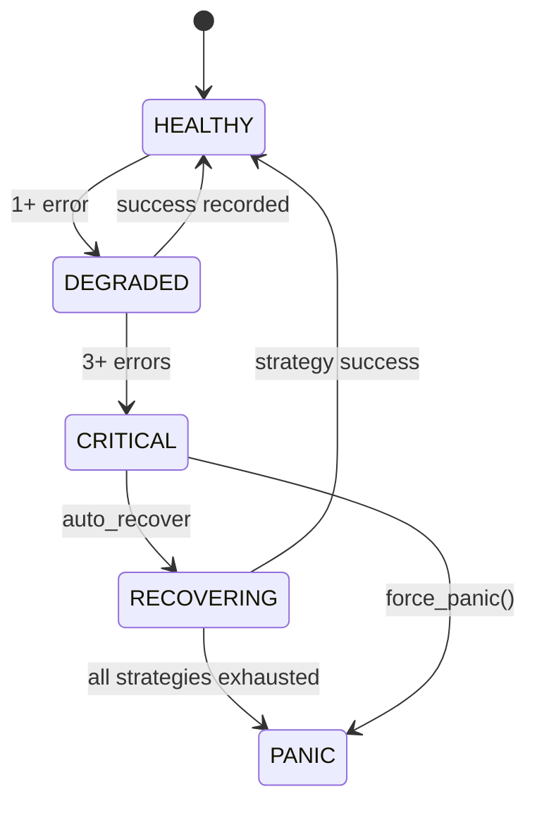

# FSM Module - NEXUS V8.4.x "TRUE HIVE MIND"

Finite State Machine components for NEXUS V8.4.x orchestration.

## Overview

The FSM module implements the state machine that governs NEXUS operation:
- **State definitions** and transitions (11 + 24 V8.0 Hive Mind states)
- **TRANSITION_MATRIX** - Complete state machine specification
- **VALIDATING_CFL** - Cognitive Feedback Loop validation
- **Panic recovery** system for fatal errors
- **Stagnation detection** for loop prevention (+ V8.0 StrategyBlacklist integration)
- **Plan health monitoring**
- **TaskExecutionContext** - Immutable execution context (Phase 0d)
- **HealthStateMachine** (V8.4.4) - Automated recovery with strategies
- **StagnationPredictor** (V8.4.4) - Proactive stagnation prediction

## V8.0 Hive Mind Integration

Les taches MODERATE/COMPLEX/EXPERT sont routees vers le TRUE HIVE MIND (voir `core/hive_mind/`).

| Complexite | Routing | Handler |
|------------|---------|---------|
| TRIVIAL | V7 Swarm / Fast Path | `FSMHandlers.handle_idle()` |
| SIMPLE | V7 Swarm | `FSMHandlers._route_to_swarm()` |
| MODERATE | V8 Hive Mind | `FSMHandlers._route_to_hive_mind()` |
| COMPLEX | V8 Hive Mind | `FSMHandlers._route_to_hive_mind()` |
| EXPERT | V8 Hive Mind | `FSMHandlers._route_to_hive_mind()` |

### V8.0 HiveMindState (8 etats internes)

```python
class HiveMindState(Enum):
    HIVE_ANALYZING_GEMINI = "hive_analyzing_gemini"
    HIVE_ANALYZING_CLAUDE = "hive_analyzing_claude"
    HIVE_DEBATING = "hive_debating"
    HIVE_ARCHITECTING = "hive_architecting"
    HIVE_EXECUTING = "hive_executing"
    HIVE_DIAGNOSING = "hive_diagnosing"
    HIVE_RETRYING = "hive_retrying"
    HIVE_CONSOLIDATING = "hive_consolidating"
```

### StagnationDetector -> StrategyBlacklist Integration (V8.0)

```python
# V8.0: StagnationDetector peut reporter vers StrategyBlacklist
detector = StagnationDetector()
detector.set_strategy_blacklist(hive_mind.strategy_blacklist)

if detector.is_stagnant():
    detector.report_to_blacklist()  # Evite retry circulaire
```

## State Diagram (from TRANSITION_MATRIX)

```mermaid
stateDiagram-v2
    [*] --> IDLE

    IDLE --> BRAINSTORMING: user_input

    BRAINSTORMING --> EXECUTING_TOOL: tool_use
    BRAINSTORMING --> WAITING_USER: finished
    BRAINSTORMING --> ERROR: stagnation

    EXECUTING_TOOL --> VALIDATING_CFL: tool_completed

    VALIDATING_CFL --> IDLE: success + finished
    VALIDATING_CFL --> BRAINSTORMING: success + continue
    VALIDATING_CFL --> BRAINSTORMING: failure (retry)
    VALIDATING_CFL --> ERROR: stalemate

    WAITING_USER --> BRAINSTORMING: user_input

    ERROR --> IDLE: /reset
    ERROR --> PANIC: timeout

    PANIC --> [*]: restart required

    state "EVOLUTION_BRAINSTORM" as evo
    IDLE --> evo: /evolve
    evo --> IDLE: mutations_complete

    note right of SWARM_ANALYZING: [RESERVED] Sprint 9
    note right of SWARM_NEGOTIATING: Bypassed by process_with_swarm()
    note right of SWARM_EXECUTING: Full FSM integration planned
```

## TRANSITION_MATRIX (states.py:143-188)

The complete FSM specification from source code:

```python
TRANSITION_MATRIX = {
    OrchestratorState.IDLE: {
        "user_input": OrchestratorState.BRAINSTORMING
    },
    OrchestratorState.BRAINSTORMING: {
        "tool_use": OrchestratorState.EXECUTING_TOOL,
        "finished": OrchestratorState.WAITING_USER,
        "stagnation": OrchestratorState.ERROR
    },
    OrchestratorState.EXECUTING_TOOL: {
        "tool_completed": OrchestratorState.VALIDATING_CFL
    },
    OrchestratorState.VALIDATING_CFL: {
        "success": OrchestratorState.IDLE,
        "failure": OrchestratorState.BRAINSTORMING,
        "stalemate": OrchestratorState.ERROR
    },
    OrchestratorState.WAITING_USER: {
        "user_input": OrchestratorState.BRAINSTORMING
    },
    OrchestratorState.ERROR: {
        "reset": OrchestratorState.IDLE,
        "timeout": OrchestratorState.PANIC
    },
    OrchestratorState.PANIC: {
        # No transitions - session restart required
    },
    # RESERVED: Swarm FSM states (Sprint 9)
    OrchestratorState.SWARM_ANALYZING: {
        "analysis_complete": OrchestratorState.SWARM_NEGOTIATING,
        "skip_negotiation": OrchestratorState.SWARM_EXECUTING,
        "error": OrchestratorState.ERROR
    },
    OrchestratorState.SWARM_NEGOTIATING: {
        "consensus": OrchestratorState.SWARM_EXECUTING,
        "timeout": OrchestratorState.SWARM_EXECUTING,
        "error": OrchestratorState.ERROR
    },
    OrchestratorState.SWARM_EXECUTING: {
        "execution_complete": OrchestratorState.VALIDATING_CFL,
        "continue": OrchestratorState.SWARM_EXECUTING,
        "error": OrchestratorState.ERROR
    }
}
```

## Files

| File | Purpose | Key Classes |
|------|---------|-------------|
| `states.py` | State enum + TRANSITION_MATRIX | `OrchestratorState`, `TransitionGuard` |
| `context.py` | Immutable execution context | `TaskExecutionContext` |
| `panic_system.py` | Error recovery | `PanicSystem`, `PanicEvent` |
| `stagnation_detector.py` | Loop detection (reactive) | `StagnationDetector` |
| `stagnation_predictor.py` | **V8.4.4** Proactive prediction | `StagnationPredictor`, `PredictionLevel` |
| `health_state_machine.py` | **V8.4.4** Auto-recovery FSM | `HealthStateMachine`, `HealthState`, `RecoveryStrategy` |
| `plan_health.py` | Plan monitoring | `PlanHealthMonitor` |
| `__init__.py` | Module exports | - |

## OrchestratorState Enum

### Active States (7)

| State | Description | Triggers |
|-------|-------------|----------|
| `IDLE` | Awaiting user input (initial state) | Session start, task complete |
| `BRAINSTORMING` | Agents exchange TALK messages | User input received |
| `EXECUTING_TOOL` | Nexus Core executes tool (synchronous) | Agent requests TOOL_USE |
| `VALIDATING_CFL` | **CFL** - Agent validates tool result | Tool execution complete |
| `WAITING_USER` | Task finished, awaiting next input | Agent sends FINISHED status |
| `ERROR` | Recoverable error (use `/reset`) | Parse errors, stagnation |
| `PANIC` | Fatal error (restart required) | Circuit breaker triggered |

### Special State (1)

| State | Description | Limit |
|-------|-------------|-------|
| `EVOLUTION_BRAINSTORM` | Agents debate mutation design | 30 turns max |

### Reserved States (3) - Sprint 9

| State | Description | Status |
|-------|-------------|--------|
| `SWARM_ANALYZING` | Task complexity analysis | **[RESERVED]** |
| `SWARM_NEGOTIATING` | Mode negotiation (max 4 turns) | Bypassed by `process_with_swarm()` |
| `SWARM_EXECUTING` | Execute negotiated mode | Full FSM integration planned |

**Note**: Swarm states exist but are bypassed in V7.6. The Hybrid Swarm Engine operates via `process_with_swarm()` which handles state internally.

## VALIDATING_CFL State (Critical)

The **Cognitive Feedback Loop** (CFL) state is where tool results are validated.

### Purpose
- Cross-validation: The OTHER agent validates the tool result
- Fast timeout: 60s (validation should be quick)
- Prevents invalid tool results from proceeding

### Implementation (orchestration_v7.py:957-1043)

```python
# === STATE: VALIDATING_CFL ===
elif self.state == OrchestratorState.VALIDATING_CFL:
    # CFL timeout (shorter than brainstorming)
    cfl_timeout = getattr(self.config, 'cfl_timeout', 60)

    # Invoke validating agent
    if self.active_agent == "Claude":
        driver = self._get_claude_driver(TaskType.VALIDATION, timeout_override=cfl_timeout)
        response = driver.invoke(context)
    else:
        response = self.gemini_driver.invoke(context)

    # Validation signals (heuristic detection)
    content = message.get("content", "")
    validation_success = (
        "✓" in content or
        "success" in content.lower() or
        "successfully" in content.lower()
    )

    # Three outcomes:
    if task_finished:
        # → IDLE (task complete)
        self._transition_to(OrchestratorState.IDLE)
    elif validation_success:
        # → BRAINSTORMING (continue with agent swap)
        self.active_agent = "Claude" if self.active_agent == "Gemini" else "Gemini"
        self._transition_to(OrchestratorState.BRAINSTORMING)
    else:
        # → BRAINSTORMING (retry with fresh perspective)
        self.active_agent = "Claude" if self.active_agent == "Gemini" else "Gemini"
        self._transition_to(OrchestratorState.BRAINSTORMING)
```

### Validation Signals

| Signal | Detection | Result |
|--------|-----------|--------|
| Task Finished | `status == "FINISHED"` or "task complete" in content | → IDLE |
| Success | "✓" or "success" in content | → BRAINSTORMING (agent swap) |
| Failure | "✗" or "error" in content | → BRAINSTORMING (agent swap, stalemate check) |
| Neutral | No explicit signal | Assumed success |

## TransitionGuard Class

Guards for FSM transitions (states.py:105-140).

```python
class TransitionGuard:
    @staticmethod
    def can_start_brainstorming(user_input: str) -> bool:
        """User input valid for brainstorming"""
        return bool(user_input and user_input.strip())

    @staticmethod
    def can_execute_tool(message: dict) -> bool:
        """Message contains valid tool request"""
        return (
            message.get("action_type") == "TOOL_USE" and
            "tool_use" in message and
            message["tool_use"] is not None
        )

    @staticmethod
    def is_task_finished(message: dict) -> bool:
        """Task marked as finished"""
        return message.get("status") == "FINISHED"

    @staticmethod
    def should_switch_agent(message: dict, current_agent: str) -> bool:
        """Agent requests switch to partner"""
        next_agent = message.get("next_agent")
        return next_agent and next_agent != current_agent

    @staticmethod
    def is_brainstorm_message(message: dict) -> bool:
        """Message is TALK (not action)"""
        return message.get("action_type") in ["TALK", "DELEGATE"]
```

## TaskExecutionContext (Phase 0d)

Immutable context for thread-safe PARALLEL mode execution (context.py:12-104).

```python
@dataclass(frozen=True)
class TaskExecutionContext:
    """Immutable context per task (replaces mutable self.active_agent)"""
    task_id: str
    current_agent: str  # "Gemini" or "Claude"
    iteration: int = 0
    tool_requesting_agent: Optional[str] = None
    validation_agent: Optional[str] = None
    objective: str = ""

    def with_agent(self, agent: str) -> 'TaskExecutionContext':
        """Return new context with changed agent (immutable)"""

    def swap_agent(self) -> 'TaskExecutionContext':
        """Return context with agent swapped"""

    def next_iteration(self) -> 'TaskExecutionContext':
        """Return context with incremented iteration"""
```

### Thread Safety

- **Problem**: `self.active_agent` is mutable global state
- **Solution**: Pass immutable context through call chain
- **Benefit**: Safe for PARALLEL Swarm mode with concurrent agent execution

## Support Classes

### PanicSystem

Manages critical error states (panic_system.py:12-200).

```python
panic = PanicSystem(workspace_path, max_stalemate=5, max_consecutive_errors=3)

# Record error
if panic.record_error("CFL_VALIDATION", str(e)):
    return self._trigger_panic(f"Too many errors")

# Check stalemate
if panic.check_stalemate():
    return self._trigger_panic("Stalemate detected")

# Reset counters
panic.reset_stalemate()
panic.reset_errors()
```

### StagnationDetector

Detects repetitive brainstorming (stagnation_detector.py:17-167).

```python
detector = StagnationDetector(
    similarity_threshold=0.8,  # 80% text similarity
    window_size=3,             # Last 3 messages
    min_matches=2              # 2+ similar pairs = stagnation
)

detector.add_message(message_content)

if detector.is_stagnant():
    # Inject warning to force agent decision
    warning = detector.get_stagnation_message()
```

### PlanHealthMonitor

Monitors strategic plan health (plan_health.py:10-195).

```python
monitor = PlanHealthMonitor()

status = monitor.check_health(strategic_plan)
# Returns: HEALTHY, WARNING, STAGNANT, or ZOMBIE

# ZOMBIE detection: all steps PENDING > 30 turns
```

## State Flows

### Normal Flow
```
IDLE → BRAINSTORMING → EXECUTING_TOOL → VALIDATING_CFL → IDLE
```

### Swarm Flow (via process_with_swarm, bypasses FSM states)
```
IDLE → [HybridSwarmEngine handles internally] → VALIDATING_CFL → IDLE
```

### Evolution Flow
```
IDLE → EVOLUTION_BRAINSTORM (30 turns max) → IDLE
```

### Error Recovery
```
ANY_STATE → ERROR → (/reset) → IDLE
ANY_STATE → PANIC → (restart session) → IDLE
```

## Configuration

| Variable | Default | Purpose |
|----------|---------|---------|
| `MAX_STALEMATE_COUNT` | 5 | Stalemates before panic |
| `CFL_TIMEOUT` | 60 | Validation timeout (seconds) |
| `STAGNATION_SIMILARITY_THRESHOLD` | 0.8 | Text similarity threshold |
| `EVOLUTION_MAX_TURNS` | 30 | Max brainstorm turns |

## Usage Example

```python
from core.fsm import OrchestratorState, TransitionGuard, TaskExecutionContext
from core.fsm import PanicSystem, StagnationDetector

# Initialize
panic = PanicSystem(workspace_path)
detector = StagnationDetector(similarity_threshold=0.8)

# Create immutable context
context = TaskExecutionContext(
    task_id="task_001",
    current_agent="Gemini",
    iteration=0,
    objective="Implement feature X"
)

# State management
current_state = OrchestratorState.IDLE

def transition(new_state: OrchestratorState):
    global current_state
    print(f"[FSM] {current_state.name} → {new_state.name}")
    current_state = new_state

# Use transition guards
if TransitionGuard.can_execute_tool(message):
    transition(OrchestratorState.EXECUTING_TOOL)
```

## Dependencies

### Internal
- `core.config` - Configuration parameters
- `core.logging` - Event logging
- `core.synapse` - Message protocol

### External
- `enum` - State enumeration
- `difflib` - Text similarity (stagnation)
- `dataclasses` - TaskExecutionContext
- `threading.RLock` - Thread safety

---

## V8.4.4 HealthStateMachine - Automated Recovery

### Concept

Le HealthStateMachine remplace les compteurs simples de PanicSystem par un FSM de sante avec strategies de recovery automatiques.

### Health States



| State | Description | Threshold |
|-------|-------------|-----------|
| `HEALTHY` | Normal operation | 0 errors |
| `DEGRADED` | Minor issues | 1-2 errors |
| `CRITICAL` | Auto-recovery triggered | 3+ errors |
| `RECOVERING` | Trying strategies | - |
| `PANIC` | All recovery failed | - |

### Recovery Strategies

```python
RECOVERY_STRATEGIES = [
    RecoveryStrategy("reset_stagnation", "Clear stagnation detector"),
    RecoveryStrategy("switch_agent", "Switch to alternate agent"),
    RecoveryStrategy("compress_context", "Reduce context window"),
    RecoveryStrategy("clear_tool_cache", "Clear tool execution cache"),
    RecoveryStrategy("rollback_phase", "Rollback to last checkpoint"),
]
```

**Caracteristiques**:
- Cooldown par strategie (evite retry immediat)
- Max attempts par strategie
- Callbacks `on_state_change` pour monitoring

### Exemple

```python
from core.fsm.health_state_machine import HealthStateMachine, HealthState

health = HealthStateMachine(auto_recover=True)

# Register custom strategy
health.add_strategy(RecoveryStrategy(
    name="custom_fix",
    description="Apply project-specific fix",
    action=async_fix_function
))

# Record errors
health.record_error("TOOL_EXECUTION", "subprocess timeout", severity=2)

# Check state
if health.state == HealthState.CRITICAL:
    success = await health.attempt_recovery()
    if not success:
        # PANIC state
        ...

# Manual controls
health.force_panic("User requested")
health.reset()  # Back to HEALTHY
```

---

## V8.4.4 StagnationPredictor - Proactive Detection

### Concept

Contrairement a `StagnationDetector` (reactif, detecte apres 3 messages similaires), le `StagnationPredictor` anticipe la stagnation via:
- **Leading indicators** (patterns textuels)
- **Trajectory analysis** (longueur decroissante)
- **Tool mention sans usage** (discussion sans action)
- **Similarity increase** (convergence vers repetition)

### Prediction Levels

| Level | Probability | Action |
|-------|-------------|--------|
| `CONTINUE` | < 0.4 | Normal operation |
| `MONITOR` | 0.4 - 0.6 | Watch closely |
| `NUDGE` | 0.6 - 0.8 | Inject gentle reminder |
| `INTERVENE` | > 0.8 | Force tool usage |

### Leading Indicators (20 patterns EN+FR)

```python
LEADING_INDICATORS = [
    (r"\blet me think\b", 0.15),
    (r"\bperhaps\b", 0.10),
    (r"\bwe should consider\b", 0.15),
    (r"\bd'accord mais\b", 0.20),  # French
    (r"\breflexion\b", 0.15),
    # ... 15 more patterns
]
```

### Exemple

```python
from core.fsm.stagnation_predictor import StagnationPredictor, PredictionLevel

predictor = StagnationPredictor(window_size=5)

# Feed messages
predictor.add_message(agent_response, has_tool_use=False)

# Get prediction
result = predictor.predict()

if result.level == PredictionLevel.NUDGE:
    print(result.nudge_message)
    # "Consider using a tool to make progress..."

if result.level == PredictionLevel.INTERVENE:
    print(result.recommendation)
    # "FORCE_TOOL_USE"
```

### Integration avec StagnationDetector

```python
# Hybrid approach: predict + detect
predictor = StagnationPredictor()
detector = StagnationDetector()

prediction = predictor.predict()
if prediction.level >= PredictionLevel.NUDGE:
    # Early intervention
    inject_nudge_message()
elif detector.is_stagnant():
    # Reactive fallback
    inject_stagnation_warning()
```

---

## See Also

- [Core README](../README.md) - Architecture overview
- [Swarm Module](../swarm/README.md) - Hybrid Swarm Engine
- [Synapse Module](../synapse/README.md) - Message schemas (LightMessageV7/HeavyMessageV7)
- [Drivers Module](../drivers/README.md) - Agent invocation
- [Hive Mind Module](../hive_mind/README.md) - SagaManager integration
