# fsm

NEXUS V7/V8 FSM Module

## Overview

| Metric | Value |
|--------|-------|
| **Path** | `C:\Code\NEXUS\NEXUS-N7A\core\fsm` |
| **Modules** | 9 |
| **Total Lines** | 2736 |
| **Classes** | 16 |
| **Functions** | 4 |

## Architecture

```mermaid
classDiagram
    class TaskExecutionContext {
        +str task_id
        +str current_agent
        +str objective
        +int iteration
        +Optional[str] tool_requesting_agent
        +Optional[str] validation_agent
        +create(cls, objective: str=..., initial_agent: str=...) 'TaskExecutionContext'
        +with_agent(self, agent: str) 'TaskExecutionContext'
        +with_iteration(self, iteration: int) 'TaskExecutionContext'
        +with_tool_request(self, requesting_agent: str) 'TaskExecutionContext'
        +with_validation(self, validating_agent: str) 'TaskExecutionContext'
        +swap_agent(self) 'TaskExecutionContext'
        +next_iteration(self) 'TaskExecutionContext'
        -__str__(self) str
    }
    class HealthState {
        +HEALTHY
        +DEGRADED
        +CRITICAL
        +RECOVERING
        +PANIC
    }
    Enum <|-- HealthState
    class RecoveryStrategy {
        +str name
        +str description
        +Callable action
        +float cooldown_seconds
        +int max_attempts
        +Optional[datetime] last_attempt
        +int attempt_count
        +is_available(self) bool
        +mark_used(self) None
        +reset(self) None
    }
    class HealthStateMachine {
        +TRANSITIONS
        +DEGRADED_THRESHOLD
        +CRITICAL_THRESHOLD
        -_orchestrator
        -_auto_recover
        -_state
        -_error_count
        -_recovery_attempts
        -_last_state_change
        -__init__(self, orchestrator: Optional[Any]=..., auto_recover: bool=...)
        +state(self) HealthState
        +error_count(self) int
        +is_healthy(self) bool
        +is_panic(self) bool
        +add_strategy(self, strategy: RecoveryStrategy) None
        -_register_default_strategies(self) None
        -_transition_to(self, new_state: HealthState, reason: str=...) bool
        +on_state_change(self, callback: Callable) None
        +record_error(self, error_type: str, error_message: str, severity: float=...) HealthState
        +record_success(self) HealthState
        +attempt_recovery(self) bool
        -_reset_strategies(self) None
        +reset(self) None
        +force_panic(self, reason: str) None
        +status(self) Dict[str, Any]
        +get_history(self, limit: int=...) List[Dict[str, Any]]
        -__repr__(self) str
    }
    class RedisHibernationCache {
        +KEY_PREFIX
        +DEFAULT_TTL
        -Optional['RedisHibernationCache'] _instance
        -Optional[Any] _redis
        -bool _enabled
        +get_instance(cls) 'RedisHibernationCache'
        -_init(self) None
        -_key(self, tenant_id: UUID, workspace_id: str) str
        +set(self, tenant_id: UUID, workspace_id: str, state: dict, ttl_hours: int=...) bool
        +get(self, tenant_id: UUID, workspace_id: str) Optional[dict]
        +delete(self, tenant_id: UUID, workspace_id: str) bool
    }
    class HibernationState {
        -__tablename__
        +UUID id
        +UUID tenant_id
        +str workspace_id
        +str previous_state
        +Optional[str] fsm_context
        +Optional[str] active_agent
        +int turn_count
        +Optional[str] message_history
        +datetime entered_at
        +datetime expires_at
        +bool is_active
        +is_expired(self) bool
    }
    SQLModel <|-- HibernationState
    class HibernationManager {
        +DEFAULT_TTL_HOURS
        +enter_hibernate(tenant_id: UUID, workspace_id: str, previous_state: str, fsm_context: Optional[dict]=..., active_agent: Optional[str]=..., turn_count: int=..., message_history: Optional[list]=..., ttl_hours: int=...) dict
        +get_hibernation(tenant_id: UUID, workspace_id: str) Optional[dict]
        +exit_hibernate(tenant_id: UUID, workspace_id: str) Optional[dict]
        +cleanup_expired() int
    }
    class PanicSystem {
        +workspace_path
        +max_stalemate
        +panic_dir
        +panic_file
        +panic_history
        +stalemate_counter
        +consecutive_errors
        +is_in_panic
        -__init__(self, workspace_path: Path, max_stalemate: int=...)
        +check_stalemate(self) bool
        +reset_stalemate(self)
        +record_error(self, error_type: str, error_message: str) bool
        +reset_errors(self)
        +trigger_panic_explicit(self, reason: str, details: str)
        -_trigger_panic(self, reason: str, details: str)
        +is_panicked(self) bool
        +get_panic_info(self) Optional[Dict]
        +clear_panic(self)
        -_log_to_history(self, event: Dict)
        +get_status(self) Dict
    }
    class PlanHealthMonitor {
        +warning_threshold
        +stagnant_threshold
        +zombie_threshold
        +last_progress_turn
        +last_completion_turn
        +plan_created_turn
        +current_turn
        -__init__(self, warning_threshold: int=..., stagnant_threshold: int=..., zombie_threshold: int=...)
        +reset(self)
        +check_health(self, current_plan: Optional[List[Dict]], current_turn: int) Dict
        -_has_progress(self, prev_plan: Optional[List[Dict]], curr_plan: List[Dict]) bool
        -_has_completion(self, prev_plan: Optional[List[Dict]], curr_plan: List[Dict]) bool
        -_determine_status(self, turns_since_progress: int, turns_since_completion: int, turns_since_creation: int, current_plan: List[Dict]) tuple
        -_copy_plan(self, plan: List[Dict]) List[Dict]
    }
    class StagnationDetector {
        -_PROGRESS_INDICATORS
        +similarity_threshold
        +window_size
        -_stagnation_count
        +semantic_progress_threshold
        -__init__(self, similarity_threshold: float=..., window_size: int=..., strategy_blacklist: Optional['StrategyBlacklist']=..., semantic_progress_threshold: float=...)
        +set_strategy_blacklist(self, blacklist: 'StrategyBlacklist')
        +add_message(self, content: str)
        +is_stagnant(self) bool
        -_similarity(self, text1: str, text2: str) float
        -_compute_semantic_progress(self) float
        +reset(self)
        +get_stagnation_message(self) str
        +get_stats(self) dict
        +extract_stagnant_strategy(self) str
        +report_to_blacklist(self, task_context: str=...) bool
        +check_and_report(self, task_context: str=...) bool
        +should_swap_lead(self, current_lead: str, failure_count: int=...) bool
        +get_swap_recommendation(self, current_lead: str) dict
        +record_agent_failure(self, agent_id: str)
    }
    class PredictionLevel {
        +CONTINUE
        +MONITOR
        +NUDGE
        +INTERVENE
    }
    Enum <|-- PredictionLevel
    class MessageMetrics {
        +int length
        +bool has_tool_use
        +bool has_tool_mention
        +float leading_indicator_score
        +datetime timestamp
    }
    class PredictionResult {
        +float probability
        +PredictionLevel level
        +Dict[str, float] factors
        +str recommendation
        +Optional[str] nudge_message
    }
    class StagnationPredictor {
        +MONITOR_THRESHOLD
        +NUDGE_THRESHOLD
        +INTERVENE_THRESHOLD
        -_window_size
        -_enable_trajectory
        -_enable_indicators
        -_indicator_patterns
        -_tool_mention_patterns
        -__init__(self, window_size: int=..., enable_trajectory: bool=..., enable_indicators: bool=...)
        +add_message(self, content: str, has_tool_use: bool=...) None
        +predict(self) PredictionResult
        -_compute_indicator_score(self, text: str) float
        -_compute_indicator_factor(self) float
        -_compute_trajectory_factor(self) float
        -_compute_tool_factor(self) float
        -_has_tool_mention(self, text: str) bool
        -_compute_similarity_factor(self) float
        -_generate_recommendation(self, level: PredictionLevel, factors: Dict[str, float]) Tuple[str, Optional[str]]
        -_get_nudge_message(self, factor: str) str
        -_get_intervention_message(self, factor: str) str
        +reset(self) None
        +get_stats(self) Dict
    }
    class OrchestratorState {
        +IDLE
        +BRAINSTORMING
        +EXECUTING_TOOL
        +VALIDATING_CFL
        +EVOLUTION_BRAINSTORM
        +WAITING_USER
        +ERROR
        +PANIC
        +SWARM_ANALYZING
        +SWARM_NEGOTIATING
        +SWARM_EXECUTING
        +HIBERNATE
    }
    Enum <|-- OrchestratorState
```

## Modules

| Module | Description | Classes | Functions |
|--------|-------------|---------|-----------|
| [context](context.py) | Task Execution Context - V7.5 Phase 0d | 1 | 0 |
| [health_state_machine](health_state_machine.py) | HealthStateMachine - FSM for System Health with Automatic Recovery. | 3 | 0 |
| [hibernation_manager](hibernation_manager.py) | NEXUS V12.3 SCALE-OUT - Hibernation Manager | 3 | 4 |
| [panic_system](panic_system.py) | Panic System - Gestion des erreurs critiques et panic states | 1 | 0 |
| [plan_health](plan_health.py) | Plan Health Monitoring - Détecte les plans zombies et stagnants | 1 | 0 |
| [stagnation_detector](stagnation_detector.py) | Stagnation Detector - Détection adaptative de stagnation dans le brainstorming | 1 | 0 |
| [stagnation_predictor](stagnation_predictor.py) | StagnationPredictor - Proactive Stagnation Detection via Trajectory Analysis. | 4 | 0 |
| [states](states.py) | FSM States - États de la Machine à États NEXUS V7 | 2 | 0 |

---
*Auto-generated by nexus-doc-generator 1.0.0 - 2025-12-16 19:13*