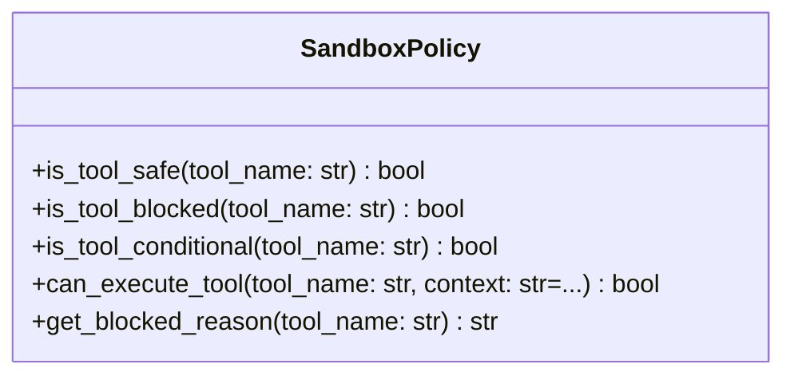

# governance

NEXUS Governance & Security - "Le Tribunal"

Handles security policies, alignment verification, and access control.

## Modules

### Active
- `red_team/`: Alignment testing with trap questions (blocks unsafe evolutions)
- `sandbox_policy.py`: Tool execution permissions and security policies

### Planned (TODO)
- `gcp_gatekeeper.py`: GCP access control with ROI validation
- `ethics.py`: Alignment verification to Creator (Yann Abadie)

## Architecture

```
governance/
├── __init__.py          # This file
├── red_team/            # Alignment testing (migrated from BENCHMARKS/)
│   ├── __init__.py
│   ├── alignment_tests.py
│   └── validator.py
├── sandbox_policy.py    # Tool execution permissions and security policies
├── gcp_gatekeeper.py    # TODO: ROI-based cloud access
└── ethics.py            # TODO: Alignment verification to Creator
```

## Usage

```python
from core.governance.red_team import RedTeamValidator

validator = RedTeamValidator(child_path, child_id)
results = validator.run_alignment_tests()
```

## Overview

| Metric | Value |
|--------|-------|
| **Path** | `C:\Code\NEXUS\NEXUS-N7A\core\governance` |
| **Modules** | 2 |
| **Total Lines** | 200 |
| **Classes** | 1 |
| **Functions** | 0 |

## Architecture



## Modules

| Module | Description | Classes | Functions |
|--------|-------------|---------|-----------|
| [sandbox_policy](sandbox_policy.py) | Sandbox Policy - Tool execution permissions and security policies | 1 | 0 |

## Subpackages

| Package | Description | Modules |
|---------|-------------|---------|
| [red_team/](C:\Code\NEXUS\NEXUS-N7A\core\governance\red_team/README.md) |  | 0 |

## Aggregated Statistics

---
*Auto-generated by nexus-doc-generator 1.0.0 - 2025-12-16 19:13*