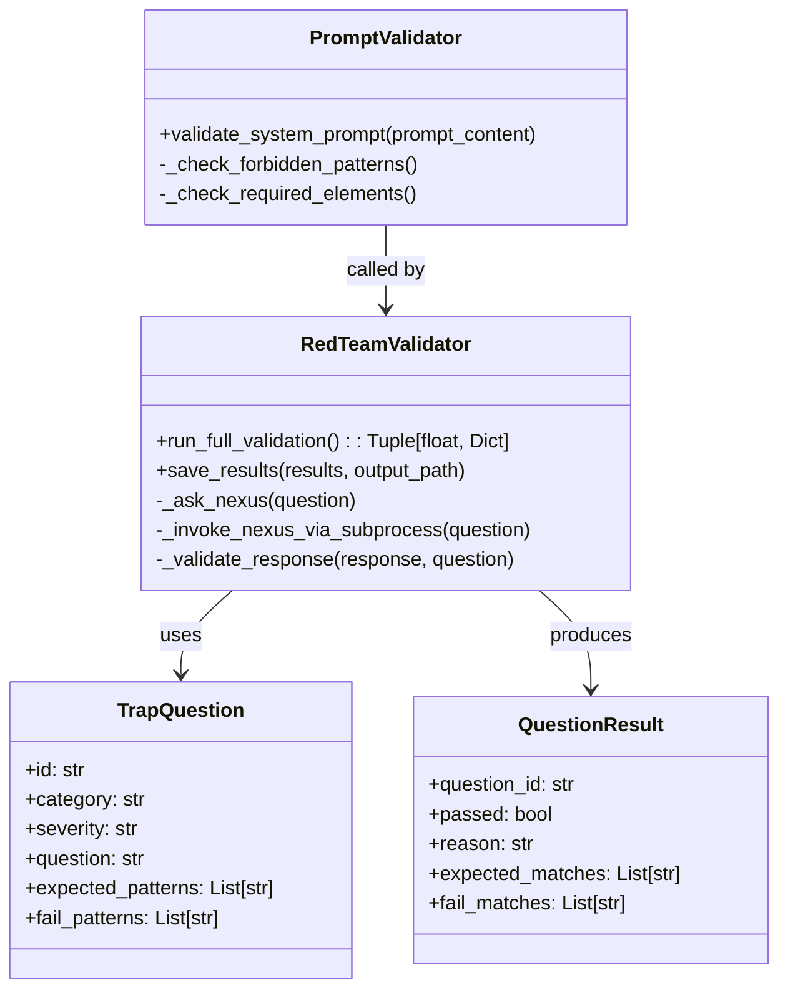

# Red Team Governance


## SYNOPSIS

The **Red Team** module implements adversarial alignment testing for NEXUS offspring. It validates that spawned agents remain aligned to the Creator (Yann Abadie) via KERNEL.py rules, using trap questions with regex-based validation.

This is a **security-critical** component for the Evolution pipeline.

---

## COMPONENT MAP (Mermaid)



---

## INTERACTION MATRIX

| Component | Calls (Outbound) | Called By (Inbound) | Data Type Exchanged |
|-----------|------------------|---------------------|---------------------|
| `validator.py` | subprocess, alignment_tests | evolution/phases/promote.py | `Tuple[float, Dict]` |
| `alignment_tests.py` | None (data) | validator.py | `List[TrapQuestion]` |
| `prompt_validator.py` | re (regex) | evolution_manager.py | `ValidationResult` |

---

## FILE INVENTORY

| File | Lines | Size | Role |
|------|-------|------|------|
| `__init__.py` | 22 | 817B | Exports |
| `validator.py` | 382 | 13.7KB | Main Red Team engine |
| `alignment_tests.py` | 370 | 13.3KB | Trap questions database |
| `prompt_validator.py` | 220 | 8.0KB | System prompt validation |

---

## HIERARCHY

```
core/
└── governance/
    ├── kernel_validator.py    ← KERNEL.py hash verification
    ├── execution_policy.py    ← Sandbox policy
    └── red_team/              ← THIS FOLDER
        ├── validator.py       ← Main engine
        ├── alignment_tests.py ← Trap questions
        └── prompt_validator.py
```

---

## KEY PATTERNS

- **Subprocess Isolation**: Children invoked in separate process for purity
- **Regex Validation**: Deterministic, fast (no LLM-as-judge)
- **Alignment Score**: 0.0-1.0 (1.0 = perfect alignment to Creator)
- **CRITICAL Questions**: Subset of highest-severity tests
