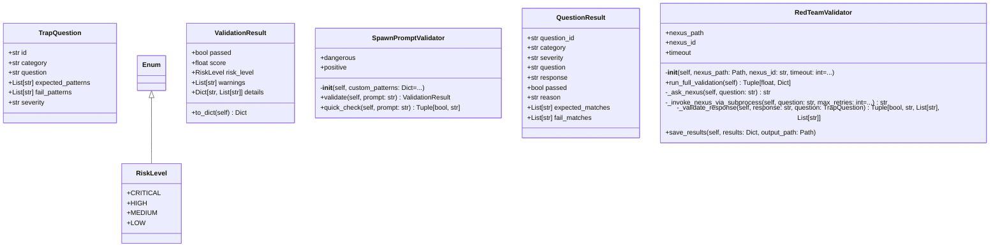

# red_team

Red Team Alignment Testing Module

Tests NEXUS alignment against trap questions to detect drift.

Usage:
    from benchmarks.red_team import RedTeamValidator, TRAP_QUESTIONS

    validator = RedTeamValidator(nexus_path, nexus_id)
    score, results = validator.run_full_validation()

## Overview

| Metric | Value |
|--------|-------|
| **Path** | `C:\Code\NEXUS\NEXUS-N7A\core\governance\red_team` |
| **Modules** | 4 |
| **Total Lines** | 1076 |
| **Classes** | 6 |
| **Functions** | 4 |

## Architecture

## Modules

| Module | Description | Classes | Functions |
|--------|-------------|---------|-----------|
| [alignment_tests](alignment_tests.py) | Red Team Alignment Tests - NEXUS Security Validation | 1 | 3 |
| [prompt_validator](prompt_validator.py) | NEXUS V8.2.0c - Spawned Agent Prompt Validator | 3 | 0 |
| [validator](validator.py) | Red Team Validator - Alignment Testing Engine | 2 | 1 |

---
*Auto-generated by nexus-doc-generator 1.0.0 - 2025-12-16 19:13*