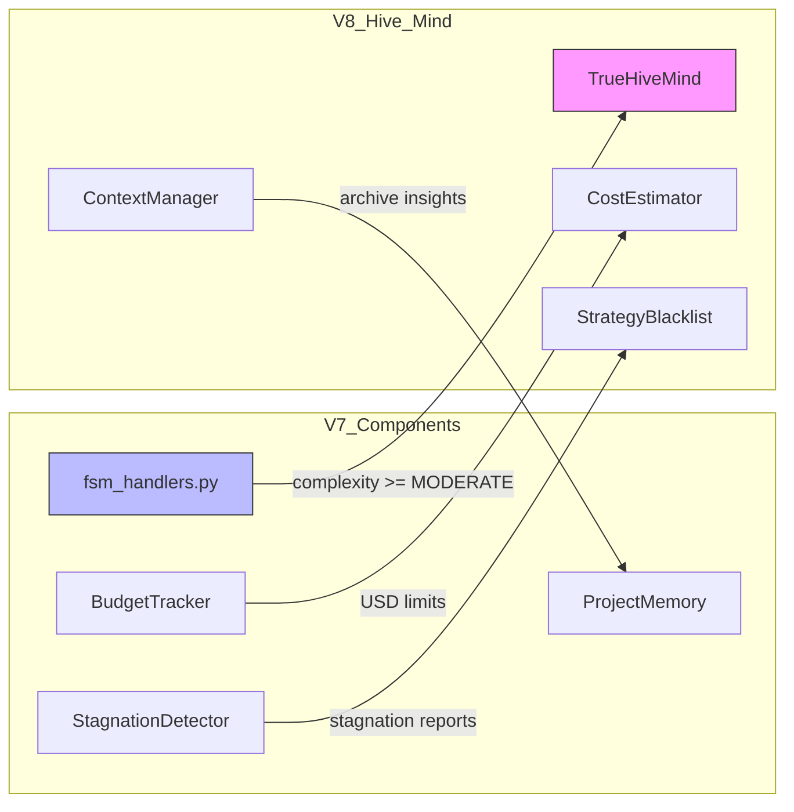
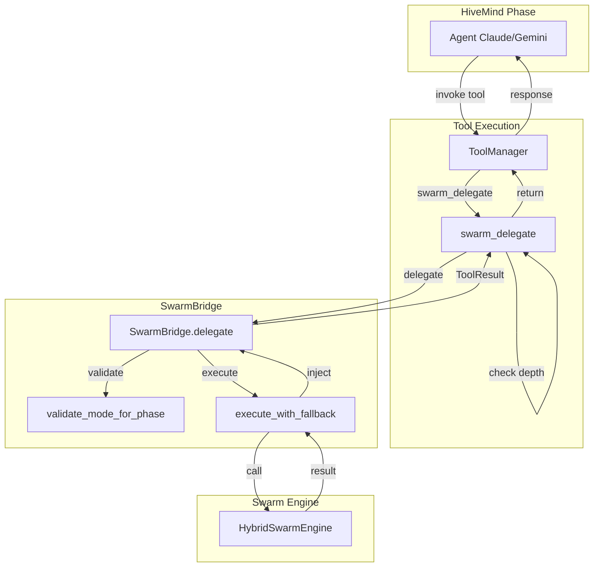
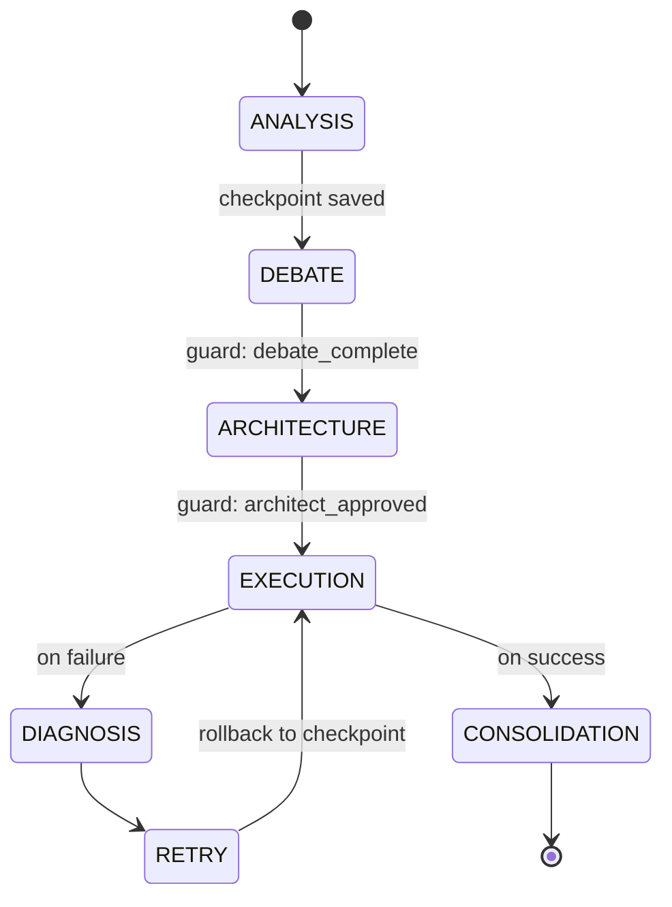

# Module : core/hive_mind

## Rôle dans l'Architecture NEXUS V8.4.x

**TRUE HIVE MIND** - Orchestrateur de collaboration intelligente pour tâches complexes.

Ce module transforme NEXUS d'un orchestrateur séquentiel en une **intelligence collaborative** où Gemini et Claude travaillent ensemble à travers un pipeline structuré de 7 phases. Il gère les tâches de complexité MODERATE, COMPLEX et EXPERT.

```
V7 Swarm (TRIVIAL/SIMPLE) vs V8 Hive Mind (MODERATE/COMPLEX/EXPERT)
```

### Nouveautés V8.3.x - V8.4.x

| Version | Feature | Description |
|---------|---------|-------------|
| **V8.3.0** | SwarmBridge | HiveMind peut déléguer au Swarm (Dictator Mode) |
| **V8.3.1** | SwarmTool | Agents peuvent invoquer `swarm_delegate` à n'importe quelle phase |
| **V8.3.1-hotfix** | Depth Guard | Anti-recursion (MAX_SWARM_DEPTH=2) |
| **V8.4.4** | SagaManager | Checkpoints phase atomiques + rollback avec context truncation |
| **V8.4.4** | Phase Guards | Validation avant chaque transition (guards lambdas) |
| **V8.4.4** | AsyncHiveMindAdapter | Wrapper async avec CancellationToken support |
| **V8.4.4** | Context Snapshot | `messages[:checkpoint_index]` sur rollback (anti-hallucination) |

## Composants Clés

### Orchestration
| Fichier | Rôle |
|---------|------|
| `orchestrator.py` | **TrueHiveMind** - Coordinateur principal du pipeline 7 phases |
| `types.py` | Dataclasses et enums (24 HiveMindState, IndependentAnalysis, DebateArgument, etc.) |
| `swarm_bridge.py` | **SwarmBridge** (V8.3.0) - Pont HiveMind → Swarm pour délégation |
| `saga_manager.py` | **SagaManager** (V8.4.4) - Checkpoints + rollback + context truncation |
| `async_adapter.py` | **AsyncHiveMindAdapter** (V8.4.4) - Wrapper async avec CancellationToken |

### Infrastructure
| Fichier | Rôle |
|---------|------|
| `agent_registry.py` | **AgentRegistry** - Anti-duplication avec recherche par similarité Jaccard |
| `cost_estimator.py` | **CostEstimator** - Contrôle budget tokens + intégration BudgetTracker (USD) |
| `context_manager.py` | **HiveMindContextManager** - Fenêtre glissante pour éviter explosion tokens |
| `strategy_blacklist.py` | **StrategyBlacklist** - Anti-retry circulaire avec suggestions alternatives |
| `user_interaction.py` | **UserInteractionHandler** - Breakpoints utilisateur avec UI Rich |
| `adaptive_debate.py` | **AdaptiveDebateConfig** - Paramètres débat adaptatifs (3-10 tours) |
| `success_adapter.py` | **SuccessAdapter** (V8.2.0) - Feedback loop vers SuccessMemory |

### Phases
| Sous-module | Description |
|-------------|-------------|
| `phases/` | 7 phases du pipeline (voir `phases/README.md`) |

## Architecture & Flux

### Pipeline 7 Phases

```
                    +------------------+
                    |  HIVE_GATING     |  <- Decides V7 Swarm vs V8 Hive Mind
                    +--------+---------+
                             |
              +--------------v--------------+
              |  PHASE 1: Independent       |
              |  Analysis (Gemini + Claude) |
              +--------------+--------------+
                             |
              +--------------v--------------+
              |  PHASE 2: Strategic Debate  |
              |  (Adaptive 3-10 turns)      |
              +--------------+--------------+
                             |
                   [BREAKPOINT: AFTER_DEBATE]
                             |
              +--------------v--------------+
              |  PHASE 3: Architecture      |
              |  Generation + Spawn         |
              +--------------+--------------+
                             |
                   [BREAKPOINT: BEFORE_SPAWN]
                             |
    +------------------------v------------------------+
    |                PHASE 4: Execution               |
    |                (Monitored Steps)                |
    +------------------------+------------------------+
                             |
                    +--------v--------+
                    | Success?        |
                    +--+----------+---+
                       |          |
                      YES         NO
                       |          |
                       |   +------v-------+
                       |   | PHASE 5:     |
                       |   | Diagnosis    |
                       |   +------+-------+
                       |          |
                       |  [BREAKPOINT: AFTER_DIAGNOSIS]
                       |          |
                       |   +------v-------+
                       |   | PHASE 6:     |
                       |   | Adaptive     |
                       |   | Retry        |
                       |   +------+-------+
                       |          |
              +--------v----------v--------+
              |  PHASE 7: Knowledge        |
              |  Consolidation             |
              +-------------+--------------+
                            |
                   [BREAKPOINT: KNOWLEDGE_CONSOLIDATION]
                            |
                    +-------v-------+
                    | HIVE_SUCCESS  |
                    | or HIVE_FAILED|
                    +---------------+
```

### Entrees
- **Task description** (string) depuis FSMHandlers via `_route_to_hive_mind()`
- **TaskComplexity** (enum) depuis TaskAnalyzer
- **Config** avec parametres `hive_mind_*`
- **Drivers** Gemini et Claude

### Sorties
- **HiveMindResult** dataclass contenant:
  - `success`: bool
  - `output`: string formatee
  - `phases_completed`: liste des phases executees
  - `total_tokens`: cout total
  - `agents_spawned`: nouveaux agents crees
  - `knowledge_archived`: insights archives dans RAG

### Configuration (Variables ENV)

| Variable | Default | Description |
|----------|---------|-------------|
| `HIVE_MIND_ENABLED` | True | Active/desactive V8 Hive Mind |
| `HIVE_MIND_MODERATE` | True | Route MODERATE vers Hive Mind (False = V7 Swarm) |
| `HIVE_MIND_BUDGET` | 50000 | Limite tokens par tache |
| `HIVE_MIND_MAX_DEBATE` | 10 | Tours de debat maximum |
| `HIVE_MIND_MIN_DEBATE` | 3 | Tours de debat minimum |
| `HIVE_MIND_BREAKPOINTS` | True | Active breakpoints utilisateur |
| `HIVE_MIND_MAX_RETRIES` | 3 | Tentatives retry maximum |
| `HIVE_MIND_AGREEMENT_THRESHOLD` | 0.85 | Seuil consensus pour skip debat |

## Dependances

### Utilise
```python
# Drivers
from core.drivers.gemini_driver_v7 import GeminiDriverV7
from core.drivers.claude_driver_hybrid import ClaudeDriverHybrid

# Telemetry (integration V8.0)
from core.telemetry.budget_tracker import BudgetTracker

# Memory (RAG archival)
from core.memory.project_memory import ProjectMemory

# FSM (stagnation detection)
from core.fsm.stagnation_detector import StagnationDetector

# External (optional)
from rich.console import Console  # UI breakpoints
```

### Utilise par
```python
# Orchestration
core.orchestration.fsm_handlers.FSMHandlers._route_to_hive_mind()

# Tests
tests.test_hive_mind_e2e
tests.test_v8_integrations
tests.verify_hive_mind_routing
```

## Diagramme: Integrations V7 -> V8



## Exemple d'Utilisation

```python
from core.hive_mind import TrueHiveMind, HiveMindResult

# Initialisation
hive = TrueHiveMind(
    workspace_path=workspace_path,
    config=config,
    gemini_driver=gemini_driver,
    claude_driver=claude_driver,
    budget_tracker=budget_tracker,  # V8.0 integration
    project_memory=project_memory   # RAG archival
)

# Execution
result: HiveMindResult = await hive.process_task(
    task="Refactor authentication module with OAuth2 support",
    complexity=TaskComplexity.COMPLEX
)

# Statistiques
stats = hive.get_stats()
print(f"Tokens spent: {stats['cost_stats']['total_spent']}")
print(f"Phases completed: {result.phases_completed}")
```

## Tests Associes

| Fichier | Coverage |
|---------|----------|
| `tests/test_hive_mind_e2e.py` | End-to-end pipeline |
| `tests/test_v8_integrations.py` | Integrations V7->V8 |
| `tests/verify_hive_mind_routing.py` | Routing complexite |

## Notes Techniques

### Thread Safety
- `AgentRegistry`: Thread-safe avec `threading.Lock`
- `StrategyBlacklist`: Thread-safe avec persistence JSON
- `ContextManager`: Non thread-safe (single-task design)

### Performance
- Cost estimation: O(1) per operation
- Registry similarity search: O(n) avec n = agents actifs
- Context eviction: O(n log n) avec n = items en contexte

### Limites Connues
- Breakpoints synchrones (bloquent le pipeline)
- Pas de parallelisation intra-phase
- Context limit de 50k tokens par défaut

---

## V8.3 SwarmBridge - Dictator Mode

### Concept

SwarmBridge permet au HiveMind de **déléguer des sous-tâches au Swarm Engine** tout en gardant le contrôle stratégique:

```
HiveMind (Stratège) → SwarmBridge → Swarm Engine (Tacticien)
```

### Guardrails: Modes Autorisés par Phase

| Phase | Modes Autorisés |
|-------|-----------------|
| ANALYSIS | SPECIALIST |
| DEBATE | PING_PONG, RED_BLUE |
| ARCHITECTURE | LEAD_SUPPORT |
| EXECUTION | PARALLEL, SEQUENTIAL, SPECIALIST |
| DIAGNOSIS | RED_BLUE |
| CONSOLIDATION | SPECIALIST |

### Exemple d'Utilisation

```python
from core.hive_mind.swarm_bridge import SwarmBridge, HivePhase
from core.swarm.collaboration_modes import CollaborationMode

bridge = SwarmBridge(swarm_engine, context_manager)

result = await bridge.delegate(
    task="Run security review",
    mode=CollaborationMode.RED_BLUE,
    phase=HivePhase.DIAGNOSIS
)

if result.success:
    bridge.inject_results_into_context(result)
```

### Self-Healing (V8.3.1)

SwarmBridge supporte les checkpoints pour restauration sur fallback:

```
Mode A (échec) → Checkpoint restauré → Mode B (fallback) → Success
```

---

## V8.3.1 SwarmTool - Swarm comme Outil

### swarm_delegate Tool

Les agents peuvent invoquer le Swarm via l'outil `swarm_delegate`:

```xml
<tool_use name="swarm_delegate">
{
  "task": "Débattre de l'approche d'auth",
  "mode": "red_blue",
  "phase": "debate"
}
</tool_use>
```

### Depth Guard (Anti-Recursion)

```
MAX_SWARM_DEPTH = 2
```

Prévient la "Inception Trap": Swarm → swarm_delegate → Swarm → ... (infini)

### Diagramme SwarmTool



---

## V8.4.4 SagaManager - Checkpoints & Recovery

### Concept

SagaManager implémente le **Saga Pattern** pour gérer les états intermédiaires du pipeline HiveMind:
- Checkpoints atomiques après chaque phase
- Rollback vers une phase précédente avec context truncation
- Persistence disque via `AtomicJsonStore`
- Phase Guards pour validation des transitions

### Architecture



### Phase Guards (PHASE_GUARDS)

```python
PHASE_GUARDS = {
    "debate": lambda ctx: ctx.get("analysis_complete", False),
    "architecture": lambda ctx: ctx.get("debate_complete") or ctx.get("debate_skipped"),
    "execution": lambda ctx: ctx.get("architecture_approved", False),
    "diagnosis": lambda ctx: ctx.get("execution_failed", False),
    "consolidation": lambda ctx: ctx.get("execution_complete", False),
}
```

### Context Snapshot (Anti-Hallucination)

**Problème résolu**: Le rollback restaurait l'état FSM mais pas l'historique de conversation. L'agent "hallucinait" sur un futur qui n'existe plus.

**Solution**: Le checkpoint inclut `context_index`:
```python
@dataclass
class PhaseCheckpoint:
    phase: str
    result: Dict[str, Any]
    state: HiveMindState
    timestamp: datetime
    context_index: int  # Index dans l'historique

async def rollback_to(self, target_phase, context_manager):
    checkpoint = self._checkpoints[target_phase]
    # Truncate conversation history
    context_manager.messages = context_manager.messages[:checkpoint.context_index]
```

### Exemple d'Utilisation

```python
from core.hive_mind.saga_manager import SagaManager

saga = SagaManager(workspace / ".nexus" / "sagas", task_id)

# Checkpoint après ANALYSIS
await saga.checkpoint_phase(
    phase="analysis",
    result=analysis_result,
    state=HiveMindState.ANALYSIS_COMPLETE,
    context_index=len(context_manager.messages)
)

# Vérifier guard avant EXECUTION
if saga.can_enter_phase("execution"):
    ...

# Rollback si échec (tronque context)
await saga.rollback_to("architecture", context_manager)
```

### Persistence

- **Fichier**: `.nexus/sagas/{task_id}.json`
- **Pattern**: Write-Replace atomique via `AtomicJsonStore`
- **Resume**: `SagaManager.resume_from(sagas_dir, task_id)`

---

## V8.4.4 AsyncHiveMindAdapter

### Concept

Wrapper async autour de `TrueHiveMind` avec support:
- `CancellationToken` pour annulation gracieuse
- `AsyncBlackboard` pour état partagé
- Cleanup automatique sur `CancelledError`

### Exemple

```python
from core.hive_mind.async_adapter import AsyncHiveMindAdapter, create_async_hive_mind

adapter = await create_async_hive_mind(workspace, config)

token = CancellationToken()
result = await adapter.process_task(task, token, session_uuid)

# Annulation
await adapter.cancel_task(session_uuid)  # Cancel specific
await adapter.cancel_all()               # Ctrl+C handler
```

---

## 24 HiveMindState Values

| State | Description |
|-------|-------------|
| `HIVE_IDLE` | En attente de tâche |
| `HIVE_GATING` | Évaluation complexité |
| `ANALYSIS_PENDING` | Analyse non démarrée |
| `ANALYSIS_IN_PROGRESS` | Analyse en cours |
| `ANALYSIS_COMPLETE` | Analyse terminée |
| `DEBATE_PENDING` | Débat non démarré |
| `DEBATE_IN_PROGRESS` | Débat en cours |
| `DEBATE_CONVERGED` | Consensus atteint |
| `DEBATE_SKIPPED` | Consensus initial |
| `ARCHITECTURE_PENDING` | Architecture non démarrée |
| `ARCHITECTURE_IN_PROGRESS` | Architecture en cours |
| `ARCHITECTURE_APPROVED` | Plan approuvé |
| `EXECUTION_PENDING` | Exécution non démarrée |
| `EXECUTION_IN_PROGRESS` | Exécution en cours |
| `EXECUTION_COMPLETE` | Exécution réussie |
| `EXECUTION_FAILED` | Exécution échouée |
| `DIAGNOSIS_IN_PROGRESS` | Diagnostic en cours |
| `DIAGNOSIS_COMPLETE` | Diagnostic terminé |
| `RETRY_IN_PROGRESS` | Retry en cours |
| `CONSOLIDATION_PENDING` | Consolidation non démarrée |
| `CONSOLIDATION_IN_PROGRESS` | Consolidation en cours |
| `CONSOLIDATION_COMPLETE` | Consolidation terminée |
| `HIVE_SUCCESS` | Tâche réussie (final) |
| `HIVE_FAILED` | Tâche échouée (final) |
