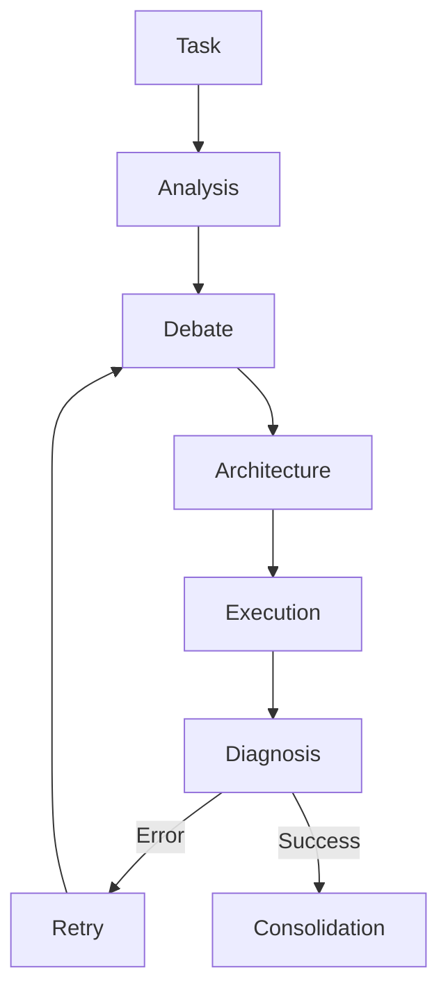
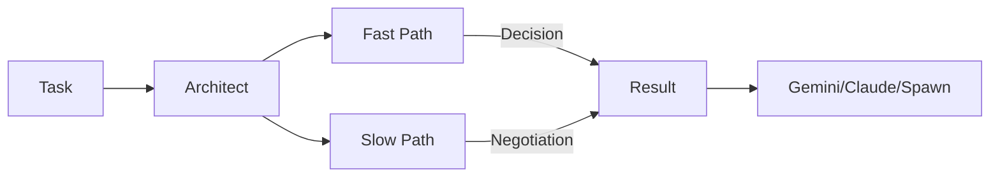

# Hive Mind Module - NEXUS V9.2

## Rôle
Le module `core/hive_mind` est le cerveau stratégique de NEXUS. Contrairement au Swarm (tactique), le Hive Mind gère la planification à long terme, la négociation des rôles (via `Architect`), et la résilience des tâches complexes (via `SagaManager`).

## Fichiers Clés
| Fichier | Lignes | Responsabilité |
|---------|--------|----------------|
| `orchestrator.py` | ~270 | **TrueHiveMind**: Orchestrateur principal du pipeline stratégique (7 phases). |
| `architect.py` | ~110 | **Architect**: Négocie les rôles (Gemini/Claude/Spawn) et décide de la délégation. |
| `swarm_bridge.py` | ~200 | **Bridge**: Connecte le Hive Mind (Stratégie) au Swarm (Exécution). |
| `saga_manager.py` | ~230 | **Resilience**: Gère les checkpoints et la reprise après erreur (Saga Pattern). |
| `adaptive_debate.py` | ~160 | **Debate**: Gère la phase de débat contradictoire avant exécution. |

## API Publique
```python
from core.hive_mind import (
    TrueHiveMind,
    Architect,
    SagaManager,
    SwarmBridge
)

# Usage
hive = TrueHiveMind(workspace_path, config)
result = await hive.process_task("Build a complex app")
```

## Flux de Données

### Hive Mind Pipeline (7 Phases)


### Architect Negotiation


## Dépendances

**Importe :**
- `core/swarm` : Pour déléguer l'exécution tactique.
- `core/agents` : Pour spawner de nouveaux agents (`UnifiedRegistry`).
- `core/memory` : Pour la consolidation des connaissances.

**Importé par :**
- `core/orchestration_v7.py` : Intègre le Hive Mind dans la boucle principale FSM.
- `core/orchestration/fsm_handlers.py` : Gère les transitions vers/depuis le Hive Mind.

## Configuration

| Variable | Default | Description |
|----------|---------|-------------|
| `HIVE_MIND_ENABLED` | `True` | Active le pipeline stratégique complet. |
| `ARCHITECT_MODEL` | `gemini-pro` | Modèle utilisé pour la négociation des rôles. |

## Session Isolation (V10)

### session_uuid Lifecycle

```
TrueHiveMind.process_task()
    │
    ├── self._current_session_uuid = uuid.uuid4()
    │
    └── Phase 1-7 receive session_uuid via execute()
        │
        ├── phase.execute(task, session_uuid=...)
        └── driver.send_message_async(session_uuid=...)
```

### Key Points
- **Generated**: `session_uuid` created at start of `process_task()`
- **Propagated**: Passed to all 7 phases via `execute()` parameter
- **Used by**: Drivers for CLI session isolation (`--session-id`)
- **Storage**: In-memory only (HiveMind sessions are not persisted)

## Tests

- `tests/hive_mind/test_orchestrator.py`
- `tests/hive_mind/test_architect.py`
- `tests/e2e/test_hive_mind_pipeline.py`
- `tests/test_v10_session_uuid_comprehensive.py` **(V10)**

