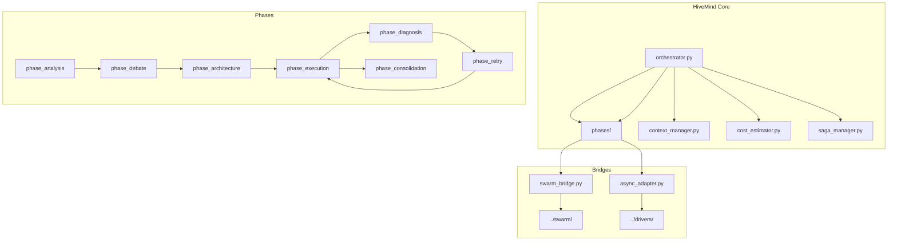

# HiveMind Module


## SYNOPSIS

The **HiveMind** module implements the 7-phase cognitive pipeline for complex task orchestration. It coordinates Gemini and Claude agents through structured phases: Analysis → Debate → Architecture → Execution → Diagnosis → Retry → Consolidation.

This is the **strategic brain** of NEXUS for MODERATE+ complexity tasks.

---

## COMPONENT MAP (Mermaid)



---

## INTERACTION MATRIX

| Component | Calls (Outbound) | Called By (Inbound) | Data Type Exchanged |
|-----------|------------------|---------------------|---------------------|
| `orchestrator.py` | All phases, context_manager, saga_manager | OrchestratorV7 | `HiveMindResult` |
| `context_manager.py` | Blackboard, memory | All phases | `HiveMindContext` |
| `cost_estimator.py` | Token counters | All phases | `CostEstimate` |
| `saga_manager.py` | Transaction log | orchestrator | `SagaState` |
| `swarm_bridge.py` | HybridSwarmEngine | phase_execution | `SwarmResult` |
| `phases/` | Drivers, tools | orchestrator | `*PhaseResult` |

---

## FILE INVENTORY

| File | Lines | Size | Role |
|------|-------|------|------|
| `__init__.py` | 90 | 3.3KB | Module exports |
| `orchestrator.py` | 750 | 27.7KB | Main HiveMind orchestrator |
| `context_manager.py` | 440 | 16.2KB | Shared context management |
| `cost_estimator.py` | 420 | 15.2KB | Token/cost estimation |
| `saga_manager.py` | 620 | 22.8KB | Transaction management |
| `swarm_bridge.py` | 560 | 20.4KB | Swarm Engine delegation |
| `async_adapter.py` | 300 | 11.0KB | Async wrapper |
| `types.py` | 380 | 13.6KB | Type definitions |
| `phases/` | (see phases/README.md) | 7 phase files |

---

## HIERARCHY

```
core/
├── hive_mind/                ← THIS FOLDER
│   ├── orchestrator.py       ← Main entry point
│   ├── context_manager.py
│   ├── cost_estimator.py
│   ├── saga_manager.py
│   ├── swarm_bridge.py
│   └── phases/               ← 7 phase implementations
└── orchestration/            ← Lower-level FSM
```

---

## KEY PATTERNS

- **Saga Pattern**: `saga_manager.py` for transactional consistency
- **SwarmBridge**: Delegates tactical execution to Swarm Engine
- **Cost Budgeting**: Phases check budget before LLM calls
- **Strategy Blacklist**: Failed strategies blacklisted (`strategy_blacklist.py`)
