# hive_mind

NEXUS V8.0 - TRUE HIVE MIND Module

Transforms NEXUS from a sequential orchestrator into a true collaborative intelligence.

Architecture:
- 7 Phases: Analysis → Debate → Architecture → Execution → Diagnosis → Retry → Consolidation
- 4 User Breakpoints: After debate, before spawn, after diagnosis, consolidation
- Adaptive debate turns based on complexity and errors
- Knowledge consolidation post-task

Components:
- types.py: Core dataclasses and enums
- agent_registry.py: Anti-duplication with similarity search
- cost_estimator.py: Budget control before decisions
- context_manager.py: Sliding window to avoid token explosion
- strategy_blacklist.py: Anti-circular retry
- user_interaction.py: Breakpoint handling
- fsm_states.py: FSM states extension for V8.0

Usage:
    from core.hive_mind import TrueHiveMind

    hive = TrueHiveMind(workspace_path, config)
    result = await hive.process_task("Complex task here")

## Overview

| Metric | Value |
|--------|-------|
| **Path** | `C:\Code\NEXUS\NEXUS-N7A\core\hive_mind` |
| **Modules** | 16 |
| **Total Lines** | 7483 |
| **Classes** | 64 |
| **Functions** | 11 |

## Architecture

```mermaid
classDiagram
    class TaskComplexity {
        +TRIVIAL
        +MODERATE
        +COMPLEX
        +EXPERT
    }
    Enum <|-- TaskComplexity
    class DebateParams {
        +int min_turns
        +int max_turns
        +float consensus_threshold
        +float early_exit_threshold
        +int timeout_per_turn
        +bool allow_concessions
        +bool require_evidence
        +int force_vote_after
    }
    class AgentDebateMetrics {
        +str agent_id
        +int total_debates
        +int arguments_made
        +int concessions_made
        +int positions_defended
        +int positions_changed
        +float average_satisfaction
        +float win_rate
        +flexibility_score(self) float
        +conviction_score(self) float
    }
    class AdaptiveDebateConfig {
        +COMPLEXITY_TURNS
        +COMPLEXITY_CONSENSUS
        -__init__(self)
        +get_debate_params(self, complexity: TaskComplexity, initial_disagreement: float=..., error_history: List[bool]=..., domain_tags: List[str]=...) DebateParams
        +record_debate_outcome(self, task_id: str, complexity: TaskComplexity, turns_used: int, final_consensus: float, was_forced_vote: bool, gemini_satisfaction: float, claude_satisfaction: float, task_success: bool)
        +record_agent_argument(self, agent_id: str, made_concession: bool=..., defended_position: bool=..., changed_position: bool=...)
        +update_agent_satisfaction(self, agent_id: str, satisfaction: float, won_debate: bool)
        +get_optimal_strategy(self, agent_id: str, opponent_id: str, topic: str) Dict
        +should_force_vote(self, turns_completed: int, consensus_progress: List[float], params: DebateParams) bool
        +calculate_final_decision(self, gemini_position: str, claude_position: str, gemini_confidence: float, claude_confidence: float, gemini_satisfaction: float, claude_satisfaction: float) Dict
        +get_stats(self) Dict
    }
    class RegisteredAgent {
        +str agent_id
        +str role
        +List[str] capabilities
        +str mission
        +str created_at
        +str last_used
        +int use_count
        +float success_rate
        +bool is_active
        +str source
    }
    class AgentRegistry {
        +REGISTRY_FILE
        +SIMILARITY_THRESHOLD
        +workspace_path
        +registry_path
        -_lock
        -__init__(self, workspace_path: Path)
        -_load_registry(self)
        -_save_registry(self)
        -_register_builtin_agents(self)
        +find_similar(self, required_capabilities: List[str], threshold: float=...) Optional[RegisteredAgent]
        -_jaccard_similarity(self, set1: Set[str], set2: Set[str]) float
        +register_spawn(self, agent_id: str, role: str, capabilities: List[str], mission: str) bool
        +record_usage(self, agent_id: str, success: bool=...)
        +deactivate_agent(self, agent_id: str, reason: str=...)
        +merge_agents(self, source_id: str, target_id: str, new_capabilities: List[str]=...) bool
        +get_agent(self, agent_id: str) Optional[RegisteredAgent]
        +get_active_agents(self) List[RegisteredAgent]
        +get_spawned_agents(self) List[RegisteredAgent]
        +get_agents_by_capability(self, capability: str) List[RegisteredAgent]
        +get_stats(self) Dict
    }
    class AsyncHiveMindAdapter {
        +hive_mind
        +driver_factory
        +blackboard
        -_registry
        -__init__(self, hive_mind: 'TrueHiveMind', driver_factory: Optional['AsyncDriverFactory']=..., blackboard: Optional[AsyncBlackboard]=...)
        +process_task(self, task: str, token: Optional[CancellationToken]=..., session_uuid: Optional[str]=..., complexity: Optional[Any]=...) 'HiveMindResult'
        +cancel_task(self, session_uuid: str) bool
        +cancel_all(self) int
        +active_task_count(self) int
        +get_task_status(self, session_uuid: str) Optional[Dict[str, Any]]
    }
    class DriverBridge {
        +async_driver
        -_loop
        -__init__(self, async_driver, loop: Optional[asyncio.AbstractEventLoop]=...)
        +invoke(self, context: str, **kwargs) Dict[str, Any]
    }
    class ContextPriority {
        +CRITICAL
        +HIGH
        +MEDIUM
        +LOW
    }
    Enum <|-- ContextPriority
    class ContextItem {
        +str category
        +str source
        +str content
        +ContextPriority priority
        +datetime timestamp
        +int token_estimate
        +Dict metadata
        -__post_init__(self)
    }
    class ContextSnapshot {
        +List[ContextItem] items
        +int total_tokens
        +List[str] categories_included
        +bool truncated
    }
    class HiveMindContextManager {
        +OPERATION_BUDGETS
        +CRITICAL_MAX_TOKENS
        +max_tokens
        -_current_tokens
        -__init__(self, max_tokens: int=...)
        +current_tokens(self) int
        +available_tokens(self) int
        +add_item(self, category: str, source: str, content: str, priority: ContextPriority=..., metadata: Dict=...)
        -_evict_one(self) bool
        +add_task(self, task: str)
        +add_analysis(self, agent_id: str, analysis: Dict)
        +add_debate_turn(self, turn_number: int, agent_id: str, argument: str)
        +add_execution_result(self, step_name: str, result: str, success: bool)
        +add_diagnosis(self, agent_id: str, diagnosis: str)
        +add_insight(self, category: str, content: str, tags: List[str]=...)
        +get_context_for(self, operation: str, max_tokens: int=..., include_categories: List[str]=..., exclude_categories: List[str]=...) ContextSnapshot
        +get_full_context_string(self, operation: str=...) str
        -_format_analysis(self, analysis: Dict) str
        +archive_to_rag(self, project_memory: 'ProjectMemory', session_id: str) int
        +get_pending_insights(self) List[Dict]
        +clear(self, keep_critical: bool=...)
        +get_stats(self) Dict
        +create_scoped_context(self, scope: ContextScope, from_phase: Optional[str]=..., session_uuid: Optional[str]=..., relevant_files: Optional[List[str]]=..., model_id: Optional[str]=..., max_summary_tokens: int=...) ScopedContext
        +summarize_for_inheritance(self, from_phase: Optional[str]=..., max_tokens: int=...) str
        -_get_task_description(self) str
        -_get_model_context(self, model_id: str) str
        +get_scoped_prompt(self, instruction: str, scope: ContextScope, from_phase: Optional[str]=..., session_uuid: Optional[str]=..., relevant_files: Optional[List[str]]=..., model_id: Optional[str]=...) str
    }
    class ContextScope {
        +FULL
        +TASK_PLUS_RESULTS
        +RESULTS_ONLY
        +TASK_ONLY
        +MINIMAL
        +FRESH
    }
    str <|-- ContextScope
    Enum <|-- ContextScope
    class InheritanceDirection {
        +NONE
        +PARENT_TO_CHILD
        +PHASE_TO_PHASE
        +BIDIRECTIONAL
    }
    str <|-- InheritanceDirection
    Enum <|-- InheritanceDirection
    class ScopedContext {
        +ContextScope scope
        +str task_description
        +List[str] relevant_files
        +str parent_summary
        +List[Dict[str, Any]] full_history
        +Dict[str, Any] metadata
        +Optional[str] session_uuid
        +Optional[str] model_context
        +str created_at
        +int estimated_tokens
        -__post_init__(self)
        -_estimate_tokens(self) int
        +to_prompt_prefix(self) str
        +to_dict(self) Dict[str, Any]
    }
```

## Modules

| Module | Description | Classes | Functions |
|--------|-------------|---------|-----------|
| [adaptive_debate](adaptive_debate.py) | NEXUS V8.0 - Adaptive Debate Configuration | 4 | 0 |
| [agent_registry](agent_registry.py) | NEXUS V8.0 - Agent Registry | 2 | 0 |
| [async_adapter](async_adapter.py) | Async Adapter for NEXUS V9.0 Hive Mind. | 2 | 1 |
| [context_manager](context_manager.py) | NEXUS V9.2 - Hive Mind Context Manager | 4 | 0 |
| [context_scope](context_scope.py) | NEXUS V9.2 - Context Scoping for Controlled Inheritance | 4 | 1 |
| [cost_estimator](cost_estimator.py) | NEXUS V8.0 - Cost Estimator | 3 | 0 |
| [json_parser](json_parser.py) | NEXUS V9.1.1 - Robust JSON Parser for HiveMind Phases | 0 | 4 |
| [orchestrator](orchestrator.py) | NEXUS V8.0 - TRUE HIVE MIND Orchestrator | 2 | 0 |
| [saga_manager](saga_manager.py) | SagaManager - Checkpoint and Recovery System for HiveMind Pipeline. | 3 | 0 |
| [session_integration](session_integration.py) | NEXUS V9.2 - HiveMind Session Integration | 2 | 1 |
| [strategy_blacklist](strategy_blacklist.py) | NEXUS V8.0 - Strategy Blacklist | 3 | 0 |
| [success_adapter](success_adapter.py) | NEXUS V8.2.0 - HiveMind Success Adapter | 5 | 2 |
| [swarm_bridge](swarm_bridge.py) | V8.3 SwarmBridge - Hive Mind → Swarm Delegation | 4 | 2 |
| [types](types.py) | NEXUS V8.0 - TRUE HIVE MIND Types | 25 | 0 |
| [user_interaction](user_interaction.py) | NEXUS V8.0 - User Interaction Handler | 1 | 0 |

## Subpackages

| Package | Description | Modules |
|---------|-------------|---------|
| [phases/](C:\Code\NEXUS\NEXUS-N7A\core\hive_mind\phases/README.md) |  | 0 |

## Aggregated Statistics

---
*Auto-generated by nexus-doc-generator 1.0.0 - 2025-12-16 19:13*