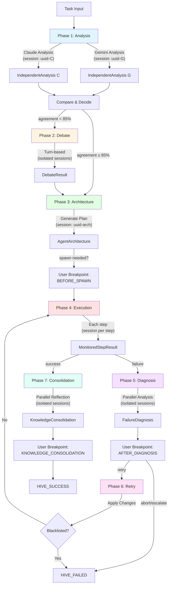

# HiveMind Phases - 7-Phase Pipeline

NEXUS V9.2 orchestration pipeline for collaborative multi-agent task execution.

## SYNOPSIS

**Entree:** Task string + HiveMind context
**Traitement:** 7-phase sequential pipeline with phase-specific session isolation
**Sortie:** HiveMindResult (success/failure + consolidated knowledge)

The HiveMind pipeline orchestrates dual-agent collaboration through 7 distinct phases, each with isolated session contexts to prevent context bleeding between phases and agents.

## ARCHITECTURE OVERVIEW

```
Task Input
    ↓
[Phase 1] Analysis (Parallel)        → IndependentAnalysis × 2
    ↓
[Phase 2] Debate (Sequential)        → DebateResult
    ↓
[Phase 3] Architecture (Single)      → AgentArchitecture
    ↓
[Phase 4] Execution (Sequential)     → ExecutionPhaseResult
    ↓ (on failure)
[Phase 5] Diagnosis (Parallel)       → FailureDiagnosis
    ↓
[Phase 6] Retry (Adaptive)           → RetryPhaseResult
    ↓ (retry Phase 4 or escalate)
[Phase 7] Consolidation (Parallel)   → KnowledgeConsolidation
    ↓
HiveMindResult
```

## LOCAL MAP



## INTERACTION MATRIX

| Phase | Entree | Sortie | Dependances | Session Isolation |
|-------|--------|--------|-------------|-------------------|
| **Phase 1: Analysis** | Task string | AnalysisPhaseResult | None | Parallel (uuid per agent) |
| **Phase 2: Debate** | Task + AnalysisComparison | DebatePhaseResult | Phase 1 | Sequential (uuid per turn) |
| **Phase 3: Architecture** | Task + DebateResult | ArchitecturePhaseResult | Phase 2 | Single (uuid-arch) |
| **Phase 4: Execution** | Task + AgentArchitecture | ExecutionPhaseResult | Phase 3 | Per-step (uuid per step) |
| **Phase 5: Diagnosis** | Task + ExecutionResult | DiagnosisPhaseResult | Phase 4 (on failure) | Parallel (uuid per agent) |
| **Phase 6: Retry** | Diagnosis + Recommendations | RetryPhaseResult | Phase 5 | Synchronous (no LLM) |
| **Phase 7: Consolidation** | Task + All Results | ConsolidationPhaseResult | Phase 4/6 (on success) | Parallel (uuid per agent) |

## PHASE DETAILS

### Phase 1: Independent Analysis

**File:** `phase_analysis.py`

**Purpose:** Both agents analyze the task independently to ensure genuine diversity of thought.

**Key Features:**
- Parallel execution with isolated sessions (Gemini: uuid-001, Claude: uuid-002)
- Context scope: TASK_ONLY (prevents cross-contamination)
- Agreement threshold: 85% (skip debate if exceeded)
- Fallback on parse errors

**Flow:**
1. Create isolated sessions for Gemini and Claude
2. Send ANALYSIS_PROMPT to both (parallel async)
3. Parse JSON responses into IndependentAnalysis objects
4. Compare analyses (complexity, capabilities, approach, risks, confidence)
5. Calculate agreement score
6. Decide: needs_debate? (agreement < 85% or severe disagreements)

**Outputs:**
- `AnalysisPhaseResult` containing:
  - `gemini_analysis: IndependentAnalysis`
  - `claude_analysis: IndependentAnalysis`
  - `comparison: AnalysisComparison`
  - `needs_debate: bool`
  - `skip_reason: Optional[str]`

**V9.2 Enhancements:**
- Session isolation via `HiveMindSessionIntegration`
- Model-aware context for capability reminders
- `get_parallel_sessions()` for concurrent agent execution

---

### Phase 2: Strategic Debate

**File:** `phase_debate.py`

**Purpose:** Structured debate to resolve disagreements identified in Phase 1.

**Key Features:**
- Turn-based alternation (max 3-10 turns, adaptive)
- Three debate positions: SUPPORT, OPPOSE, CONCEDE
- Evidence required for COMPLEX/EXPERT tasks
- Early exit on consensus (threshold: configurable)
- Forced vote if max turns reached

**Flow:**
1. Skip if `comparison.needs_debate == false`
2. Get primary disagreement (highest severity)
3. Initialize debate with adaptive parameters (min_turns, max_turns)
4. Loop: speaker alternates (Gemini → Claude → Gemini...)
   - Get argument from speaker (session isolated)
   - Append to debate history
   - Check consensus after min_turns
   - Force vote if stalled or max_turns reached
5. Return final approach + mode

**Outputs:**
- `DebatePhaseResult` containing:
  - `debate_result: DebateResult` (status, final_approach, debate_history)
  - `final_approach: str`
  - `final_capabilities: List[str]`
  - `final_mode: str` (PARALLEL, LEAD_SUPPORT, etc.)
  - `was_skipped: bool`

**V9.2 Enhancements:**
- Session isolation per turn
- Context inheritance from Phase 1 (TASK_PLUS_RESULTS scope)
- DyLAN metrics for speaker selection

---

### Phase 3: Architecture Generation

**File:** `phase_architecture.py`

**Purpose:** Generate agent architecture for task execution (which agents, execution plan, RAG config).

**Key Features:**
- Registry check for existing agents (prevents duplicate spawning)
- User breakpoint: BEFORE_SPAWN (approval for new agents)
- Execution plan with dependencies
- RAG configuration (depth: shallow/standard/deep)

**Flow:**
1. Format available agents from AgentRegistry
2. Generate architecture via ARCHITECTURE_PROMPT (session: uuid-arch)
3. Parse: agents_to_use, agents_to_spawn, execution_steps, rag_config
4. Check for duplicate agents in registry
5. If spawning needed:
   - User breakpoint (options: spawn_all, spawn_selective, skip, cancel)
   - Spawn approved agents → write to workspace/agents/
   - Register in AgentRegistry
6. Return execution-ready architecture

**Outputs:**
- `ArchitecturePhaseResult` containing:
  - `architecture: AgentArchitecture`
  - `agents_spawned: List[str]`
  - `user_approved_spawn: bool`
  - `spawn_skipped_reason: Optional[str]`

**V9.2 Enhancements:**
- Session isolation for architecture generation
- Context inheritance from Phase 2
- SwarmBridge integration (can delegate steps to Swarm modes)

---

### Phase 4: Monitored Execution

**File:** `phase_execution.py`

**Purpose:** Execute the architecture plan with real-time monitoring and issue detection.

**Key Features:**
- Step-by-step execution with timeouts
- Issue detection (hallucinations, errors, timeouts)
- Artifact verification
- SwarmBridge delegation (V8.3 Dictator Mode)

**Flow:**
1. For each ExecutionStep:
   - Check dependencies (wait for previous steps)
   - Check budget
   - Execute step:
     - If `step.swarm_mode` set: delegate to SwarmBridge
     - Else: call driver with isolated session (uuid per step)
   - Parse response, detect issues (hallucinations, errors)
   - Verify artifacts if `verification_required`
   - Record result: MonitoredStepResult
2. Check for critical failures
3. Determine if diagnosis needed (errors or critical issues)

**Outputs:**
- `ExecutionPhaseResult` containing:
  - `success: bool`
  - `step_results: List[MonitoredStepResult]`
  - `total_duration: float`
  - `total_tokens: int`
  - `issues: List[ExecutionIssue]`
  - `artifacts_created: List[str]`
  - `needs_diagnosis: bool`
  - `failure_step: Optional[str]`

**V9.2 Enhancements:**
- Session isolation per execution step
- Context inheritance from Phase 3
- SwarmBridge for Swarm mode delegation

**Issue Detection Patterns:**
- Hallucinations: "I cannot access", "file not found", "does not exist"
- Errors: "error:", "exception:", "failed:", "traceback"

---

### Phase 5: Failure Diagnosis

**File:** `phase_diagnosis.py`

**Purpose:** Dual-agent failure analysis when execution encounters issues.

**Key Features:**
- Parallel diagnosis by both agents (independent root cause analysis)
- Synthesis of diagnoses
- User breakpoint: AFTER_DIAGNOSIS
- Evidence-based diagnosis

**Flow:**
1. Format execution context (step results, issues)
2. Get diagnoses in parallel (Gemini + Claude, isolated sessions)
   - Prompt: DIAGNOSIS_PROMPT (failure_type, root_cause, evidence, recommended_changes)
3. Synthesize diagnoses via SYNTHESIS_PROMPT
   - Merge root causes, evidence, recommendations
   - Note disagreements
4. User breakpoint (options: retry, modify_changes, escalate, abort)
5. Return diagnosis + user decision

**Outputs:**
- `DiagnosisPhaseResult` containing:
  - `diagnosis: FailureDiagnosis`
  - `gemini_diagnosis: str`
  - `claude_diagnosis: str`
  - `user_decision: str` (retry/escalate/abort)
  - `user_modifications: Optional[str]`

**FailureType Enum:**
- TIMEOUT
- CAPABILITY_MISSING
- HALLUCINATION
- STRATEGY_WRONG
- TOOL_ERROR
- CONTEXT_LOST
- BUDGET_EXCEEDED
- UNKNOWN

**V9.2 Enhancements:**
- Session isolation for parallel diagnosis
- FULL context scope (needs complete history for debugging)
- Model-aware context for diagnostic capabilities

---

### Phase 6: Adaptive Retry

**File:** `phase_retry.py`

**Purpose:** Apply changes from diagnosis and retry execution with anti-circular protection.

**Key Features:**
- Strategy blacklist (prevents trying same failing approach)
- Max retry limit: 3
- Incremental architecture changes
- Escalation when stuck

**Flow:**
1. Check user decision (abort/escalate → return immediately)
2. Increment retry count, check max_retries
3. Check budget for retry
4. Check blacklist:
   - If strategy blacklisted → ESCALATE with alternatives
5. Apply changes to architecture:
   - Timeout adjustments
   - Specialist spawning
   - Verification additions
   - Simplify steps
   - Change collaboration mode
   - Reduce RAG context
6. Return RETRY decision with modified architecture
7. On success/failure: update blacklist

**Outputs:**
- `RetryPhaseResult` containing:
  - `decision: RetryDecision` (action: RETRY/STOP/ESCALATE)
  - `modified_architecture: Optional[AgentArchitecture]`
  - `retry_count: int`
  - `blacklisted: bool`

**Blacklist Mapping:**
- TIMEOUT → FailureCategory.TIMEOUT
- CAPABILITY_MISSING → FailureCategory.CAPABILITY_MISSING
- HALLUCINATION → FailureCategory.HALLUCINATION
- STRATEGY_WRONG → FailureCategory.WRONG_APPROACH
- TOOL_ERROR → FailureCategory.TOOL_ERROR
- CONTEXT_LOST → FailureCategory.RESOURCE_EXCEEDED
- BUDGET_EXCEEDED → FailureCategory.RESOURCE_EXCEEDED

**Change Application Logic:**
- `increase_timeout` → multiply step durations by 1.5
- `spawn_specialist` → add AgentSpec to agents_to_spawn
- `add_verification` → set verification_required on all steps
- `simplify_steps` → keep only first and last steps
- `rethink_approach` → cycle collaboration mode
- `reduce_context` → downgrade RAG depth

---

### Phase 7: Knowledge Consolidation

**File:** `phase_consolidation.py`

**Purpose:** Post-task reflection and knowledge archival.

**Key Features:**
- Parallel reflection by both agents
- Pattern/antipattern extraction
- Agent retention decisions
- RAG archival
- User breakpoint: KNOWLEDGE_CONSOLIDATION

**Flow:**
1. Get reflections in parallel (Gemini + Claude, isolated sessions)
   - Prompt: REFLECTION_PROMPT (learned_patterns, antipatterns, agent votes)
2. Debate consolidation:
   - Merge patterns/antipatterns (union)
   - Merge agent retention votes
   - Merge knowledge entries (deduplicate)
3. User breakpoint (options: accept_all, selective, skip)
4. Apply decisions:
   - Agent retention: KEEP_PERMANENT, ARCHIVE_KNOWLEDGE, MERGE, DELETE
   - Archive knowledge to RAG (ProjectMemory)
   - Update AgentRegistry
5. Return consolidation result

**Outputs:**
- `ConsolidationPhaseResult` containing:
  - `consolidation: KnowledgeConsolidation`
  - `gemini_reflection: str`
  - `claude_reflection: str`
  - `user_decision: str`
  - `archived_to_rag: int`
  - `agents_retained: List[str]`
  - `agents_deleted: List[str]`

**RetentionDecision Enum:**
- KEEP_PERMANENT
- ARCHIVE_KNOWLEDGE (deactivate but save patterns)
- MERGE_INTO_EXISTING
- DELETE

**V9.2 Enhancements:**
- Session isolation for parallel reflection
- Context inheritance from Phase 6 (TASK_PLUS_RESULTS scope)
- ProjectMemory integration for RAG archival

---

## SESSION ISOLATION (V9.2)

Each phase uses `HiveMindSessionIntegration` to manage session contexts:

### Context Scopes

| Scope | Description | Phases |
|-------|-------------|--------|
| `TASK_ONLY` | Only task description | Phase 1 (Analysis) |
| `TASK_PLUS_RESULTS` | Task + previous phase results | Phases 2, 3, 7 |
| `FULL` | Complete context history | Phase 5 (Diagnosis) |

### Session Types

- **Parallel Sessions:** Phase 1, 5, 7 (uuid per agent)
- **Sequential Sessions:** Phase 2 (uuid per turn)
- **Per-Step Sessions:** Phase 4 (uuid per execution step)
- **Single Session:** Phase 3, 6

### Key Methods

```python
# Create isolated sessions for parallel agents
parallel_sessions = session_integration.get_parallel_sessions(
    agents=["gemini", "claude"]
)

# Get agent-specific session
session_uuid = session_integration.get_agent_session("gemini")

# Create scoped context for next phase
scoped_context = session_integration.create_phase_context(
    scope=ContextScope.TASK_PLUS_RESULTS,
    agent_id="gemini"
)
```

---

## USER BREAKPOINTS

Three user interaction points in the pipeline:

### 1. BEFORE_SPAWN (Phase 3)

**Trigger:** Architecture wants to spawn new agents

**Options:**
- `spawn_all` - Spawn all proposed agents
- `spawn_selective` - Choose which agents to spawn
- `skip` - Use existing agents only
- `cancel` - Abort spawning

**Purpose:** Prevent runaway agent creation

---

### 2. AFTER_DIAGNOSIS (Phase 5)

**Trigger:** Execution failed, diagnosis complete

**Options:**
- `retry` - Apply recommended changes and retry
- `modify_changes` - User modifies recommendations
- `escalate` - Stop and request user intervention
- `abort` - Stop execution

**Purpose:** User control over retry strategy

---

### 3. KNOWLEDGE_CONSOLIDATION (Phase 7)

**Trigger:** Task complete, knowledge ready for archival

**Options:**
- `accept_all` - Archive all knowledge and apply agent decisions
- `selective` - Choose what to keep
- `skip` - Discard all

**Purpose:** User control over what's remembered

---

## COST MANAGEMENT

Each phase records token costs for budget tracking:

| Operation | Estimated Tokens |
|-----------|-----------------|
| `independent_analysis_gemini` | Variable (prompt + response) |
| `independent_analysis_claude` | Variable (prompt + response) |
| `compare_analyses` | 500 |
| `debate_turn` | Variable (per turn) |
| `check_consensus` | Variable |
| `generate_architecture` | Variable |
| `check_registry` | 100 |
| `spawn_agent` | Per AgentSpec.estimated_cost |
| `execution_step` | Variable (per step) |
| `failure_diagnosis_gemini` | Variable |
| `failure_diagnosis_claude` | Variable |
| `synthesize_diagnosis` | Variable |
| `decide_retry` | 400 |
| `apply_changes` | 300 |
| `reflection_gemini` | Variable |
| `reflection_claude` | Variable |
| `consolidate` | 300 |

Budget checks occur at each phase transition.

---

## ERROR HANDLING

### Phase-Level Fallbacks

All phases implement fallback mechanisms:

- **Phase 1:** Fallback analysis on parse error
- **Phase 2:** Immediate consensus if debate fails
- **Phase 3:** Fallback architecture (sequential, Claude+Gemini, no spawning)
- **Phase 4:** Error captured as MonitoredStepResult with issues
- **Phase 5:** Fallback diagnosis (UNKNOWN failure type)
- **Phase 6:** ESCALATE on change application failure
- **Phase 7:** Minimal consolidation on budget limit

### Critical Failures

Critical failures in Phase 4 immediately transition to Phase 5 (Diagnosis).

**Critical Issue Types:**
- IssueSeverity.CRITICAL
- Timeout errors (step exceeds 2x expected duration)
- Unmet dependencies
- Budget exceeded

---

## SWARM DELEGATION (V8.3 Dictator Mode)

Phase 4 can delegate execution steps to the Swarm Engine:

```python
ExecutionStep(
    name="Security Review",
    agent_id="gemini",
    swarm_mode="red_blue"  # Delegates to Swarm RED_BLUE mode
)
```

**Available Swarm Modes:**
- `parallel`
- `sequential`
- `lead_support`
- `ping_pong`
- `specialist`
- `red_blue`

**SwarmBridge Features:**
- Context injection from HiveMind
- Result extraction back to HiveMind
- Fallback chain tracking
- Mode-specific executors

---

## PHASE TRANSITIONS

### Normal Flow (Success)

```
Phase 1 → Phase 2 (if needs_debate) or Phase 3 (if high agreement)
Phase 2 → Phase 3
Phase 3 → Phase 4
Phase 4 → Phase 7 (if success)
Phase 7 → HIVE_SUCCESS
```

### Failure Flow

```
Phase 4 (failure) → Phase 5
Phase 5 → Phase 6 (if user chooses retry)
Phase 6 → Phase 4 (retry) or HIVE_FAILED (if blacklisted/max retries)
```

### Abort Flow

```
Any Phase → HIVE_FAILED (if budget exceeded)
Phase 5 → HIVE_FAILED (if user chooses abort)
Phase 6 → HIVE_FAILED (if escalate or max retries)
```

---

## ADAPTIVE FEATURES

### Adaptive Debate (Phase 2)

**Parameters adjusted by task complexity:**
- `min_turns`: 1-3
- `max_turns`: 3-10
- `early_exit_threshold`: 0.7-0.9

**Learning:**
- Agent argument patterns tracked (concessions, defenses)
- Consensus progress monitored
- Force vote on stalled consensus

### Adaptive Retry (Phase 6)

**Strategy Blacklist:**
- Prevents circular retries
- Suggests alternatives based on failure category
- Max 3 retries per task
- Exponential backoff on timeout failures

**Change Application:**
- Targeted changes based on failure type
- Incremental approach (don't change everything at once)
- Expected improvement estimation

---

## KNOWLEDGE LEARNING

### Pattern Extraction (Phase 7)

**Categories:**
- `pattern` - Successful approaches
- `antipattern` - Mistakes to avoid
- `recipe` - Reusable solutions
- `insight` - General observations

**Storage:**
- ProjectMemory (RAG)
- ContextManager (session-local)
- AgentRegistry (agent-specific patterns)

### Agent Lifecycle

**Spawned Agent Fate:**
1. Used in execution (Phase 4)
2. Evaluated in consolidation (Phase 7)
3. Retention vote by both agents
4. User approval
5. Decision applied:
   - KEEP_PERMANENT → Active in registry
   - ARCHIVE_KNOWLEDGE → Deactivate, extract patterns to RAG
   - MERGE_INTO_EXISTING → Capabilities merged into base agents
   - DELETE → Remove from registry

---

## PARENT LINK

**Parent Module:** [core/hive_mind/](../README.md)

**Related Modules:**
- [core/hive_mind/types.py](../types.py) - All dataclass definitions
- [core/hive_mind/context_manager.py](../context_manager.py) - Context state management
- [core/hive_mind/session_integration.py](../session_integration.py) - V9.2 session isolation
- [core/hive_mind/swarm_bridge.py](../swarm_bridge.py) - Swarm delegation
- [core/hive_mind/agent_registry.py](../agent_registry.py) - Agent spawn tracking
- [core/swarm/](../../swarm/README.md) - Swarm Engine for delegation

**Root Orchestrator:** [core/orchestration_v7.py](../../orchestration_v7.py)

---

## VERSION HISTORY

- **V8.0** - Initial 7-phase pipeline (Analysis, Debate, Architecture, Execution, Diagnosis, Retry, Consolidation)
- **V8.3** - SwarmBridge integration for Dictator Mode delegation
- **V8.4** - Unified agent registry integration
- **V9.1** - Robust JSON parser for all phases
- **V9.2** - Session isolation via HiveMindSessionIntegration, scoped context inheritance

---

## USAGE EXAMPLE

```python
from core.hive_mind.pipeline import HiveMindPipeline

# Initialize pipeline
pipeline = HiveMindPipeline(
    gemini_driver=gemini,
    claude_driver=claude,
    cost_estimator=cost_estimator,
    session_manager=session_manager
)

# Execute task
result = await pipeline.execute(
    task="Implement JWT authentication for FastAPI",
    complexity="MODERATE"
)

# Check result
if result.status == "HIVE_SUCCESS":
    print(f"Success: {result.final_output}")
    print(f"Patterns learned: {len(result.consolidation.learned_patterns)}")
    print(f"Agents spawned: {result.agents_spawned}")
else:
    print(f"Failed: {result.failure_reason}")
    print(f"Diagnosis: {result.diagnosis.root_cause}")
```

---

## DEBUGGING TIPS

### Enable Phase Logging

```python
import logging
logging.getLogger("core.hive_mind.phases").setLevel(logging.DEBUG)
```

### Inspect Phase Transitions

```python
# After each phase
logger.info(f"Phase {phase_num} result: {result}")
```

### Check Session Isolation

```python
# Verify session UUIDs are unique
parallel_sessions = session_integration.get_parallel_sessions(["gemini", "claude"])
assert parallel_sessions["gemini"] != parallel_sessions["claude"]
```

### Monitor Budget

```python
# Before each phase
if not cost_estimator.can_afford("phase_operation"):
    raise RuntimeError("Budget exceeded")
```

### Blacklist Analysis

```python
# Check what strategies are blacklisted
stats = blacklist.get_stats()
print(f"Blacklisted strategies: {stats['total_entries']}")
```

---

**Last Updated:** 2025-12-13 (V9.2)
**Maintainer:** NEXUS Core Team
**Status:** Production
